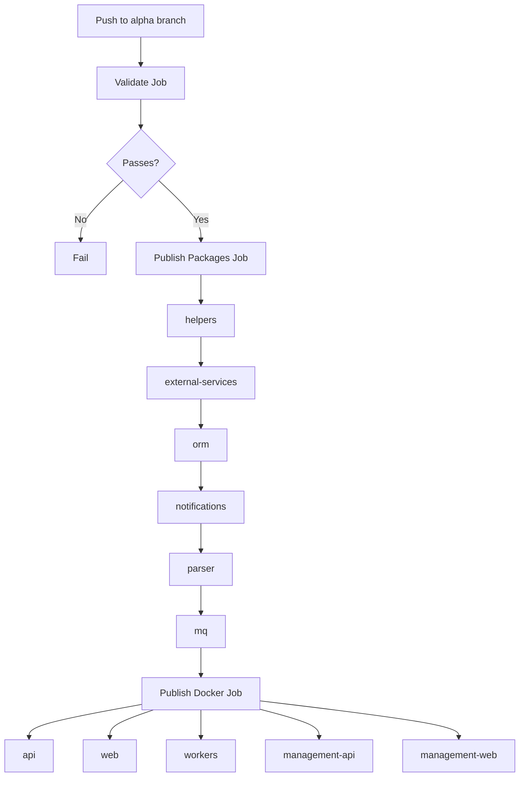

# Phase 8B: Publish Alpha Workflow

**Status**: Completed
**Estimated Effort**: 4-6 hours
**Prerequisite**: 08a-package-config-version-bump.md

## Overview

Create GitHub Actions workflow to publish npm packages and Docker images when code is pushed to the `alpha` branch.

## Alpha Version Format

Same as current multi-repo system: `X.Y.Z-alpha.N`

- `X.Y.Z` from package.json version
- `N` auto-incremented per publish
- Reset to 0 when base version changes

## Workflow Structure



## Tasks

### 1. Create publish-alpha.yml

**File**: `.github/workflows/publish-alpha.yml`

```yaml
name: Publish Alpha

on:
  push:
    branches:
      - alpha

jobs:
  # Step 1: Validate everything builds
  validate:
    runs-on: ubuntu-latest
    steps:
      - uses: actions/checkout@v4

      - name: Setup Node.js
        uses: actions/setup-node@v4
        with:
          node-version: '22'
          cache: 'npm'

      - name: Install dependencies
        run: npm ci

      - name: Lint
        run: npm run lint

      - name: Type check
        run: npm run type-check

      - name: Build all packages
        run: npm run build:packages

      - name: Build all apps
        run: npm run build:apps

  # Step 2: Publish npm packages (sequential by dependency)
  publish-packages:
    needs: validate
    runs-on: ubuntu-latest
    steps:
      - uses: actions/checkout@v4

      - name: Setup Node.js
        uses: actions/setup-node@v4
        with:
          node-version: '22'
          registry-url: 'https://registry.npmjs.org'
          cache: 'npm'

      - name: Install dependencies
        run: npm ci

      - name: Build packages
        run: npm run build:packages

      - name: Publish helpers
        run: |
          cd packages/helpers
          PACKAGE_NAME=$(node -p "require('./package.json').name")
          BASE_VERSION=$(node -p "require('./package.json').version" | sed 's/-.*//')
          ALPHA_VERSION=$(npm dist-tag ls "$PACKAGE_NAME" 2>/dev/null | grep -w alpha | awk '{print $2}' || echo "")
          
          if [[ -z "$ALPHA_VERSION" ]]; then
            NEXT_VERSION="$BASE_VERSION-alpha.0"
          else
            CURRENT_BASE=$(echo "$ALPHA_VERSION" | cut -d '-' -f 1)
            CURRENT_NUM=$(echo "$ALPHA_VERSION" | sed -En 's/.*alpha\.([0-9]+)$/\1/p')
            if [[ "$CURRENT_BASE" == "$BASE_VERSION" && -n "$CURRENT_NUM" ]]; then
              NEXT_VERSION="$BASE_VERSION-alpha.$((CURRENT_NUM + 1))"
            else
              NEXT_VERSION="$BASE_VERSION-alpha.0"
            fi
          fi
          
          npm version $NEXT_VERSION --no-git-tag-version
          npm publish --tag alpha
        env:
          NODE_AUTH_TOKEN: ${{ secrets.NPM_TOKEN }}

      # Repeat for each package in dependency order...
      # (external-services, orm, notifications, parser, mq)

  # Step 3: Build and publish Docker images (parallel)
  publish-docker:
    needs: publish-packages
    runs-on: ubuntu-latest
    strategy:
      matrix:
        app: [api, web, workers, management-api, management-web]
    steps:
      - uses: actions/checkout@v4

      - name: Setup Node.js
        uses: actions/setup-node@v4
        with:
          node-version: '22'
          cache: 'npm'

      - name: Install dependencies
        run: npm ci

      - name: Determine version
        id: version
        run: |
          BASE_VERSION=$(node -p "require('./package.json').version")
          # Calculate next alpha version for Docker tag
          echo "VERSION=$BASE_VERSION-alpha.0" >> $GITHUB_OUTPUT

      - name: Build Docker image
        run: |
          docker build -f apps/${{ matrix.app }}/Dockerfile \
            -t ghcr.io/${{ github.repository }}/${{ matrix.app }}:${{ steps.version.outputs.VERSION }} \
            .

      - name: Login to GHCR
        uses: docker/login-action@v3
        with:
          registry: ghcr.io
          username: ${{ github.actor }}
          password: ${{ secrets.GITHUB_TOKEN }}

      - name: Push Docker image
        run: |
          docker push ghcr.io/${{ github.repository }}/${{ matrix.app }}:${{ steps.version.outputs.VERSION }}
```

### 2. Update Secrets Documentation

Add to `docs/modules/SECRETS.md`:

| Secret | Purpose | How to Create |
|--------|---------|---------------|
| `NPM_TOKEN` | npm publish authentication | npm.com → Access Tokens → Generate New Token (Automation) |
| `GITHUB_TOKEN` | GHCR push (automatic) | Provided by GitHub Actions automatically |

## Package Publish Order (Dependency Chain)

1. `@podverse/helpers` (no internal deps)
2. `@podverse/external-services` (depends on helpers)
3. `@podverse/orm` (depends on helpers)
4. `@podverse/notifications` (depends on helpers, external-services)
5. `@podverse/parser` (depends on helpers, external-services, orm)
6. `@podverse/mq` (depends on all above)

## Docker Build Context

All Dockerfiles use the monorepo root as build context:
- Copy `package*.json` and `packages/` for workspace setup
- Copy specific app directory
- Run `npm install --workspaces`
- Build packages, then build app

## Verification

1. **Workflow syntax validation:**
   ```bash
   # Install act for local testing (optional)
   act -n push -e .github/test-events/push-alpha.json
   ```

2. **Manual npm publish test:**
   ```bash
   cd packages/helpers
   npm pack --dry-run
   # Verify package contents look correct
   ```

3. **Docker build test:**
   ```bash
   docker build -f apps/api/Dockerfile -t test-api .
   ```

## Checklist

- [ ] publish-alpha.yml created with all 3 jobs
- [ ] All 6 packages publish in correct order
- [ ] All 5 Docker images build in parallel
- [ ] Version calculation logic correct
- [ ] SECRETS.md updated with NPM_TOKEN instructions
- [ ] Workflow tested on test branch (optional)
