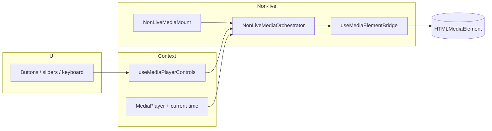

# Media player architecture (non-live)

## When to use

Changing **file-based** podcast / music / clip / soundbite / chapter / add-by-RSS playback, the queue “now playing” load path, or keyboard / slider / button controls that seek or jump the element.

## Stack (today)

- **Policy:** `resolvePlaybackLoadDecision` in `apps/web/src/lib/playback/` — pure; owns safe defaults (e.g. music intent), `explicitPlaybackSeconds` precedence, near-end clamp where applicable.
- **Imperative element surface:** `useMediaElementBridge` plus `mediaElementBridgeSurface.ts` under `apps/web/src/hooks/` — the **only** places that should assign `mediaRef.current` playback fields (`src`, `currentTime`, `load`, `play` / `pause` parity). **ESLint:** root `eslint.config.mjs` uses `no-restricted-syntax` on `apps/web/src/**` for those patterns, with **temporary** ignores only for those two files (the bridge implementation).
- **Controls context:** `MediaPlayerControlsProvider` wraps the app tree in `apps/web/src/providers/Providers.tsx`. `useMediaPlayerControls()` exposes `seek`, `jumpBy`, `pauseAt`, `togglePlay`, `loadAndStart`, etc. `isAttached: false` when no non-live bridge is registered (e.g. livestream-only playback).
- **Non-live mounts:** `NonLiveMediaMount` in `apps/web/src/components/MediaPlayer/MediaElement/NonLiveMediaMount.tsx` — hidden audio + floating video portal; both use `NonLiveMediaOrchestrator` + `useNonLivePlaybackAvProps`.
- **Livestream:** `MediaPlayerControllerLiveStream*` + `video.js` — unchanged until [`media-player-livestream-hls-migration`](../../../.llm/plans/active/media-player-livestream-hls-migration/) (placeholder).

## Do / don’t

- **Do** route new UI actions through `useMediaPlayerControls()` (and `setMPCurrentTime` when you need immediate UI sync while paused, e.g. add-by-RSS).
- **Do** read the decision spine in `apps/web/src/components/MediaPlayer/MEDIA-PLAYER-DECISION-MATRIX.md`.
- **Don’t** add `window` `CustomEvent` buses for playback; the `EVENTS.MEDIA_PLAYER` group was removed.
- **Don’t** fold livestream / HLS into the non-live bridge in this initiative — separate plan-set.

## Flow (mermaid)

## Related

- Plan set: `.llm/plans/completed/media-player-architecture-refactor/` (archived; Phases 0–6 complete on `refactor/media-player`). Livestream/HLS work is tracked separately in `.llm/plans/active/media-player-livestream-hls-migration/`.
- E2E: media-player specs under `apps/web/e2e/media-player-*.spec.ts`.
