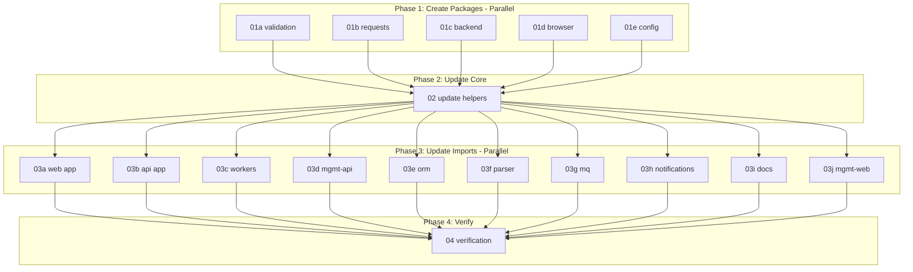

# Helpers 6-Package Split - Execution Guide

This directory contains plans for splitting `@podverse/helpers` into 6 optimized packages for maximum bundle size reduction, code clarity, and platform compatibility (web, mobile, backend).

## Goal

Split helpers into specialized packages to:
- Reduce frontend bundle size by ~2.4MB
- Improve code organization
- Support future React Native mobile apps
- Clearly separate platform-specific code
- Isolate configuration/startup utilities

## New Package Architecture

### Universal Packages (Cross-Platform)

1. **@podverse/helpers** - Core DTOs, types, lightweight utils
   - Dependencies: date-fns, he, uuid (~570KB)
   - Platform: Browser, React Native, Node.js
   - Used by: All apps and packages

2. **@podverse/helpers-validation** - Email/password/URL validation
   - Dependencies: joi (~200KB)
   - Platform: Browser, React Native, Node.js
   - Used by: web forms, orm backend, parser, mobile (future)

3. **@podverse/helpers-requests** - API client
   - Dependencies: axios (~500KB)
   - Platform: Browser, React Native
   - Used by: web app, mobile apps (future)

### Backend-Only Packages

4. **@podverse/helpers-backend** - Backend utilities
   - Dependencies: winston (~2.2MB), bignumber.js (~100KB)
   - Platform: Node.js only
   - Used by: api, workers, management-api, orm, parser, mq

5. **@podverse/helpers-config** - Config & startup validation
   - Dependencies: none (only @podverse/helpers)
   - Platform: Node.js only (uses process.env)
   - Used by: api, workers, management-api, web/management-web build scripts
   - ~880 lines of specialized validation code

### Platform-Specific Packages

6. **@podverse/helpers-browser** - Browser-only utilities
   - Dependencies: none
   - Platform: Browser only (uses navigator, document)
   - Used by: web, management-web

7. **@podverse/helpers-mobile** - React Native utilities (future)
   - Platform: React Native only
   - Used by: iOS/Android apps (when added)

## Platform Compatibility

| Package | Web | Mobile (RN) | Backend | Build Scripts |
|---------|-----|-------------|---------|---------------|
| helpers | ✅ | ✅ | ✅ | ✅ |
| helpers-validation | ✅ | ✅ | ✅ | ✅ |
| helpers-requests | ✅ | ✅ | ❌ | ❌ |
| helpers-backend | ❌ | ❌ | ✅ | ❌ |
| helpers-config | ❌ | ❌ | ✅ | ✅ |
| helpers-browser | ✅ | ❌ | ❌ | ❌ |
| helpers-mobile (future) | ❌ | ✅ | ❌ | ❌ |

## Execution Order

### Phase 1: Create New Packages (Parallel)
**Run simultaneously:**
- `01a-create-helpers-validation.md` - Validation package
- `01b-create-helpers-requests.md` - API client package
- `01c-create-helpers-backend.md` - Backend utilities package
- `01d-create-helpers-browser.md` - Browser utilities package
- `01e-create-helpers-config.md` - Config/startup validation package

### Phase 2: Update Core Helpers (Sequential)
**Run after ALL Phase 1 completes:**
- `02-update-helpers-core.md` - Remove moved code, update deps

### Phase 3: Update All Imports (Parallel)
**Run simultaneously after Phase 2 completes:**
- `03a-update-web-app.md` - Web app imports
- `03b-update-api-app.md` - API app imports
- `03c-update-workers-app.md` - Workers app imports
- `03d-update-management-api.md` - Management API imports
- `03e-update-orm-package.md` - ORM package imports
- `03f-update-parser-package.md` - Parser package imports
- `03g-update-mq-package.md` - MQ package imports
- `03h-update-notifications-package.md` - Notifications package imports
- `03i-update-documentation.md` - README, AGENTS.md updates
- `03j-update-management-web.md` - Management Web imports

### Phase 4: Verification (Sequential)
**Run after ALL Phase 3 completes:**
- `04-verification.md` - Build all, test, verify bundle sizes

## Dependency Flow

## Assigning to Agents

**Maximum parallelization (16 agents):**

1. **Phase 1** - Agents 1-5 run in parallel
2. **Phase 2** - Agent 6 runs after Phase 1 completes
3. **Phase 3** - Agents 7-16 run in parallel after Phase 2
4. **Phase 4** - Agent 17 runs after Phase 3

**Minimum agents needed: 5** (run sequentially in batches)

## Expected Timeline

- **Phase 1**: ~15 minutes (parallel)
- **Phase 2**: ~10 minutes
- **Phase 3**: ~15 minutes (parallel)
- **Phase 4**: ~20 minutes
- **Total**: ~60 minutes with full parallelization

## Bundle Size Impact

| App | Before | After | Savings |
|-----|--------|-------|---------|
| web (frontend) | ~3.5MB | ~1.1MB | ~2.4MB |
| web (server) | ~3.5MB | ~1.5MB | ~2MB |
| api/workers | ~3.5MB | ~3MB | ~0.5MB |

## Mobile App Future

When adding React Native mobile apps:
- ✅ They will use `helpers`, `helpers-validation`, `helpers-requests`
- ❌ They will NOT use `helpers-backend`, `helpers-config`, `helpers-browser`
- ➕ You may create `helpers-mobile` for React Native-specific utilities

## Rollback

If issues arise, see rollback procedures in `04-verification.md`.
