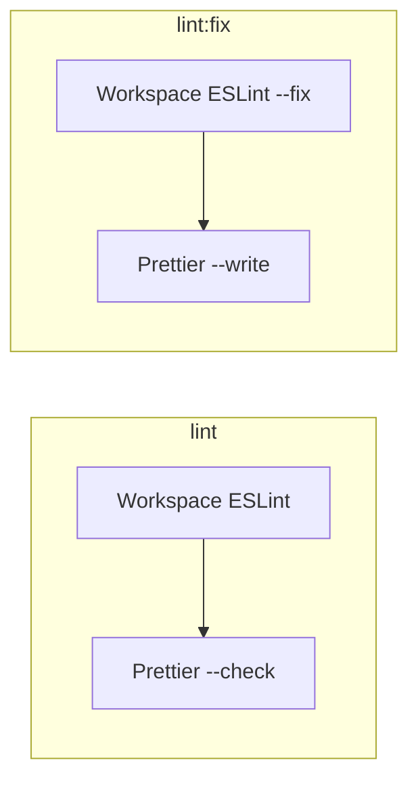

# Prettier Lint Integration – Overview

## Goal

Add Prettier as a root-level formatter for all supported file types (TS, TSX, JS, JSON, MD, YAML, SCSS, and optionally shell). Integrate it with `lint` (check) and `lint:fix` (write), and resolve ESLint conflicts via `eslint-config-prettier`.

## Current State

- **Linting**: Root [package.json](../../../../package.json) runs `npm run lint --workspaces --if-present` and `lint:fix`; each workspace runs `eslint ./src` / `eslint ./src --fix` only. No Prettier.
- **ESLint**: Single flat config at [eslint.config.mjs](../../../../eslint.config.mjs) with formatting rules (`semi`, `quotes`, `comma-dangle`). ESLint ignores `**/*.js`, `**/*.d.ts`, `dist`, `node_modules`. Codebase uses semicolons (ESLint `semi: always`).
- **Prettier**: Not installed. [.vscode/settings.json](../../../../.vscode/settings.json) uses `esbenp.prettier-vscode` as default formatter for TS, TSX, JS, JSON, Markdown—but there is no project config, so the extension uses defaults.
- **CI**: [.github/workflows/ci.yml](../../../../.github/workflows/ci.yml) and [publish-alpha.yml](../../../../.github/workflows/publish-alpha.yml) run `npm run lint` only (no fix).
- **Untouched by lint**: `scripts/` (shell, TS), `docs/`, `.llm/`, `infra/`, `.github/`, Makefiles, root configs, SCSS in apps—none are checked or formatted by the current pipeline.

## Architecture

- **ESLint**: Stays workspace-scoped (`./src` per package). Handles logic/style rules that Prettier does not (e.g. `no-console`, `eqeqeq`, `@typescript-eslint/no-explicit-any`). Formatting rules are disabled via `eslint-config-prettier`.
- **Prettier**: Runs **at root** over the whole repo. Covers TS/TSX/JS, JSON, MD, YAML, SCSS, and optionally shell (via plugin). Scope controlled by `.prettierignore`.

## File Types Covered

| Type                  | Prettier | Notes                      |
| --------------------- | -------- | -------------------------- |
| TS, TSX, JS, MJS, CJS | Yes      | Built-in                   |
| JSON                  | Yes      | Built-in; ignore lockfiles |
| MD, MDX               | Yes      | Built-in                   |
| YAML                  | Yes      | Built-in                   |
| SCSS, CSS             | Yes      | Built-in                   |
| Shell (`.sh`)         | Optional | `prettier-plugin-sh`       |

Include or exclude `.sh` via plugin and `.prettierignore` as desired.

## Plan Parts

1. **[01-setup-prettier-eslint-scripts.md](01-setup-prettier-eslint-scripts.md)** – Dependencies, `.prettierrc`, `.prettierignore`, ESLint config, root scripts. Get `lint` and `lint:fix` working with Prettier.
2. **[02-format-verify-ide.md](02-format-verify-ide.md)** – One-time format, VS Code tweaks, CI verification, optional/future items.

## Verification (High-Level)

1. `npm run lint` passes (ESLint + Prettier check).
2. `npm run lint:fix` passes and leaves no Prettier/ESLint formatting changes when run again.
3. CI `npm run lint` step passes.
4. Format-on-save in VS Code uses project Prettier config for configured languages.
