# Release notes system — summary

Created: 2026-10-05. Status: **deferred** (plan set saved; no implementation prompts run yet).

## Goal

Every app keeps a running release notes file for its next formal version. Agents add to it as
part of each change. When a formal tag is cut, the file is polished, frozen, and becomes the
GitHub release body and the store "What's new" text. Nobody writes release notes from memory at
release time.

## Locked decisions

- **One working file per upcoming formal version:** `<app>/release-notes/X.Y.Z.md`. Staging tags
  (`X.Y.Z-staging.N`) are subsections inside that file, never separate files.
- **Target version** is the root `package.json` version with any prerelease suffix removed. If a
  formal tag `X.Y.Z` already exists, the target is invalid until `bump-version.sh` moves on.
- **Frozen is final.** `status: frozen` files are never edited. A correction goes into the next
  version's notes.
- **Tone by audience.** User-facing apps (mobile, web, management-web) read as short, plain,
  benefit-first marketing copy. Developer-facing apps (api, management-api, workers, libraries)
  are technical: breaking changes, added, changed, fixed, operator notes.
- **Operator-only publishing.** Agents never stamp, freeze, tag, push, publish, or submit. Agents
  write and maintain the scripts, then end with the exact commands for the operator, in order.
- **Scope:**

| Repo | Apps | Audience |
| ---- | ---- | -------- |
| podverse | `apps/mobile`, `apps/web`, `apps/management-web` | user |
| podverse | `apps/api`, `apps/management-api`, `apps/workers` | developer |
| metaboost | `apps/web`, `apps/management-web` | user |
| metaboost | `apps/api`, `apps/management-api`, `packages/metaboost-signing` | developer |
| partytime | repo root (npm library) | developer |
| podverse-mcp | repo root (MCP server) | developer |

Out of scope: GitOps and infra repos with no versioned product release (`metaboost.cc`,
`v4v.io`, `k.podcastdj.com`, `podverse-ansible`, `pv-nixos-flake`) and `metaboost-registry`.

## Lifecycle

```mermaid
flowchart LR
  bump["bump-version.sh"] -->|"new or carry-forward"| draft["X.Y.Z.md status draft"]
  agentChange["Agent change users notice"] -->|"release_notes_add"| unreleased["Working notes / Unreleased"]
  draft --> unreleased
  unreleased --> stagingSync["sync-develop-to-staging.sh"]
  stagingSync -->|"stamp"| stagingSection["### X.Y.Z-staging.N"]
  stagingSection --> finalizePrompt["Finalize prompt writes polished sections"]
  finalizePrompt --> freeze["release_notes_freeze"]
  freeze -->|"status frozen"| frozenFile["X.Y.Z.md immutable"]
  frozenFile --> mainSync["sync-staging-to-main.sh refuses until frozen"]
  mainSync --> githubRelease["publish-main.yml release body"]
  frozenFile --> storeNotes["Play and App Store What's new"]
```

## Enforcement (how the conventions stay followed)

| Layer | Mechanism | Blocks or reminds |
| ----- | --------- | ----------------- |
| Agent guidance | `release-notes-authoring.mdc` (always), `release-notes-files.mdc` (glob), `release-notes-suggest.mdc` (always, already live), `release-notes` skill, finalize prompt | Guides |
| Cursor `beforeShellExecution` hook | `guard-operator-commands.sh` denies agent `git push`/`tag`/`commit`, `gh` writes, `npm publish`, `eas build`/`submit`, publish and freeze/stamp scripts | Blocks |
| Cursor `stop` hook | `release-notes-stop.sh` runs `check --changed`; app code changed without a note, or a frozen file edited, sends the agent back once with a follow-up | Reminds (one loop) |
| Script guards | `stamp-staging`, `freeze`, sync scripts require a TTY and a typed confirmation | Blocks unattended runs |
| Git `pre-push` | `check --range` fails on frozen edits and bad format; warns on missing notes | Blocks errors |
| CI (`ci.yml`) | Same check on every PR; `::warning::` for missing notes unless label `no-release-notes` | Blocks errors |
| Publish gate | `sync-staging-to-main.sh` refuses unless every app's `X.Y.Z.md` is frozen | Blocks |

One shared check script backs the hook, pre-push, CI, and publish gate, so they cannot disagree.

## Plan files

| File | Scope |
| ---- | ----- |
| [00-EXECUTION-ORDER.md](00-EXECUTION-ORDER.md) | Phases and order |
| [01-format-and-tone-spec.md](01-format-and-tone-spec.md) | Config, template, sections, tone, version rules, contributor doc |
| [02-scripts-and-make.md](02-scripts-and-make.md) | `scripts/release-notes/*`, Make targets, tests |
| [03-agent-rules-and-hooks.md](03-agent-rules-and-hooks.md) | Rules, skill, prompt, Cursor hooks, git pre-push |
| [04-ci-and-publish-integration.md](04-ci-and-publish-integration.md) | CI job, bump/sync scripts, publish-main body, EAS submit, operator runbook |
| [05-seed-podverse-current-version.md](05-seed-podverse-current-version.md) | First real notes for podverse 5.5.3 |
| [06-metaboost-rollout.md](06-metaboost-rollout.md) | Same system in metaboost |
| [07-partytime-and-podverse-mcp-rollout.md](07-partytime-and-podverse-mcp-rollout.md) | Single-package repos |
| [COPY-PASTA.md](COPY-PASTA.md) | Prompts |

## Open questions (decide before Phase 1)

1. **Missing-note strictness.** Recommendation: warn in CI and pre-push, remind via the stop hook.
   Make it blocking later with `--strict` once the habit holds.
2. **Store localization.** Play takes one block per language; the app ships en-US, es, fr, el-GR.
   Recommendation: author en-US only; the finalize prompt drafts the other three for operator
   review at freeze time.
3. **GitHub release body.** Recommendation: user-facing apps in full, developer apps inside
   `
` blocks in the same release.
4. **Stamp commit.** `stamp-staging` writes on `develop` right before the staging sync. The sync
   script commits and pushes it with `--no-verify`, the same bypass `bump-version.sh` already uses.
   Alternative: skip per-staging stamping and keep only `### Unreleased` until freeze.

## Done when

- All four repos in scope have the config, scripts, rules, and hooks from their plan file.
- podverse 5.5.3 and metaboost 0.1.16 have draft notes that pass `make release_notes_check`.
- The publish runbooks list the release-notes steps in order, as operator commands.
