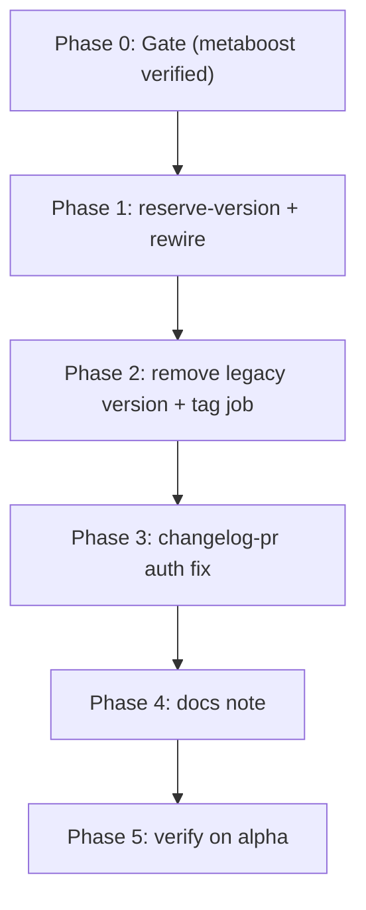

# Execution Order — CI Atomic Version Reservation (podverse)

> **DO NOT EXECUTE THIS PLAN SET UNTIL THE METABOOST EQUIVALENT IS VERIFIED GREEN
> ON A REAL `alpha` RUN.**
>
> Track metaboost's plan set across both:
> - `metaboost/.llm/plans/completed/atomic-publish-version-reservation/`
> - `metaboost/.llm/plans/completed/atomic-publish-version-reservation/05-verification.md`
>
> Baseline successful run used for this gate:
> `https://github.com/podverse/metaboost/actions/runs/24857171910`

This plan mirrors the metaboost atomic-publish-version-reservation rework on
podverse's [`.github/workflows/publish-alpha.yml`](../../../../.github/workflows/publish-alpha.yml),
plus the `changelog-pr-to-develop` duplicate-`Authorization` fix that metaboost
has already shipped.

All phases are **sequential**.

## Phase 0 — Gate

- Confirm metaboost's `reserve-version` job has run successfully on at least one
   real `alpha` push, with all downstream jobs green and a Git tag created at the
   workflow commit.

## Phase 1 — Add `reserve-version` and rewire downstream jobs

1. `01-reserve-version-job.md` — Add the new `reserve-version` job between
   `validate` and `publish-base-images` in podverse's publish workflow.
2. `02-rewire-needs-and-outputs.md` — Repoint every downstream job
   (`publish-base-images`, `publish-docker`, `verify-published-tags`,
   `workflow-summary`, `github-prerelease-create`, `changelog-pr-to-develop`) to
   consume `needs.reserve-version.outputs.*`.

## Phase 2 — Remove the legacy version-calc and `git-tag-prerelease` job

3. `03-remove-git-tag-prerelease-and-validate-version.md` — Delete
   `git-tag-prerelease` and the `Calculate unified version` step from `validate`.

## Phase 3 — Apply the changelog-pr auth fix

4. `04-changelog-auth-fix.md` — Add `persist-credentials: false` to
   `Check out develop` and pass `token: ${{ secrets.GITHUB_TOKEN }}` to
   `peter-evans/create-pull-request@v6` in `changelog-pr-to-develop`. This is the
   same fix already shipped in metaboost.

## Phase 4 — Documentation note

5. `05-docs-note.md` — Podverse has no `docs/PUBLISH.md`. Add a short note in the
   workflow file's header comment block (or, if the user prefers, a brief
   top-level `docs/PUBLISH.md`).

## Phase 5 — Verify on a real `alpha` run

6. `06-verification.md` — Trigger the podverse `alpha` publish and walk the
   verification checklist.

