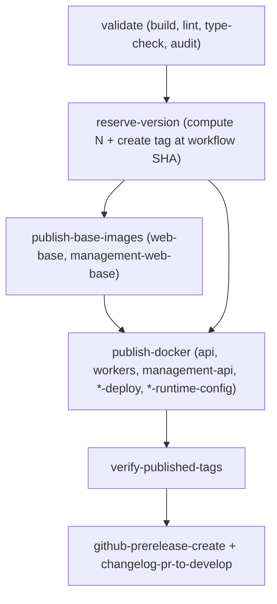

# Summary — CI Atomic Version Reservation (podverse)

## Why this needs to align with metaboost

Podverse's [`.github/workflows/publish-alpha.yml`](../../../../.github/workflows/publish-alpha.yml)
shares the same root issues that bit metaboost in run [24852065873](https://github.com/podverse/metaboost/actions/runs/24852065873):

- The version `N` for `X.Y.Z-{alpha|beta}.N` is selected from **GHCR tag discovery**
  in the `validate` job. When GHCR returns empty / 404 / partial data, the workflow
  picks `.0` and the downstream `git-tag-prerelease` job rejects the duplicate Git
  tag with `Refusing to move tag …`.
- Two concurrent runs can both pick the same `N` (race).
- `publish-base-images` and `publish-docker` push GHCR images **before**
  `git-tag-prerelease` runs, so a duplicate `N` already overwrites mutable GHCR
  tags before the Git tag check fails.
- `changelog-pr-to-develop` does not pin `persist-credentials: false` on
  `Check out develop` and does not pass an explicit `token:` to
  `peter-evans/create-pull-request@v6`. This is the same `Duplicate header:
  Authorization` bug metaboost already fixed.

## Goal

A single, atomic source of truth for `N`: **the Git tag
`refs/tags/X.Y.Z-{suffix}.N`**, reserved before publish via
`POST /repos/{owner}/{repo}/git/refs`, exactly as in metaboost.

## Decisions

- **Mirror metaboost.** Same atomic create-ref pattern, same 422-aware retry,
  same smart-start-hint, same `set -euo pipefail` / no `|| true` discipline in the
  version-selection path.
- **Suffix mapping is podverse-specific.**
  `alpha` branch → `alpha` (not `staging`) suffix; `beta` → `beta`; `main` → none.
  `FLOAT_TAG`: `alpha` / `beta` / `prod`.
- **`reserve-version` runs before both base and deploy image jobs.** Both
  `publish-base-images` and `publish-docker` consume the reserved `version`.
- **Apply the metaboost changelog-pr auth fix here too** so a future "Open pull
  request" step doesn't trip the `Duplicate header: Authorization` issue.
- **Two-phase rollout.** Phase 1 adds `reserve-version` and rewires consumers
  (legacy version step still runs but unused). Phase 2 deletes the legacy version
  step and `git-tag-prerelease`.

## Plan files

- `00-EXECUTION-ORDER.md`
- `00-SUMMARY.md` (this file)
- `01-reserve-version-job.md`
- `02-rewire-needs-and-outputs.md`
- `03-remove-git-tag-prerelease-and-validate-version.md`
- `04-changelog-auth-fix.md`
- `05-docs-note.md`
- `06-verification.md`
- `COPY-PASTA.md`

## Out of scope

- Any changes to product code, app Dockerfiles, base images, or runtime-config
  sidecars.
- Any GitOps repo changes — image consumers continue to pin against the same
  GHCR tag schema.
- `main` (RTM) tag handling stays as today: no suffix, single `X.Y.Z`.
