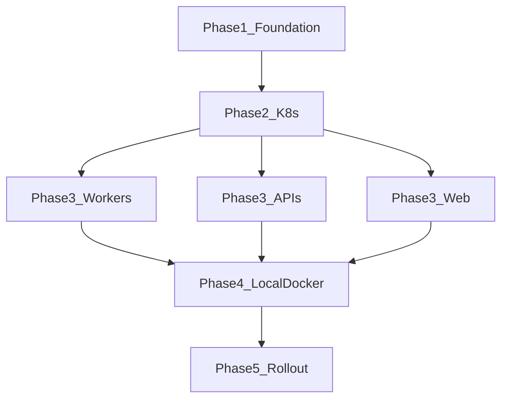

# Execution order — Extensions + Prometheus sidecar (OTEL-first)

**Status: complete.** All steps below were executed; artifacts are in the repo and plans are archived under `.llm/plans/completed/extensions-prometheus-sidecar/`.

## Critical rule

**Phases are sequential.** Do not start phase N+1 until phase N is complete and verified.  
**Within a phase**, steps marked **parallel** may run in separate agents simultaneously.

---

## Phase 1: Foundation (sequential — 1 agent)

| Step | Plan file | Deliverable |
| ---- | --------- | ----------- |
| 1.1 | [01-extension-runtime-contract.md](./01-extension-runtime-contract.md) | `docs/operations/extensions/EXTENSIONS.md` draft + env/path contract documented |
| 1.2 | [03-otel-app-sdk-and-adapters.md](./03-otel-app-sdk-and-adapters.md) | `packages/extension-sdk` (or agreed name) scaffold + types |
| 1.3 | [02-prometheus-extension-sidecar-image.md](./02-prometheus-extension-sidecar-image.md) | Extension sidecar app + Dockerfile + local image build |

**Gate:** Sidecar image builds; SDK exports `initExtensionMetrics()` without `prom-client`; contract doc merged.

---

## Phase 2: K8s platform (sequential — 1 agent)

| Step | Plan file | Deliverable |
| ---- | --------- | ----------- |
| 2.1 | [04-k8s-shared-extension-config-and-wiring.md](./04-k8s-shared-extension-config-and-wiring.md) | `infra/k8s/base/extensions/` + alpha/common resource; shared ConfigMap |

**Gate:** `kustomize build` succeeds for alpha/common and one sample workload overlay.

---

## Phase 3: App integrations (parallel — up to 3 agents)

Run **after Phase 2**. These can proceed in parallel if file ownership is split.

| Agent | Plan file | Scope |
| ----- | --------- | ----- |
| A | [05-workers-longrunning-extension-wiring.md](./05-workers-longrunning-extension-wiring.md) | 8 worker Deployments + workers OTEL adapter |
| B | [07-api-and-management-api-extension-wiring.md](./07-api-and-management-api-extension-wiring.md) | api + management-api; remove in-process prom |
| C | [06-web-and-management-web-extension-wiring.md](./06-web-and-management-web-extension-wiring.md) | web + management-web Next + pods |

**Gate:** Each app starts with extensions off; with extensions on, metrics endpoint on **sidecar** returns OTEL-semconv-derived app series.

---

## Phase 4: Local Docker (sequential — 1 agent)

| Step | Plan file | Deliverable |
| ---- | --------- | ----------- |
| 4.1 | [08-local-docker-compose-extension-profiles.md](./08-local-docker-compose-extension-profiles.md) | Compose profiles + docs + env templates |

**Gate:** Documented one-command local enable path works on a clean `local_infra_up` + extensions profile.

---

## Phase 5: Verification and cutover (sequential — 1 agent)

| Step | Plan file | Deliverable |
| ---- | --------- | ----------- |
| 5.1 | [09-testing-and-rollout-strategy.md](./09-testing-and-rollout-strategy.md) | Tests, rollout checklist, legacy removal |

**Gate:** CI lint/build pass; api integration tests updated (including hard-cutover 404 on app metrics route); `EXT_PROMETHEUS_ENABLED=true` smoke in staging documented.

---

## Dependency diagram

---

## Estimated effort (implementation, not planning)

| Phase | Sequential time | Parallel time |
| ----- | ----------------- | ------------- |
| 1 | 2–3 days | — |
| 2 | 1 day | — |
| 3 | 4–5 days | 2–3 days (3 agents) |
| 4 | 1 day | — |
| 5 | 1–2 days | — |

---

## Out of scope (explicit)

- CronJob worker Prometheus / Pushgateway
- In-repo Prometheus Operator / ServiceMonitor CRDs
- Second extension (e.g. Cloudflare analytics) beyond hooks in contract
- Metaboost repo
