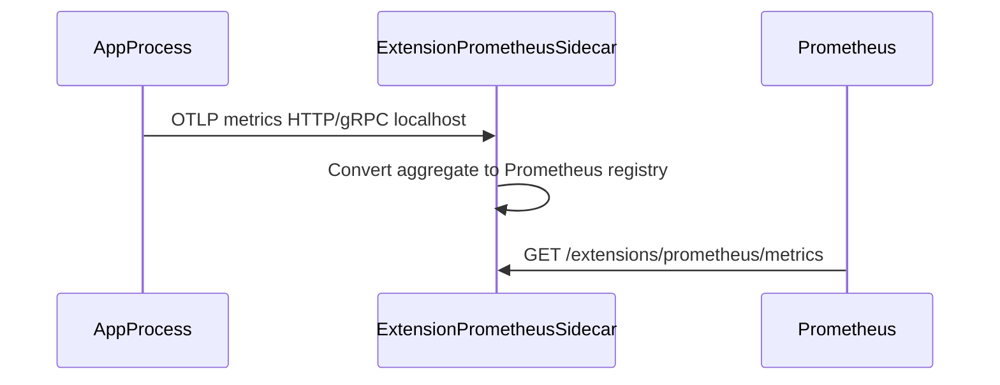

# Plan 01 — Extension runtime contract

## Objective

Define the **stable platform contract** for Podverse extensions so Prometheus is the first implementation and future extensions reuse the same wiring (env, K8s sidecar injection, local Compose profiles, OTEL transport).

## Non-goals

- Implementing non-Prometheus extensions
- Changing runtime-config sidecar responsibilities

---

## 1. Extension identity model

Each extension has:

| Field | Example (Prometheus) |
| ----- | -------------------- |
| `id` (config key) | `prometheus` |
| `envPrefix` | `EXT_PROMETHEUS_` |
| `urlSegment` | `prometheus` |
| `resources` | `metrics` (scrape), `health` (sidecar liveness) |
| `sidecarImage` | `ghcr.io/podverse/podverse/extension-prometheus` |
| `sidecarContainerName` | `extension-prometheus` |

Future extensions add rows; K8s uses a **shared** ConfigMap plus optional per-extension keys.

---

## 2. Environment variables (canonical)

All extension keys use `EXT_` prefix ([extensions-env](.cursor/skills/extensions-env/SKILL.md)).  
**Extensions section is last** in every `.env.example` and K8s `source/*.env` comment block.

### Shared (all apps with extensions)

| Variable | Required | Description |
| -------- | -------- | ----------- |
| `EXT_PROMETHEUS_ENABLED` | When sidecar injected | `"true"` schedules sidecar + enables OTEL export from app |
| `EXT_OTEL_EXPORTER_OTLP_ENDPOINT` | When enabled | App → sidecar, e.g. `http://127.0.0.1:4318` (HTTP) or `http://127.0.0.1:4317` (gRPC) — pick one standard in implementation |
| `EXT_OTEL_SERVICE_NAME` | When enabled | e.g. `podverse-api`, `podverse-worker-mqRSSRunParser` |
| `EXT_OTEL_RESOURCE_ATTRIBUTES` | Optional | `deployment.environment=alpha`, `service.namespace=podverse-alpha` |

### Sidecar-only

| Variable | Description |
| -------- | ----------- |
| `EXT_PROMETHEUS_METRICS_PORT` | Listen port for scrape (default `9464`) |
| `EXT_PROMETHEUS_METRICS_PATH` | Default `/extensions/prometheus/metrics` |
| `EXT_PROMETHEUS_COLLECT_PROCESS_METRICS` | Sidecar process defaults (`true`) |

### TypeScript mapping

```typescript
// apps/<app>/src/config/index.ts (pattern)
extensions: {
  prometheus: {
    enabled: process.env.EXT_PROMETHEUS_ENABLED === 'true',
  },
  otel: {
    otlpEndpoint: process.env.EXT_OTEL_EXPORTER_OTLP_ENDPOINT!,
    serviceName: process.env.EXT_OTEL_SERVICE_NAME!,
  },
},
```

Config files keep **no default fallbacks** for required OTEL vars when prometheus is enabled (fail at startup validation).

---

## 3. HTTP path conventions

| Consumer | Metrics path | Notes |
| -------- | ------------ | ----- |
| API / management-api (legacy removal) | `/api/v2/extensions/prometheus/metrics` | **Removed from app** after cutover; scrape sidecar only |
| Extension sidecar (all workloads) | `/extensions/prometheus/metrics` | Prometheus `metrics_path` |
| Extension sidecar health | `/extensions/prometheus/health` | K8s probe target |

**Rule:** Apps do not register Prometheus scrape routes in production path. Dev-only diagnostic route is discouraged.

---

## 4. OTEL contract (app → sidecar)



### Instrumentation scope (v1)

| Signal | Source | Labels (allowlist) |
| ------ | ------ | ------------------ |
| HTTP server duration/count | api, management-api, web middleware | `method`, `route`, `status_code` |
| Worker command duration | workers `index.ts` wrapper | `command`, `status` |
| Process/runtime | sidecar `prom-client` collectDefaultMetrics | N/A |

**Forbidden labels:** user id, email, feed URL, raw hostname lists (unbounded cardinality).

### SDK surface (`@podverse/extension-sdk`)

Proposed exports:

- `initExtensions(config: ExtensionInitConfig): void` — no-op when disabled
- `getHttpMetricsMiddleware(): Middleware` — Express + Next adapter wrappers
- `recordWorkerCommand(command: string, status: 'success' \| 'error', durationMs: number): void`
- `shutdownExtensions(): Promise<void>` — flush OTLP on SIGTERM

**Dependency rule:** SDK depends on `@opentelemetry/*` only; **never** `prom-client`.

---

## 5. K8s pod layout contract

When `EXT_PROMETHEUS_ENABLED=true` (via shared ConfigMap):

```yaml
# Pseudocode — see plan 04 for real manifests
containers:
  - name: api          # main app, no prom-client
  - name: extension-prometheus
    ports:
      - containerPort: 9464
        name: metrics
```

- `shareProcessNamespace: false` (default)
- App uses `127.0.0.1` OTLP to sidecar via **pod loopback** (same network namespace → `localhost`)
- Optional pod annotations for scrapers:
  - `prometheus.io/scrape: "true"`
  - `prometheus.io/port: "9464"`
  - `prometheus.io/path: "/extensions/prometheus/metrics"`

Workers have **no Service**; scrapers use pod IP or PodMonitor in ops repo.

---

## 6. Enable / disable semantics

| `EXT_PROMETHEUS_ENABLED` | App OTEL | Sidecar container | Scrape |
| ------------------------ | -------- | ----------------- | ------ |
| unset / `false` | Off | Not deployed (Kustomize component off or zero replicas patch) | N/A |
| `true` | On | Running | Sidecar endpoint 200 |

**K8s:** Prefer Kustomize **components** or **replacements** so sidecar is omitted entirely when disabled (not merely crashing sidecar).

---

## 7. Files to create / update (this plan)

| Action | Path |
| ------ | ---- |
| Create | `docs/operations/extensions/EXTENSIONS.md` |
| Update | `docs/operations/extensions/PROMETHEUS-METRICS-ENDPOINTS.md` — point to sidecar + OTEL |
| Update | `.cursor/skills/extensions-env/SKILL.md` — OTEL vars, sidecar ownership |
| Create | `infra/config/env-templates/extensions.env.example` |
| Update | each app `.env.example` Extensions section (pointer + app-specific `EXT_OTEL_SERVICE_NAME` example) |

---

## 8. Verification

```bash
./scripts/nix/with-env npm run lint
# Manual: read EXTENSIONS.md paths match existing registerExtensionRoutes constants
grep -r "prom-client" apps/api apps/management-api packages/extension-sdk  # after phase 3/7: only sidecar app
```

---

## 9. Acceptance checklist

- [ ] Contract doc approved by PM/architect
- [ ] Env var table matches `extensions-env` skill
- [ ] OTEL endpoint and service name documented for every app type
- [ ] Path conventions explicit for API vs sidecar
- [ ] Cardinality guardrails copied from existing Prometheus doc
