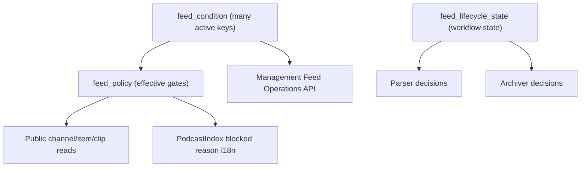

# Summary — Feed Status Table Replacement

## Objective

Replace `feed_flag_status` and `feed_flag_status_reason` with a future-focused model that supports
multi-condition moderation (`spam_detected` + `oversized_detected` at the same time), preserves
all operational behavior (parser, archiver, takedown handling, management controls), and removes
status-table references from runtime code and API contracts.

## Scope

- Data model migration in app DB and ORM entities/services.
- Runtime migration for parser, archiver, management-api, management-web, and web.
- Contract migration for feed-operations API inputs/outputs.
- i18n-safe blocked reason rendering for Podcast Index and takedown experiences.
- Cleanup migration that drops `feed_flag_status_id`, `feed_flag_status_reason_id`,
  `feed_flag_status_reason_note`, and associated lookup tables.
- Explicit status-to-new-model mapping and lifecycle transition validation rules.
- Deterministic parity fixture coverage for migration regression safety.

## Target state model

- `feed_condition` / `feed_condition_type`: all active reasons and operational signals.
- `feed_policy`: effective computed gates (`parse_allowed`, `public_visible`, `add_allowed`,
  `primary_block_reason`).
- New explicit feed lifecycle state model for archive/takedown workflow orchestration
  (separate from policy reasons).
- Management API and UI update reasons/conditions/lifecycle directly; no status IDs.

## Behavior parity requirements

- Parser still supports spam thresholds and oversized detection.
- Archiver still supports pending archive, archive completion, spam cleanup, and takedown
  content removal.
- Management feed-operations still supports operator-driven actions and auditability.
- Web still shows blocked/takedown messaging, now keyed by policy reason + lifecycle.

## Non-negotiable migration guardrails

- Forward-only linear SQL migrations only.
- Do not modify existing applied migration files for this change.
- All mapping behavior must be defined before runtime code implementation begins.
- API contract must be finalized before management-web integration work starts.

## Architecture snapshot

## Plan files

1. [01-schema-and-data-migration.md](./01-schema-and-data-migration.md)
2. [01b-status-mapping-and-transition-spec.md](./01b-status-mapping-and-transition-spec.md)
3. [02-orm-and-domain-services.md](./02-orm-and-domain-services.md)
4. [03-parser-pipeline-migration.md](./03-parser-pipeline-migration.md)
5. [04-archiver-lifecycle-migration.md](./04-archiver-lifecycle-migration.md)
6. [05-management-feed-ops-contract-migration.md](./05-management-feed-ops-contract-migration.md)
7. [05b-management-api-contract-lock.md](./05b-management-api-contract-lock.md)
8. [06-web-blocked-reason-and-takedown-i18n.md](./06-web-blocked-reason-and-takedown-i18n.md)
9. [07-tests-and-removal-cutover.md](./07-tests-and-removal-cutover.md)
10. [07b-parity-fixture-matrix.md](./07b-parity-fixture-matrix.md)
