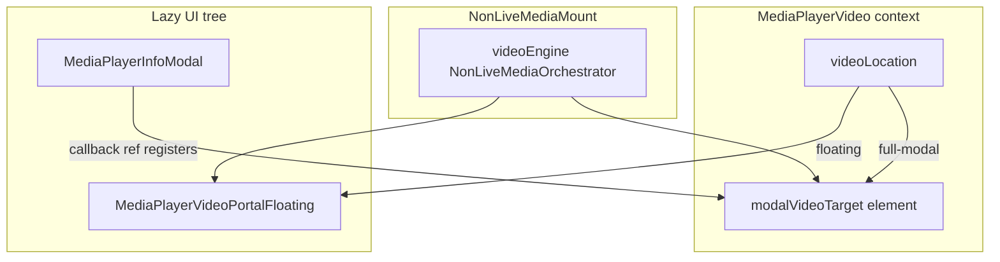

# Modal media player — centered video

## Scope

- When a **non-live video** (including add-by-RSS video) is playing and the user opens the
  full-size media player modal, show the **video** centered in the modal instead of album
  artwork.
- Video fills available width up to modal inner padding, preserves aspect ratio
  (`object-fit: contain`), and shrinks when vertical space is limited (same flex shrink
  behavior as artwork).
- Closing the modal returns the video to the floating portal.
- **Out of scope:** livestream / video.js in the modal (stays in floating portal only).

## Prerequisites

- Plans 01–03 complete (floating player appearance and interaction settled).
- [`MediaPlayerVideo.tsx`](/apps/web/src/contexts/MediaPlayerVideo.tsx) already defines
  `videoLocation: 'full-modal'` — wire it up.

## Why this step exists

- Today the modal always shows square artwork via `ImageNonReact` in
  [`MediaPlayerInfoModal.tsx`](/apps/web/src/components/MediaPlayer/Modal/MediaPlayerInfoModal.tsx),
  even when video is playing in the floating portal.
- There is only **one** `<video>` element (`videoEngine` in `NonLiveMediaMount`); the modal
  must receive that element via portal, not duplicate it.

## Architecture



**Routing rules:**

| Condition                                         | `videoLocation` | Where `videoEngine` renders      |
| ------------------------------------------------- | --------------- | -------------------------------- |
| Video playing, modal closed                       | `'floating'`    | Floating portal                  |
| Video playing, modal open                         | `'full-modal'`  | Modal target div (portal)        |
| Not video / no item                               | `null`          | Nowhere (audio-only hidden path) |

## Steps

### 1. Extend `MediaPlayerVideo` context

File:
[`apps/web/src/contexts/MediaPlayerVideo.tsx`](/apps/web/src/contexts/MediaPlayerVideo.tsx)

Add to context type and provider state:

```typescript
modalVideoTarget: HTMLElement | null;
setModalVideoTarget: (el: HTMLElement | null) => void;
```

Provider is already in [`Providers.tsx`](/apps/web/src/providers/Providers.tsx) — no move needed.

### 2. Lift floating transform state (recommended)

**Interaction note:** If `useFloatingVideoTransform` state lives only inside
`MediaPlayerVideoPortalFloating`, opening the modal unmounts the floating portal and
**loses** drag/resize position until reload.

To preserve session drag/resize across modal open/close:

- Move transform state (`position`, `size`, handlers) into `MediaPlayerVideoProvider`, **or**
- Create a thin `FloatingVideoTransformProvider` wrapping both controller + UI trees.

Pass state/handlers into both portal components as props. Implement this in plan 04 before
modal routing if plans 02–03 used component-local hook state.

If deferring, document that modal toggle resets floating position/size.

### 3. Route video in `NonLiveMediaMount`

File:
[`apps/web/src/components/MediaPlayer/MediaElement/NonLiveMediaMount.tsx`](/apps/web/src/components/MediaPlayer/MediaElement/NonLiveMediaMount.tsx)

**Read additional context:**

- `playerModalIsOpen` from `useMediaPlayer()`.
- `modalVideoTarget`, `setVideoLocation` from `useMediaPlayerVideo()`.

**Effect — sync `videoLocation` with modal + video state:**

```typescript
useEffect(() => {
  const isVideo = /* existing isAddByRSSVideo || isVideoFile && !isLiveItem logic */;
  if (!isVideo || !currentVideoKey) return;

  if (playerModalIsOpen) {
    setVideoLocation('full-modal');
  } else if (videoLocation === 'full-modal') {
    setVideoLocation('floating');
  }
}, [playerModalIsOpen, currentVideoKey, isAddByRSSVideo, isVideoFile, ...]);
```

Do not override `videoLocation` when user closed floating video (`null`) — only transition
between `'floating'` and `'full-modal'` when a video item is active.

**Render branches** (replace current floating-only branch):

```typescript
if (videoLocation === 'floating') {
  floatingVideo = (
    <MediaPlayerVideoPortalFloating onClose={handleCloseFloating}>
      {videoEngine}
    </MediaPlayerVideoPortalFloating>
  );
} else if (videoLocation === 'full-modal' && modalVideoTarget) {
  floatingVideo = ReactDOM.createPortal(videoEngine, modalVideoTarget);
}
```

- Keep hidden audio orchestrator unchanged.
- `videoEngine` remains a single React element — portaling moves the same DOM node.

### 4. Modal video target in `MediaPlayerInfoModal`

File:
[`apps/web/src/components/MediaPlayer/Modal/MediaPlayerInfoModal.tsx`](/apps/web/src/components/MediaPlayer/Modal/MediaPlayerInfoModal.tsx)

- Import `useMediaPlayerVideo`.
- Read `videoLocation`, `setModalVideoTarget`.
- Compute `isVideoPlaying` with the same rules as `NonLiveMediaMount` (shared helper
  recommended):

Create
[`apps/web/src/utils/mediaPlayer/isNonLiveVideoPlaying.ts`](/apps/web/src/utils/mediaPlayer/isNonLiveVideoPlaying.ts)
to centralize:

```typescript
export function isNonLiveVideoPlaying(params: {
  mpItem,
  mpAddByRSS,
  selectedItemEnclosureAndSource,
}): boolean;
```

**Conditional render in `.imageWrapper` region:**

```tsx
{videoLocation === 'full-modal' && isVideoPlaying ? (
  <div
    ref={setModalVideoTarget}
    className={styles.videoWrapper}
    data-testid="modal-video-target"
  />
) : (
  <div className={styles.imageWrapper}>
    <div className={styles.imageInner}>
      <ImageNonReact ... />
    </div>
  </div>
)}
```

Callback ref: `setModalVideoTarget(el)` on mount, `null` on cleanup.

### 5. Modal video SCSS

File:
[`apps/web/src/styles/components/MediaPlayer/Modal/MediaPlayerInfoModal.module.scss`](/apps/web/src/styles/components/MediaPlayer/Modal/MediaPlayerInfoModal.module.scss)

Add `.videoWrapper` mirroring artwork flex shrink behavior (not square-forced):

```scss
.videoWrapper {
  margin-top: var(--spacing-xl);
  align-items: center;
  box-sizing: border-box;
  display: flex;
  flex: 1 1 0;
  justify-content: center;
  min-height: 0;
  width: 100%;
  @include flexItemAllowShrink;
  overflow: hidden;
}
```

**Video element styling** (applied via existing orchestrator `style` prop or modal-specific
class on the portal child):

- `width: 100%`
- `height: 100%`
- `object-fit: contain`
- `display: block`

No `aspect-ratio: 1/1` on video wrapper (unlike artwork). Orchestrator video mount style:

```typescript
style={{ width: '100%', height: '100%', objectFit: 'contain' }}
```

### 6. Unit test for video detection helper

Create
[`apps/web/src/utils/mediaPlayer/isNonLiveVideoPlaying.test.ts`](/apps/web/src/utils/mediaPlayer/isNonLiveVideoPlaying.test.ts):

- Video enclosure → `true`.
- Audio enclosure → `false`.
- Add-by-RSS with `MediumEnum.Video` fallback → `true`.
- Live item → `false` (livestream excluded).

### 7. E2E spec

Create [`apps/web/e2e/media-player-modal-video.spec.ts`](/apps/web/e2e/media-player-modal-video.spec.ts):

Desktop (lg+): play video item → open modal via mini artwork click → assert
`[data-testid="modal-video-target"]` has visible `<video>`, no center artwork → close modal
→ floating portal returns → short viewport: video shrinks but stays centered. Use
`capturePageLoad` per **e2e-screenshot-verified-element**. Regression: audio modal still
shows artwork.

## Key files

| File                                                                                                              | Change                              |
| ----------------------------------------------------------------------------------------------------------------- | ----------------------------------- |
| [`MediaPlayerVideo.tsx`](/apps/web/src/contexts/MediaPlayerVideo.tsx)                                             | `modalVideoTarget` state            |
| [`NonLiveMediaMount.tsx`](/apps/web/src/components/MediaPlayer/MediaElement/NonLiveMediaMount.tsx)                | Modal routing + portal              |
| [`MediaPlayerInfoModal.tsx`](/apps/web/src/components/MediaPlayer/Modal/MediaPlayerInfoModal.tsx)                | Video target div vs artwork         |
| [`MediaPlayerInfoModal.module.scss`](/apps/web/src/styles/components/MediaPlayer/Modal/MediaPlayerInfoModal.module.scss) | `.videoWrapper`                     |
| [`isNonLiveVideoPlaying.ts`](/apps/web/src/utils/mediaPlayer/isNonLiveVideoPlaying.ts)                            | Shared video detection              |
| [`media-player-modal-video.spec.ts`](/apps/web/e2e/media-player-modal-video.spec.ts)                              | E2E                                 |

## Out of scope

- Livestream / video.js in modal; embedded video; persisting floating position on reload.
- Playback policy changes — DOM placement only; keep
  [`MEDIA-PLAYER-DECISION-MATRIX.md`](/apps/web/src/components/MediaPlayer/MEDIA-PLAYER-DECISION-MATRIX.md) passing.

## Expected outcome

- Video playing + modal open → video centered in modal, responsive shrink, preserved aspect
  ratio, no square crop.
- Modal close → video returns to floating portal (plan 01 default position unless user had
  dragged — see step 2 lift).
- Audio playing + modal open → artwork unchanged.

## Operator verification

```bash
npm run lint
npm run build:packages
npm run build -w apps/web
npm run test:unit
make e2e_test_web_report_spec SPEC=e2e/media-player-modal-video.spec.ts
```

Open `.artifacts/e2e-reports/latest/web/index.html` after the report run.
