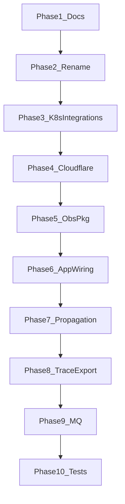

# Execution order — Platform taxonomy (extensions + integrations + observability)

**Run prompts from:** [COPY-PASTA.md](./COPY-PASTA.md) (01 → 13).

**Scope:** Podverse monorepo commits only — code, env templates, K8s manifests, local Docker, docs, tests.

## Critical rule

**Phases are sequential.** Do not start phase N+1 until phase N is complete and verified.

---

## Phase 1 — Docs and skills (1 agent)

| Step | Plan | Outcome |
| ---- | ---- | ------- |
| 1.1 | [01-docs-skills-and-taxonomy.md](./01-docs-skills-and-taxonomy.md) | Three-pillar ops docs; skills/rules; TRACING.md stub |

**Gate:** `INTEGRATIONS-WEB.md`, `EXTENSIONS-SIDECAR.md`, `TRACING.md` stub exist; index `EXTENSIONS.md` links all.

---

## Phase 2 — Env rename + metrics SDK rename (1 agent)

| Step | Plan | Outcome |
| ---- | ---- | ------- |
| 2.1 | [02-ext-env-rename.md](./02-ext-env-rename.md) | No `EXT_*`; `@podverse/extension-metrics-sdk` |

**Gate:** `rg 'EXT_PROMETHEUS|EXT_OTEL_' --glob '!package-lock.json'` clean; `npm run test -w @podverse/extension-metrics-sdk` passes.

---

## Phase 3 — K8s integrations ConfigMap (1 agent)

| Step | Plan | Outcome |
| ---- | ---- | ------- |
| 3.1 | [03-k8s-integrations-config.md](./03-k8s-integrations-config.md) | `base/integrations/` + runtime-config sidecar envFrom |

**Gate:** `kustomize build --load-restrictor LoadRestrictionsNone infra/k8s/alpha/common/` succeeds.

---

## Phase 4 — Integrations (Cloudflare) (1 agent, sequential sub-steps)

| Step | Plan | Outcome |
| ---- | ---- | ------- |
| 4.1 | [04-integrations-web-package-and-cloudflare.md](./04-integrations-web-package-and-cloudflare.md) | `@podverse/integrations-web` |
| 4.2 | [05-runtime-config-wiring.md](./05-runtime-config-wiring.md) | Sidecars, layouts, `getRuntimeConfig` |
| 4.3 | [06-env-templates-and-local.md](./06-env-templates-and-local.md) | Integrations env templates |

**Gate:** Sidecar serves `{ env, integrations }`; Cloudflare disabled by default locally.

---

## Phase 5 — Observability package (1 agent)

| Step | Plan | Outcome |
| ---- | ---- | ------- |
| 5.1 | [08-observability-package-and-env-contract.md](./08-observability-package-and-env-contract.md) | `@podverse/observability` + env/validation |

**Gate:** Package builds; unit tests pass; Observability section in app `.env.example`.

---

## Phase 6 — App wiring + logs (1 agent)

| Step | Plan | Outcome |
| ---- | ---- | ------- |
| 6.1 | [09-app-wiring-and-log-correlation.md](./09-app-wiring-and-log-correlation.md) | `initObservability` all workloads; `trace_id` in logs |

**Gate:** API request logs `trace_id` with `OTEL_TRACES_EXPORT=none`; Next.js OTLP shutdown handlers verified.

---

## Phase 7 — Outbound propagation (1 agent)

| Step | Plan | Outcome |
| ---- | ---- | ------- |
| 7.1 | [10-outbound-propagation-and-audit-unification.md](./10-outbound-propagation-and-audit-unification.md) | `traceparent` on fetch; audit `request_id` |

**Gate:** `npm run test:e2e:api` passes; fetchWithTimeout propagation test passes.

---

## Phase 8 — Trace export + sidecar (1 agent)

**Prerequisite:** Phase 7 complete; in-repo `extensions/prometheus/` OTLP receiver (`:4318`) from completed sidecar work.

| Step | Plan | Outcome |
| ---- | ---- | ------- |
| 8.1 | [11-trace-export-and-sidecar-pipeline.md](./11-trace-export-and-sidecar-pipeline.md) | OTLP trace export; sidecar traces pipeline |

**Gate:** Local smoke with `OTEL_TRACES_EXPORT=otlp` + extensions profile.

---

## Phase 9 — MQ + operator docs (1 agent)

| Step | Plan | Outcome |
| ---- | ---- | ------- |
| 9.1 | [12-mq-workers-tracing-and-operator-docs.md](./12-mq-workers-tracing-and-operator-docs.md) | MQ envelope; TRACING.md finalized |

**Gate:** Worker log shares `trace_id` with API for MQ path; TRACING.md complete.

---

## Phase 10 — Final verification (1 agent)

| Step | Plan | Outcome |
| ---- | ---- | ------- |
| 10.1 | [13-tests-and-verification.md](./13-tests-and-verification.md) | Lint, unit, E2E, rollout doc updates |

**Gate:** Full verification commands in plan 13 pass.

---

## Dependency diagram

---

## Sidecar paths

- Keep `extensions/prometheus/` paths (no `extensions/sidecars/` move).
- Alpha sidecar components remain commented by default in `infra/k8s/alpha`; enable in a GitOps overlay when deploying.
