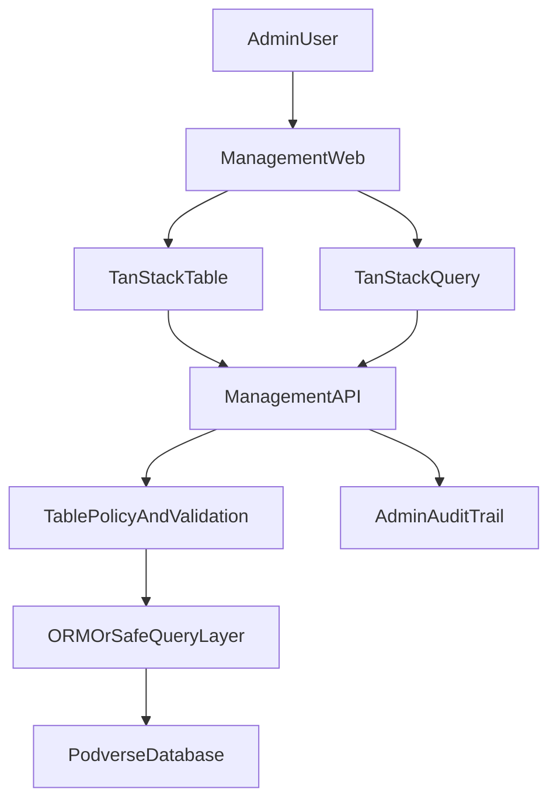

# Management Web Database Console - Master Plan

## Scope

Implement an in-house, secure admin database experience in Podverse with:

- Feed status reason support (`FeedFlagStatusReason`) for moderation/takedown context.
- New management dashboard navigation to `/database` and `/workers`.
- A generic database admin capability (query/filter/search/CRUD) via management-api policy controls.
- A `/workers` placeholder page for future tooling.

## Implementation Standard

- **Backend**: one generic, policy-driven database admin API in `management-api` (allowlisted
  tables/fields/operations), not endpoint-per-table.
- **Frontend table/query engine**: `@tanstack/react-table` and `@tanstack/react-query`.
- **Frontend rendering/forms**: custom `management-web` components and styles.
- **Security baseline**: no arbitrary SQL from browser, mandatory role checks, query bounds, and
  write audit logging before broad CRUD rollout.

## Clean-Break Constraints

- Implement target-state behavior only; do not add legacy compatibility branches.
- Do not add fallback request/response handling for older payload shapes.
- Do not add comments indicating temporary legacy handling.
- Use canonical schema and contracts for this project scope.

## V1 Scope Lock (Initial Rollout)

- Initial `/database` allowlist is limited to:
  - `feed`
  - `feed_flag_status`
  - `feed_flag_status_reason`
- Additional tables are out of scope until Phase 05 verification is complete and expansion is
  explicitly approved.

## Plan Set

- [00a-admin-crud-permissions-foundation.md](./00a-admin-crud-permissions-foundation.md)
- [01-feed-flag-status-reason.md](./01-feed-flag-status-reason.md)
- [02-management-api-database-layer.md](./02-management-api-database-layer.md)
- [03-management-web-database-ui.md](./03-management-web-database-ui.md)
- [04-security-audit-hardening.md](./04-security-audit-hardening.md)
- [05-tests-rollout-docs.md](./05-tests-rollout-docs.md)

## Delivery Sequence

1. Admin CRUD permissions foundation (required prerequisite).
2. Feed reason data model and service support.
3. Generic management-api data endpoints with allowlist policy.
4. `/database` and `/workers` management-web routes.
5. Security and audit controls for high-risk operations.
6. Tests, docs, rollout checklist.

## Phase Gates (Hard Stops)

- Do not start Phase 01 until Phase 00A acceptance criteria and tests pass.
- Do not start Phase 02 until Phase 01 acceptance criteria and tests pass.
- Do not start Phase 03 until Phase 02 acceptance criteria and tests pass.
- Do not start Phase 04 until Phase 03 acceptance criteria and tests pass.
- Do not start Phase 05 until Phase 04 acceptance criteria and tests pass.

## Core Architecture

## Non-Negotiables

- Do not expose arbitrary raw SQL execution to the web client.
- Keep server-side allowlists for tables, fields, and operations.
- Enforce role checks for every read/write endpoint.
- Include audit logging for all write operations.
- Add limits for paging, filtering, sorting, and mutation batch size.
