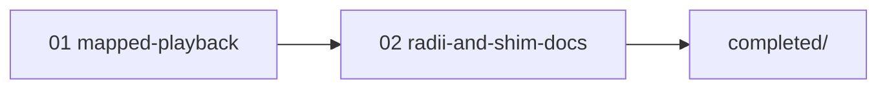

# Add-by-RSS mapped playback — execution order

Run **01 → 02**. Mark COPY-PASTA checkboxes after each prompt. Archive to
`.llm/plans/completed/mobile-addbyrss-mapped-playback/` when both steps are done (final prompt).

| Order | Plan file | Model | Notes |
| ----- | --------- | ----- | ----- |
| 1 | `01-mapped-playback.md` | Opus 4.8 | Closes detail 494 playback AC |
| 2 | `02-radii-and-shim-docs.md` | Codex 5.3 | Hygiene + docs; final archive |

