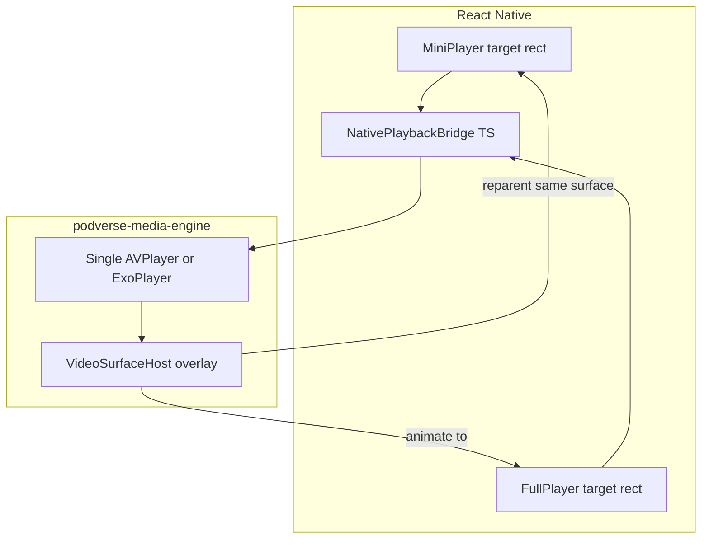

# Authoring: Track 2 — custom native media engine

**Phase:** B (parallel). **Output file:**
`docs/proposals/mobile/_master-plan_/_draft-tracks/track-02.md`

**Detail ID range:** 080–149

## Critical constraint

**Do not use `react-native-track-player`.** This Track defines a first-party Podverse media engine
with native iOS (AVPlayer + AVAudioSession) and Android (Media3 ExoPlayer) implementations, plus a
JS bridge contract consumed by `@podverse/playback-core` policy.

## Seamless video design (document in Track 2 header)

The master plan must state this architecture decision explicitly:

- One **persistent native video surface** owned by the media engine for the lifetime of a playback
  session.
- Mini player and full player screens register **target layout rects** (x, y, width, height, corner
  radius); the engine **reparents** the same native view between containers — no tear-down on expand.
- iOS: `AVPlayerLayer` hosted in a native overlay view managed by the engine module.
- Android: `PlayerView` (Media3) or `SurfaceView` attached to a single ExoPlayer instance.
- RN screens render transparent placeholders; native module positions the surface above them.
- Audio-only items use the same engine without attaching a visible surface.

Reference past pain: old app recreated video player on full-screen open — explicitly forbidden.

## Instructions for the executing agent

Emit steps **2.1–2.35** in master-plan line format (see 01-authoring file), including **Model** on
each line. Include a Track 2 intro paragraph with the seamless video design summary and a mermaid
diagram suggestion for Phase C.

## Track 2 — Custom native media engine

Reference:
[DOCS-MOBILE-PROCESS-PLAYBACK-QUEUE-PARITY.md](/docs/proposals/mobile/app-development-process/DOCS-MOBILE-PROCESS-PLAYBACK-QUEUE-PARITY.md),
[DOCS-MOBILE-CARPLAY-ANDROID-AUTO.md](/docs/proposals/mobile/initial-decisions/DOCS-MOBILE-CARPLAY-ANDROID-AUTO.md)

**Default model for this Track:** Opus 4.8 (native engine is the highest-risk workstream).

| Step | Summary | Model | Detail ID |
| ---- | ------- | ----- | --------- |
| 2.1 | Create `apps/mobile/modules/podverse-media-engine/` native module scaffold (iOS + Android). | Opus 4.8 | 080-media-engine-module-scaffold |
| 2.2 | Define TypeScript bridge interface `NativePlaybackBridge` mirroring web bridge surface API. | Opus 4.8 | 081-native-playback-bridge-interface |
| 2.3 | Document bridge methods: load, play, pause, seek, setRate, getPosition, getDuration, destroy. | Opus 4.8 | 082-bridge-method-contract |
| 2.4 | Implement iOS Swift module wrapping AVPlayer for audio enclosure playback. | Opus 4.8 | 083-ios-avplayer-audio |
| 2.5 | Configure iOS AVAudioSession category `.playback` with background and interrupt handling. | Opus 4.8 | 084-ios-audio-session-lifecycle |
| 2.6 | Wire iOS MPNowPlayingInfoCenter and MPRemoteCommandCenter for lock-screen controls. | Opus 4.8 | 085-ios-now-playing-remote-commands |
| 2.7 | Implement Android Kotlin module with Media3 ExoPlayer for audio playback. | Opus 4.8 | 086-android-exoplayer-audio |
| 2.8 | Implement Android foreground MediaSessionService for background audio survival. | Opus 4.8 | 087-android-foreground-media-service |
| 2.9 | Wire Android MediaSessionCompat/Media3 session for lock-screen and BT controls. | Opus 4.8 | 088-android-media-session-controls |
| 2.10 | Emit native events to JS: playbackState, progress, ended, error, stalled. | Opus 4.8 | 089-native-to-js-events |
| 2.11 | Implement JS `NativePlaybackBridge` adapter calling the native module from RN hooks. | Opus 4.8 | 090-js-bridge-adapter |
| 2.12 | Spike: verify background audio survives app background on iOS and Android. | Opus 4.8 | 091-spike-background-audio |
| 2.13 | Spike: verify audio continues after app kill where OS policy allows (document limits). | Opus 4.8 | 092-spike-audio-after-kill |
| 2.14 | Add iOS video: single AVPlayer instance shared for audio+video items. | Opus 4.8 | 093-ios-avplayer-video |
| 2.15 | Add Android video: single ExoPlayer instance with video surface support. | Opus 4.8 | 094-android-exoplayer-video |
| 2.16 | Implement native **VideoSurfaceHost** overlay view (iOS) for persistent surface ownership. | Opus 4.8 | 095-ios-video-surface-host |
| 2.17 | Implement native **VideoSurfaceHost** overlay view (Android) for persistent surface ownership. | Opus 4.8 | 096-android-video-surface-host |
| 2.18 | Add bridge API `attachVideoSurface(targetId, layoutRect)` for mini/full player targets. | Opus 4.8 | 097-bridge-attach-video-surface |
| 2.19 | Add bridge API `animateVideoSurface(toTargetId, durationMs)` for mini↔full transition. | Opus 4.8 | 098-bridge-animate-video-surface |
| 2.20 | Implement reparenting logic: same native view moves between registered layout targets. | Opus 4.8 | 099-surface-reparent-implementation |
| 2.21 | RN mini player registers `targetId=mini` rect updated on layout and keyboard events. | Opus 4.8 | 100-rn-mini-player-surface-target |
| 2.22 | RN full player registers `targetId=full` rect; expand triggers animate, not remount. | Opus 4.8 | 101-rn-full-player-surface-target |
| 2.23 | Hide video surface when item is audio-only; show when `PlaybackTarget` is video kind. | Opus 4.8 | 102-audio-only-hide-surface |
| 2.24 | Handle orientation change by updating target rects without resetting player. | Opus 4.8 | 103-orientation-surface-resize |
| 2.25 | Implement `loadAndStart` bridge method accepting enclosure URL and initial seek seconds. | Opus 4.8 | 104-bridge-load-and-start |
| 2.26 | Support `file://` local paths for offline playback through same engine. | Opus 4.8 | 105-engine-local-file-playback |
| 2.27 | Define error taxonomy and map native errors to `@podverse/helpers` playback error shapes. | Opus 4.8 | 106-playback-error-mapping |
| 2.28 | Add unit-testable pure TS layer for bridge command serialization (no native in Vitest). | Codex 5.3 | 107-bridge-command-serialization-tests |
| 2.29 | Document engine architecture in `apps/mobile/modules/podverse-media-engine/README.md`. | Codex 5.3 | 108-media-engine-readme |
| 2.30 | Add abcmemory skill update: replace any track-player references with podverse-media-engine. | Codex 5.3 | 109-abcmemory-no-track-player |
| 2.31 | Register non-FOSS deps used by engine (if any Google Play Services) in FOSS register doc stub. | Codex 5.3 | 110-engine-fdroid-deps-register |
| 2.32 | E2E: spike flow plays sample audio and captures lock-screen screenshot (manual/semi-auto). | Codex 5.3 | 111-e2e-audio-spike-screenshot |
| 2.33 | E2E: spike flow plays sample video mini→full transition without playback restart. | Opus 4.8 | 112-e2e-video-transition-spike |
| 2.34 | Define go/no-go gate: engine spike must pass before Track 10/11 full player UI work. | Codex 5.3 | 113-engine-spike-gate |
| 2.35 | Export native cache write hooks from engine for queue snapshot (feeds Track 12 car layer). | Opus 4.8 | 114-engine-native-cache-hooks |

## Suggested mermaid for assembled master plan

## Verification

- Steps 2.1–2.35 present with Detail links 080–114.
- Track intro documents no react-native-track-player and seamless video approach.
- `_TBD_` on every detail link.
