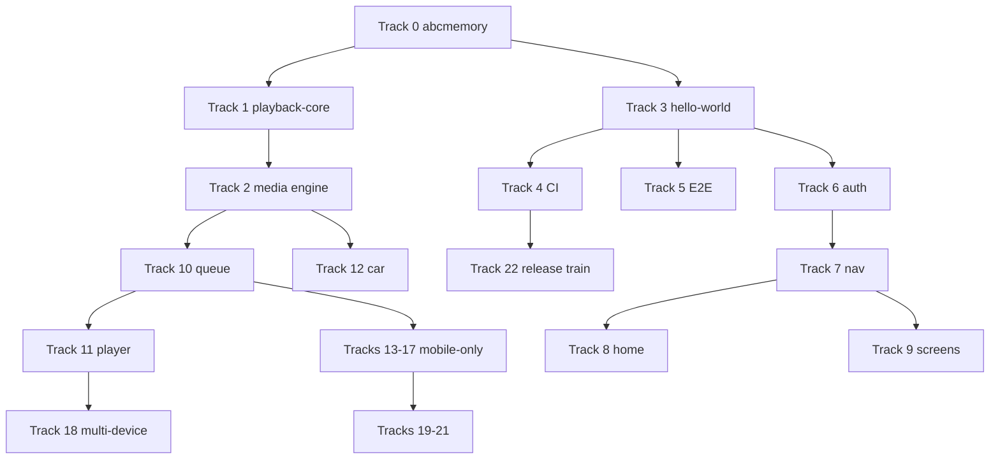

# Authoring: Phase C — assemble and finalize master plan

**Phase:** C (sequential, after all Phase B drafts exist). **Output file:**
`docs/proposals/mobile/_master-plan_/001-MASTER-PLAN.md`

**Recommended Cursor model:** Opus 4.8 (assembly, cross-track consistency, verification)

## Prerequisites

All draft files must exist under `docs/proposals/mobile/_master-plan_/_draft-tracks/`:

| Draft file | Tracks |
| ---------- | ------ |
| `track-00-01-03-05.md` | 0, 1, 3, 5 |
| `track-02.md` | 2 |
| `track-04-22.md` | 4, 22 |
| `track-06-08.md` | 6, 7, 8 |
| `track-09.md` | 9 |
| `track-10-11.md` | 10, 11 |
| `track-12.md` | 12 |
| `track-13-17.md` | 13, 14, 15, 16, 17 |
| `track-18.md` | 18 |
| `track-19-21.md` | 19, 20, 21 |

If any draft is missing, stop and report which Phase B prompt was not run.

## Instructions for the executing agent

### Step 1 — Create master plan shell

Create `docs/proposals/mobile/_master-plan_/001-MASTER-PLAN.md` with:

```markdown
# Podverse Mobile — Master Plan

> Highest-level ordered step list for building the next-generation Podverse mobile app.
> Detail plans: `details/NNN-*.md` (_TBD_ until written).
> Source proposals: [DOCS-MOBILE](/docs/proposals/mobile/initial-decisions/DOCS-MOBILE.md)

## How to read this document

- Steps use **Track.Step** numbering (e.g. `2.15`).
- Tracks run in numeric order unless noted in **Parallel groups** below.
- Each step links to a future detailed plan file marked _TBD_.
- Each step includes **Model:** — recommended Cursor model for authoring and implementing that step (Auto, Codex 5.3, or Opus 4.8).
- **Do not use react-native-track-player** — use custom `podverse-media-engine` (Track 2).

## LLM model guide

| Model | Tier | Use when |
| ----- | ---- | -------- |
| Auto | Cheapest | Mechanical docs, operator-only steps, simple config, deferral stubs |
| Codex 5.3 | Medium | Standard RN screens, E2E harness, auth/nav/browse mirroring web |
| Opus 4.8 | Premium | Native engine, playback/queue parity, car layer, IAP, assembly |

## Open decisions

| Decision | Options | Default recommendation |
| -------- | ------- | ---------------------- |
| CI tooling | EAS vs Fastlane | Document both; operator chooses |
| Store identity | Separate `.next` app id vs internal track on existing | Separate app id |
| E2E framework | Maestro vs Detox | Maestro |
| Watch/TV v1 scope | v1 vs post-MVP | Phone+tablet v1; watch v1.1; TV v2 |

## Parallel groups (implementation order)

[INSERT PARALLEL GROUP TABLE — see below]

## Tracks

[INSERT STITCHED TRACK CONTENT IN ORDER 0 → 22, skipping unused track numbers 3 and 5 are present]

## Appendix A — Screen map

Link: [DOCS-MOBILE-PROCESS-OVERVIEW](/docs/proposals/mobile/app-development-process/DOCS-MOBILE-PROCESS-OVERVIEW.md) §5

## Appendix B — Proposal doc index

Link: [DOCS-MOBILE-PROCESS-ROADMAP](/docs/proposals/mobile/app-development-process/DOCS-MOBILE-PROCESS-ROADMAP.md) § Index

## Appendix C — Detail plan index

Table of all `Detail:` links grouped by Track (_TBD_ files not created yet). Includes Model column.
```

### Step 2 — Insert parallel groups table

Use this table verbatim (adjust step counts if drafts differ):

```markdown
| Group | Tracks | Can parallelize with | Prerequisites |
| ----- | ------ | -------------------- | ------------- |
| PG-0 | 0 | — | none |
| PG-1 | 1 | 3 (after 0.6+) | 0 partial |
| PG-2a | 3 | 4, 5 (after 0) | 0 |
| PG-2b | 2 spike (2.1–2.13) | 3, 4, 5 | 0, 1 recommended |
| PG-3 | 4, 5 | each other | 3 hello-world |
| PG-4 | 6, 7 | each other | 3, 5 |
| PG-5 | 2 full (2.14–2.35) | 8, 9 | 2 spike, 1 |
| PG-6 | 8, 9 | each other | 6, 7 |
| PG-7 | 10, 11 | each other | 1, 2, 6 |
| PG-8 | 12 | 13, 14, 15 | 2, 10 |
| PG-9 | 13, 14, 15, 16, 17 | each other (mostly) | 6, 10 varies |
| PG-10 | 18 | 19, 20 | 7, 11 |
| PG-11 | 19, 20, 21 | each other | MVP feature-complete |
| PG-12 | 22 | — | 4, PG-11 |
```

Add a mermaid diagram:



### Step 3 — Stitch draft tracks

Concatenate draft files in numeric Track order:

1. Track 0, 1, 3, 5 from `track-00-01-03-05.md`
2. Track 2 from `track-02.md`
3. Track 4, 22 from `track-04-22.md` (**insert Track 22 after Track 21**, not immediately after 4)
4. Tracks 6, 7, 8 from `track-06-08.md`
5. Track 9 from `track-09.md`
6. Tracks 10, 11 from `track-10-11.md`
7. Track 12 from `track-12.md`
8. Tracks 13–17 from `track-13-17.md`
9. Track 18 from `track-18.md`
10. Tracks 19–21 from `track-19-21.md`
11. Track 22 section from `track-04-22.md` (if not already placed at end)

**Final Track order in assembled doc:** 0, 1, 2, 3, 4, 5, 6, 7, 8, 9, 10, 11, 12, 13, 14, 15, 16,
17, 18, 19, 20, 21, 22.

When stitching, preserve **Model:** from each draft step line. Do not strip or reassign models unless
a draft step is missing Model (fix the draft, do not guess).

### Step 4 — Verify every step

Run these checks and fix the master plan if any fail:

1. Every step line matches pattern: `N.M. Summary. Model: <Auto|Codex 5.3|Opus 4.8>. Detail: [slug](path) — _TBD_`
2. Every step has exactly one **Model:** field with a value from {Auto, Codex 5.3, Opus 4.8}.
3. No duplicate Detail IDs across the document.
4. Detail IDs fall in expected ranges (001–609 per 00-SUMMARY.md).
5. Track 2 intro states **no react-native-track-player**.
6. Track 2 documents seamless video surface reparenting.
7. Track 7 tabs are exactly: Home, Search, My Library, RSS, More.
8. Track 8 lists six media types in selector.
9. Track 16 includes OPML import and export steps.
10. Track 4 and 22 emphasize separate app id / prod listing safety.
11. Track 20 documents FOSS flavor path without requiring F-Droid submission now.

### Step 5 — Build Appendix C detail index

Generate a markdown table:

| Detail ID | Track.Step | Slug | Model | Status |
| --------- | ---------- | ---- | ----- | ------ |
| 001-cursorignore-native-artifacts | 0.1 | ... | Auto | _TBD_ |
| ... | ... | ... | ... | _TBD_ |

Sort by numeric ID prefix. **Model** must match the master-plan step line.

### Step 6 — Detail plan template (for when detail docs are written)

When operators or agents create `details/NNN-slug.md`, use this header (Model copied from master plan):

```markdown
# NNN-slug

**Master step:** Track.Step  
**Model (author + implement):** Codex 5.3  
**Status:** draft | ready | done

## Scope

...

## Acceptance criteria

...

## Web parity references

...

## Verification

...
```

Bump to **Opus 4.8** for detail plans under playback, native engine, car, or store-release when the
master step already says Opus or the work spans native + JS bridges.

### Step 7 — Optional cleanup

Do **not** delete `_draft-tracks/` unless operator prefers — add note in master plan that drafts
are source fragments for this assembly.

### Step 8 — Update COPY-PASTA

Mark Prompt 11 complete in `.llm/plans/active/mobile-master-plan/COPY-PASTA.md` (change `[ ]` to
`[x]` for Prompt 11 only if executing agent is also archiving; otherwise leave for operator).

## Assembly checklist (for executing agent)

- [ ] `001-MASTER-PLAN.md` created
- [ ] All 23 Tracks (0–22) present in correct order
- [ ] Parallel groups table and mermaid included
- [ ] LLM model guide section included
- [ ] Open decisions table included
- [ ] Appendix A, B, C present (Appendix C includes Model column)
- [ ] Step count ≥ 200 (sanity check for comprehensiveness)
- [ ] Every step has Model and Detail link with `_TBD_`
- [ ] No `details/*.md` files created (links only)

## Verification commands (operator)

```bash
test -f docs/proposals/mobile/_master-plan_/001-MASTER-PLAN.md
grep -c '^[0-9]' docs/proposals/mobile/_master-plan_/001-MASTER-PLAN.md
grep -c 'Model:' docs/proposals/mobile/_master-plan_/001-MASTER-PLAN.md
grep -c 'Detail:' docs/proposals/mobile/_master-plan_/001-MASTER-PLAN.md
grep -c '_TBD_' docs/proposals/mobile/_master-plan_/001-MASTER-PLAN.md
! grep -q 'react-native-track-player' docs/proposals/mobile/_master-plan_/001-MASTER-PLAN.md || grep -q 'Do not use' docs/proposals/mobile/_master-plan_/001-MASTER-PLAN.md
```

Expected: Model count equals step count; Detail count equals step count; `_TBD_` count equals Detail count.

## After assembly

Operator archives plan set:

```bash
mv .llm/plans/active/mobile-master-plan .llm/plans/completed/
```

Update `.llm/LLM.md` or active plans index if mobile-master-plan is listed there.
