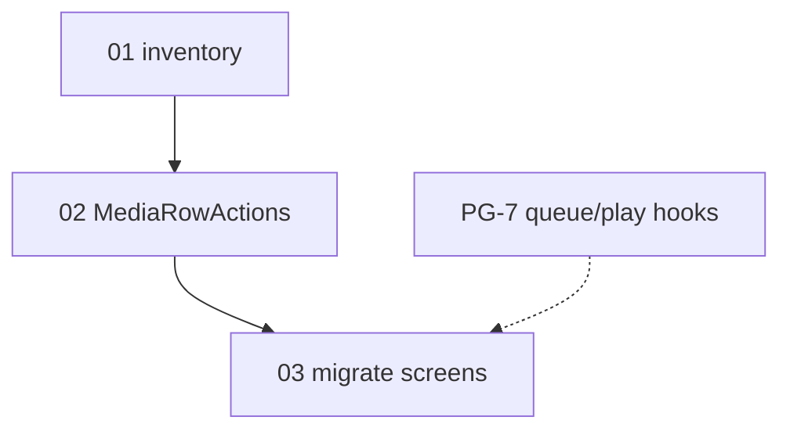

# PG-6.6 media row actions — execution order

Run **01 → 03** sequentially. May parallel a PG-7 session/worktree. Mark steps `done` after each
prompt; update Appendix C + detail headers. Archive to
`.llm/plans/completed/mobile-media-row-actions/` on the final prompt.

| Order | Plan file | Steps | Detail IDs | Model |
| ----- | --------- | ----- | ---------- | ----- |
| 1 | `01-inventory.md` | 9c.1 | 497 | Auto |
| 2 | `02-shared-component.md` | 9c.2 | 498 | Codex 5.3 |
| 3 | `03-migrate-screens.md` | 9c.3 | 499 | Codex 5.3 |

