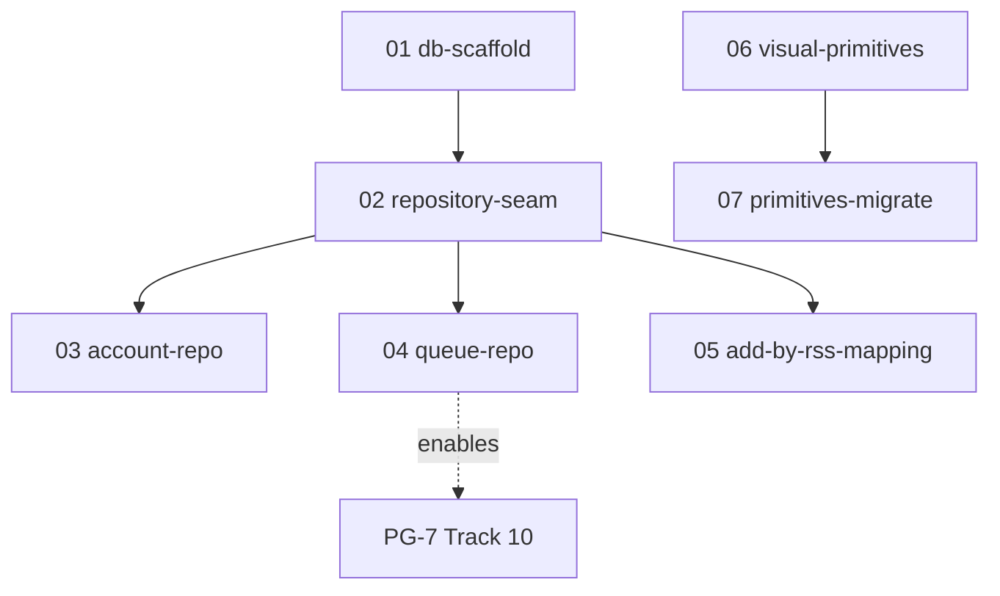

# PG-6.5 data layer — execution order

Critical path for PG-7 is **01 → 02 → 04**. Account (03) and add-by-RSS mapping (05) depend on the
repository seam (02). Visual primitives (06 → 07) are independent and may run in a parallel
session/worktree (or overlap PG-7). Mark master-plan steps `done` after each prompt; update
Appendix C and detail doc headers.

| Order | Plan file | Steps | Detail IDs | Model | Notes |
| ----- | --------- | ----- | ---------- | ----- | ----- |
| 1 | `01-db-scaffold.md` | 9b.1 | 490 | Opus 4.8 | Blocks everything |
| 2 | `02-repository-seam.md` | 9b.2 | 491 | Opus 4.8 | Projection stubs + seam |
| 3 | `03-account-repo.md` | 9b.3 | 492 | Codex 5.3 | After 02 |
| 4 | `04-queue-repo.md` | 9b.4 | 493 | Opus 4.8 | **Required before Track 10** |
| 5 | `05-add-by-rss-mapping.md` | 9b.5 | 494 | Opus 4.8 | After 02; may follow 04 |
| 6 | `06-visual-primitives.md` | 9b.6 | 495 | Codex 5.3 | Parallel OK |
| 7 | `07-primitives-migrate.md` | 9b.7 | 496 | Codex 5.3 | After 06 |

Archive to `.llm/plans/completed/mobile-pg6.5-data-layer/` when all steps `done` (final COPY-PASTA
prompt).
