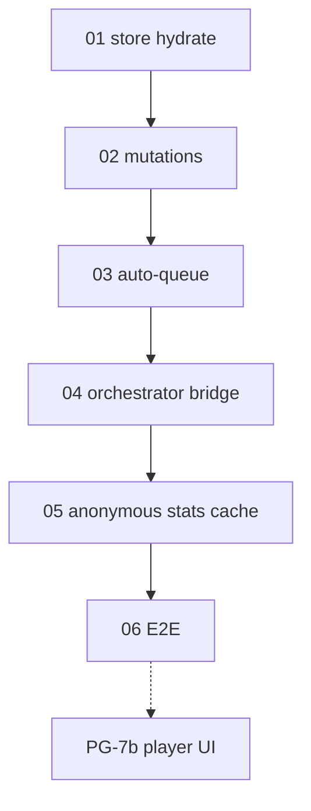

# PG-7a queue — execution order

Run **01 → 06** sequentially (each builds on the prior). Mark master-plan steps `done` after each
prompt; update Appendix C and detail doc headers. Archive to
`.llm/plans/completed/mobile-pg7a-queue/` on the final prompt.

| Order | Plan file | Steps | Detail IDs | Model |
| ----- | --------- | ----- | ---------- | ----- |
| 1 | `01-queue-store-hydrate.md` | 10.1–10.5 | 310–314 | Opus 4.8 |
| 2 | `02-queue-mutations.md` | 10.6–10.7 | 315–316 | Opus 4.8 |
| 3 | `03-auto-queue.md` | 10.8–10.11 | 317–320 | Opus 4.8 |
| 4 | `04-orchestrator-bridge.md` | 10.12–10.17 | 321–326 | Opus 4.8 |
| 5 | `05-anonymous-stats-cache.md` | 10.18–10.22 | 327–331 | Opus 4.8 |
| 6 | `06-e2e-queue-playback.md` | 10.23–10.25 | 332–334 | Codex 5.3 |

