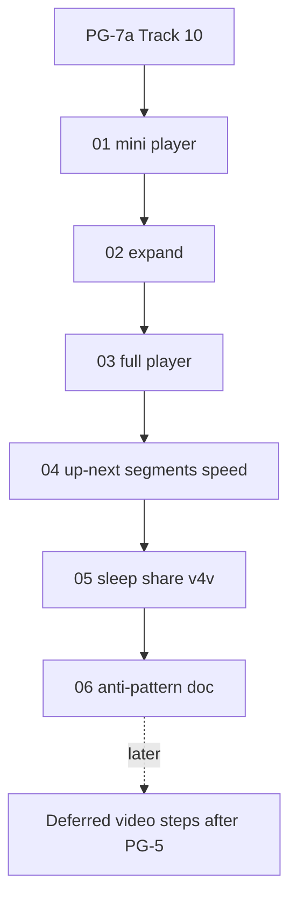

# PG-7b player — execution order

Run **01 → 06** after PG-7a Track 10 is `done` (or at least 10.13–10.14 play path live). **Do not**
implement deferred video steps (11.3, 11.6–11.8, 11.15–11.17) in this set. Mark implemented steps
`done` after each prompt; leave deferred steps `planned`. Archive to
`.llm/plans/completed/mobile-pg7b-player/` on the final prompt.

| Order | Plan file | Steps | Detail IDs | Model |
| ----- | --------- | ----- | ---------- | ----- |
| 1 | `01-mini-player.md` | 11.1–11.2 | 340–341 | Codex 5.3 |
| 2 | `02-expand-without-reload.md` | 11.4 | 343 | Opus 4.8 |
| 3 | `03-full-player-ui.md` | 11.5 | 350 | Codex 5.3 |
| 4 | `04-up-next-segments-speed.md` | 11.9–11.11 | 354–356 | Codex 5.3 |
| 5 | `05-sleep-share-v4v.md` | 11.12–11.14 | 357–359 | Opus 4.8 |
| 6 | `06-anti-pattern-doc.md` | 11.18 | 363 | Auto |

