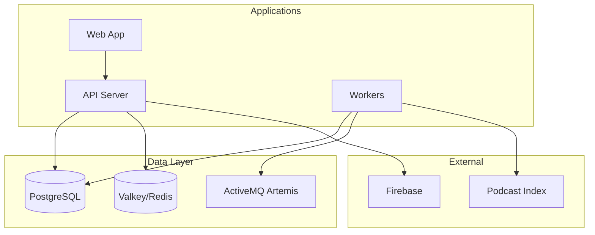

# Phase 5B: Documentation Finalization

**Status**: Completed
**Effort**: ~3-4 hours
**Dependencies**: None (can run parallel with 5A)

## Overview

Expand the minimal documentation created during Phase 1 into comprehensive guides for developers and LLMs.

## Tasks

### 1. Expand README.md

Current: 23 lines (minimal quick start)

**Add sections:**

```markdown
# Podverse

Open source podcast app with Podcasting 2.0 support.

## Features

- Value4Value / Lightning payments
- Chapters, transcripts, soundbites
- Cross-platform (iOS, Android, F-Droid, Web)
- Self-hostable

## Quick Start

[existing content]

## Directory Structure

packages/ # Publishable npm packages (@podverse/\*)
helpers/ # Shared utilities, types, DTOs
external-services/ # Third-party integrations
orm/ # Database entities and services
notifications/ # Push notification services
parser/ # RSS/Podcast feed parsing
mq/ # Message queue operations

apps/ # Deployable applications
api/ # REST API (Express)
web/ # Web app (Next.js)
workers/ # Background job processors
management-api/ # Admin API
management-web/ # Admin dashboard

tools/ # Development tools
qa/ # Test data generation

infra/ # Infrastructure
config/ # Environment templates
database/ # Migrations and seeds
docker/ # Docker compose files

scripts/ # Utility scripts
pipelines/ # Jenkins pipelines
docs/ # Documentation
.llm/ # LLM context and history

## Development

[expanded setup instructions]

## Deployment

[overview pointing to Jenkins/CI docs]

## Documentation

- [Architecture](docs/ARCHITECTURE.md)
- [Contributing](docs/CONTRIBUTING.md)
- [Environment Variables](docs/ENV.md)

## License

AGPL-3.0
```

### 2. Expand docs/ARCHITECTURE.md

Current: 24 lines (basic structure)

**Add sections:**

- Service communication diagram (mermaid)
- Data flow: Feed parsing → Database → API → Web
- Database overview (PostgreSQL + TypeORM)
- External service integrations (Firebase, PayPal, Podcast Index)
- Message queue architecture

**Example diagram:**



### 3. Update docs/CONTRIBUTING.md

Current: 42 lines (good but incomplete)

**Add/update:**

- Testing section (placeholder - "Testing strategy TBD")
- Release/deployment process overview
- Code review guidelines
- PR checklist

### 4. Expand .llm/context/architecture.md

Current: 22 lines (minimal)

**Add:**

- Brief description of each app
- Common code patterns used
- Troubleshooting tips
- "Where to find X" quick reference

### 5. Update .llm/context/conventions.md

Current: 20 lines (basic)

**Add:**

- Import order conventions
- Error handling patterns
- Logging conventions
- Environment variable patterns

## Checklist

- [x] Expand README.md with full structure and setup
- [x] Expand docs/ARCHITECTURE.md with diagrams and data flow
- [x] Update docs/CONTRIBUTING.md with testing and release sections
- [x] Expand .llm/context/architecture.md with app descriptions
- [x] Update .llm/context/conventions.md with additional patterns

## Notes

- Keep docs concise but complete
- Use mermaid diagrams where helpful
- Link between docs rather than duplicating content
- LLM context docs should be optimized for AI consumption
