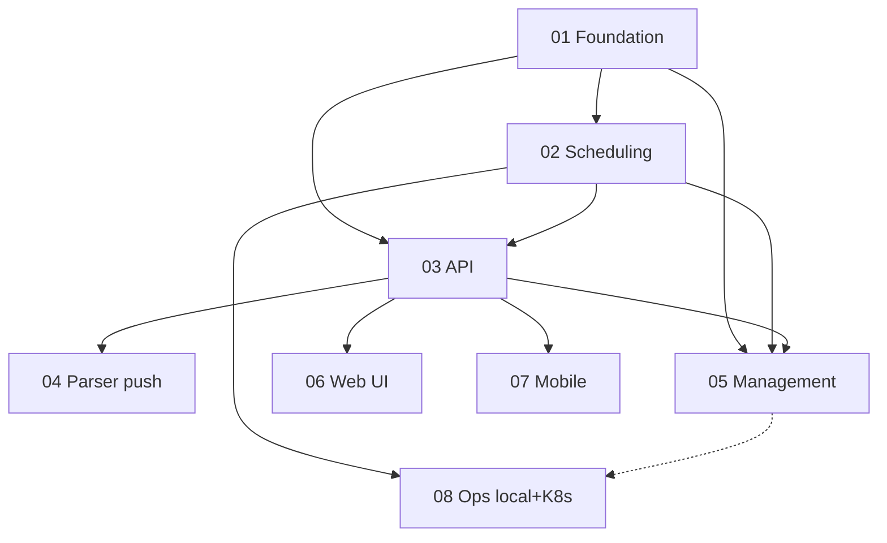

# Execution order — Notifications platform & scheduling

Run prompts **01 → 08** in order via [`COPY-PASTA.md`](./COPY-PASTA.md). Each phase depends on the
prior unless noted.

## Order

| # | Phase | File | Depends on |
| --- | --- | --- | --- |
| 01 | Foundation DB/domain | [`01-foundation-db-domain.md`](./01-foundation-db-domain.md) | — |
| 02 | Scheduling system | [`02-scheduling-system-workers.md`](./02-scheduling-system-workers.md) | 01 |
| 03 | API + prefs | [`03-api-notifications-and-prefs.md`](./03-api-notifications-and-prefs.md) | 01, 02 |
| 04 | Send integration | [`04-send-integration-parser-push.md`](./04-send-integration-parser-push.md) | 01, 03 |
| 05 | Management admin | [`05-management-admin-notifications.md`](./05-management-admin-notifications.md) | 01, 02, 03 |
| 06 | Web UI | [`06-web-notifications-ui.md`](./06-web-notifications-ui.md) | 03 |
| 07 | Mobile tabs + inbox | [`07-mobile-tabs-and-notifications.md`](./07-mobile-tabs-and-notifications.md) | 03 |
| 08 | Ops local + K8s | [`08-ops-local-and-k8s.md`](./08-ops-local-and-k8s.md) | 01, 02 (docs polish; best after 05 if admin schedule notes) |

## Dependency graph



## Why this order

1. **01** defines tables, enums, services, and DTOs everything else imports (local migrate + K8s
   baseline).
2. **02** adds the generic job runner (local npm scripts + K8s CronJobs) before API/admin schedule.
3. **03** exposes feed/prefs/mark-seen and row-creation helpers parser/management call.
4. **04** wires content events to in-app rows + respects expanded prefs at send time.
5. **05** admin compose/schedule can land once API + jobs exist (parallel with 04/06 if needed).
6. **06** / **07** are per-app consumers; can be executed in parallel after **03** (operator choice).
7. **08** closes dual-env docs/smoke gaps so local CLI and cluster Cron/GitOps stay aligned.

## Cumulative verification (after all steps)

Operator runs once at end of the full set (deduped):

```bash
npm run build:packages
npm run lint
npm run test:unit
make test_deps
npm run test:e2e:api
make e2e_test_web_report_spec SPEC=e2e/notifications-inbox.spec.ts
make e2e_test_management_web_report_spec SPEC=e2e/admin-notifications.spec.ts
npm run mobile:e2e:test -- notifications-inbox
open .artifacts/mobile-e2e-reports/latest/ios-phone/index.html
npm run scheduled_jobs_run_due -w apps/workers -- -dry-run
```

Adjust spec paths to match files added during implementation.

## Archival

After all steps complete and merge:

```bash
mv .llm/plans/active/notifications-platform \
   .llm/plans/completed/notifications-platform
```

Update [`.llm/plans/active/LLM-PLANS-ACTIVE.md`](../LLM-PLANS-ACTIVE.md).
