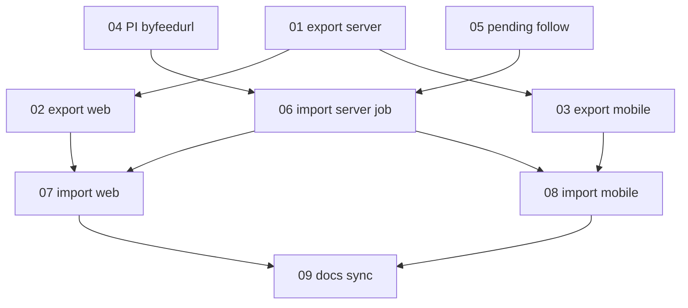

# OPML Import/Export — Execution Order

Phases are **sequential**. Within a phase, agents marked parallel may run simultaneously.

## Phase 1 — Export (start here)

Deliver the full export path end to end before touching import.

1. **01** Server export endpoint + OPML generation + shared req helper. (foundation)
2. Then in parallel:
   - **02** Web OPML settings tab + Export button/download.
   - **03** Mobile More "OPML" row + OPML screen + Export (write + share).

## Phase 2 — Import foundation (server, sequential)

3. **04** Podcast Index by-feed-URL lookup (`podcastGetByFeedUrl`).
4. **05** Pending-follow ORM table + service + parser resolution hook.
5. **06** OPML import MQ job: server OPML parse, 3-tier per-feed resolution, Valkey report,
   enqueue + status endpoints, 50/hr rate limit (new work only), shared req helpers.

`06` depends on `04` and `05`.

## Phase 3 — Import UI (parallel)

6. In parallel:
   - **07** Web OPML import (file picker, upload, poll, report, rate-limit modal).
   - **08** Mobile OPML import (`expo-document-picker`, upload, poll, report, rate-limit modal).

## Phase 4 — Docs / master-plan sync

7. **09** Update master plan Track 16 statuses, web docs, and abcmemory pointers. Confirm the
   web+mobile add-by-RSS/OPML parity checklist in [00-SUMMARY.md](./00-SUMMARY.md).

## Dependency graph

