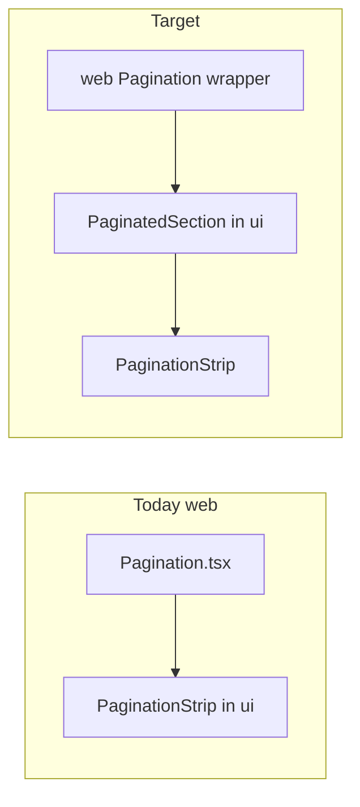

# Move web list pagination shell into `@podverse/ui`

## Current state

| Location                                                                                                                | Role                                                                                                                                                                                                                                        |
| ----------------------------------------------------------------------------------------------------------------------- | ------------------------------------------------------------------------------------------------------------------------------------------------------------------------------------------------------------------------------------------- |
| [`packages/ui/src/components/navigation/Pagination/Pagination.tsx`](../../../../packages/ui/src/components/navigation/Pagination/Pagination.tsx) | **Management-style** pagination: text prev/next, numbered buttons, `pageIndicatorLabel`. Used by [`TableBrowserPageClient.tsx`](../../../../apps/management-web/src/app/(management)/database/[table]/TableBrowserPageClient.tsx). |
| [`packages/ui/src/components/navigation/PaginationStrip/PaginationStrip.tsx`](../../../../packages/ui/src/components/navigation/PaginationStrip/PaginationStrip.tsx) | **Web list baseline**: chevrons + sliding numeric strip. Already framework-agnostic and i18n-clean.                                                                                                                                        |
| [`apps/web/src/components/Pagination/Pagination.tsx`](../../../../apps/web/src/components/Pagination/Pagination.tsx)                            | Wraps `PaginationStrip`, adds outer column layout, `children`, hides controls when `totalPages <= 1`, wires `useTranslations('pagination')` for **aria** only. Styles: [`apps/web/src/styles/components/Pagination/Pagination.module.scss`](../../../../apps/web/src/styles/components/Pagination/Pagination.module.scss) (only consumer). |

There is a **name collision**: `Pagination` means different UX in web vs management. The migration must **not** overload the existing `Pagination` export; add a **new** symbol for the strip-based composite.



## Recommended component API (new in `packages/ui`)

Introduce **`PaginatedSection`** under [`packages/ui/src/components/navigation/`](../../../../packages/ui/src/components/navigation/) (name can be tweaked — avoid overloading `Pagination`):

- **Props (copy-free; apps pass strings):**
  - `children: ReactNode`
  - `currentPage`, `totalPages`, `onPageChange` (align with `PaginationStrip`)
  - `prevAriaLabel`, `nextAriaLabel` (required; web wrapper fills via `t(...)`)
  - Optional: `maxButtons` (default **5**, replacing [`apps/web/src/constants/pagination.ts`](../../../../apps/web/src/constants/pagination.ts))
  - Optional: `paginationControlsClassName`, root `className`
- **Behavior:** Root column flex container; render `PaginationStrip` only when `totalPages > 1`.
- **Styles:** Move the flex-column rule from web SCSS into `packages/ui` (e.g. `PaginatedSection.module.scss`). Delete web-only [`Pagination.module.scss`](../../../../apps/web/src/styles/components/Pagination/Pagination.module.scss) after migration.
- **Exports:** Add to [`packages/ui/src/index.ts`](../../../../packages/ui/src/index.ts). Optionally export **`PAGINATION_STRIP_DEFAULT_MAX_BUTTONS`** (or similar).

## Web app wrapper (convenience)

Keep [`apps/web/src/components/Pagination/Pagination.tsx`](../../../../apps/web/src/components/Pagination/Pagination.tsx) as the thin boundary for **`next-intl`** ([`shared-ui-i18n`](../../../../.cursor/rules/shared-ui-i18n.mdc)): call `useTranslations('pagination')` and pass `prevAriaLabel` / `nextAriaLabel` into `PaginatedSection`. Map `setPage` → `onPageChange` internally so call sites under [`apps/web/src/components`](../../../../apps/web/src/components) and [`apps/web/src/app/add-by-rss`](../../../../apps/web/src/app/add-by-rss) need **no** prop renames.

Remove [`apps/web/src/constants/pagination.ts`](../../../../apps/web/src/constants/pagination.ts) if redundant (currently only used by web `Pagination.tsx`).

## Tests and verification

- **Unit:** Vitest for `PaginatedSection` (no strip when `totalPages <= 1`; children render; aria passed through). Follow [`Pagination.test.tsx`](../../../../packages/ui/src/components/navigation/Pagination/Pagination.test.tsx).
- **E2E:** Optional scoped list spec if desired.

```bash
./scripts/nix/with-env npm run build:packages
./scripts/nix/with-env npm run lint
```

```bash
make e2e_test_web_report_spec SPEC=e2e/<representative-list>.spec.ts
```

## Management-web

**No change** unless you later converge table browser to `PaginationStrip` (out of scope).

## LLM history

After implementation, append a session under [`.llm/history/active/`](../../../../.llm/history/active/) per repo rules.

## Checklist

- [ ] `PaginatedSection` + SCSS + export + optional default max-buttons constant
- [ ] Web `Pagination.tsx` composes shared primitive + `next-intl`
- [ ] Remove orphaned web SCSS / constants
- [ ] Vitest; build + lint; optional E2E
