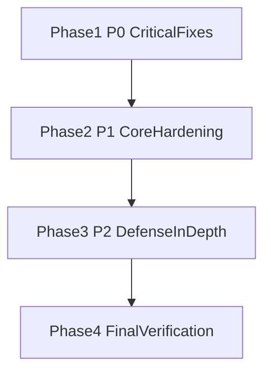

# Podverse Security Remediation Wave 1

## Goal

Implement fixes for the open, fixworthy findings from the SQLi + attack-surface audit.

## Finding Coverage

- `PVSA-001` -> `01-management-api-authz-scope.md`
- `PVSA-002` -> `03-orm-stats-query-hardening.md`
- `PVSA-003`, `PVSA-004` -> `02-parser-ssrf-and-response-guardrails.md`
- `PVSA-005`, `PVSA-006` -> `04-auth-token-policy.md`
- `PVSA-007` -> `05-api-validation-strictness.md`
- `PVSA-008`, `PVSA-009` -> `06-logging-redaction-hardening.md`
- `PVSA-010` -> `07-management-dashboard-server-auth-gate.md`
- P2 load guardrail follow-up -> `08-query-load-guardrails.md`
- Optional frontend URL hardening follow-up -> `09-web-safe-url-policy.md`

## Execution Order



### Phase 1 (P0)

1. `01-management-api-authz-scope.md`
2. `02-parser-ssrf-and-response-guardrails.md`

### Phase 2 (P1)

1. `03-orm-stats-query-hardening.md`
2. `04-auth-token-policy.md`
3. `05-api-validation-strictness.md`
4. `06-logging-redaction-hardening.md`
5. `07-management-dashboard-server-auth-gate.md`

### Phase 3 (P2)

1. `08-query-load-guardrails.md`
2. `09-web-safe-url-policy.md`

### Phase 4

1. Re-run focused tests for all touched subsystems.
2. Update `security-findings-tracker.md` statuses from `open` to `resolved` or
   `accepted_risk`.
3. Write remediation summary note under this plan set.

## Shared Verification Baseline

```bash
npm run build:packages
npm run lint
```

Run subsystem tests noted in each plan file before marking a finding resolved.
