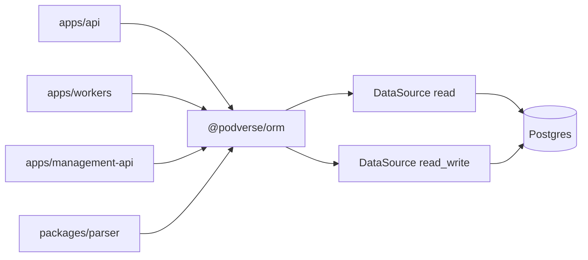

# TypeORM 1.0 upgrade — summary

Created: 2026-05-25  
Scope: **Podverse** monorepo only (not Metaboost).

## Work location

| Item | Value |
| ---- | ----- |
| Branch | `chore/typeorm-v1` |
| Worktree | `/Users/mitcheldowney/repos/pv/podverse-typeorm-v1` |
| Primary checkout (do not implement here) | `/Users/mitcheldowney/repos/pv/podverse` on `develop` |

Pre-flight: `cd /Users/mitcheldowney/repos/pv/podverse-typeorm-v1 && git branch --show-current`

## Goal

Upgrade `typeorm` from **0.3.30** to **1.0.0** across all direct consumers with a **clean hard break**. After completion, the codebase uses only TypeORM v1 APIs and patterns — no compatibility shims, no v0.3 naming strategy, no rollback flags.

Related: [Dependabot PR #221](https://github.com/podverse/podverse/pull/221) bumps the version only; **do not merge as-is**. Close or supersede that PR when executing this plan set.

## Hard-break policy (binding)

| Prohibited | Required instead |
| ---------- | ---------------- |
| `@typeorm/legacy-naming-strategies` / `NamingStrategyV03` | Vendored `SnakeNamingStrategy` in `@podverse/orm` |
| `invalidWhereValuesBehavior: { null: 'ignore', undefined: 'ignore' }` | Fix callers; use `IsNull()` for null matching |
| Dual-path code, feature flags, “formerly 0.3” comments | Single v1-only path |
| Keeping `typeorm-naming-strategies` peer dep | Remove package; import from `@podverse/orm` |

## Authoritative upstream docs

- [TypeORM v1.0 Release Notes](https://typeorm.io/docs/releases/1.0/release-notes/)
- [Upgrading from 0.3 to 1.0](https://typeorm.io/docs/releases/1.0/upgrading-from-0.3/)
- [`@typeorm/codemod`](https://www.npmjs.com/package/@typeorm/codemod)

## Inventory snapshot

**Plan 01 baseline (2026-05-26, worktree):** 241 typeorm-import files; 44 string-`relations` files; 4 string-`select`; 1 string-entity `findOne`; 19 QueryBuilder files; 0 legacy `getConnection`/`createConnection` in TS. Full table: [completed/01-baseline-inventory-and-contract.md](../completed/typeorm-v1-upgrade/01-baseline-inventory-and-contract.md).

**Plan authoring baseline (approximate):**

| Area | Scale | v1 risk |
| ---- | ----- | ------- |
| Direct `typeorm` deps | 4 `package.json` files | Lockfile + peer alignment |
| `typeorm` import files | ~228 TS files (mostly `packages/orm`) | Codemod + compile |
| String `relations: [...]` | **45 files** | Must convert to object syntax |
| String `select: [...]` | **4 files** | Object syntax |
| String entity `findOne('Queue', …)` | **5 calls** in `queueResource.ts` | Use `Queue` entity class |
| Legacy Connection API | **0 usages** | Low |
| `join:` / `onConflict` / `printSql` / `findByIds` | **0 usages** | Low |
| `typeorm-naming-strategies@4.1.0` | orm + management-api | Peer is `^0.2 \|\| ^0.3` — replace |
| Node.js (`.nvmrc`) | **24** | Meets v1 requirement (20+) |
| Schema migrations | Linear SQL only | TypeORM migrations disabled (`migrations: []`) |

## Architecture (unchanged semantically)

Linear SQL under `infra/k8s/base/ops/source/database/linear-migrations/` remains the schema source of truth.

## Plan files

| File | Focus |
| ---- | ----- |
| [01-baseline-inventory-and-contract.md](./01-baseline-inventory-and-contract.md) | Baseline `rg` counts; scope contract |
| [02-dependency-bump-and-naming-strategy.md](./02-dependency-bump-and-naming-strategy.md) | Bump deps; vendor naming strategy |
| [03-automated-codemod-pass.md](./03-automated-codemod-pass.md) | `@typeorm/codemod v1` |
| [04-find-options-orm-package.md](./04-find-options-orm-package.md) | String relations/select in `packages/orm` |
| [05-find-options-apps-and-parser.md](./05-find-options-apps-and-parser.md) | String relations/select in apps/parser |
| [06-querybuilder-and-high-risk-services.md](./06-querybuilder-and-high-risk-services.md) | `queueResource`, QB hotspots |
| [07-management-api-and-satellite-consumers.md](./07-management-api-and-satellite-consumers.md) | 4× DataSource, lighthouse, test-assets |
| [08-docs-skills-and-type-exports.md](./08-docs-skills-and-type-exports.md) | ORM skill, type re-exports, docs |
| [09-verification-and-merge-gates.md](./09-verification-and-merge-gates.md) | Build, lint, tests, final grep gates |

Execute via [00-EXECUTION-ORDER.md](./00-EXECUTION-ORDER.md) and [COPY-PASTA.md](./COPY-PASTA.md).

## Recorded decisions

1. **Vendor `SnakeNamingStrategy`** into `packages/orm/src/lib/snakeNamingStrategy.ts` and export from `@podverse/orm` — do not wait for `typeorm-naming-strategies` 1.0 peer support.
2. **Run official codemod** before large manual find-options passes.
3. **No linear SQL changes** — entity metadata must stay aligned with existing DDL by discipline and tests.
4. **Close Dependabot #221** — execute this plan set instead of merging the bare version bump.

## Risk focus

1. **45-file string `relations` migration** — nested dot paths need object nesting.
2. **`queueResource.ts`** — string entity names, QueryBuilder, `as any`.
3. **`invalidWhereValuesBehavior: throw`** — optional filters passing `undefined` into `where`.
4. **`nullable: false` → INNER JOIN** — relation loads may exclude rows if FK gaps exist.
5. **Vitest duplicate module metadata** — `orm-account-set-password-metadata.test.ts` may need re-validation.

## Non-goals

- Metaboost monorepo
- Linear SQL migration file edits
- E2E web/management-web (unless API integration tests surface regressions)
- TypeORM CLI migration runner setup
