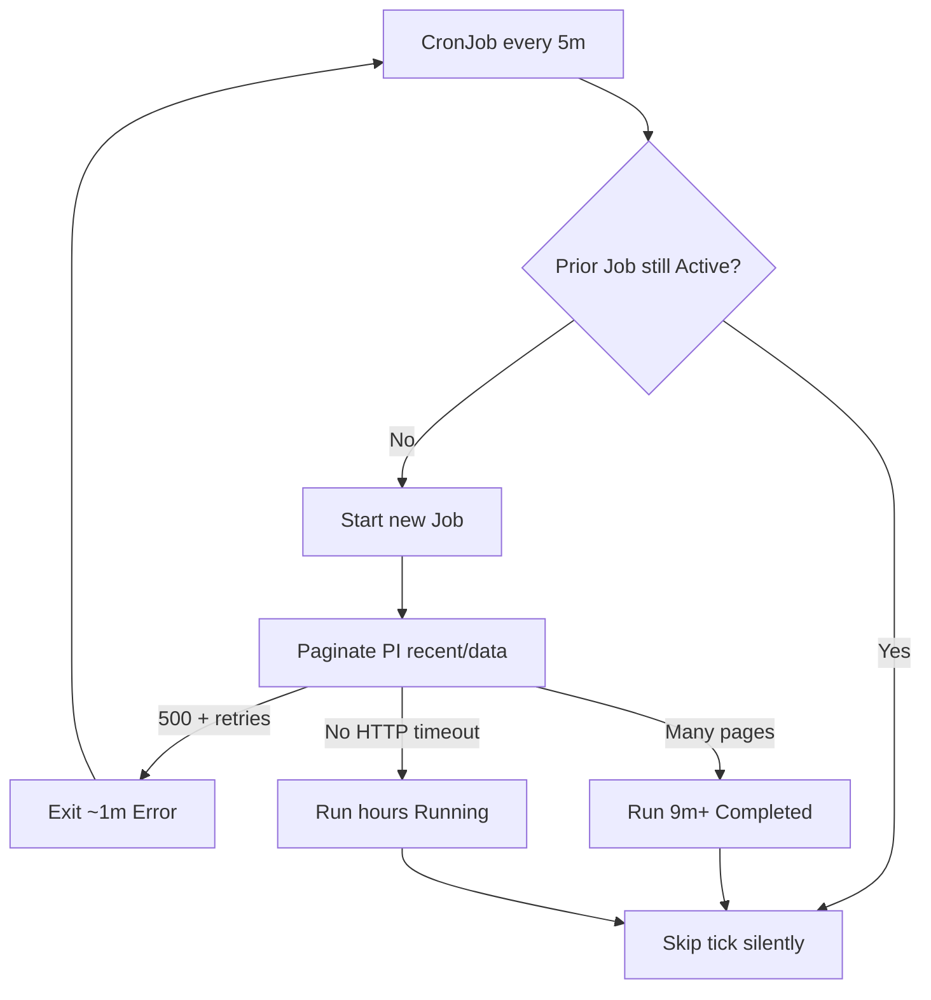

# worker-recent-feeds Cron Cadence — Investigation Summary

Saved for later implementation after cluster investigation on 2026-06-19.

## Question

Why does `worker-recent-feeds` appear to have multi-hour gaps in Argo CD although the CronJob
schedule is every 5 minutes?

## Answer (high confidence)

**Failures do not pause the CronJob.** Fast-failing pods (Podcast Index HTTP 500) exit in ~50s and
free the slot. The schedule gaps come from **`concurrencyPolicy: Forbid`** combined with **jobs that
stay Active longer than 5 minutes** — including runs that paginate PI `/recent/data` for ~9+ minutes
and runs that can **hang indefinitely** when upstream HTTP or MQ calls never complete.

Argo CD also **exaggerates gaps** because `successfulJobsHistoryLimit` defaults to **3**, so many
successful Jobs are deleted while older failed Jobs remain visible.

## Cluster evidence (alpha, `podverse-alpha`)

| Observation | Source |
| --- | --- |
| Schedule `*/5 * * * *`, `Forbid`, `failedJobsHistoryLimit: 10`, default success history **3** | `kubectl describe cronjob worker-recent-feeds` |
| `JobAlreadyActive … concurrency policy is Forbid` | CronJob events (live) |
| Job `29697260` ran **~9m34s** (02:20 → 02:29:40 UTC); PI pagination alone ~9m for 1633 feeds | Job logs + completion timestamps |
| Failure burst at 22:50–23:00 UTC: PI `/recent/data` HTTP **500**, exit in ~52s each | Pods `29697050`–`29697060` logs |
| **~2h35m with no Jobs** after last failure (`29697060`), then steady ~5m cadence from `29697215` | Event timeline (suffix ↔ schedule minute mapping) |
| Recent healthy stretch: Jobs every ~5m (`29697215`–`29697270`) but only last 3 successes kept | Events + job list |

## Root cause chain

1. **`concurrencyPolicy: Forbid`** — Kubernetes skips all ticks while any Job is Active; missed ticks
   are not backfilled.
2. **Normal slow runs** — `29697260` paginated 1633 feeds in ~9 minutes before enqueueing 3 feeds.
   That alone skips the next 5-minute tick (`JobAlreadyActive` confirmed).
3. **Hour-scale gaps** — After the 23:00 UTC failure cluster, no Jobs were created for ~155 schedule
   minutes until `29697215`. Pattern matches **one long-blocking Job** (likely started on the first
   tick after failures when PI recovered), not failure backoff. Deleted successful Job objects prevent
   retrieving that pod's logs retroactively.
4. **Hang enablers in code** — `PodcastIndexService.podcastIndexAPIRequest` calls
   `requestWithUserAgent` **without** an abort timeout; axios default is no timeout. MQ
   `connect`/`ensureSender`/`sendMessage` can also wait indefinitely (no deadline).
5. **Argo illusion** — Between a visible failed Job and visible successes, intermediate successful
   Jobs are GC'd (`successfulJobsHistoryLimit: 3`).

## Proposed fix (deferred)

Three layers, in order:

1. **CronJob manifest guardrails** — `activeDeadlineSeconds`, raise `successfulJobsHistoryLimit`,
   consider `concurrencyPolicy: Replace` if cadence must trump single-run completeness.
2. **Podcast Index HTTP timeouts** — fail fast instead of hanging hours.
3. **Bound PI pagination wall time** for the cron worker — cap pages or elapsed time so routine
   runs finish under 5 minutes when possible.

See `00-EXECUTION-ORDER.md` and numbered plan files.

## Confidence

| Finding | Confidence |
| --- | --- |
| Forbid blocks ticks while Job Active | **High** (controller events) |
| Failures do not impose schedule backoff | **High** (manifest + pod durations) |
| Slow/hung Jobs cause real multi-hour gaps | **High** (timeline math + Forbid semantics) |
| Exact hang point for the ~2.5h Job | **Medium** (Job object/logs GC'd; likely PI pagination or MQ) |
| PI no-timeout enables indefinite hang | **High** (code path) |

## GitOps

Manifest changes: [`infra/k8s/base/cron/worker-recent-feeds.cronjob.yaml`](../../../infra/k8s/base/cron/worker-recent-feeds.cronjob.yaml).
Sync via Argo app `podverse-alpha-cron`.

## Implementation readiness

| Prompt | Ready? | Blast radius | Notes |
| --- | --- | --- | --- |
| **01** CronJob manifest | **Yes** | Only `worker-recent-feeds` CronJob | Low risk. `activeDeadlineSeconds: 600` may kill a run mid-enqueue if load grows past ~10m — acceptable tradeoff vs hour-scale holes. `successfulJobsHistoryLimit: 30` is observability only. |
| **02** PI HTTP timeouts | **Yes** (after scope fix) | Only `recentGetData` when caller passes timeout | **Do not** add a global 5s timeout on all `podcastIndexAPIRequest` calls — would break dead-feed CSV stream and other long PI operations. Plan updated to scope accordingly. |
| **03** Pagination wall cap | **Yes, with product caveat** | Only `recentGetData` → recent-feeds cron | Truncated pagination means some feeds in the 15m window may be skipped **for that tick**; overlapping windows + 5m cadence usually pick them up on the next run. Monitor enqueue counts after deploy. |

**Recommended rollout:** implement **01 first**, deploy to alpha, watch ~24h cadence. Then **02 + 03**
together (both touch `recentGetData`).

**Not covered (acceptable deferral):** MQ client deadlines for long-running parser Deployments;
prompt 01 limits risk to this CronJob only.

**Optional before prod:** one alpha cycle watching `Done. Enqueued:` / skipped counts after prompt 03
to confirm truncation is rare enough.
