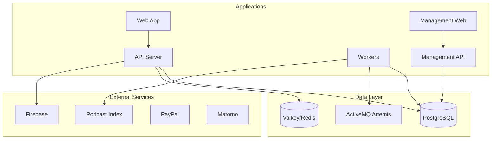
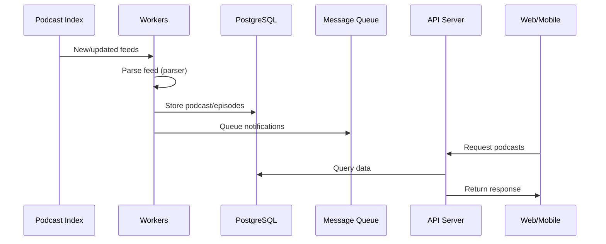

# Podverse Architecture

## System Overview



## Data Flow

### Feed Parsing Pipeline



### User Authentication

- Firebase Authentication for user management
- JWT tokens for API authentication
- Session management via Valkey/Redis

## Module Dependency Order

| Tier | Packages                                                                               | Depends On                                          |
| ---- | -------------------------------------------------------------------------------------- | --------------------------------------------------- |
| 1    | helpers                                                                                | (none)                                              |
| 2    | helpers-validation, helpers-requests, helpers-backend, helpers-browser, helpers-config | helpers                                             |
| 3    | external-services, orm                                                                 | helpers, helpers-\*                                 |
| 4    | notifications, parser                                                                  | helpers, helpers-\*, external-services, orm         |
| 5    | mq                                                                                     | helpers, helpers-\*, external-services, orm, parser |
| 6    | api, web, workers, management-\*                                                       | various                                             |
| 7    | qa                                                                                     | helpers, helpers-\*, external-services, orm, parser |

## Build Order

```
1. helpers
2. helpers-validation, helpers-requests, helpers-backend, helpers-browser, helpers-config (parallel)
3. external-services
4. orm
5. notifications
6. parser
7. mq
8. apps (parallel)
9. qa
```

**Note:** The 5 specialized helper packages can build in parallel with each other because they only depend on core `helpers`, not on each other.

## Directory Structure

```
packages/                 # Publishable npm packages (@podverse/*)
  helpers/                # Core utilities, types, DTOs, mediums
  helpers-validation/     # Validation utilities (email, password, URL, etc.)
  helpers-requests/       # API request types, query params, ApiRequestService
  helpers-backend/        # Backend-specific utilities (logger, timers, OS)
  helpers-browser/        # Browser-specific utilities (clipboard)
  helpers-config/         # Configuration validation utilities
  external-services/      # Third-party API integrations
  orm/                    # Database entities, services, migrations
  notifications/          # Push notification services (Firebase)
  parser/                 # RSS/Podcast feed parsing
  mq/                     # Message queue operations

apps/               # Deployable applications
  api/              # REST API (Express)
  web/              # Web app (Next.js)
  workers/          # Background job processors
  management-api/   # Admin API
  management-web/   # Admin dashboard

tools/              # Development tools
  qa/               # Test data generation

infra/              # Infrastructure
  config/           # Environment templates
  database/         # Migrations and seeds
  docker/           # Docker compose files
```

## Database

### Technology

- PostgreSQL 16+
- TypeORM for ORM layer
- Entities defined in `packages/orm/src/entities/`

### Key Entities

- **Podcast** - Podcast feed metadata
- **Episode** - Individual episodes
- **User** - User accounts
- **MediaRef** - User-created clips/soundbites
- **Playlist** - User playlists
- **Subscription** - Podcast subscriptions

### Caching

- Valkey/Redis for session and query caching
- API response caching for high-traffic endpoints

## External Service Integrations

### Podcast Index

- Feed discovery and updates
- Podcast metadata enrichment
- Used by workers for feed synchronization

### Firebase

- Push notifications (FCM)
- User authentication
- Configured via `packages/notifications/`

### PayPal

- Premium subscription payments
- Configured via `packages/external-services/`

### Matomo

- Analytics tracking
- Privacy-respecting alternative to Google Analytics

## Message Queue

### Technology

- ActiveMQ Artemis
- STOMP protocol for messaging

### Queues

- Feed parsing jobs
- Notification delivery
- Background processing tasks

### Configuration

- Queue definitions in `packages/mq/`
- Worker processors in `apps/workers/`
