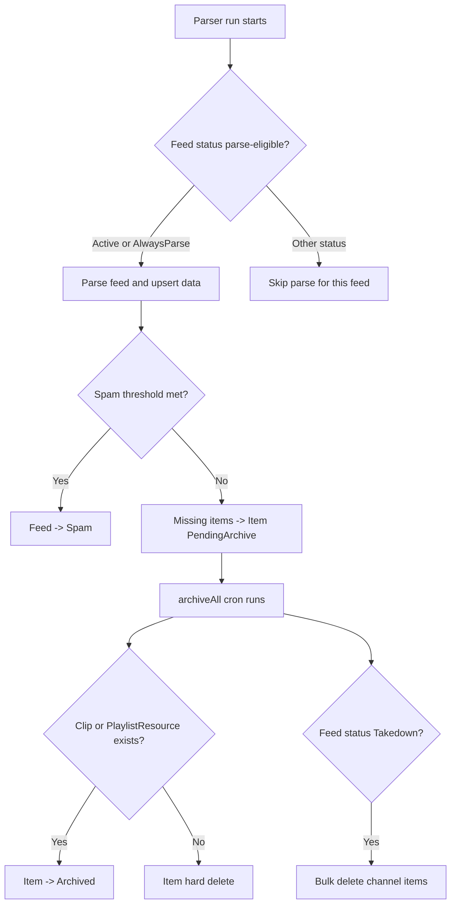
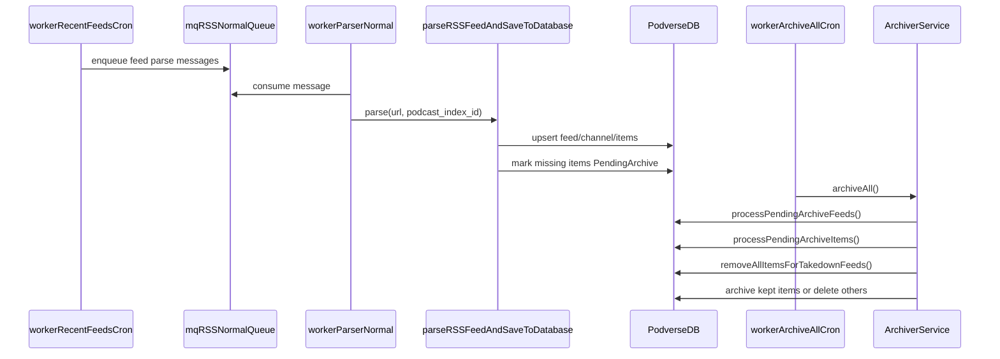
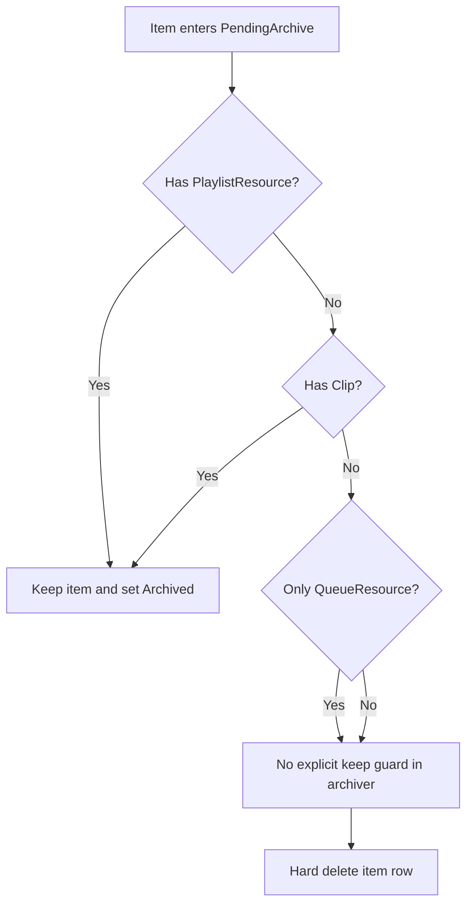

# RSS Archive/Delete Lifecycle

This document explains how Podverse handles archiving and deletion of RSS-derived data for `Feed`,
`Channel`, `Item`, and related records. It focuses on implemented behavior in code and manifests.

## Quick Summary

- RSS ingestion updates feeds/channels/items through parser workers, not API controllers.
- Removed RSS items are first marked `PendingArchive`, not immediately deleted.
- `archiveAll` is a phased cleanup job that can either archive an item or hard-delete it.
- Items with `Clip` or `PlaylistResource` links are retained as `Archived`.
- Each `archiveAll` also drops `Archived` items that **no longer** have any `Clip` or `playlist_resource` rows (second-pass cleanup after users remove clips/playlists).
- User queues: only `item` rows in `item_flag_status` `Active` (or add-by-RSS-only rows) are listed. `QueueResourceService` list/history/now playing endpoints filter to that; `archiveAll` ends with a bulk `DELETE` on `queue_resource` for item-backed rows whose resolved `item` is not `Active` (so retained `Archived` items are removed from queues even though the `item` row may still exist for `Clip`/`PlaylistResource` reasons).
- SpamPermitted allows higher parse-time item/live-item thresholds before auto-spam flagging.
- Takedown handling uses the bulk-delete path. **Spam** feeds keep `feed_flag_status` `Spam`; `archiveAll` runs `processSpamFeeds()` so their `Active` / `PendingArchive` items get the same clip/playlist retention as other archive passes (feed is not moved to `Archived`).

## Scope And Terms

- `Feed` is where feed-level lifecycle status exists (`feed_flag_status`).
- `Channel` is 1:1 with `Feed` and does not have its own archive status table.
- `Item` has its own status (`item_flag_status`) and can be archived or deleted.
- Add-by-RSS feeds without `podcast_index_id` are not persisted like indexed feeds.

Source files:

- `packages/orm/src/entities/feed/feed.ts`
- `packages/orm/src/entities/channel/channel.ts`
- `packages/orm/src/entities/item/item.ts`
- `packages/parser/src/lib/rss/parser.ts`

## Status Models

### Feed statuses

Defined in `FeedFlagStatusStatusEnum`:

- `Active = 1`
- `AlwaysParse = 2`
- `Spam = 3`
- `PendingArchive = 4`
- `Archived = 5`
- `Takedown = 6`
- `SpamPermitted = 7`

Sources:

- `packages/orm/src/entities/feed/feedFlagStatus.ts`
- `infra/k8s/base/ops/source/database/linear-migrations/app` (linear migration chain)

### Item statuses

Defined in `ItemFlagStatusStatusEnum`:

- `Active = 1`
- `PendingArchive = 2`
- `Archived = 3`
- `PendingDelete = 4`

Sources:

- `packages/orm/src/entities/item/itemFlagStatus.ts`
- `infra/k8s/base/ops/source/database/linear-migrations/app` (linear migration chain)

## Who Changes Statuses

| Status Change                          | Writer                                                        | Trigger                                                                                                                                                                 |
| -------------------------------------- | ------------------------------------------------------------- | ----------------------------------------------------------------------------------------------------------------------------------------------------------------------- |
| Feed -> `Spam`                         | `packages/parser/src/lib/rss/parser.ts`                       | Parsed feed crosses status-based spam limits (`PARSER_SPAM_FEED_ITEM_THRESHOLD_DEFAULT` / `PARSER_SPAM_FEED_ITEM_THRESHOLD_SPAM_PERMITTED`; defaults 10,000 / 100,000). |
| Feed -> `PendingArchive`               | `apps/workers/src/lib/deduplicator.ts`                        | Dead-feed merge flow marks duplicate feed pending archive.                                                                                                              |
| Feed -> `Archived`                     | `packages/orm/src/services/archiver.ts`                       | `processPendingArchiveFeeds()` finishes item handling for that feed.                                                                                                    |
| Feed stays `Spam` (item cleanup only)  | `packages/orm/src/services/archiver.ts`                       | `processSpamFeeds()` during `archiveAll` applies `processItems` to `Active` / `PendingArchive` items; feed status is not changed.                                       |
| Feed lifecycle / policy (manual admin) | Management API / management-web feed operations               | Admin workflows set lifecycle state and conditions via management tools.                                                                                                |
| Item -> `Active`                       | `packages/parser/src/lib/rss/item/item.ts`                    | `handleParsedItem()` upserts current parsed items.                                                                                                                      |
| Item -> `PendingArchive`               | `packages/parser/src/lib/rss/item/item.ts`                    | Previously existing item is absent from latest parse batch.                                                                                                             |
| Live Item -> `PendingArchive`          | `packages/parser/src/lib/rss/liveItem/liveItem.ts`            | Existing live item disappears from latest parsed live set.                                                                                                              |
| Item -> `Archived`                     | `packages/orm/src/services/archiver.ts`                       | Archiver sees clip or playlist dependency and retains row.                                                                                                              |
| Item -> hard delete                    | `packages/orm/src/services/archiver.ts`                       | Archiver finds no clip and no playlist dependency.                                                                                                                      |
| Takedown items -> hard delete          | `packages/orm/src/services/archiver.ts` (`removeAllItems...`) | Feed status is `Takedown`.                                                                                                                                              |
| Optional channel rows -> hard delete   | `packages/orm/src/services/archiver.ts` (`removeAllItems...`) | For takedown feeds, optional `channel_*` rows are deleted; feed + channel identity/title remain.                                                                        |

## Parse Gate And Lifecycle Entry

Parser only proceeds when feed status is `Active`, `AlwaysParse`, or `SpamPermitted`.

- Gate: `checkIfFeedFlagStatusShouldParse(...)`
- Spam handling:
  - `Active` / `AlwaysParse` use a 10,000 item/live-item threshold.
  - `SpamPermitted` uses a higher item/live-item threshold (default 100,000; override with worker env `PARSER_SPAM_FEED_ITEM_THRESHOLD_SPAM_PERMITTED`).
  - Other parse-eligible statuses use the default threshold (10,000; override with `PARSER_SPAM_FEED_ITEM_THRESHOLD_DEFAULT`).
  - threshold breach sets feed status to `Spam` and aborts the run.

Sources:

- `packages/orm/src/services/feed/feedFlagStatus.ts`
- `packages/parser/src/lib/rss/parser.ts`

## End-To-End Lifecycle

### 1) Ingestion/update phase

`mqRSSRunParser` consumers call `parseRSSFeedAndSaveToDatabase(...)`, which:

- loads/upserts feed and channel data,
- upserts current items as `Active`,
- marks no-longer-present items as `PendingArchive`,
- does similar pending-archive marking for removed live items.

Sources:

- `packages/mq/src/functions/mq/rss/runParser.ts`
- `packages/parser/src/lib/rss/parser.ts`
- `packages/parser/src/lib/rss/item/item.ts`
- `packages/parser/src/lib/rss/liveItem/liveItem.ts`

### 2) Archive cleanup phase (`archiveAll`)

`archiveAll` runs in strict internal order:

1. `processPendingArchiveFeeds()`
2. `processSpamFeeds()` — spam feeds only when they still have `Active` or `PendingArchive` items; same `processItems` rules as pending-archive feeds; **does not** change feed status (remains `Spam`)
3. `processPendingArchiveItems()`
4. `deleteArchivedItemsWithoutClipOrPlaylist()` (batched hard-delete of `Archived` items with no `Clip` or `playlist_resource` rows)
5. `removeAllItemsForTakedownFeeds()` for feed status `Takedown`
6. `pruneNonActiveItemBackedQueueResourceRows()` (delete `queue_resource` for non-`Active` items: direct `item_id`, and via `clip` / `item_soundbite` to a non-`Active` item; add-by-RSS rows are not deleted in this pass)

List reads in `QueueResourceService` (now playing, upcoming, history, abridged sync) apply the same `Active` / add-by-RSS resolution so the UI and exports stay consistent before the next scheduled `archiveAll` (for example, between parser marking an item `PendingArchive` and the next job run).

For regular archive processing (`processItems`):

- if item has `PlaylistResource` or `Clip`: set item status `Archived`,
- otherwise: delete item row.

`deleteArchivedItemsWithoutClipOrPlaylist()` repeats the same dependency rule for items **already** `Archived`: if both clip and playlist_resource counts are zero, hard-delete the item (batched SQL `SELECT … LIMIT` then TypeORM `delete`).

After **`processPendingArchiveFeeds()`** completes for a feed, that feed is set `Archived` and `last_parsed_file_hash` is cleared. Spam feeds processed by `processSpamFeeds()` do **not** get that feed-level update.

Sources:

- `packages/orm/src/services/archiver.ts`
- `packages/orm/src/services/queue/queueResourceActiveItemFilter.ts`
- `packages/orm/src/services/queue/queueResource.ts`

### 3) Takedown cleanup phase

Feeds with `Takedown` status have channel item ids collected and deleted in bulk.
In the same step, optional channel-related rows are hard-deleted (`channel_about`, `channel_chat`,
`channel_description`, `channel_category`, `channel_funding`, `channel_image`,
`channel_internal_settings`, `channel_license`, `channel_location`, `channel_meta_boost`,
`channel_person`, `channel_podroll` (+ nested remote items), `channel_publisher` (+ nested remote
item), `channel_remote_item`, `channel_season`, `channel_social_interact`, `channel_trailer`,
`channel_txt`, `channel_value` (+ recipients)).

Retained minimum reference: feed row + feed status/reason fields and channel identity/title fields.

Feeds with `Spam` status are not in this hard-delete path and follow normal archive retention behavior.

Source:

- `packages/orm/src/services/archiver.ts`

## Cron Jobs And Worker Phases

### Scheduled CronJobs

- `worker-recent-feeds` every 5 minutes enqueues recently updated feeds to `rss-normal`.
- `worker-archive-all` at `0 6,18 * * *` runs `archiveAll`.
- `worker-dead-feeds-merge` is configured daily but currently `suspend: true`.

Sources:

- `infra/k8s/base/cron/kustomization.yaml`
- `infra/k8s/base/cron/worker-recent-feeds.cronjob.yaml`
- `infra/k8s/base/cron/worker-archive-all.cronjob.yaml`
- `infra/k8s/base/cron/worker-dead-feeds-merge.cronjob.yaml`

### Long-running worker deployments

- `worker-parser-normal` consumes `rss-normal`.
- `worker-parser-live` consumes `rss-live`.
- `worker-parser-ondemand` consumes `rss-on-demand`.
- `worker-parser-add-by-rss-ondemand` consumes `add-by-rss-on-demand`.
- `worker-parser-add-by-rss-ondemand-background` consumes `add-by-rss-background`.
- `worker-listener-live` listens for live signals and enqueues to `rss-live`.

Sources:

- `infra/k8s/base/workers/kustomization.yaml`
- `infra/k8s/base/workers/parser-normal.deployment.yaml`
- `infra/k8s/base/workers/parser-live.deployment.yaml`
- `infra/k8s/base/workers/parser-ondemand.deployment.yaml`
- `infra/k8s/base/workers/parser-add-by-rss-ondemand.deployment.yaml`
- `infra/k8s/base/workers/parser-add-by-rss-ondemand-background.deployment.yaml`
- `infra/k8s/base/workers/listener-live.deployment.yaml`

## Retention Decision Matrix

| Item Dependency At Archive Time         | Archiver Behavior                                                                                 | Item Row Outcome                                                                                                |
| --------------------------------------- | ------------------------------------------------------------------------------------------------- | --------------------------------------------------------------------------------------------------------------- |
| Has `Clip`                              | Keep item                                                                                         | `Archived`                                                                                                      |
| Has `PlaylistResource`                  | Keep item                                                                                         | `Archived`                                                                                                      |
| Has both                                | Keep item                                                                                         | `Archived`                                                                                                      |
| Has neither                             | Delete item                                                                                       | Hard delete                                                                                                     |
| `Archived`, later loses clip + playlist | N/A (post-archive)                                                                                | Hard delete on next `archiveAll` step 3 (`deleteArchivedItemsWithoutClipOrPlaylist`)                            |
| Only in queue                           | `queue_resource` is not a retention reason in `processItems`; pruned in step 5 / filtered on read | Hard delete path applies if no clip/playlist; any remaining non-`Active` `queue_resource` is removed in step 5. |

Dependency references:

- `packages/orm/src/services/archiver.ts`
- `packages/orm/src/entities/clip.ts`
- `packages/orm/src/entities/playlist/playlistResource.ts`
- `packages/orm/src/entities/queue/queueResource.ts`

## Dedup Merge Behavior

Dead-feed dedup flow updates references for duplicate channel items:

- repoints `Clip.item_id`,
- repoints `PlaylistResource.item_id`,
- marks archived feed as `PendingArchive`.

Source files:

- `packages/orm/src/services/deduplicator.ts`
- `apps/workers/src/lib/deduplicator.ts`
- `apps/workers/src/commands/podcastIndex/deadFeeds/flagAndMerge.ts`

## Known Special Cases

- `ItemFlagStatusStatusEnum.PendingDelete` exists but no active lifecycle writer was found in app code.
- Archiver includes a TODO marker for post-archive dependency rechecks.
- Parser can enqueue remote-item work to `rss-slow`; this document only describes visible base manifests
  and core archive/delete behavior.

Sources:

- `packages/orm/src/entities/item/itemFlagStatus.ts`
- `packages/orm/src/services/archiver.ts`
- `packages/mq/src/functions/mq/rss/runParser.ts`

## Diagram: Feed/Item State Transitions

## Diagram: Sequence From Parse To Archive

## Diagram: Dependency-Based Item Outcome

## Related Follow-Up

Potential flaws and recommended changes are documented in
`docs/RSS-ARCHIVE-DELETE-FLAWS-AND-RECOMMENDATIONS.md`.
