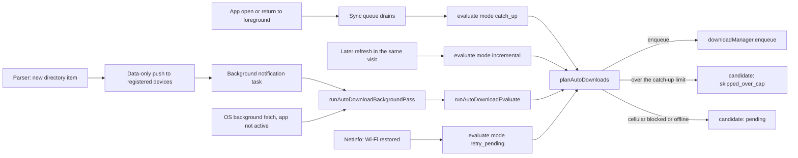

# Auto download

How new episodes get onto a phone without the user opening each one. Auto download is a
**mobile** feature and requires **Membership**. The phone keeps an offline library and decides
what to fetch. Postgres only stores which directory channels should wake which installation.

Web has a separate **Download** action on an episode, track, or clip. That saves the one file the
person chose, through the browser (`downloadAndSaveFile` in `apps/web/src/utils/fileDownloader.ts`:
the file is fetched, then the browser is asked to save it, which may show up as a download or a
new tab). It does not fill an offline library, it does not run when new episodes appear, and it
does not register the device for the wake mirror below. Notification settings on web and mobile
share the “apply this default to existing podcasts” popup; that popup is about alerts, not files.

## What the user controls

| Setting                           | Default                     | Where it lives                                            | What it does                                            |
| --------------------------------- | --------------------------- | --------------------------------------------------------- | ------------------------------------------------------- |
| Auto download new subscriptions   | Off                         | AsyncStorage (`downloads.auto_download_default`)          | Copied onto a channel row at subscribe time             |
| Download over cellular by default | Off (Wi‑Fi only)            | AsyncStorage (`downloads.auto_download_cellular_default`) | Copied onto that same row                               |
| Catch-up limit                    | 20 (also 10 or 50)          | AsyncStorage (`downloads.auto_download_catch_up_limit`)   | Newest episodes kept on one open after the app was away |
| Per-podcast auto download         | Inherited, then overridable | SQLite `channel_auto_download`                            | On/off for that podcast                                 |
| Per-podcast allow cellular        | Inherited, then overridable | Same row                                                  | Whether that podcast may use cellular                   |

More → Settings → Downloads holds the globals, including the catch-up limit. Podcast settings holds
the per-podcast pair.

Toggling a global that already applies to existing podcasts opens a confirm dialog: **Apply to
all** or **Only new subscriptions**. Count 0 skips the dialog. The same pattern covers notification
defaults on web and mobile; see
[`global-default-apply-to-existing`](/.cursor/rules/global-default-apply-to-existing.mdc).

A lapsed membership keeps the local rows and any files already downloaded. New transfers stop.
Turning auto download on while lapsed opens the renewal gate.

## Device data

SQLite migration 18:

- `channel_auto_download` — one row per podcast: `channel_id_text`, `source` (`directory` or
  `add_by_rss`), `enabled`, `allow_cellular`, `enabled_at`.
- `auto_download_candidate` — one row per item: `pending`, `enqueued`, `skipped_ineligible`,
  `skipped_over_cap`, or `user_removed`. The status column is text, so the extra value does not
  need a new SQLite migration.

`enabled_at` is a watermark. Enabling auto download does not pull the back catalog. An item is
considered only if its publish time is after that watermark, or if a silent push names its id.

The candidate ledger is decided once. A later sync or push does not enqueue an item already
`enqueued`, `skipped_ineligible`, `skipped_over_cap`, or `user_removed`. Deleting a download marks
the item `user_removed`, so it is not fetched again. `pending` is not decided: it retries when
Wi‑Fi returns, or on the next catch-up if it is still among the newest episodes.

Subscribe snapshots the globals into a new row when the global default is on. Unsubscribe deletes
the channel row.

## How a download starts

Several triggers, one planner.



### 1. Foreground sync

Opening the app, or bringing it back to the foreground, asks for one **catch-up** after that
visit's sync queue drains. Per-channel evaluate waits until then, so the newest episodes can be
compared across podcasts. The catch-up keeps the newest N eligible episodes (default 20, also 10
or 50) and marks the rest of that pass `skipped_over_cap`. Episodes already downloaded do not
count toward N. A manual download is unchanged.

After that catch-up, a later `channel-items` or `add-by-rss-parse` in the same visit enqueues an
**incremental** evaluate for that channel only. Incremental does not apply the cap, so an episode
that arrives while the app is open is not thrown away because older ones already filled the limit.
A silent push is incremental too, and only for the item ids in the payload.

The catch-up waits while Offline Mode is on or membership does not allow auto download. Running
it in that state would mark the whole window `pending`, and a later Wi‑Fi retry would download
that window without the cap. When transfers are allowed again, this visit's catch-up still runs
and applies the limit. A catch-up that does run while the network is unavailable still applies
the cap: the newest N stay `pending`, and the rest are `skipped_over_cap`.

Directory channels use cached episode pages (newest 50). Add-by-RSS uses the mapped feed already
on the device. The server does not parse add-by-RSS on its own schedule, and the background pass
does not enqueue those parses (the parse route is limited to 20 an hour). Those feeds are included
in the foreground catch-up from whatever is already stored, and they get an incremental evaluate
after a foreground parse.

### 2. Silent push (directory channels only)

When the parser saves new items it calls `handleNewItemAutoDownloadPushes` next to the normal
new-item notification. That looks up `account_device_auto_download_channel` for the channel, joins
FCM devices on `(account_id, installation_id)` and UnifiedPush devices on `account_id`, and drops
accounts whose membership has expired.

The payload is data only (no banner):

```json
{ "type": "auto-download", "channelIdText": "…", "itemIdTexts": "id1,id2" }
```

`itemIdTexts` bypass the publish-date watermark for those ids. A push does not apply the catch-up
cap, and it does not mark the rest of the channel's backlog as skipped.

The phone registers the set with `PUT /account/auto-download/channels`
(`installation_id` + full `channel_id_texts`). The API replaces every row for that installation.
Unknown channel ids are skipped. A hash of the sorted set is stored in AsyncStorage so unchanged
sets are not sent again. Sign-out sends an empty set and clears the hash. Add-by-RSS urls are not
registered; the server has no parse schedule for them.

### 3. OS background fetch

`expo-background-fetch` task `podverse-auto-download-fetch`, minimum interval 15 minutes,
`stopOnTerminate: false`, `startOnBoot: true`. The OS chooses the real interval. If background
fetch is restricted or denied, registration is skipped.

A periodic fetch runs only when the app is not already in the foreground (that visit's sync owns
the catch-up). It refreshes up to five stale **directory** windows, one after another, then runs
one capped catch-up. It does not refresh every enabled channel. A silent push still runs if the
app is active: it refreshes only the named directory channel, then an incremental evaluate of the
named item ids.

Item-list reads and `PUT /account/auto-download/channels` are not rate-limited. The paced refresh
is what keeps a wake from requesting every subscription's episodes beside the foreground queue.

### Wi‑Fi retry and cold start

A NetInfo listener re-runs evaluate in `retry_pending` mode about 1.5s after the network becomes
Wi‑Fi (or ethernet) from something else. That retries rows already `pending`. It does not scan
new episodes and it does not apply the catch-up cap.

On launch, download rows left `downloading` by a killed process are reconciled: a non-empty file
on disk is marked complete; otherwise the row goes back to `queued` and the pump resumes it.

## The decision (`planAutoDownloads`)

Pure function, no I/O. For each candidate item, in order:

1. `retry_pending` considers only rows already `pending`. Incremental with push ids considers only
   those ids. Catch-up considers the loaded window.
2. Already `enqueued`, `skipped_ineligible`, `skipped_over_cap`, or `user_removed` → leave it.
3. Channel missing or auto download off → ignore.
4. Not named by the push, and publish time missing or at/before `enabled_at` → skip (no ledger row).
5. Membership lapsed or Offline Mode on → `pending` (retry later; not a permanent skip).
6. Not downloadable (live item, HLS, no enclosure) → `skipped_ineligible`.
7. Network is `none`, or `cellular` while that channel disallows cellular → `pending`.
8. Otherwise → `enqueue` through `downloadManager`.
9. Catch-up only, and only when transfers are allowed: sort the enqueue and pending results by
   publish time, keep the newest N, and mark the rest `skipped_over_cap`.

`wifi` and `unknown` are treated as allowed. A failed enqueue (quota, auto-free refusal, same
ineligible cases the manual download path rejects) is stored as `skipped_ineligible`.

## Server pieces

| Piece                                     | Role                                                                                                           |
| ----------------------------------------- | -------------------------------------------------------------------------------------------------------------- |
| `account_device_auto_download_channel`    | `(account_id, installation_id, channel_id)`. Linear migration `0011_account_device_auto_download_channel.sql`. |
| `PUT /account/auto-download/channels`     | Idempotent replace for one installation. Membership required.                                                  |
| `AccountDeviceAutoDownloadChannelService` | Replace, and the two “who to wake” queries (FCM by installation, UnifiedPush by account).                      |
| `handleNewItemAutoDownloadPushes`         | Parser hook. Failures are logged; they do not fail the parse.                                                  |
| `dataOnlyPushOrchestrator`                | FCM iOS, FCM Android, or UnifiedPush. No inbox row, no banner.                                                 |

## iOS and Android

The planner, SQLite, and `downloadManager` are the same on both. Transfers use
`FileSystem.createDownloadResumable` with the default session (not an explicit background URL
session). A file that does not finish before the process is suspended is picked up by launch
reconcile or the next evaluate. The difference is **how the process is woken**, and **which push
transport the build uses**.

### iOS (FCM → APNs)

Play-store style builds register an FCM token with `platform = ios`. The server sends a multicast
with:

- `apns-push-type: background`
- `apns-priority: 5` (APNs background priority, not the alert priority 10)
- `aps.content-available: 1`
- no alert, sound, or badge

`Info.plist` `UIBackgroundModes` includes `remote-notification` and `fetch` (plus `audio` for
playback). `index.js` imports the task definitions before React mounts so a push can find
`podverse-auto-download-notification`. The app registers that task with `expo-notifications` on
startup.

iOS limits that matter:

- **Force-quit** (swipe away) stops silent pushes until the user opens the app again. The next
  foreground catch-up applies the newest-N limit. This is an OS rule, not a bug in the payload.
- **Low Power Mode** and Apple’s silent-push budget delay or drop wakes. Priority 5 is required
  for a background push; a visible notification would use a different payload and is intentionally
  not sent here.
- **Background fetch** (`fetch` mode) is opportunistic. Fifteen minutes is a floor the OS may
  ignore for hours.
- The JS background window after `content-available` is short. A long file may not finish in that
  window; the next launch or fetch resumes it.
- There is no UnifiedPush path on iOS. Wakes are FCM/APNs only.

### Android — FCM (Play builds)

The same data map, different envelope:

- `android.priority: high`
- `data` only — no `notification` block, so the system does not post a banner

High priority is what lets FCM start the app process when it is cached or stopped, within Google’s
limits (Doze, app standby, force-stop from system settings). Force-stop from Settings is stricter
than leaving the app in the recents list: FCM will not deliver until the user opens the app.

`expo-background-fetch` on Android is scheduled work (`startOnBoot: true`). It runs more often
than iOS fetch in practice, and it is still deferred when the device is idle.

The notification task and the download code are the same module as iOS. Android does not need
`UIBackgroundModes`; the FCM data message plus the TaskManager task is the wake.

### Android — UnifiedPush (FOSS builds)

FOSS builds do not use Firebase. The parser posts the same JSON body to each account’s UnifiedPush
endpoint with `X-UnifiedPush: 1` (and `Authorization: Bearer` when the device stored an auth key).
The distributor app (ntfy, or another UP distributor) delivers it to Podverse.

Differences from FCM:

- The join is **per account**, not per `installation_id`. One UP endpoint covers the account’s
  registrations for that channel.
- Delivery depends on the distributor process, not on Google Play services. If the distributor is
  killed or its server is down, there is no wake until background fetch or the next foreground
  open.
- There is still no banner. A user-visible new-episode notification is a separate push path
  (`handleNewItemNotifications`).

### Side-by-side

|                               | iOS (APNs via FCM)                                          | Android FCM                       | Android UnifiedPush           |
| ----------------------------- | ----------------------------------------------------------- | --------------------------------- | ----------------------------- |
| Wake message                  | Background push, priority 5, `content-available`            | High-priority data message        | HTTP POST, `X-UnifiedPush: 1` |
| User-visible banner           | No                                                          | No                                | No                            |
| After force-quit / force-stop | No silent wake until next open                              | No FCM until next open            | Depends on the distributor    |
| Periodic backstop             | `fetch` background mode, OS-timed                           | Scheduled fetch, boot-restartable | Same fetch task               |
| Add-by-RSS                    | No server push; foreground parse, then incremental evaluate | Same                              | Same                          |
| Download API                  | `expo-file-system` resumable, default session               | Same                              | Same                          |
| Membership check              | Client gate, and again on the server before send            | Same                              | Same                          |

## What this is not

- Not a server-side download. Bytes go from the enclosure host to the phone.
- Not a backfill of the whole catalog. Turning it on does not download every old episode. A long
  gap is capped at the catch-up limit; anything older in that pass is skipped for good.
- Not the new-episode notification. That banner is a different send. Auto download can run when
  notifications for the podcast are off, as long as the device is registered and membership is valid.
- Not the web Download action. Web saves one chosen file in the browser. It does not share the
  phone's candidate ledger, the catch-up limit, or the device wake registration.

Related plan notes (decisions and the device checklist, not this runtime picture):
[728-defer-channel-auto-download](/docs/proposals/mobile/_master-plan_/phase-2/details/728-defer-channel-auto-download.md),
[728-auto-download-background-spike](/docs/proposals/mobile/_master-plan_/phase-2/details/728-auto-download-background-spike.md).
