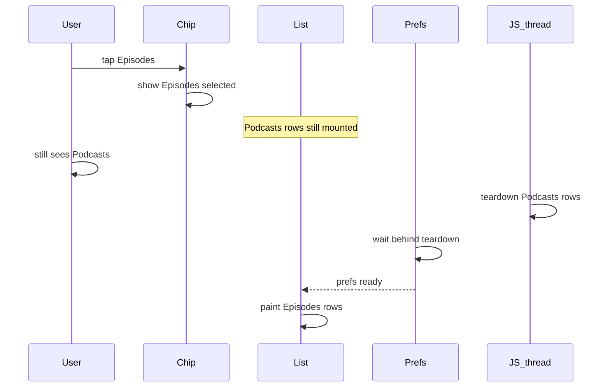
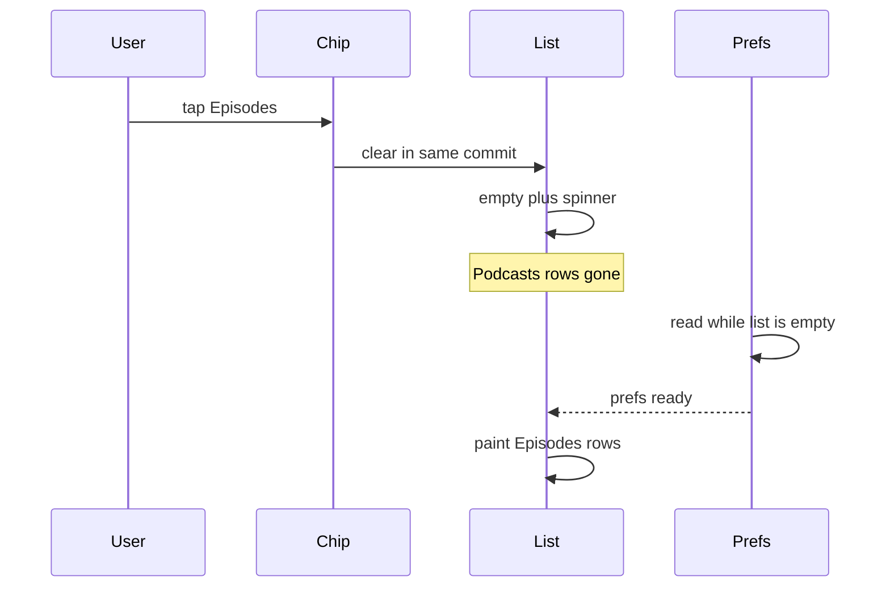

# Home and Browse chip taps

A short account of why media-type chip switches on Home and Browse felt slow, what fixed them, and
how iOS and Android differed. Measured numbers live in
[MOBILE-PERF-BASELINES.md](./MOBILE-PERF-BASELINES.md).

## The symptom

Tapping Podcasts, Episodes, or Artists on Home — and the same kind of chip on Browse — left the
previous list on screen for a beat, then stalled before the new list painted. Rapid taps made that
worse: the chip label moved, but the rows still belonged to the previous selection.

## What was going wrong

React Native runs list teardown and the next tap on one JavaScript thread. A chip switch used to
update the chip and leave the previous rows mounted. Tearing those rows down then sat in front of
the preference read that has to finish before the new list can load. The SQLite read itself was only
a small share of the wait.

Earlier work made each row cheaper: closed overflow menus stay unmounted, rows use narrow playback
hooks, props stay stable for memo, lists are virtualized, description HTML is previewed instead of
fully parsed, and one stylesheet is shared per theme. Those changes stay. The stall remained because
the previous list was still mounted when the next tap arrived.

Several other ideas were measured and set aside: an in-memory cache of sort preferences, one shared
translator for every list row, and unique third-party artwork on the perf seed. None of them owned
the wait. The deltas are in the baselines doc.

## What fixed it

Home and Browse use the same pattern. The chip and an empty list commit together, and the empty
list shows a spinner until that chip's read finishes. Unmounting the previous rows in that commit
takes the teardown off the thread the preference read was waiting on. Browse also releases its
pull-to-refresh lock when a newer chip wins.

On the seeded Android emulator, warm time from tap to the new rows dropped from about 1145 ms to
about 304 ms, and the previous media type stopped flashing under the new chip.

## iOS and Android

The fix is the same code on both platforms. Before it, the devices did not share one bottleneck:

| Device  | Largest stage before the fix                         |
| ------- | ---------------------------------------------------- |
| Android | Preference gate (most of the wait)                   |
| iOS     | Paint and preference gate close; paint slightly ahead |

The kept timing is the seeded Android emulator. On a real iOS library the clear was not enough:
expo-image was still resizing full covers on the main queue. That stall, and the thumbnail path
that removed it, is [MOBILE-IOS-CHIP-SWITCH.md](./MOBILE-IOS-CHIP-SWITCH.md).

How the stale list shows up in the harness also differs. Android records that flash as its own early
paint sample. iOS often folds it into the tap's total, so a zero early-paint count on iOS does not
mean the flash was absent.

## Still open

Scrolling an Episodes list is still an open question on iOS with a real library (and on the seeded
Android emulator for scripted flings). Measure with `--gesture scroll` and `scroll.uiframes` /
`scroll.jsframes` before claiming a cause. See the open questions and proposed gates in the
baselines doc.
