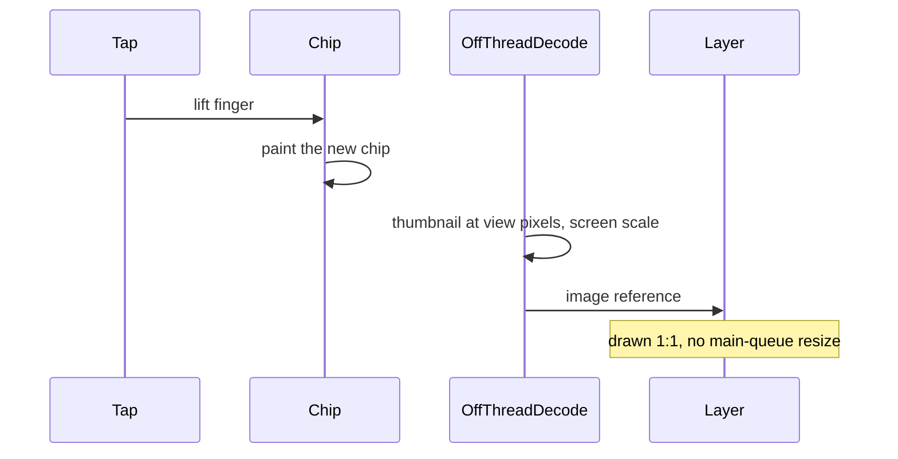

# iOS Home chip switches and cover thumbnails

Why media-type chip switches on a real iOS library still stalled after the shared clear-on-tap
fix, what removed that stall, and what was left for another day. The earlier Android account is
[MOBILE-CHIP-TAP.md](./MOBILE-CHIP-TAP.md). Measured numbers live in
[MOBILE-PERF-BASELINES.md](./MOBILE-PERF-BASELINES.md).

## The symptom

On `"iPhone 17 Pro"` with a real library, lifting a finger from Podcasts, Episodes, or Artists
left the old list up for the better part of a second. The chip did not feel selected until the
new list could paint. Memory sat around 600 MB and peaked near 1 GB. Android had already been
fixed by clearing the list in the same commit as the chip; that code was already on iOS, and the
stall remained.

## What was going wrong

expo-image on iOS resizes a remote cover on the main queue when the view is given the original
URL. Home was mounting about twenty of those at once, often 1400–3000 px on the long side, in the
same commit that had to paint the new chip. Android's image loader already decodes at view size
off the main thread, so the same screens did not pay this cost.

A second, smaller cost is still there and was not what the finger felt: leaving Episodes unmounts
the heaviest rows in that same commit, and a play or pause re-renders every mounted row. Those
are the parked follow-ups below.

## What fixed it

List, grid, and compact header covers on iOS decode a thumbnail off the main thread and hand the
view an image reference. The view then draws that bitmap and does not resize the original on the
main queue. The cache holds about 24 MB of decoded pixels. Animated GIFs stay on the plain path.
Android stays on the plain path.

Two details decide whether the thumbnail looks like the full-screen viewer:

- The decoded edge is the tile in **device pixels** (`points × screen scale`, rounded). Decoding
  larger than the tile, to "buy" sharpness, makes the GPU shrink the bitmap and the photograph
  looks worse.
- The loaded image is tagged with that same screen scale. A bitmap with the right pixel count and
  a scale of 1 is still hundreds of points inside a ~100 pt tile, and the layer minifies it again.
  Faces go soft; flat logos often still look fine.

The channel header (78 pt) uses the same path. The full-screen viewer and the large player art
do not: they show the original.

On the manual iPhone, after the thumbnail path and before the scale tag (capture T5):

| | Before (B1 / B2) | After (T5) |
| --- | --- | --- |
| Chip visible p95, revisit | 777 ms / 792 ms | 67 ms |
| UI-thread gap p95 | 760 ms / 400 ms | 59 ms |
| Taps with a gap ≥ 100 ms | 12/12 and 16/16 | 0/13 |
| Footprint | ~614 MB | 265 MB |

First-visit chip time was already noisy between the two baselines (46 ms and 440 ms). T5's 84 ms
sits inside that spread. The operator's later check, after the exact-pixel edge and the screen
scale, was that loading still felt fast and the photographs looked sharp.

## Still open

The written same-frame targets were not met (revisit chip visible around 67 ms, list about 100 ms
behind the chip). Keeping up to three Home lists mounted, so a tap never unmounts the previous
one, is parked in `.llm/plans/active/mobile-home-switch-followups/`. So is the playback-row store
(a play tap re-renders every row) and stable row objects across refresh. None of that is required
for the switch to feel immediate. Do not start it unless a new capture shows the chip numbers
have regressed, or play or refresh itself feels heavy.

Scrolling an Episodes list is a separate question. Measure it with `--gesture scroll` and
`scroll.uiframes` before claiming a cause. See the open questions in the baselines doc.
