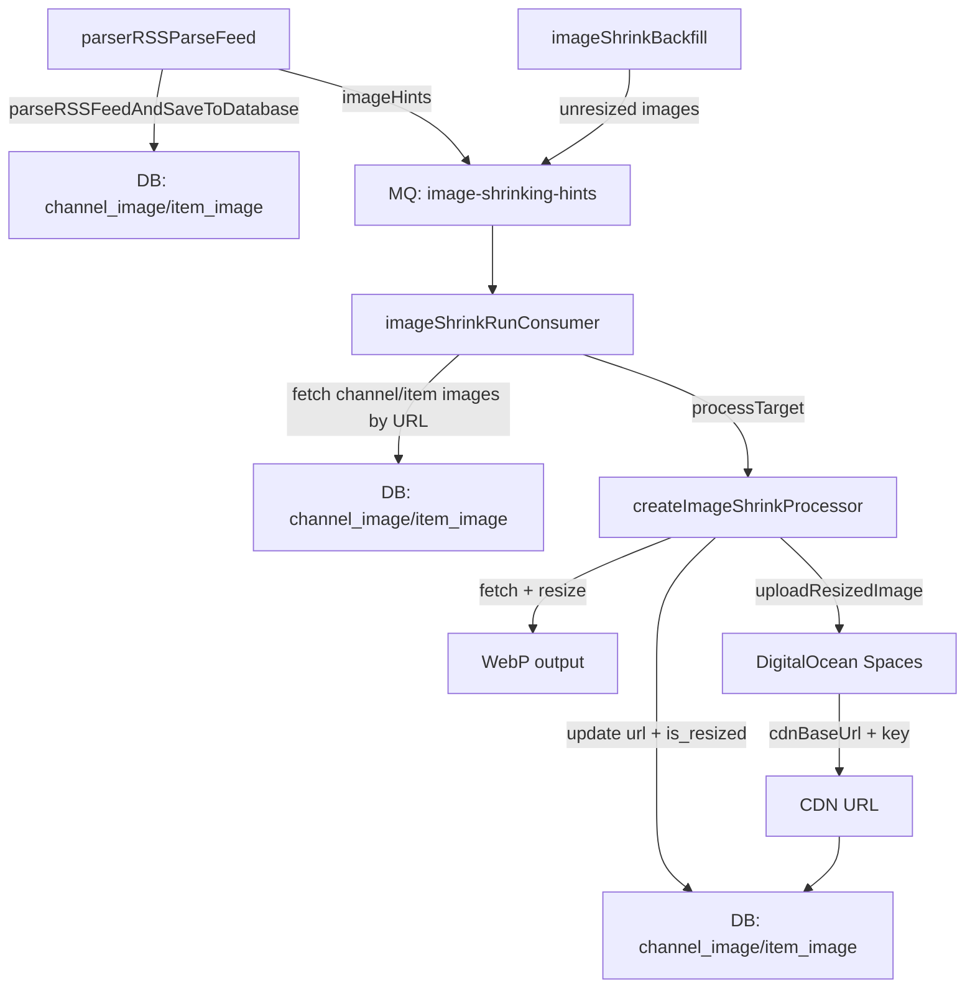

## Image Shrinking Flow

This doc describes the end-to-end flow for image shrinking, from RSS parse through MQ hints to
storage and DB updates.

Key code paths:

- MQ hints emitted during RSS parsing: `apps/workers/src/commands/parser/rss/parseFeed.ts`
- MQ consumer and hint handling: `apps/workers/src/commands/imageShrink/runConsumer.ts`
- Resizing/uploading/DB updates: `apps/workers/src/commands/imageShrink/batch.ts`

### High-Level Flow



### CDN Key Format

Resized images are stored deterministically using a URL hash:

```
images/{entityType}/{entityId}/{sha256(url)}-w{width}.webp
```

Example:

```
images/item/10/5ae702a12c0ed2d27f3bb4797040aa9bbe0638174d28785-w300.webp
```

### What Triggers Shrinking

- **Hints**: fresh MQ hints (<= 24 hours old) from RSS parsing.
- **Backfill**: periodic job that enqueues unresized images from the DB.
- **Rechecks**: existing sources are periodically rechecked (see cache/recheck doc).
