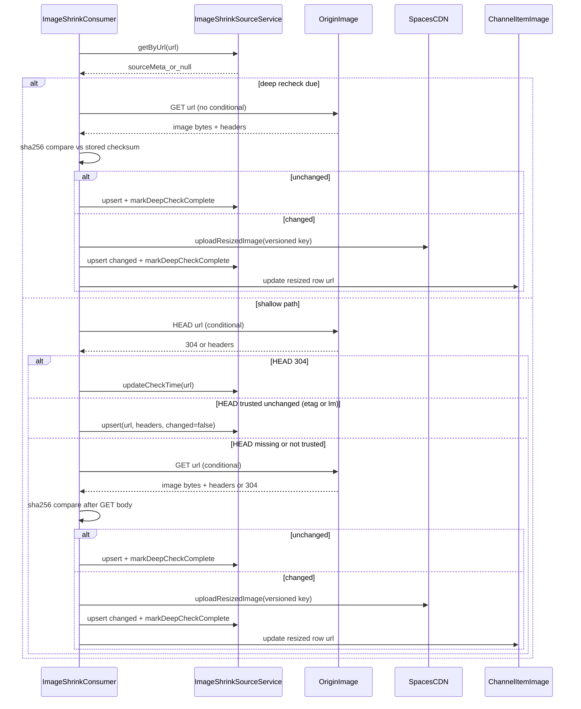

## Image Shrinking Cache and Recheck

This doc focuses on change detection and how the service avoids re-downloading unchanged images.

Key code paths:

- Change detection helpers: `apps/workers/src/commands/imageShrink/changeDetection.ts`
- Processor: `apps/workers/src/commands/imageShrink/batch.ts`
- Source metadata storage: `packages/orm/src/services/imageShrinkSource.ts`

### Change Detection Strategy

The worker uses these signals:

- HTTP `ETag` (when present on both the stored row and the origin `HEAD` response)
- HTTP `Last-Modified` (only when **neither** side has an `ETag`; `Content-Length` alone is never
  treated as proof of sameness on `HEAD`)
- SHA-256 checksum of downloaded bytes after any `GET` that returns a body (always compared to
  `image_shrink_source.checksum_sha256` when deciding whether to re-shrink)

It stores origin metadata in `image_shrink_source` keyed by source URL, including
`last_deep_checked_at` for periodic unconditional re-downloads.

### Shallow vs deep recheck

- **Shallow (default):** conditional `HEAD`, then conditional `GET` when `HEAD` is inconclusive.
- **Deep:** unconditional `GET` (no `If-None-Match` / `If-Modified-Since`), full-byte SHA-256
  compare. Triggered when `IMAGE_SHRINK_DEEP_RECHECK_EXPIRATION` (seconds) has elapsed since
  `last_deep_checked_at`, or when that column is still null for an existing source row.

`IMAGE_SHRINK_DEEP_RECHECK_EXPIRATION` defaults to `604800` (7 days). When unset, that default
applies; when set explicitly, the value must be a positive integer (same rule as other
`*_EXPIRATION` worker env vars).

### Recheck TTL

If the current processing target is _not_ a hint (i.e., not from MQ), a per-URL recheck TTL
limits how often it will be rechecked (`IMAGE_SHRINK_RECHECK_EXPIRATION`). MQ hints bypass this TTL.

### Sequence Diagram

### Notes

- Resized object keys are **content-versioned** (suffix `-c` + first 16 hex chars of SHA-256 of
  origin bytes) so `Cache-Control: immutable` stays safe when bytes change at the same URL.
- `IMAGE_SHRINK_RECHECK_EXPIRATION` (seconds) controls how often unchanged URLs are rechecked when
  not driven by MQ hints.
