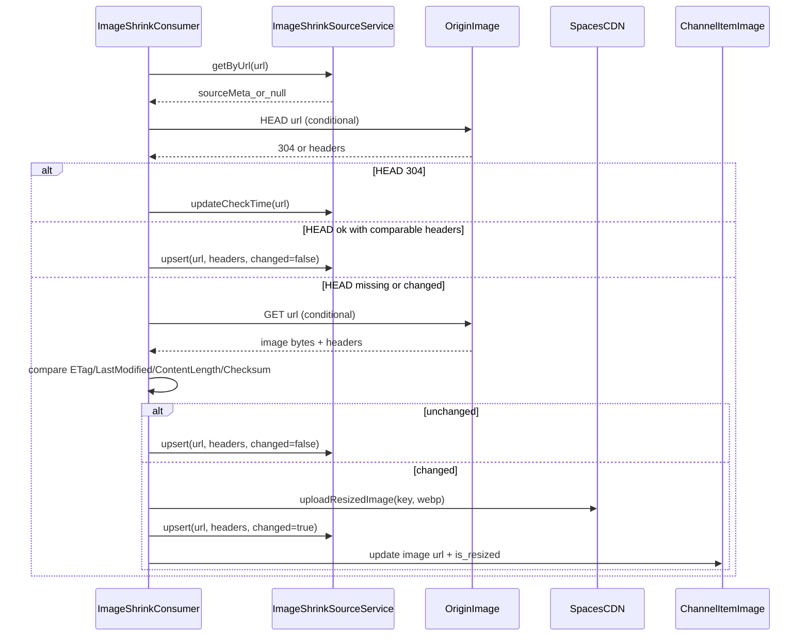

## Image Shrinking Cache and Recheck

This doc focuses on change detection and how the service avoids re-downloading unchanged images.

Key code paths:

- Change detection + headers + checksum: `apps/workers/src/commands/imageShrink/batch.ts`
- Source metadata storage: `packages/orm/src/services/imageShrinkSource.ts`

### Change Detection Strategy

The worker uses multiple signals to avoid unnecessary work:

- HTTP `ETag`
- HTTP `Last-Modified`
- HTTP `Content-Length`
- SHA-256 checksum (only when needed)

It stores origin metadata in `image_shrink_source` keyed by source URL.

### Recheck TTL

If the current processing target is _not_ a hint (i.e., not from MQ), a per-URL recheck TTL
limits how often it will be rechecked.

### Sequence Diagram

### Notes

- Checksums are only computed if other headers are inconclusive.
- `IMAGE_SHRINK_RECHECK_TTL_SECONDS` controls how often unchanged URLs are rechecked.
