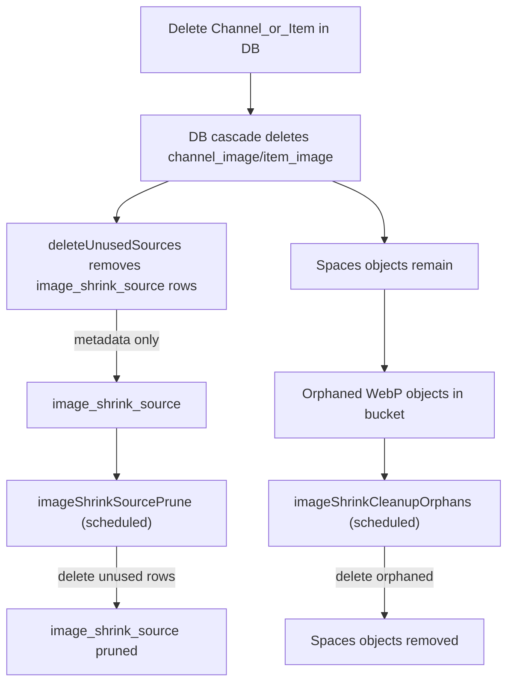
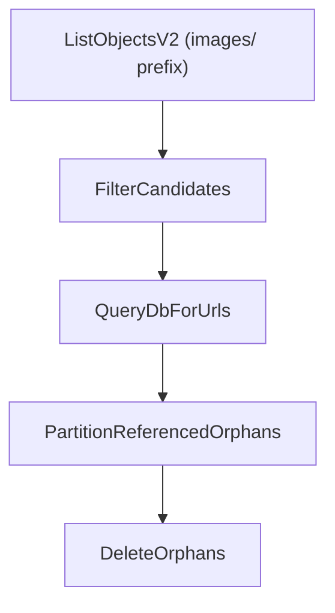
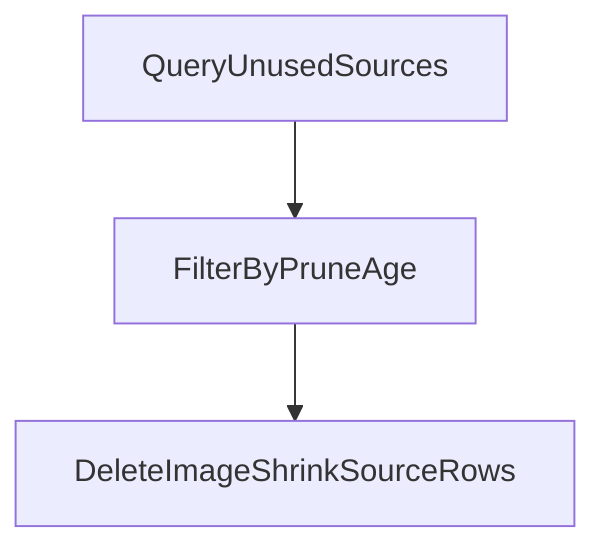

## Deletion and Orphan Behavior

This doc explains what happens when channels/items are deleted and how that affects stored
image data in the database and in object storage (S3-compatible bucket).

Key code paths:

- DB cascade rules: `packages/orm/src/entities/channel/channelImage.ts`,
  `packages/orm/src/entities/item/itemImage.ts`
- Source metadata pruning: `packages/orm/src/services/imageShrinkSource.ts`
- Storage interface (no delete method): `apps/workers/src/types/imageStorage.ts`
- Orphan cleanup worker: `apps/workers/src/commands/imageShrink/cleanupOrphans.ts`
- Full reset worker: `apps/workers/src/commands/imageShrink/resetShrunken.ts`

### What Happens If You Delete a Channel/Item in the DB

1. The channel/item row is deleted.
2. Related `channel_image` or `item_image` rows are deleted via `onDelete: 'CASCADE'`.
3. **No immediate storage deletion occurs**. The WebP objects in the bucket remain until the
   orphan cleanup job runs.

### Why Objects Remain in Storage

The core shrinking pipeline only uploads during normal processing; it does not delete from
storage when DB rows disappear. Deleting DB rows alone does not remove objects from the bucket.

Orphan cleanup uses the same **`ImageStorageService`** implementation as the consumer (`listObjects`,
`deleteImageByKey`, `getPublicUrl`), injected at bootstrap from **`@podverse/external-services-object-storage`**
according to **`BUCKET_PROVIDER`**.

The orphan cleanup command (`imageShrinkCleanupOrphans`) lists objects in the bucket,
checks whether their CDN URLs are still referenced in `channel_image` or `item_image`
(`is_resized = true`), and deletes any orphaned objects.

The source prune command (`imageShrinkSourcePrune`) deletes unused `image_shrink_source` rows
based on `IMAGE_SHRINK_SOURCE_PRUNE_EXPIRATION` (seconds). It does not delete CDN objects.

The full reset commands (`imageShrinkResetShrunkenDryRun`, `imageShrinkResetShrunken`) are
operator-only: the dry-run command reports shrink-generated WebP objects and matching
`is_resized = true` rows; the destructive command removes them, including bucket-only orphans and
DB-only stale references. See [SERVICE.md](../SERVICE.md).

### Source Metadata Pruning

The worker periodically deletes **metadata rows** from `image_shrink_source` when:

- There is no resized image referencing the URL in `channel_image` or `item_image`.
- A prune interval has passed (`IMAGE_SHRINK_SOURCE_PRUNE_EXPIRATION` in seconds).

This cleanup **does not delete any objects** from object storage.

### Deletion Flow Diagram

### Orphan Cleanup Scan (Detailed)

Filters applied before DB checks:

- `.webp` suffix only
- `lastModified` must exist
- Object age in storage must be >= `IMAGE_SHRINK_ORPHAN_MIN_AGE_EXPIRATION` (seconds)
- Optional `IMAGE_SHRINK_ORPHAN_CLEANUP_MAX_DELETE` cap
- Optional `IMAGE_SHRINK_ORPHAN_CLEANUP_PAGE_SIZE` pagination

### Source Prune Scan (Detailed)

### Practical Implication

If you delete channels/items directly in the DB, **the images will not be removed immediately
from Spaces**. They remain until the orphan cleanup job runs (or are manually deleted).

Spaces “folders” are just key prefixes. If the last object under a prefix is deleted, the UI may
still show the folder until any zero-byte placeholder objects are removed (if they exist).
