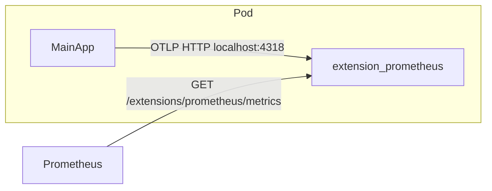

# Extension sidecars (Prometheus)

**Extension** capabilities ship as **optional sidecar containers** plus app-side OTEL metrics
clients. Main application images do not bundle extension-specific dependencies such as
`prom-client`.

See the platform index: [DOCS-OPERATIONS-PLATFORM.md](../platform/DOCS-OPERATIONS-PLATFORM.md). For
built-in web integrations and observability, see
[INTEGRATIONS-WEB.md](../integrations/INTEGRATIONS-WEB.md) and
[TRACING.md](../observability/TRACING.md).

## Architecture



| Layer                  | Responsibility                                                                    |
| ---------------------- | --------------------------------------------------------------------------------- |
| Main app               | OpenTelemetry metrics via `@podverse/extension-metrics-sdk`; **no** `prom-client` |
| Extension sidecar      | OpenTelemetry Collector contrib; OTLP ingest; Prometheus exposition               |
| Runtime-config sidecar | `NEXT_PUBLIC_*` and **Integrations** env only; **not** an extensions host         |

Apps export metrics with **OTLP over HTTP** to `http://127.0.0.1:4318` inside the pod network
namespace (the sidecar OTLP receiver binds to loopback only — not reachable at pod IP). The sidecar
listens on port **9464** for Prometheus scrape at `/extensions/prometheus/metrics`.

## Extension identity (Prometheus v1)

| Field          | Value                                                       |
| -------------- | ----------------------------------------------------------- |
| Config key     | `prometheus` → `config.extensions.prometheus.enabled`       |
| Env subsection | **Extensions** (last in app env files)                      |
| Sidecar image  | `ghcr.io/podverse/podverse/extension-prometheus`            |
| Source (repo)  | `extensions/prometheus/` (`@podverse/extension-prometheus`) |
| Container name | `extension-prometheus`                                      |
| Health path    | `/extensions/prometheus/health`                             |
| Metrics path   | `/extensions/prometheus/metrics`                            |

Future extensions add their own sidecar image, env keys, and paths under
`/extensions/{service}/{resource}`.

## Environment variables

Env is split into three source files merged into **`podverse-extensions-config`** (K8s) or three
local files loaded by the Compose sidecar:

| File                         | Audience           | Contents                                                 |
| ---------------------------- | ------------------ | -------------------------------------------------------- |
| `extensions.env`             | Main app + sidecar | `PROMETHEUS_ENABLED`, `OTEL_EXPORTER_OTLP_ENDPOINT`      |
| `extension-sidecar-otel.env` | Sidecar only       | OTLP receiver, sidecar trace forwarding                  |
| `extension-prometheus.env`   | Sidecar only       | Prometheus scrape ports/paths, collector process metrics |

Templates: `infra/config/env-templates/extensions.env.example`,
`extension-sidecar-otel.env.example`, `extension-prometheus.env.example`.

### App process (`extensions.env`)

| Variable                      | When required | Description                                             |
| ----------------------------- | ------------- | ------------------------------------------------------- |
| `PROMETHEUS_ENABLED`          | Always set    | `"true"` enables sidecar wiring and app OTLP export     |
| `OTEL_EXPORTER_OTLP_ENDPOINT` | When enabled  | App → sidecar OTLP HTTP (often `http://127.0.0.1:4318`) |

When `PROMETHEUS_ENABLED` is `true`, also set **Observability** vars (see [TRACING.md](../observability/TRACING.md)):

- `OTEL_SERVICE_NAME` — per workload (shared with observability config)
- `OTEL_TRACES_EXPORT` — app trace export (`none` or `otlp`)

### Sidecar OTLP collector (`extension-sidecar-otel.env`)

| Variable                             | Description                                            |
| ------------------------------------ | ------------------------------------------------------ |
| `OTEL_RECEIVER_OTLP_HTTP_PORT`       | OTLP HTTP listen port (default `4318`)                 |
| `OTEL_TRACES_EXPORTER_MODE`          | Sidecar downstream forward: `none`, `debug`, or `otlp` |
| `OTEL_TRACES_EXPORTER_OTLP_ENDPOINT` | Required when mode is `otlp`                           |
| `OTEL_TRACES_EXPORTER_OTLP_HEADERS`  | Optional forward headers                               |

Not app Observability — distinct from `OTEL_TRACES_EXPORT`.

### Prometheus sidecar (`extension-prometheus.env`)

| Variable                             | Description                                            |
| ------------------------------------ | ------------------------------------------------------ |
| `PROMETHEUS_METRICS_PORT`            | Prometheus scrape port (default `9464`)                |
| `PROMETHEUS_METRICS_PATH`            | Scrape path (default `/extensions/prometheus/metrics`) |
| `PROMETHEUS_COLLECT_PROCESS_METRICS` | Sidecar process metrics via OpenTelemetry Collector    |

### TypeScript mapping

```typescript
extensions: {
  prometheus: {
    enabled: process.env.PROMETHEUS_ENABLED === 'true',
  },
  otel: {
    otlpEndpoint: process.env.OTEL_EXPORTER_OTLP_ENDPOINT!,
    serviceName: process.env.OTEL_SERVICE_NAME!,
  },
},
```

When `PROMETHEUS_ENABLED` is `true`, startup validation requires OTLP/service name vars (no
silent defaults in `config/index.ts`). When disabled, extension metrics SDK calls are no-ops.

## HTTP paths

| Endpoint                         | Served by         | Notes                       |
| -------------------------------- | ----------------- | --------------------------- |
| `/extensions/prometheus/metrics` | Extension sidecar | **Canonical** scrape target |
| `/extensions/prometheus/health`  | Extension sidecar | Liveness / readiness        |

Scrape **port 9464** on the extension container, not the main app HTTP port.

## Kubernetes enablement

1. Set shared values in `infra/k8s/base/common/source/extensions/` (`extensions.env`,
   `extension-sidecar-otel.env`, `extension-prometheus.env` → ConfigMap
   `podverse-extensions-config`), including `PROMETHEUS_ENABLED=true`.
2. In your GitOps overlay, uncomment `components:` in each eligible alpha overlay (`api`,
   `management-api`, `web`, `management-web`, `workers`) pointing at
   `infra/k8s/base/common/components/prometheus-sidecar`.

Configure Prometheus scrape in your GitOps repo (PodMonitor or Kubernetes pod SD on container
port **9464**). See [PROMETHEUS-METRICS-ENDPOINTS.md](PROMETHEUS-METRICS-ENDPOINTS.md).

In-repo `infra/k8s/alpha` keeps sidecar components **commented by default**; enable when deploying.

Eligible workloads receive `envFrom` referencing `podverse-extensions-config` on the main
container. The extension sidecar is a **separate** container.

## Local development

```bash
make local_extensions_prometheus_up
./scripts/development/extensions/verify-extension-prometheus-local.sh
```

Compose profiles live in
[infra/docker/local/extensions/docker-compose.yml](../../../infra/docker/local/extensions/docker-compose.yml).
They are **not** started by `make local_infra_up`.

Typical flow (apps on host via npm):

1. `make local_infra_up` (or `make local_network_create`)
2. `make local_extensions_prometheus_up`
3. Set `PROMETHEUS_ENABLED="true"` and `OTEL_EXPORTER_OTLP_ENDPOINT="http://127.0.0.1:4318"` in app env
4. Set per-app `OTEL_SERVICE_NAME` (e.g. `podverse-api`, `podverse-web`)
5. Start the app, generate traffic, scrape `http://127.0.0.1:9464/extensions/prometheus/metrics`

When other Podverse containers on `podverse_local_network` send OTLP, use
`http://podverse_local_extension_prometheus:4318` instead of `127.0.0.1`.

## SDK (`@podverse/extension-metrics-sdk`)

Metrics-only OTEL client (not a general extension umbrella):

- `initExtensions(config)` — no-op when disabled
- `getExtensionHttpMiddleware()` — Express; Next via server instrumentation helpers
- `recordWorkerCommand(command, status, durationMs)`
- `shutdownExtensions()` — flush OTLP on shutdown

**Rule:** SDK uses `@opentelemetry/*` for metrics only; never `prom-client`. **Do not** put W3C
trace export in this package — use `@podverse/observability`.

## Related docs

- [DOCS-OPERATIONS-PLATFORM.md](../platform/DOCS-OPERATIONS-PLATFORM.md) — platform capabilities index
- [PROMETHEUS-METRICS-ENDPOINTS.md](PROMETHEUS-METRICS-ENDPOINTS.md) — scrape jobs and ports
- `.cursor/skills/extensions-env/SKILL.md` — env authoring rules
