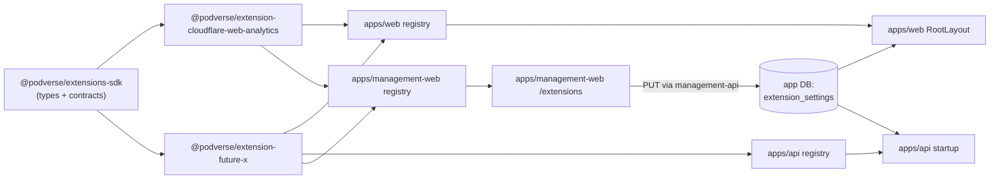
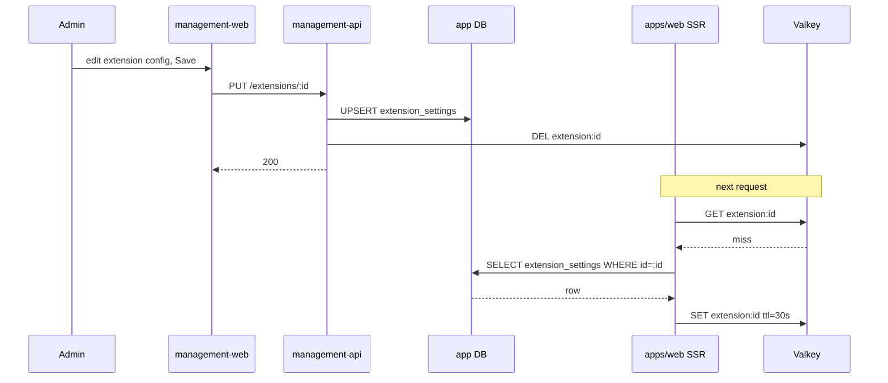

# Conditional Extensions System

Status: Proposed

## Summary

An opt-in extensions framework that lets operators of a Podverse deployment enable
third-party integrations (analytics, observability, webhooks, and similar) without
modifying core code. Each extension is a self-contained workspace package with a
typed manifest and one or more host hooks (web client, api server, management-web admin
UI). Configuration resolves from environment variables (bootstrap defaults) and a new
`extension_settings` row in the app database (runtime override editable from
management-web). The whole system is gated by a master switch `EXTENSIONS_ENABLED` that
defaults to `false`, so extensions are inert until an operator explicitly opts in.

The first concrete extension is Cloudflare Web Analytics; the architecture is shaped to
fit that need plus the next several integrations of the same shape (Datadog APM, Sentry,
outbound webhooks, etc.).

## 1. Motivation

Several near-term operational needs share the same shape:

- Optional, per-deployment.
- Sometimes runtime-editable (token rotation, on/off toggle) without a redeploy.
- Sometimes secret, sometimes intentionally public.
- Sometimes UI-injecting (analytics scripts), sometimes server-side
  (observability middleware), sometimes both.

A per-feature environment variable plus a hand-coded layout block is technically
sufficient for any single such integration, but it does not scale. By the third
integration of the same shape there are three different env vars, three different
injection points, three different operator stories, and no consistent way to flip any of
them on or off without a redeploy.

A generic extensions contract amortizes the cost across all such integrations, keeps
third-party concerns at the edge of the system rather than baked into core paths, and
gives operators a single place to enable, configure, and audit them.

The OSS monorepo is the intended home for the framework and for first-party
integrations: shipping the _option_ to enable a third-party integration is independent
of any specific deployment's choice to use it.

## 2. Goals & non-goals

**Goals**

- Opt-in: master switch defaults to off; per-extension toggles default to off.
- Bootstrap from env vars; override from a database row that management-web can edit.
- Multi-surface: one contract covers web client (script injection, providers), api
  server (middleware, event handlers), and management-web admin UI (list, edit).
- Per-extension typed configuration schema with `secret` and `userEditable` flags.
- Clean licensing/ethos boundary: an extension is a self-contained directory with a
  stable workspace package name, so a future extraction to a sibling repo is
  mechanical.
- Extensions cannot import from `apps/*` or other internal packages — they only see
  the SDK and shared UI.

**Non-goals (v1)**

- Hot-loading new extensions without a redeploy.
- Sandboxing untrusted extension code — extension authors are first-party.
- Marketplace or discovery UI.
- Per-account or per-tenant scoping (the contract should not foreclose this, but it
  is out of v1 scope).
- Extensions that own database schema beyond their `extension_settings` row.

## 3. High-level architecture

Three layers, all in the monorepo:

1. **Extension SDK** — a new workspace package `packages/extensions-sdk` that exposes
   nothing but types and contracts: `ExtensionManifest`, `WebClientHook`,
   `ApiServerHook`, `ManagementHook`, `ScriptDescriptor`, `ExtensionConfigSchema`. It is
   publishable so future external repos can build against it if extensions ever move.
1. **Extension registry** — small per-app modules at
   `apps/web/src/lib/extensions/registry.ts`, `apps/api/src/lib/extensions/registry.ts`,
   and `apps/management-web/src/lib/extensions/registry.ts` that statically import each
   extension's manifest. Adding, removing, or relocating an extension is a one-line
   change here.
1. **Extension modules** — a new top-level `extensions/<id>/` folder. Each extension is
   a self-contained workspace package (`@podverse/extension-<id>`) containing
   `manifest.ts` and one or more of `web-client.ts(x)`, `api-server.ts`, `mgmt.ts(x)`,
   plus a `README.md` and `LICENSE`.



## 4. Extension contract (the SDK)

`ExtensionManifest`:

- `id` — kebab-case, stable forever (used as DB primary key and env-var prefix).
- `name`, `description`, `kind` — `kind` is one of `analytics`, `observability`,
  `integration`, `webhook`, `other`.
- `defaultEnabled: false` — invariant. Reviewers reject any manifest that sets this
  to `true`. The point of the framework is that extensions are inert until an operator
  opts in.
- `configSchema` — a Joi schema. Each field is annotated with `secret: boolean` and
  `userEditable: boolean`. Secret fields are stripped at the SSR boundary and masked in
  management-web forms. Non-user-editable fields can only be set via env.
- `requires` — optional `{ web?: WebClientHook; api?: ApiServerHook; mgmt?: ManagementHook }`.
  An extension declares only the hooks it needs.
- `cspSources?` — optional list of CSP source declarations the runtime-config sidecar
  should merge into the `Content-Security-Policy` header when this extension is active.

Hook surfaces (each optional):

- **`WebClientHook`** — `headScripts(ctx) => ScriptDescriptor[]`,
  `bodyProviders(ctx) => ReactNode[]`. Rendered by `apps/web/src/app/layout.tsx` just
  inside `<head>` (after `RuntimeConfigScript`) and around `<Providers>`.
- **`ApiServerHook`** — `registerMiddleware(app)`, `registerEventHandlers(bus)`. Called
  once at api startup, after env validation and ORM init.
- **`ManagementHook`** — `navSection: { label, icon, href }`, optional
  `SettingsForm: React.FC<{ config; onSave }>`. When `SettingsForm` is omitted, the host
  auto-generates a form from `configSchema`.

The SDK is types only; it has no runtime code. Resolution and rendering live in the
host apps so each app can wire the contract into its own layout, routing, and i18n
without forcing those concerns into the SDK.

## 5. Configuration resolution order


- `EXTENSIONS_ENABLED` (default `false`) gates the entire system. If unset or `false`,
  every extension is inert regardless of DB state or per-extension env.
- Per-extension `EXTENSION_<ID>_ENABLED=true` and `EXTENSION_<ID>_<KEY>=...` env vars
  provide bootstrap defaults. `<ID>` is the manifest's `id` upper-cased with kebab-case
  hyphens converted to underscores.
- A row in `extension_settings` (when present) wins over env, so management-web changes
  are authoritative at runtime.
- DB row absence does not mean disabled — it means "fall back to env." This preserves
  the env-only deployment mode for operators who prefer never to touch the
  management-web UI.

This ordering matches operator expectations: env is the deployment-time default, the
management-web UI is the runtime override, and there is always a way to disable
everything centrally.

## 6. Storage model

A new linear migration adds a single table to the **app DB** (not the management DB)
because both `apps/web` and `apps/api` need to read it on render and request paths.

`infra/k8s/base/ops/source/database/linear-migrations/app/0032_extension_settings.sql`:

```sql
CREATE TABLE extension_settings (
  id varchar(120) PRIMARY KEY,
  enabled boolean NOT NULL DEFAULT false,
  config jsonb NOT NULL DEFAULT '{}'::jsonb,
  updated_by_admin_id integer NULL,
  created_at timestamptz NOT NULL DEFAULT now(),
  updated_at timestamptz NOT NULL DEFAULT now()
);
```

- `id` is the manifest `id`. Stability of the value is therefore a hard contract on
  manifests.
- `updated_by_admin_id` is informational. It is not enforced as a foreign key because
  admins live in the management DB; the column documents intent without coupling
  schemas.
- `config` is `jsonb`; the application validates against the manifest's `configSchema`
  before write.

A new ORM service `packages/orm/src/services/ExtensionSettingsService.ts` wraps reads
and writes and integrates with the existing service patterns. Reads are cached in
Valkey under `extension:<id>` keys with a short TTL (e.g. 30s); management-api
explicitly invalidates the key on every write.

## 7. Surface 1 — apps/web client

The driving use case: inject a script tag (Cloudflare beacon, etc.) into the
server-rendered HTML when an extension is active.

- `apps/web/src/lib/extensions/resolveExtensions.ts` returns the active extensions and
  their resolved configs (env + DB merge) per the resolution order above.
- `apps/web/src/app/layout.tsx` renders `<ExtensionHeadScripts />` inside `<head>` and
  wraps children in `<ExtensionProviders>`. Both are no-ops when the master switch is
  off.
- Sensitive config never reaches the client. Any field annotated `secret: true` is
  stripped at the SSR boundary; the resolved config that goes to client components
  contains only the non-secret subset.
- CSP integration: each extension's `cspSources` are merged into the
  `Content-Security-Policy` header by the web sidecar so that script injection does not
  require operators to hand-edit policy. Extensions that fail to declare needed sources
  break loudly in dev and staging rather than silently in production.

## 8. Surface 2 — apps/api server

- `apps/api/src/lib/extensions/bootstrap.ts` runs after env validation and ORM init,
  iterates active extensions, and calls `registerMiddleware(app)` and
  `registerEventHandlers(bus)`.
- A small in-process event bus emits typed domain events such as `account.created`,
  `episode.played`, `boost.received`. Extensions subscribe; they cannot mutate events or
  block the request path. Errors thrown by an extension's event handler are logged and
  swallowed so a misbehaving extension cannot brick the api.
- Workers are intentionally **out of scope for v1**. A worker hook surface is a natural
  Phase 2 addition once the api side is exercised by a real observability extension.

## 9. Surface 3 — apps/management-web admin UI

- A new nav section `extensions` is added to
  `apps/management-web/src/lib/managementNavRoutes.ts`, gated by `EXTENSIONS_ENABLED`
  and a permission check. The conservative v1 default is a new `extensions_crud`
  permission scoped to superusers.
- List page (`/extensions`): one row per known extension manifest, with enabled toggle
  and "last updated" timestamp.
- Detail page (`/extensions/[id]`): renders the extension's `SettingsForm`, or the
  auto-generated form from `configSchema` when no custom form is provided. Save POSTs
  to a new management-api route `PUT /extensions/:id`, which writes to the app DB via
  the existing cross-DB pattern that management-api already uses for app-DB mutations,
  then invalidates the Valkey cache key.
- Follows existing patterns: `@podverse/ui` resource table,
  [`form-primary-actions-row`](../../.cursor/skills/form-primary-actions-row/SKILL.md),
  [`crud-tables-resources`](../../.cursor/skills/crud-tables-resources/SKILL.md),
  [`modal-layout-contract`](../../.cursor/skills/modal-layout-contract/SKILL.md) for
  any confirms.



## 10. First concrete extension — Cloudflare Web Analytics

`extensions/cloudflare-web-analytics/`:

- `manifest.ts` — `id: 'cloudflare-web-analytics'`, `kind: 'analytics'`,
  `configSchema: { token: string (required, secret: false, userEditable: true), beaconUrl?: string }`.
  The token is intentionally public — it is a beacon identifier, not a credential — and
  the management-web form should include a tooltip clarifying that.
- `web-client.ts` — `headScripts({ config }) => [{ src: 'https://static.cloudflareinsights.com/beacon.min.js', defer: true, dataAttrs: { 'cf-beacon': JSON.stringify({ token: config.token }) } }]`.
- `mgmt.tsx` — minimal; relies on the auto-form for v1.
- `cspSources` — adds the Cloudflare Insights script source.
- `README.md` — env keys (`EXTENSION_CLOUDFLARE_WEB_ANALYTICS_ENABLED`,
  `EXTENSION_CLOUDFLARE_WEB_ANALYTICS_TOKEN`), management-web override path, and a
  one-paragraph description of what data Cloudflare collects.

## 11. Boundary discipline

The architecture treats the OSS monorepo as the _default and intended_ home for
extensions. To keep a future extraction (e.g. a separate `podverse-extensions` repo)
cheap if it is ever wanted, every extension follows these rules:

- Imports only from `@podverse/extensions-sdk`, `@podverse/ui`, and framework types
  (`react`, `next`). No imports from `apps/*` or other internal packages.
- Each `extensions/<id>/package.json` declares a stable workspace package name
  (`@podverse/extension-<id>`); the host registry imports manifests by package name, so
  today's monorepo path matches a hypothetical published path.
- Per-extension `LICENSE` file, so a mixed-license extraction is mechanical.

This is hygiene, not a roadmap commitment. The default is "keep extensions in this
repo."

## 12. Risks & open questions

- **Cross-DB write path** (management-api -> app DB): the exact authorization shape is
  open — new `extensions_crud` permission vs. superuser-only; one route or per-extension
  routes.
- **Caching strategy:** TTL plus explicit invalidation is the proposed default; the
  TTL value (30s) is a guess and should be tuned once SSR latency is measured.
- **CSP / SRI:** every script-injecting extension must declare its sources and (where
  feasible) integrity hashes. CSP merging in the sidecar is straightforward; SRI is
  trickier because Cloudflare does not publish a stable hash for `beacon.min.js`. The
  Cloudflare extension declares the source but no hash; future extensions may declare
  hashes when their providers expose them.
- **Audit trail:** is `updated_by_admin_id` plus `updated_at` enough, or do we want a
  dedicated `extension_settings_history` table? Deferred to Phase 3 unless v1 audit
  proves insufficient.
- **Per-account scoping:** out of v1, but the schema may want a reserved hook (e.g. a
  nullable `account_id` added in a later migration) so the path is clear.
- **Test coverage:** Playwright spec for management-web `/extensions` list and edit; an
  apps/web HEAD assertion that the beacon script is present iff the extension is
  active; integration test for the cross-DB write; unit tests for the config resolver
  covering every branch of section 5's flowchart.
- **Vendoring policy:** when an extension wraps a third-party SDK, do we vendor the
  SDK or pull from npm? Cloudflare's beacon is a remote `<script>` so the question is
  moot for v1 but will arise for, say, a Datadog APM extension.

## 13. Phased rollout

- **Phase 1:** SDK + registry + master env switch + `extension_settings` table +
  Cloudflare Web Analytics extension (web surface only) + management-web list and edit
  UI + integration and E2E tests. This is what the deliverable-3 plan set executes on
  acceptance of this proposal.
- **Phase 2:** apps/api hook surface + event bus + first observability-style extension
  (Datadog APM is a candidate; it validates the secret-config path that Cloudflare
  does not exercise).
- **Phase 3:** per-account scoping if and when a use case appears; audit-history table
  if v1 audit proves insufficient; optional extraction to a separate repo if ever
  desired.

## 14. Decision request

Before implementation begins, this proposal asks for an explicit decision on:

1. **Master switch name and default.** Proposed: `EXTENSIONS_ENABLED=false` as the
   default in every environment.
1. **Permission model for management-web `/extensions`.** Proposed: a new
   `extensions_crud` permission, superuser-only initially.
1. **Caching strategy.** Proposed: 30s Valkey TTL plus explicit invalidation on write.
1. **Phase-1 scope.** Proposed: web surface only; defer the apps/api hook surface to
   Phase 2.

Once accepted, the implementation plan set at
`.llm/plans/active/extensions-framework/` executes Phase 1 in numbered steps. That
plan set treats the parallel Cloudflare env plan
(Cursor plan `cloudflare_web_analytics_env_6f142d3e`) as a sibling, also currently
pre-implementation, and documents how both plans converge on a single end state
regardless of which ships first.
