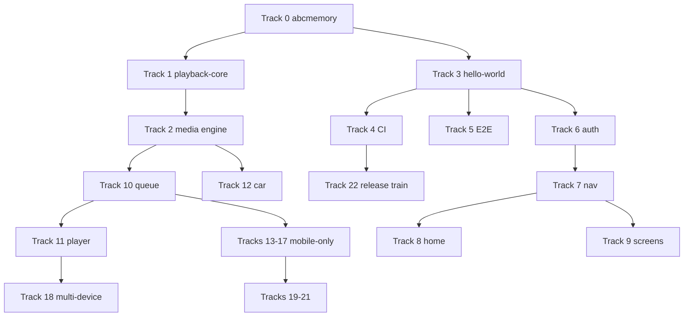
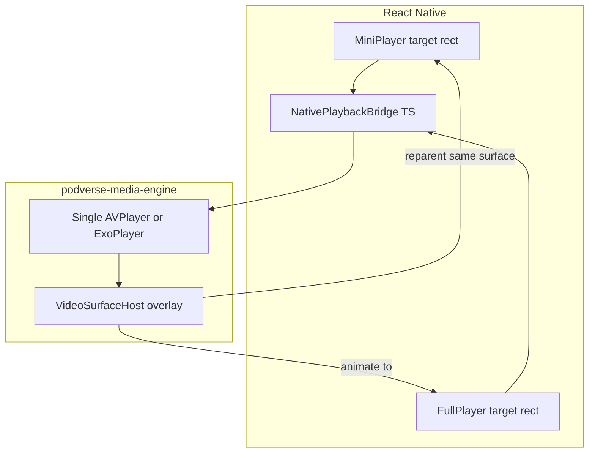

# Podverse Mobile — Master Plan

> Highest-level ordered step list for building the next-generation Podverse mobile app.
> Detail plans: `details/<id>-*.md` — numeric prefix, zero-padded (typically **3** digits) + slug (_TBD_ until written).
> Source proposals: [DOCS-MOBILE](/docs/proposals/mobile/initial-decisions/DOCS-MOBILE.md)
>
> **Draft source:** `_draft-tracks/*.md` fragments used to assemble this document; retain for reference.

## How to read this document

- Steps use **Track.Step** numbering (e.g. `2.15`).
- Tracks run in numeric order unless noted in **Parallel groups** below.
- Each step links to a detail plan file with a **status suffix**: `_TBD_`, `planned`, or `done` (completed).
- Each step includes **Model:** — recommended Cursor model for authoring and implementing that step (Auto, Codex 5.3, or Opus 4.8).
- **Do not use react-native-track-player** — use custom `podverse-media-engine` (Track 2).
- **Phasing workflow:** Just-in-time detailing and implementation one parallel group at a time — see [.cursor/skills/mobile-master-plan-phasing/SKILL.md](/.cursor/skills/mobile-master-plan-phasing/SKILL.md).

## LLM model guide

| Model     | Tier     | Use when                                                            |
| --------- | -------- | ------------------------------------------------------------------- |
| Auto      | Cheapest | Mechanical docs, operator-only steps, simple config, deferral stubs |
| Codex 5.3 | Medium   | Standard RN screens, E2E harness, auth/nav/browse mirroring web     |
| Opus 4.8  | Premium  | Native engine, playback/queue parity, car layer, IAP, assembly      |

## Open decisions

| Decision          | Options                                               | Default recommendation             |
| ----------------- | ----------------------------------------------------- | ---------------------------------- |
| CI tooling        | EAS vs Fastlane                                       | Document both; operator chooses    |
| Store identity    | Separate `.next` app id vs internal track on existing | Separate app id                    |
| E2E framework     | Maestro vs Detox                                      | Maestro                            |
| Watch/TV v1 scope | v1 vs post-MVP                                        | Phone+tablet v1; watch v1.1; TV v2 |

## Parallel groups (implementation order)

| Group | Tracks             | Can parallelize with | Prerequisites        |
| ----- | ------------------ | -------------------- | -------------------- |
| PG-0  | 0                  | —                    | none                 |
| PG-1  | 1                  | 3 (after 0.6+)       | 0 partial            |
| PG-2a | 3                  | 4, 5 (after 0)       | 0                    |
| PG-2b | 2 spike (2.1–2.13) | 3, 4, 5              | 0, 1 recommended     |
| PG-3  | 4, 5               | each other           | 3 hello-world        |
| PG-4  | 6, 7               | each other           | 3, 5; **0.20** design-tokens recommended before 7.11–7.16 |
| PG-5  | 2 full (2.14–2.35) | 8, 9                 | 2 spike, 1           |
| PG-6  | 8, 9               | each other           | 6, 7; **7.11–7.15** theme scaffold `done` |
| PG-7  | 10, 11             | each other           | 1, 2, 6              |
| PG-8  | 12                 | 13, 14, 15           | 2, 10                |
| PG-9  | 13, 14, 15, 16, 17 | each other (mostly)  | 6, 10 varies         |
| PG-10 | 18                 | 19, 20               | 7, 11                |
| PG-11 | 19, 20, 21         | each other           | MVP feature-complete |
| PG-12 | 22                 | —                    | 4, PG-11             |



## Tracks

## Track 0 — Monorepo, Tier D, abcmemory prep

0.1. Add `.cursorignore` entries for `apps/mobile/ios/Pods/`, Android build dirs, and `.expo/`. Model: Auto. Detail: [001-cursorignore-native-artifacts](/docs/proposals/mobile/_master-plan_/details/001-cursorignore-native-artifacts.md) — done
0.2. Document Tier D import-specifier rules for `apps/mobile/**` in import-specifiers doc. Model: Codex 5.3. Detail: [002-tier-d-import-specifiers-doc](/docs/proposals/mobile/_master-plan_/details/002-tier-d-import-specifiers-doc.md) — done
0.3. Add ESLint override block for `apps/mobile/**` (extensionless imports, RN globals). Model: Codex 5.3. Detail: [003-eslint-mobile-override](/docs/proposals/mobile/_master-plan_/details/003-eslint-mobile-override.md) — done
0.4. Exclude `apps/mobile` from root `test:unit` until RN Vitest config is ready. Model: Auto. Detail: [004-exclude-mobile-test-unit](/docs/proposals/mobile/_master-plan_/details/004-exclude-mobile-test-unit.md) — done
0.5. Exclude or scope `apps/mobile` from root lint sweep until RN ESLint is configured. Model: Auto. Detail: [005-exclude-mobile-lint](/docs/proposals/mobile/_master-plan_/details/005-exclude-mobile-lint.md) — done
0.6. Create `apps/mobile/AGENTS.md` with allowed/forbidden `@podverse/*` imports. Model: Codex 5.3. Detail: [006-mobile-agents-md](/docs/proposals/mobile/_master-plan_/details/006-mobile-agents-md.md) — done
0.7. Create `apps/mobile/APPS-MOBILE.md` contributor guide (commands, layout, toolchain). Model: Codex 5.3. Detail: [007-apps-mobile-md](/docs/proposals/mobile/_master-plan_/details/007-apps-mobile-md.md) — done
0.8. Add `.cursor/rules/mobile-react-native.mdc` (RN boundaries, no Next/ui/orm). Model: Codex 5.3. Detail: [008-rule-mobile-react-native](/docs/proposals/mobile/_master-plan_/details/008-rule-mobile-react-native.md) — done
0.9. Add `.cursor/rules/mobile-carplay-android-auto.mdc` (native cache contract pointer). Model: Opus 4.8. Detail: [009-rule-mobile-car-native](/docs/proposals/mobile/_master-plan_/details/009-rule-mobile-car-native.md) — done
0.10. Add `.cursor/skills/mobile-playback/SKILL.md` mapping web policy to native bridge. Model: Opus 4.8. Detail: [010-skill-mobile-playback](/docs/proposals/mobile/_master-plan_/details/010-skill-mobile-playback.md) — done
0.11. Add `.cursor/skills/mobile-e2e-screenshots/SKILL.md` for Maestro/Detox screenshot reports. Model: Codex 5.3. Detail: [011-skill-mobile-e2e-screenshots](/docs/proposals/mobile/_master-plan_/details/011-skill-mobile-e2e-screenshots.md) — done
0.12. Add `.cursor/skills/mobile-fdroid-flavors/SKILL.md` documenting FOSS vs playstore flavors. Model: Codex 5.3. Detail: [012-skill-mobile-fdroid-flavors](/docs/proposals/mobile/_master-plan_/details/012-skill-mobile-fdroid-flavors.md) — done
0.13. Update root [AGENTS.md](/AGENTS.md) directory map with `apps/mobile` Tier 5 note. Model: Auto. Detail: [013-root-agents-mobile-entry](/docs/proposals/mobile/_master-plan_/details/013-root-agents-mobile-entry.md) — done
0.14. Update [.cursorrules](/.cursorrules) with mobile tier, `-w apps/mobile` commands pointer. Model: Auto. Detail: [014-cursorrules-mobile-note](/docs/proposals/mobile/_master-plan_/details/014-cursorrules-mobile-note.md) — done
0.15. Add `.cursor/skills/mobile-worktree-scope/SKILL.md` for parallel LLM sessions per Track. Model: Codex 5.3. Detail: [015-skill-mobile-worktree-scope](/docs/proposals/mobile/_master-plan_/details/015-skill-mobile-worktree-scope.md) — done
0.16. Define abcmemory checklist: when to update rules/skills vs `.llm/` plans. Model: Codex 5.3. Detail: [016-abcmemory-update-checklist](/docs/proposals/mobile/_master-plan_/details/016-abcmemory-update-checklist.md) — done
0.17. Add mobile package import allowlist/denylist to `apps/mobile/AGENTS.md` (mirror shared-vs-divergent). Model: Codex 5.3. Detail: [017-mobile-import-allowlist](/docs/proposals/mobile/_master-plan_/details/017-mobile-import-allowlist.md) — done
0.18. Document Metro monorepo resolver requirements in `APPS-MOBILE.md`. Model: Codex 5.3. Detail: [018-metro-monorepo-doc](/docs/proposals/mobile/_master-plan_/details/018-metro-monorepo-doc.md) — done
0.19. Add `.cursorignore` for `apps/mobile/**/*.hbc` and Xcode user data if not already covered. Model: Auto. Detail: [019-cursorignore-generated-assets](/docs/proposals/mobile/_master-plan_/details/019-cursorignore-generated-assets.md) — done
0.20. Create `@podverse/design-tokens` package: RN-safe TS token maps synced with `packages/ui` SCSS themes. Model: Codex 5.3. Detail: [035-design-tokens-package](/docs/proposals/mobile/_master-plan_/details/035-design-tokens-package.md) — planned

## Track 1 — Extract `packages/playback-core`

1.1. Create `packages/playback-core` workspace with package.json mirroring helpers pattern. Model: Codex 5.3. Detail: [020-playback-core-package-scaffold](/docs/proposals/mobile/_master-plan_/details/020-playback-core-package-scaffold.md) — done
1.2. Move `resolvePlaybackLoadDecision.ts` and types from web lib/playback into playback-core. Model: Opus 4.8. Detail: [021-move-resolve-playback-decision](/docs/proposals/mobile/_master-plan_/details/021-move-resolve-playback-decision.md) — done
1.3. Move `playbackTarget.ts`, `playbackLoadRequest.ts`, and related target helpers. Model: Opus 4.8. Detail: [022-move-playback-target-types](/docs/proposals/mobile/_master-plan_/details/022-move-playback-target-types.md) — done
1.4. Move `resumeSeekFromAbridged.ts`, `clampNearEndSeconds.ts`, `parsePlaybackSeconds.ts`. Model: Opus 4.8. Detail: [023-move-resume-seek-helpers](/docs/proposals/mobile/_master-plan_/details/023-move-resume-seek-helpers.md) — done
1.5. Move enclosure-switch decision helpers into playback-core. Model: Opus 4.8. Detail: [024-move-enclosure-switch-policy](/docs/proposals/mobile/_master-plan_/details/024-move-enclosure-switch-policy.md) — done
1.6. Move `combineQueueNowPlayingAndUpcoming.ts` from web lib/queue into playback-core. Model: Opus 4.8. Detail: [025-move-combine-queue-helper](/docs/proposals/mobile/_master-plan_/details/025-move-combine-queue-helper.md) — done
1.7. Move unit tests from web lib/playback and lib/queue `__tests__/` into playback-core. Model: Opus 4.8. Detail: [026-move-playback-core-tests](/docs/proposals/mobile/_master-plan_/details/026-move-playback-core-tests.md) — done
1.8. Export public API from `packages/playback-core/src/index.ts`. Model: Codex 5.3. Detail: [027-playback-core-index-exports](/docs/proposals/mobile/_master-plan_/details/027-playback-core-index-exports.md) — done
1.9. Add playback-core to `build:packages` ordered list immediately after helpers. Model: Auto. Detail: [028-build-packages-playback-core](/docs/proposals/mobile/_master-plan_/details/028-build-packages-playback-core.md) — done
1.10. Update web app to import policy from `@podverse/playback-core` (re-export or direct). Model: Opus 4.8. Detail: [029-web-consume-playback-core](/docs/proposals/mobile/_master-plan_/details/029-web-consume-playback-core.md) — done
1.11. Verify web playback behavior unchanged after extraction (operator runs unit tests). Model: Auto. Detail: [030-web-playback-regression-verify](/docs/proposals/mobile/_master-plan_/details/030-web-playback-regression-verify.md) — done
1.12. Document playback-core tier placement in architecture.md. Model: Auto. Detail: [031-architecture-playback-core-tier](/docs/proposals/mobile/_master-plan_/details/031-architecture-playback-core-tier.md) — done
1.13. Add PACKAGES-PLAYBACK-CORE.md contributor doc under packages/playback-core. Model: Codex 5.3. Detail: [032-packages-playback-core-doc](/docs/proposals/mobile/_master-plan_/details/032-packages-playback-core-doc.md) — done
1.14. Ensure playback-core depends only on `@podverse/helpers` (no DOM, no RN). Model: Codex 5.3. Detail: [033-playback-core-dependency-audit](/docs/proposals/mobile/_master-plan_/details/033-playback-core-dependency-audit.md) — done

## Track 2 — Custom native media engine

**Do not use `react-native-track-player`.** This track defines a first-party Podverse media engine
with native iOS (AVPlayer + AVAudioSession) and Android (Media3 ExoPlayer) implementations, plus a JS
bridge contract consumed by `@podverse/playback-core` policy.
Reference:
[DOCS-MOBILE-PROCESS-PLAYBACK-QUEUE-PARITY.md](/docs/proposals/mobile/app-development-process/DOCS-MOBILE-PROCESS-PLAYBACK-QUEUE-PARITY.md),
[DOCS-MOBILE-CARPLAY-ANDROID-AUTO.md](/docs/proposals/mobile/initial-decisions/DOCS-MOBILE-CARPLAY-ANDROID-AUTO.md)

## Seamless video architecture

One **persistent native video surface** owned by the media engine for the lifetime of a playback
session. Mini player and full player screens register **target layout rects** (x, y, width, height,
corner radius); the engine **reparents** the same native view between containers — no tear-down on
expand.

- iOS: `AVPlayerLayer` hosted in a native overlay view managed by the engine module.
- Android: `PlayerView` (Media3) or `SurfaceView` attached to a single ExoPlayer instance.
- RN screens render transparent placeholders; native module positions the surface above them.
- Audio-only items use the same engine without attaching a visible surface.
  The old app recreated the video player on full-screen open — that pattern is **explicitly forbidden**.



2.1. Create `apps/mobile/modules/podverse-media-engine/` native module scaffold (iOS + Android). Model: Opus 4.8. Detail: [080-media-engine-module-scaffold](/docs/proposals/mobile/_master-plan_/details/080-media-engine-module-scaffold.md) — _TBD_
2.2. Define TypeScript bridge interface `NativePlaybackBridge` mirroring web bridge surface API. Model: Opus 4.8. Detail: [081-native-playback-bridge-interface](/docs/proposals/mobile/_master-plan_/details/081-native-playback-bridge-interface.md) — _TBD_
2.3. Document bridge methods: load, play, pause, seek, setRate, getPosition, getDuration, destroy. Model: Opus 4.8. Detail: [082-bridge-method-contract](/docs/proposals/mobile/_master-plan_/details/082-bridge-method-contract.md) — _TBD_
2.4. Implement iOS Swift module wrapping AVPlayer for audio enclosure playback. Model: Opus 4.8. Detail: [083-ios-avplayer-audio](/docs/proposals/mobile/_master-plan_/details/083-ios-avplayer-audio.md) — _TBD_
2.5. Configure iOS AVAudioSession category `.playback` with background and interrupt handling. Model: Opus 4.8. Detail: [084-ios-audio-session-lifecycle](/docs/proposals/mobile/_master-plan_/details/084-ios-audio-session-lifecycle.md) — _TBD_
2.6. Wire iOS MPNowPlayingInfoCenter and MPRemoteCommandCenter for lock-screen controls. Model: Opus 4.8. Detail: [085-ios-now-playing-remote-commands](/docs/proposals/mobile/_master-plan_/details/085-ios-now-playing-remote-commands.md) — _TBD_
2.7. Implement Android Kotlin module with Media3 ExoPlayer for audio playback. Model: Opus 4.8. Detail: [086-android-exoplayer-audio](/docs/proposals/mobile/_master-plan_/details/086-android-exoplayer-audio.md) — _TBD_
2.8. Implement Android foreground MediaSessionService for background audio survival. Model: Opus 4.8. Detail: [087-android-foreground-media-service](/docs/proposals/mobile/_master-plan_/details/087-android-foreground-media-service.md) — _TBD_
2.9. Wire Android MediaSessionCompat/Media3 session for lock-screen and BT controls. Model: Opus 4.8. Detail: [088-android-media-session-controls](/docs/proposals/mobile/_master-plan_/details/088-android-media-session-controls.md) — _TBD_
2.10. Emit native events to JS: playbackState, progress, ended, error, stalled. Model: Opus 4.8. Detail: [089-native-to-js-events](/docs/proposals/mobile/_master-plan_/details/089-native-to-js-events.md) — _TBD_
2.11. Implement JS `NativePlaybackBridge` adapter calling the native module from RN hooks. Model: Opus 4.8. Detail: [090-js-bridge-adapter](/docs/proposals/mobile/_master-plan_/details/090-js-bridge-adapter.md) — _TBD_
2.12. Spike: verify background audio survives app background on iOS and Android. Model: Opus 4.8. Detail: [091-spike-background-audio](/docs/proposals/mobile/_master-plan_/details/091-spike-background-audio.md) — _TBD_
2.13. Spike: verify audio continues after app kill where OS policy allows (document limits). Model: Opus 4.8. Detail: [092-spike-audio-after-kill](/docs/proposals/mobile/_master-plan_/details/092-spike-audio-after-kill.md) — _TBD_
2.14. Add iOS video: single AVPlayer instance shared for audio+video items. Model: Opus 4.8. Detail: [093-ios-avplayer-video](/docs/proposals/mobile/_master-plan_/details/093-ios-avplayer-video.md) — _TBD_
2.15. Add Android video: single ExoPlayer instance with video surface support. Model: Opus 4.8. Detail: [094-android-exoplayer-video](/docs/proposals/mobile/_master-plan_/details/094-android-exoplayer-video.md) — _TBD_
2.16. Implement native **VideoSurfaceHost** overlay view (iOS) for persistent surface ownership. Model: Opus 4.8. Detail: [095-ios-video-surface-host](/docs/proposals/mobile/_master-plan_/details/095-ios-video-surface-host.md) — _TBD_
2.17. Implement native **VideoSurfaceHost** overlay view (Android) for persistent surface ownership. Model: Opus 4.8. Detail: [096-android-video-surface-host](/docs/proposals/mobile/_master-plan_/details/096-android-video-surface-host.md) — _TBD_
2.18. Add bridge API `attachVideoSurface(targetId, layoutRect)` for mini/full player targets. Model: Opus 4.8. Detail: [097-bridge-attach-video-surface](/docs/proposals/mobile/_master-plan_/details/097-bridge-attach-video-surface.md) — _TBD_
2.19. Add bridge API `animateVideoSurface(toTargetId, durationMs)` for mini↔full transition. Model: Opus 4.8. Detail: [098-bridge-animate-video-surface](/docs/proposals/mobile/_master-plan_/details/098-bridge-animate-video-surface.md) — _TBD_
2.20. Implement reparenting logic: same native view moves between registered layout targets. Model: Opus 4.8. Detail: [099-surface-reparent-implementation](/docs/proposals/mobile/_master-plan_/details/099-surface-reparent-implementation.md) — _TBD_
2.21. RN mini player registers `targetId=mini` rect updated on layout and keyboard events. Model: Opus 4.8. Detail: [100-rn-mini-player-surface-target](/docs/proposals/mobile/_master-plan_/details/100-rn-mini-player-surface-target.md) — _TBD_
2.22. RN full player registers `targetId=full` rect; expand triggers animate, not remount. Model: Opus 4.8. Detail: [101-rn-full-player-surface-target](/docs/proposals/mobile/_master-plan_/details/101-rn-full-player-surface-target.md) — _TBD_
2.23. Hide video surface when item is audio-only; show when `PlaybackTarget` is video kind. Model: Opus 4.8. Detail: [102-audio-only-hide-surface](/docs/proposals/mobile/_master-plan_/details/102-audio-only-hide-surface.md) — _TBD_
2.24. Handle orientation change by updating target rects without resetting player. Model: Opus 4.8. Detail: [103-orientation-surface-resize](/docs/proposals/mobile/_master-plan_/details/103-orientation-surface-resize.md) — _TBD_
2.25. Implement `loadAndStart` bridge method accepting enclosure URL and initial seek seconds. Model: Opus 4.8. Detail: [104-bridge-load-and-start](/docs/proposals/mobile/_master-plan_/details/104-bridge-load-and-start.md) — _TBD_
2.26. Support `file://` local paths for offline playback through same engine. Model: Opus 4.8. Detail: [105-engine-local-file-playback](/docs/proposals/mobile/_master-plan_/details/105-engine-local-file-playback.md) — _TBD_
2.27. Define error taxonomy and map native errors to `@podverse/helpers` playback error shapes. Model: Opus 4.8. Detail: [106-playback-error-mapping](/docs/proposals/mobile/_master-plan_/details/106-playback-error-mapping.md) — _TBD_
2.28. Add unit-testable pure TS layer for bridge command serialization (no native in Vitest). Model: Codex 5.3. Detail: [107-bridge-command-serialization-tests](/docs/proposals/mobile/_master-plan_/details/107-bridge-command-serialization-tests.md) — _TBD_
2.29. Document engine architecture in `apps/mobile/modules/podverse-media-engine/README.md`. Model: Codex 5.3. Detail: [108-media-engine-readme](/docs/proposals/mobile/_master-plan_/details/108-media-engine-readme.md) — _TBD_
2.30. Add abcmemory skill update: replace any track-player references with podverse-media-engine. Model: Codex 5.3. Detail: [109-abcmemory-no-track-player](/docs/proposals/mobile/_master-plan_/details/109-abcmemory-no-track-player.md) — _TBD_
2.31. Register non-FOSS deps used by engine (if any Google Play Services) in FOSS register doc stub. Model: Codex 5.3. Detail: [110-engine-fdroid-deps-register](/docs/proposals/mobile/_master-plan_/details/110-engine-fdroid-deps-register.md) — _TBD_
2.32. E2E: spike flow plays sample audio and captures lock-screen screenshot (manual/semi-auto). Model: Codex 5.3. Detail: [111-e2e-audio-spike-screenshot](/docs/proposals/mobile/_master-plan_/details/111-e2e-audio-spike-screenshot.md) — _TBD_
2.33. E2E: spike flow plays sample video mini→full transition without playback restart. Model: Opus 4.8. Detail: [112-e2e-video-transition-spike](/docs/proposals/mobile/_master-plan_/details/112-e2e-video-transition-spike.md) — _TBD_
2.34. Define go/no-go gate: engine spike must pass before Track 10/11 full player UI work. Model: Codex 5.3. Detail: [113-engine-spike-gate](/docs/proposals/mobile/_master-plan_/details/113-engine-spike-gate.md) — _TBD_
2.35. Export native cache write hooks from engine for queue snapshot (feeds Track 12 car layer). Model: Opus 4.8. Detail: [114-engine-native-cache-hooks](/docs/proposals/mobile/_master-plan_/details/114-engine-native-cache-hooks.md) — _TBD_

## Track 3 — App bootstrap (hello-world)

3.1. Create `apps/mobile/package.json` with Expo prebuild and dev-client dependencies. Model: Codex 5.3. Detail: [040-mobile-package-json](/docs/proposals/mobile/_master-plan_/details/040-mobile-package-json.md) — done
3.2. Add `app.json` / `app.config.ts` with **separate bundle id** (e.g. `com.podverse.app.next`). Model: Codex 5.3. Detail: [041-expo-config-separate-bundle-id](/docs/proposals/mobile/_master-plan_/details/041-expo-config-separate-bundle-id.md) — done
3.3. Configure `metro.config.js` with repo-root `watchFolders` and workspace resolution. Model: Codex 5.3. Detail: [042-metro-config-monorepo](/docs/proposals/mobile/_master-plan_/details/042-metro-config-monorepo.md) — done
3.4. Add `apps/mobile/tsconfig.json` extending base with RN jsx and bundler resolution. Model: Codex 5.3. Detail: [043-mobile-tsconfig](/docs/proposals/mobile/_master-plan_/details/043-mobile-tsconfig.md) — done
3.5. Add root convenience scripts: `dev:mobile`, `mobile:ios`, `mobile:android`. Model: Auto. Detail: [044-root-mobile-npm-scripts](/docs/proposals/mobile/_master-plan_/details/044-root-mobile-npm-scripts.md) — done
3.6. Run `expo prebuild` to generate `ios/` and `android/` native projects. Model: Codex 5.3. Detail: [045-expo-prebuild-initial](/docs/proposals/mobile/_master-plan_/details/045-expo-prebuild-initial.md) — done
3.7. Implement hello-world screen showing app name and version on both platforms. Model: Codex 5.3. Detail: [046-hello-world-screen](/docs/proposals/mobile/_master-plan_/details/046-hello-world-screen.md) — done
3.8. Verify Metro starts and loads `@podverse/helpers` dist after `build:packages`. Model: Auto. Detail: [047-hello-world-shared-package-smoke](/docs/proposals/mobile/_master-plan_/details/047-hello-world-shared-package-smoke.md) — done
3.9. Document Xcode and Android SDK prerequisites in APPS-MOBILE.md (outside Nix shell). Model: Auto. Detail: [048-native-toolchain-prerequisites](/docs/proposals/mobile/_master-plan_/details/048-native-toolchain-prerequisites.md) — done
3.10. Add `.gitignore` entries for mobile native build output and `.expo/`. Model: Auto. Detail: [049-mobile-gitignore](/docs/proposals/mobile/_master-plan_/details/049-mobile-gitignore.md) — done
3.11. Configure iOS background audio mode placeholder in Info.plist via config plugin. Model: Codex 5.3. Detail: [050-ios-background-audio-plist](/docs/proposals/mobile/_master-plan_/details/050-ios-background-audio-plist.md) — done
3.12. Configure Android foreground service permission placeholders for future media engine. Model: Codex 5.3. Detail: [051-android-foreground-service-perms](/docs/proposals/mobile/_master-plan_/details/051-android-foreground-service-perms.md) — done
3.13. Add initial `src/navigation/` and `src/screens/` directory scaffold. Model: Auto. Detail: [052-mobile-src-scaffold](/docs/proposals/mobile/_master-plan_/details/052-mobile-src-scaffold.md) — done
3.14. Create dev-client build and install on physical iOS device (operator). Model: Auto. Detail: [053-dev-client-ios-device](/docs/proposals/mobile/_master-plan_/details/053-dev-client-ios-device.md) — done
3.15. Create dev-client build and install on physical Android device (operator). Model: Auto. Detail: [054-dev-client-android-device](/docs/proposals/mobile/_master-plan_/details/054-dev-client-android-device.md) — done
3.16. Record hello-world success criteria in master plan exit checklist for Track 3. Model: Auto. Detail: [055-track-3-exit-criteria](/docs/proposals/mobile/_master-plan_/details/055-track-3-exit-criteria.md) — done

### Track 3 exit checklist

Track 3 is complete when all of the following are true:

- [ ] `npm run build:packages` succeeds; Metro resolves `@podverse/helpers` from `dist/`.
- [ ] `npm run start -w @podverse/mobile` (or `npm run dev:mobile`) starts without resolver errors.
- [ ] Hello-world screen shows app name, version, and helpers smoke line on iOS and Android.
- [ ] `npm run prebuild -w @podverse/mobile` generates gitignored `ios/` and `android/` with bundle id `com.podverse.app.next`.
- [ ] Dev client installed on a physical iOS device (operator step 3.14).
- [ ] Dev client installed on a physical Android device (operator step 3.15).

## Track 4 — CI/CD, alpha track, store safety

**Store safety:** Never overwrite existing Podverse Prod/Beta store listings. Use separate `.next` app id until convergence decision (step 4.25).

4.1. Record open decision: EAS Build/Submit vs self-hosted Fastlane on GitHub macOS runners. Model: Opus 4.8. Detail: [150-ci-tooling-decision](/docs/proposals/mobile/_master-plan_/details/150-ci-tooling-decision.md) — _TBD_
4.2. Document required accounts: Apple Developer ($99/yr), Google Play ($25 one-time). Model: Auto. Detail: [151-store-account-costs](/docs/proposals/mobile/_master-plan_/details/151-store-account-costs.md) — _TBD_
4.3. Document optional EAS paid tier costs for cloud builds and submit convenience. Model: Auto. Detail: [152-eas-pricing-note](/docs/proposals/mobile/_master-plan_/details/152-eas-pricing-note.md) — _TBD_
4.4. Create `.github/workflows/mobile-internal.yml` triggered on `develop` (non-blocking). Model: Codex 5.3. Detail: [153-workflow-mobile-internal](/docs/proposals/mobile/_master-plan_/details/153-workflow-mobile-internal.md) — _TBD_
4.5. Create `.github/workflows/mobile-staging-beta.yml` triggered on `staging` (TestFlight/closed). Model: Codex 5.3. Detail: [154-workflow-mobile-staging-beta](/docs/proposals/mobile/_master-plan_/details/154-workflow-mobile-staging-beta.md) — _TBD_
4.6. Create `.github/workflows/mobile-production-submit.yml` triggered on `main` (manual approval gate). Model: Opus 4.8. Detail: [155-workflow-mobile-production](/docs/proposals/mobile/_master-plan_/details/155-workflow-mobile-production.md) — _TBD_
4.7. Ensure mobile workflows never block `publish-staging.yml` / `publish-main.yml` server jobs. Model: Codex 5.3. Detail: [156-ci-isolation-from-server](/docs/proposals/mobile/_master-plan_/details/156-ci-isolation-from-server.md) — _TBD_
4.8. Configure macOS GitHub Actions runner requirement for iOS builds. Model: Codex 5.3. Detail: [157-macos-runner-ios](/docs/proposals/mobile/_master-plan_/details/157-macos-runner-ios.md) — _TBD_
4.9. Configure Android build job (macOS or Linux depending on toolchain choice). Model: Codex 5.3. Detail: [158-android-build-runner](/docs/proposals/mobile/_master-plan_/details/158-android-build-runner.md) — _TBD_
4.10. Store signing credentials in GitHub Actions secrets (match/EAS credentials or Fastlane). Model: Opus 4.8. Detail: [159-signing-secrets-setup](/docs/proposals/mobile/_master-plan_/details/159-signing-secrets-setup.md) — _TBD_
4.11. Use separate iOS bundle id and Android applicationId for next-gen app (`*.next` suffix). Model: Opus 4.8. Detail: [160-separate-app-id](/docs/proposals/mobile/_master-plan_/details/160-separate-app-id.md) — _TBD_
4.12. Create separate App Store Connect app record for next-gen (do not reuse prod listing). Model: Opus 4.8. Detail: [161-app-store-connect-next-app](/docs/proposals/mobile/_master-plan_/details/161-app-store-connect-next-app.md) — _TBD_
4.13. Create separate Google Play app entry or internal testing track isolated from prod. Model: Opus 4.8. Detail: [162-play-console-next-app](/docs/proposals/mobile/_master-plan_/details/162-play-console-next-app.md) — _TBD_
4.14. Map `develop` branch builds to TestFlight Internal / Play internal testing only. Model: Codex 5.3. Detail: [163-branch-develop-internal](/docs/proposals/mobile/_master-plan_/details/163-branch-develop-internal.md) — _TBD_
4.15. Map `staging` branch builds to TestFlight external beta / Play closed testing. Model: Codex 5.3. Detail: [164-branch-staging-beta](/docs/proposals/mobile/_master-plan_/details/164-branch-staging-beta.md) — _TBD_
4.16. Map `main` branch to production submit workflow with human approval and staged rollout. Model: Opus 4.8. Detail: [165-branch-main-production](/docs/proposals/mobile/_master-plan_/details/165-branch-main-production.md) — _TBD_
4.17. Integrate monotonic iOS `CFBundleVersion` and Android `versionCode` from CI build counter. Model: Codex 5.3. Detail: [166-monotonic-build-numbers](/docs/proposals/mobile/_master-plan_/details/166-monotonic-build-numbers.md) — _TBD_
4.18. Sync marketing version `X.Y.Z` from root bump-version.sh to mobile app config. Model: Codex 5.3. Detail: [167-marketing-version-sync](/docs/proposals/mobile/_master-plan_/details/167-marketing-version-sync.md) — _TBD_
4.19. Document OTA policy: EAS Update for JS-only; native changes require store build. Model: Codex 5.3. Detail: [168-ota-update-policy](/docs/proposals/mobile/_master-plan_/details/168-ota-update-policy.md) — _TBD_
4.20. Add Fastlane lanes or EAS profiles: `internal`, `beta`, `production` per platform. Model: Codex 5.3. Detail: [169-fastlane-eas-profiles](/docs/proposals/mobile/_master-plan_/details/169-fastlane-eas-profiles.md) — _TBD_
4.21. Version store metadata (screenshots, release notes) as code in repo. Model: Auto. Detail: [170-store-metadata-as-code](/docs/proposals/mobile/_master-plan_/details/170-store-metadata-as-code.md) — _TBD_
4.22. Add operator runbook doc `docs/operations/mobile/MOBILE-RELEASE-RUNBOOK.md`. Model: Codex 5.3. Detail: [171-mobile-release-runbook](/docs/proposals/mobile/_master-plan_/details/171-mobile-release-runbook.md) — _TBD_
4.23. CI artifact retention for signed IPAs/AABs and dSYM/mapping files. Model: Codex 5.3. Detail: [172-ci-artifact-retention](/docs/proposals/mobile/_master-plan_/details/172-ci-artifact-retention.md) — _TBD_
4.24. Add beta tester onboarding doc (TestFlight link, Play internal link) for next-gen app only. Model: Auto. Detail: [173-beta-tester-onboarding](/docs/proposals/mobile/_master-plan_/details/173-beta-tester-onboarding.md) — _TBD_
4.25. Record convergence decision gate: when/how to migrate from `.next` id to prod listing. Model: Opus 4.8. Detail: [174-prod-listing-convergence-gate](/docs/proposals/mobile/_master-plan_/details/174-prod-listing-convergence-gate.md) — _TBD_

## Track 5 — Mobile E2E + screenshots harness

5.1. Decide E2E framework: Maestro (recommended default) vs Detox; record open decision if unset. Model: Codex 5.3. Detail: [060-e2e-framework-decision](/docs/proposals/mobile/_master-plan_/details/060-e2e-framework-decision.md) — _TBD_
5.2. Create `apps/mobile/e2e/` directory and naming convention mirroring web spec paths. Model: Auto. Detail: [061-e2e-directory-layout](/docs/proposals/mobile/_master-plan_/details/061-e2e-directory-layout.md) — _TBD_
5.3. Add hello-world Maestro/Detox flow asserting app launches and shows title. Model: Codex 5.3. Detail: [062-e2e-hello-world-flow](/docs/proposals/mobile/_master-plan_/details/062-e2e-hello-world-flow.md) — _TBD_
5.4. Configure screenshot capture on each flow step (Maestro `takeScreenshot` or Detox artifact). Model: Codex 5.3. Detail: [063-e2e-screenshot-capture-config](/docs/proposals/mobile/_master-plan_/details/063-e2e-screenshot-capture-config.md) — _TBD_
5.5. Define report output directory `.artifacts/mobile-e2e-reports/latest/`. Model: Auto. Detail: [064-e2e-report-output-dir](/docs/proposals/mobile/_master-plan_/details/064-e2e-report-output-dir.md) — _TBD_
5.6. Add Makefile targets `mobile_e2e_test` and `mobile_e2e_test_report_spec` at repo root. Model: Codex 5.3. Detail: [065-makefile-mobile-e2e-targets](/docs/proposals/mobile/_master-plan_/details/065-makefile-mobile-e2e-targets.md) — _TBD_
5.7. Document operator commands in APPS-MOBILE.md (from monorepo root). Model: Auto. Detail: [066-e2e-operator-commands-doc](/docs/proposals/mobile/_master-plan_/details/066-e2e-operator-commands-doc.md) — _TBD_
5.8. Add abcmemory rule: every new mobile feature PR includes matching e2e flow + screenshot. Model: Codex 5.3. Detail: [067-rule-feature-requires-e2e](/docs/proposals/mobile/_master-plan_/details/067-rule-feature-requires-e2e.md) — _TBD_
5.9. Add CI job stub (non-blocking) running hello-world e2e on simulator when macOS runner available. Model: Codex 5.3. Detail: [068-ci-e2e-stub-job](/docs/proposals/mobile/_master-plan_/details/068-ci-e2e-stub-job.md) — _TBD_
5.10. Create e2e seed/env doc for test API base URL (reuse podverse test env patterns). Model: Codex 5.3. Detail: [069-e2e-test-env-doc](/docs/proposals/mobile/_master-plan_/details/069-e2e-test-env-doc.md) — _TBD_
5.11. Add `.cursor/skills/mobile-e2e-screenshots/SKILL.md` cross-link to web ui-e2e-screenshot-report. Model: Auto. Detail: [070-skill-e2e-screenshot-parity](/docs/proposals/mobile/_master-plan_/details/070-skill-e2e-screenshot-parity.md) — _TBD_
5.12. Define spec naming: `e2e/<area>.yaml` (Maestro) or `e2e/<area>.e2e.ts` (Detox). Model: Auto. Detail: [071-e2e-spec-naming-convention](/docs/proposals/mobile/_master-plan_/details/071-e2e-spec-naming-convention.md) — _TBD_
5.13. Add parallel-worktree note: e2e specs are safe to author in isolation per feature Track. Model: Auto. Detail: [072-e2e-parallel-worktree-guidance](/docs/proposals/mobile/_master-plan_/details/072-e2e-parallel-worktree-guidance.md) — _TBD_

## Track 6 — Bearer auth + secure storage

6.1. Add `expo-secure-store` or `react-native-keychain` for access/refresh token storage. Model: Codex 5.3. Detail: [200-secure-storage-dependency](/docs/proposals/mobile/_master-plan_/details/200-secure-storage-dependency.md) — _TBD_
6.2. Implement auth store (Zustand or context) holding bearer token and user session state. Model: Codex 5.3. Detail: [201-auth-store](/docs/proposals/mobile/_master-plan_/details/201-auth-store.md) — _TBD_
6.3. Wire `POST /auth/mobile/token` via `req*` wrapper with `AuthContext { mode: 'bearer' }`. Model: Codex 5.3. Detail: [202-mobile-token-login](/docs/proposals/mobile/_master-plan_/details/202-mobile-token-login.md) — _TBD_
6.4. Implement token refresh via `POST /auth/mobile/refresh` on 401 with rotation handling. Model: Opus 4.8. Detail: [203-token-refresh](/docs/proposals/mobile/_master-plan_/details/203-token-refresh.md) — _TBD_
6.5. Implement logout via `POST /auth/mobile/revoke` and local secure storage wipe. Model: Codex 5.3. Detail: [204-logout-revoke](/docs/proposals/mobile/_master-plan_/details/204-logout-revoke.md) — _TBD_
6.6. Build login screen mirroring web auth fields and error states. Model: Codex 5.3. Detail: [205-login-screen](/docs/proposals/mobile/_master-plan_/details/205-login-screen.md) — _TBD_
6.7. Build signup screen with validation from `@podverse/helpers-validation/client`. Model: Codex 5.3. Detail: [206-signup-screen](/docs/proposals/mobile/_master-plan_/details/206-signup-screen.md) — _TBD_
6.8. Implement `GET /auth/me` bootstrap on app launch for session restore. Model: Codex 5.3. Detail: [207-auth-me-bootstrap](/docs/proposals/mobile/_master-plan_/details/207-auth-me-bootstrap.md) — _TBD_
6.9. Implement anonymous mode: no token, limited features, anonymous playback snapshot. Model: Opus 4.8. Detail: [208-anonymous-mode](/docs/proposals/mobile/_master-plan_/details/208-anonymous-mode.md) — _TBD_
6.10. Never use cookies or `withCredentials` in mobile API client configuration. Model: Auto. Detail: [209-no-cookie-auth](/docs/proposals/mobile/_master-plan_/details/209-no-cookie-auth.md) — _TBD_
6.11. E2E: login flow with screenshot of authenticated home shell. Model: Codex 5.3. Detail: [210-e2e-login-screenshot](/docs/proposals/mobile/_master-plan_/details/210-e2e-login-screenshot.md) — _TBD_
6.12. E2E: logout flow returning to login screen. Model: Auto. Detail: [211-e2e-logout](/docs/proposals/mobile/_master-plan_/details/211-e2e-logout.md) — _TBD_

## Track 7 — Navigation shell (tabs + stacks)

**Tabs:** Home, Search, My Library, RSS, More.

7.1. Add React Navigation with bottom tab navigator (5 tabs per spec). Model: Codex 5.3. Detail: [220-tab-navigator-scaffold](/docs/proposals/mobile/_master-plan_/details/220-tab-navigator-scaffold.md) — _TBD_
7.2. Create Home tab nested stack for podcast → episode → clip push navigation. Model: Codex 5.3. Detail: [221-home-stack](/docs/proposals/mobile/_master-plan_/details/221-home-stack.md) — _TBD_
7.3. Create Search tab nested stack for search results and detail pushes. Model: Codex 5.3. Detail: [222-search-stack](/docs/proposals/mobile/_master-plan_/details/222-search-stack.md) — _TBD_
7.4. Create My Library tab stack: playlists, history, queues, downloads entry points. Model: Codex 5.3. Detail: [223-library-stack](/docs/proposals/mobile/_master-plan_/details/223-library-stack.md) — _TBD_
7.5. Create RSS tab stack dedicated to Add-by-RSS flows (feeds Track 9 RSS screen). Model: Codex 5.3. Detail: [224-rss-tab-stack](/docs/proposals/mobile/_master-plan_/details/224-rss-tab-stack.md) — _TBD_
7.6. Create More tab stack: settings, profile, about, membership links. Model: Codex 5.3. Detail: [225-more-stack](/docs/proposals/mobile/_master-plan_/details/225-more-stack.md) — _TBD_
7.7. Implement persistent mini player slot above tab bar on all tabs. Model: Opus 4.8. Detail: [226-mini-player-slot](/docs/proposals/mobile/_master-plan_/details/226-mini-player-slot.md) — _TBD_
7.8. Wire full player as modal or stack screen over tabs without unmounting mini slot engine. Model: Opus 4.8. Detail: [227-full-player-modal](/docs/proposals/mobile/_master-plan_/details/227-full-player-modal.md) — _TBD_
7.9. Define deep link route config mirroring web resource ids (placeholder for Track 15). Model: Codex 5.3. Detail: [228-linking-config-stub](/docs/proposals/mobile/_master-plan_/details/228-linking-config-stub.md) — _TBD_
7.10. Handle Android back button: mini player → full player → tab stack pop order. Model: Codex 5.3. Detail: [229-android-back-behavior](/docs/proposals/mobile/_master-plan_/details/229-android-back-behavior.md) — _TBD_
7.11. `ThemeProvider` + `useTheme()` scaffold; default `dark`; wire `StatusBar`. Model: Codex 5.3. Detail: [232-theme-provider-scaffold](/docs/proposals/mobile/_master-plan_/details/232-theme-provider-scaffold.md) — planned
7.12. Map `@podverse/design-tokens` → RN style objects (background, text, border, button surfaces). Model: Codex 5.3. Detail: [233-theme-token-stylesheet](/docs/proposals/mobile/_master-plan_/details/233-theme-token-stylesheet.md) — planned
7.13. Read/write `uit` theme pref in device prefs (stub ok before Track 16.1). Model: Codex 5.3. Detail: [234-theme-pref-uit-storage](/docs/proposals/mobile/_master-plan_/details/234-theme-pref-uit-storage.md) — planned
7.14. Optional: honor `Appearance.getColorScheme()` when `uit` unset; document default-to-`dark` web parity. Model: Codex 5.3. Detail: [235-theme-system-appearance](/docs/proposals/mobile/_master-plan_/details/235-theme-system-appearance.md) — planned
7.15. Replace hardcoded colors in hello-world / nav shell with tokenized styles. Model: Codex 5.3. Detail: [236-refactor-scaffold-screens](/docs/proposals/mobile/_master-plan_/details/236-refactor-scaffold-screens.md) — planned
7.16. Unit test: each built-in theme resolves required token keys (no missing colors). Model: Auto. Detail: [237-theme-unit-smoke](/docs/proposals/mobile/_master-plan_/details/237-theme-unit-smoke.md) — planned
7.17. Support tablet: optional side rail or two-column layout at wide breakpoints. Model: Codex 5.3. Detail: [230-tablet-nav-adaptive](/docs/proposals/mobile/_master-plan_/details/230-tablet-nav-adaptive.md) — _TBD_
7.18. E2E: tab switching preserves playback state screenshot test. Model: Codex 5.3. Detail: [231-e2e-tab-switch-playback](/docs/proposals/mobile/_master-plan_/details/231-e2e-tab-switch-playback.md) — _TBD_

## Track 8 — Home screen + media-type selector

**Media-type selector:** Podcasts, Episodes, Clips, Artists, Albums, Tracks.

8.1. Build Home screen layout with horizontal media-type selector chip row. Model: Codex 5.3. Detail: [240-home-screen-layout](/docs/proposals/mobile/_master-plan_/details/240-home-screen-layout.md) — _TBD_
8.2. Media-type selector options: Podcasts, Episodes, Clips, Artists, Albums, Tracks. Model: Auto. Detail: [241-media-type-selector-chips](/docs/proposals/mobile/_master-plan_/details/241-media-type-selector-chips.md) — _TBD_
8.3. Persist selected media type in device prefs (reuse web `preferred_media_type` semantics). Model: Codex 5.3. Detail: [242-media-type-pref-sync](/docs/proposals/mobile/_master-plan_/details/242-media-type-pref-sync.md) — _TBD_
8.4. Podcasts view: subscribed channels list via `reqChannelGetMany` (subscribed filter). Model: Codex 5.3. Detail: [243-home-podcasts-feed](/docs/proposals/mobile/_master-plan_/details/243-home-podcasts-feed.md) — _TBD_
8.5. Episodes view: recent episodes from subscriptions (match web home episode logic). Model: Codex 5.3. Detail: [244-home-episodes-feed](/docs/proposals/mobile/_master-plan_/details/244-home-episodes-feed.md) — _TBD_
8.6. Clips view: clip discovery feed via `reqClip*` public/list endpoints. Model: Codex 5.3. Detail: [245-home-clips-feed](/docs/proposals/mobile/_master-plan_/details/245-home-clips-feed.md) — _TBD_
8.7. Artists view: music artist channels browse (mirror web artist routes). Model: Codex 5.3. Detail: [246-home-artists-feed](/docs/proposals/mobile/_master-plan_/details/246-home-artists-feed.md) — _TBD_
8.8. Albums view: music album channels browse (mirror web album routes). Model: Codex 5.3. Detail: [247-home-albums-feed](/docs/proposals/mobile/_master-plan_/details/247-home-albums-feed.md) — _TBD_
8.9. Tracks view: music tracks/items list (mirror web music item browsing). Model: Codex 5.3. Detail: [248-home-tracks-feed](/docs/proposals/mobile/_master-plan_/details/248-home-tracks-feed.md) — _TBD_
8.10. Implement pull-to-refresh on Home for each media-type sub-feed. Model: Codex 5.3. Detail: [249-home-pull-to-refresh](/docs/proposals/mobile/_master-plan_/details/249-home-pull-to-refresh.md) — _TBD_
8.11. Loading, empty, and error states per media type matching web semantics. Model: Codex 5.3. Detail: [250-home-state-handling](/docs/proposals/mobile/_master-plan_/details/250-home-state-handling.md) — _TBD_
8.12. Tap row navigates to correct detail screen in Home stack. Model: Codex 5.3. Detail: [251-home-row-navigation](/docs/proposals/mobile/_master-plan_/details/251-home-row-navigation.md) — _TBD_
8.13. Play action on row integrates with queue/player hooks (stub until Track 10). Model: Codex 5.3. Detail: [252-home-play-action-stub](/docs/proposals/mobile/_master-plan_/details/252-home-play-action-stub.md) — _TBD_
8.14. E2E: screenshot each media-type selector state on Home. Model: Auto. Detail: [253-e2e-home-media-types-screenshots](/docs/proposals/mobile/_master-plan_/details/253-e2e-home-media-types-screenshots.md) — _TBD_
8.15. E2E: swipe horizontal selector and verify feed content changes. Model: Auto. Detail: [254-e2e-media-type-swipe](/docs/proposals/mobile/_master-plan_/details/254-e2e-media-type-swipe.md) — _TBD_

## Track 9 — Browse and content screens

9.1. Podcast detail screen: channel header, tabs, item list via `reqChannelGet*` + `reqItemGetManyByChannel`. Model: Codex 5.3. Detail: [260-podcast-detail-screen](/docs/proposals/mobile/_master-plan_/details/260-podcast-detail-screen.md) — _TBD_
9.2. Podcast detail: live items section via live item endpoints where applicable. Model: Codex 5.3. Detail: [261-podcast-live-items](/docs/proposals/mobile/_master-plan_/details/261-podcast-live-items.md) — _TBD_
9.3. Episode detail screen: metadata, enclosure, play/queue actions via `reqItemGet*`. Model: Codex 5.3. Detail: [262-episode-detail-screen](/docs/proposals/mobile/_master-plan_/details/262-episode-detail-screen.md) — _TBD_
9.4. Episode detail tabs: chapters, soundbites, clips, transcript (parity with web tabs). Model: Codex 5.3. Detail: [263-episode-detail-tabs](/docs/proposals/mobile/_master-plan_/details/263-episode-detail-tabs.md) — _TBD_
9.5. Album detail screen for music channels (mirror web `/album/[id]`). Model: Codex 5.3. Detail: [264-album-detail-screen](/docs/proposals/mobile/_master-plan_/details/264-album-detail-screen.md) — _TBD_
9.6. Artist detail screen for music artists (mirror web `/artist/[id]`). Model: Codex 5.3. Detail: [265-artist-detail-screen](/docs/proposals/mobile/_master-plan_/details/265-artist-detail-screen.md) — _TBD_
9.7. Clip detail screen via `reqClipGet*` with play-at-clip-bounds action. Model: Codex 5.3. Detail: [266-clip-detail-screen](/docs/proposals/mobile/_master-plan_/details/266-clip-detail-screen.md) — _TBD_
9.8. Search screen: query UI and `reqPodcastIndexSearchPodcasts` results list. Model: Codex 5.3. Detail: [267-search-screen](/docs/proposals/mobile/_master-plan_/details/267-search-screen.md) — _TBD_
9.9. Search filters and sort defaults matching web search behavior. Model: Codex 5.3. Detail: [268-search-filters-sort](/docs/proposals/mobile/_master-plan_/details/268-search-filters-sort.md) — _TBD_
9.10. My Library — playlists list via `reqPlaylistGetMany`. Model: Codex 5.3. Detail: [269-library-playlists-list](/docs/proposals/mobile/_master-plan_/details/269-library-playlists-list.md) — _TBD_
9.11. Playlist detail screen via playlist resource endpoints. Model: Codex 5.3. Detail: [270-playlist-detail-screen](/docs/proposals/mobile/_master-plan_/details/270-playlist-detail-screen.md) — _TBD_
9.12. My Library — manual queue screen via queue resource endpoints. Model: Codex 5.3. Detail: [271-library-queue-screen](/docs/proposals/mobile/_master-plan_/details/271-library-queue-screen.md) — _TBD_
9.13. My Library — history screen with history-paginated queue resources. Model: Codex 5.3. Detail: [272-library-history-screen](/docs/proposals/mobile/_master-plan_/details/272-library-history-screen.md) — _TBD_
9.14. My Library — my clips list via `reqClip*` account endpoints. Model: Codex 5.3. Detail: [273-library-my-clips](/docs/proposals/mobile/_master-plan_/details/273-library-my-clips.md) — _TBD_
9.15. Profile screen: public profile via `reqProfile*`. Model: Codex 5.3. Detail: [274-profile-screen](/docs/proposals/mobile/_master-plan_/details/274-profile-screen.md) — _TBD_
9.16. My profile screen via `reqMyProfile*` for authenticated user. Model: Codex 5.3. Detail: [275-my-profile-screen](/docs/proposals/mobile/_master-plan_/details/275-my-profile-screen.md) — _TBD_
9.17. More — settings screen entry (detailed prefs in Track 16). Model: Auto. Detail: [276-more-settings-entry](/docs/proposals/mobile/_master-plan_/details/276-more-settings-entry.md) — _TBD_
9.18. RSS tab — Add-by-RSS main screen mirroring web `/add-by-rss` UX (native simplified). Model: Codex 5.3. Detail: [277-rss-add-by-rss-screen](/docs/proposals/mobile/_master-plan_/details/277-rss-add-by-rss-screen.md) — _TBD_
9.19. RSS tab — feed URL input, validation, and add-by-rss queue resource mutations. Model: Codex 5.3. Detail: [278-rss-feed-add-flow](/docs/proposals/mobile/_master-plan_/details/278-rss-feed-add-flow.md) — _TBD_
9.20. RSS tab — list of added RSS feeds from local/RN state mirroring web AddByRSSList context. Model: Codex 5.3. Detail: [279-rss-feed-list](/docs/proposals/mobile/_master-plan_/details/279-rss-feed-list.md) — _TBD_
9.21. RSS tab — play add-by-rss resource using `PlaybackTarget.kind` add-by-rss policy. Model: Opus 4.8. Detail: [280-rss-play-add-by-rss](/docs/proposals/mobile/_master-plan_/details/280-rss-play-add-by-rss.md) — _TBD_
9.22. More/ Library — OPML import entry point button (implementation Track 16). Model: Auto. Detail: [281-opml-import-entry-ui](/docs/proposals/mobile/_master-plan_/details/281-opml-import-entry-ui.md) — _TBD_
9.23. More/ Library — OPML export entry point button (implementation Track 16). Model: Auto. Detail: [282-opml-export-entry-ui](/docs/proposals/mobile/_master-plan_/details/282-opml-export-entry-ui.md) — _TBD_
9.24. Categories browse optional screen via `reqCategory*` if exposed on web home. Model: Codex 5.3. Detail: [283-categories-browse-optional](/docs/proposals/mobile/_master-plan_/details/283-categories-browse-optional.md) — _TBD_
9.25. E2E: podcast → episode navigation with screenshots at each step. Model: Codex 5.3. Detail: [284-e2e-podcast-episode-flow](/docs/proposals/mobile/_master-plan_/details/284-e2e-podcast-episode-flow.md) — _TBD_
9.26. E2E: search query and result tap screenshot flow. Model: Auto. Detail: [285-e2e-search-flow](/docs/proposals/mobile/_master-plan_/details/285-e2e-search-flow.md) — _TBD_
9.27. E2E: add-by-RSS happy path screenshot flow on RSS tab. Model: Codex 5.3. Detail: [286-e2e-add-by-rss-flow](/docs/proposals/mobile/_master-plan_/details/286-e2e-add-by-rss-flow.md) — _TBD_
9.28. Document web→mobile screen map table in master plan appendix reference. Model: Auto. Detail: [287-screen-map-appendix-ref](/docs/proposals/mobile/_master-plan_/details/287-screen-map-appendix-ref.md) — _TBD_

## Track 10 — Queue, auto-queue, playlists, history parity

10.1. Implement queue store mirroring web `QueuesProvider` boundaries. Model: Opus 4.8. Detail: [310-queue-store](/docs/proposals/mobile/_master-plan_/details/310-queue-store.md) — _TBD_
10.2. On launch fetch all queues + abridged index (same wrappers as web SSR bootstrap). Model: Opus 4.8. Detail: [311-queue-launch-hydration](/docs/proposals/mobile/_master-plan_/details/311-queue-launch-hydration.md) — _TBD_
10.3. Resolve active queue by medium via `getQueueForMedium` from `@podverse/helpers`. Model: Codex 5.3. Detail: [312-active-queue-by-medium](/docs/proposals/mobile/_master-plan_/details/312-active-queue-by-medium.md) — _TBD_
10.4. Load now-playing + upcoming via queue resource `req*` wrappers. Model: Codex 5.3. Detail: [313-queue-now-playing-upcoming](/docs/proposals/mobile/_master-plan_/details/313-queue-now-playing-upcoming.md) — _TBD_
10.5. Implement `useQueueResourcesLoadActive` equivalent RN hook. Model: Opus 4.8. Detail: [314-hook-queue-load-active](/docs/proposals/mobile/_master-plan_/details/314-hook-queue-load-active.md) — _TBD_
10.6. Implement add-to-queue next/last via same POST wrappers as web. Model: Codex 5.3. Detail: [315-queue-add-next-last](/docs/proposals/mobile/_master-plan_/details/315-queue-add-next-last.md) — _TBD_
10.7. Implement move now-playing to history on ended/skip. Model: Opus 4.8. Detail: [316-queue-move-to-history](/docs/proposals/mobile/_master-plan_/details/316-queue-move-to-history.md) — _TBD_
10.8. Implement auto-queue store mirroring web `AutoQueueProvider`. Model: Opus 4.8. Detail: [317-auto-queue-store](/docs/proposals/mobile/_master-plan_/details/317-auto-queue-store.md) — _TBD_
10.9. Implement auto-queue loader hook with playlist sequential/random sources. Model: Opus 4.8. Detail: [318-auto-queue-playlist-sources](/docs/proposals/mobile/_master-plan_/details/318-auto-queue-playlist-sources.md) — _TBD_
10.10. Implement auto-queue channel mode sources (pub-date, season, shuffle). Model: Opus 4.8. Detail: [319-auto-queue-channel-sources](/docs/proposals/mobile/_master-plan_/details/319-auto-queue-channel-sources.md) — _TBD_
10.11. Persist auto-queue shuffle/repeat prefs in device storage (web cookie keys `aqc.rd`/`aqc.rp`). Model: Codex 5.3. Detail: [320-auto-queue-prefs-storage](/docs/proposals/mobile/_master-plan_/details/320-auto-queue-prefs-storage.md) — _TBD_
10.12. Orchestrate ended event: manual upcoming first, else auto-queue row advance. Model: Opus 4.8. Detail: [321-orchestrator-ended-advance](/docs/proposals/mobile/_master-plan_/details/321-orchestrator-ended-advance.md) — _TBD_
10.13. Wire orchestrator to `@podverse/playback-core` `resolvePlaybackLoadDecision`. Model: Opus 4.8. Detail: [322-orchestrator-playback-core](/docs/proposals/mobile/_master-plan_/details/322-orchestrator-playback-core.md) — _TBD_
10.14. Implement `useMediaPlayerResourceUpdate` equivalent calling native bridge `loadAndStart`. Model: Opus 4.8. Detail: [323-hook-resource-update](/docs/proposals/mobile/_master-plan_/details/323-hook-resource-update.md) — _TBD_
10.15. Handle all `PlaybackTarget.kind` variants per parity checklist. Model: Opus 4.8. Detail: [324-playback-target-kinds](/docs/proposals/mobile/_master-plan_/details/324-playback-target-kinds.md) — _TBD_
10.16. Implement music `intent` discriminator for stats side effects. Model: Opus 4.8. Detail: [325-music-playback-intent](/docs/proposals/mobile/_master-plan_/details/325-music-playback-intent.md) — _TBD_
10.17. Implement clip/soundbite/chapter bounded play with pauseAt. Model: Opus 4.8. Detail: [326-bounded-segment-playback](/docs/proposals/mobile/_master-plan_/details/326-bounded-segment-playback.md) — _TBD_
10.18. Implement anonymous playback snapshot persist (mirror web anonymousPlaybackStorage). Model: Opus 4.8. Detail: [327-anonymous-playback-snapshot](/docs/proposals/mobile/_master-plan_/details/327-anonymous-playback-snapshot.md) — _TBD_
10.19. Reconcile anonymous snapshot to server queue on login. Model: Opus 4.8. Detail: [328-anonymous-login-reconcile](/docs/proposals/mobile/_master-plan_/details/328-anonymous-login-reconcile.md) — _TBD_
10.20. Playlist row play seeds auto-queue config like web list rows. Model: Opus 4.8. Detail: [329-playlist-play-seed-autoqueue](/docs/proposals/mobile/_master-plan_/details/329-playlist-play-seed-autoqueue.md) — _TBD_
10.21. Stats: wire `reqStats*` on play/page events from mobile client. Model: Codex 5.3. Detail: [330-stats-tracking](/docs/proposals/mobile/_master-plan_/details/330-stats-tracking.md) — _TBD_
10.22. Write native cache snapshot on queue/auto-queue changes (feeds Track 12). Model: Opus 4.8. Detail: [331-native-cache-queue-write](/docs/proposals/mobile/_master-plan_/details/331-native-cache-queue-write.md) — _TBD_
10.23. E2E: play episode, verify mini player appears (screenshot). Model: Codex 5.3. Detail: [332-e2e-play-mini-player](/docs/proposals/mobile/_master-plan_/details/332-e2e-play-mini-player.md) — _TBD_
10.24. E2E: add to queue and verify queue screen row (screenshot). Model: Codex 5.3. Detail: [333-e2e-queue-add](/docs/proposals/mobile/_master-plan_/details/333-e2e-queue-add.md) — _TBD_
10.25. E2E: auto-queue advance after track ended (screenshot or state assert). Model: Opus 4.8. Detail: [334-e2e-auto-queue-advance](/docs/proposals/mobile/_master-plan_/details/334-e2e-auto-queue-advance.md) — _TBD_

## Track 11 — Mini player, full player, seamless video

11.1. Build mini player UI: artwork, title, play/pause, progress bar, expand affordance. Model: Codex 5.3. Detail: [340-mini-player-ui](/docs/proposals/mobile/_master-plan_/details/340-mini-player-ui.md) — _TBD_
11.2. Mini player fixed above tab bar; respects safe area and keyboard inset. Model: Codex 5.3. Detail: [341-mini-player-layout](/docs/proposals/mobile/_master-plan_/details/341-mini-player-layout.md) — _TBD_
11.3. Mini player video mode: transparent placeholder + `targetId=mini` surface registration. Model: Opus 4.8. Detail: [342-mini-player-video-placeholder](/docs/proposals/mobile/_master-plan_/details/342-mini-player-video-placeholder.md) — _TBD_
11.4. Tap mini player expands to full player without calling engine destroy/reload. Model: Opus 4.8. Detail: [343-expand-without-reload](/docs/proposals/mobile/_master-plan_/details/343-expand-without-reload.md) — _TBD_
11.5. Build full player screen: large artwork/video, scrubber, skip, speed, queue peek. Model: Codex 5.3. Detail: [350-full-player-ui](/docs/proposals/mobile/_master-plan_/details/350-full-player-ui.md) — _TBD_
11.6. Full player video mode: `targetId=full` surface + animateVideoSurface from mini. Model: Opus 4.8. Detail: [351-full-player-video-surface](/docs/proposals/mobile/_master-plan_/details/351-full-player-video-surface.md) — _TBD_
11.7. Collapse full player animates surface back to mini target. Model: Opus 4.8. Detail: [352-collapse-to-mini-animation](/docs/proposals/mobile/_master-plan_/details/352-collapse-to-mini-animation.md) — _TBD_
11.8. Verify playback position continuous across mini↔full transitions (no restart). Model: Opus 4.8. Detail: [353-position-continuity-verify](/docs/proposals/mobile/_master-plan_/details/353-position-continuity-verify.md) — _TBD_
11.9. Full player queue/up-next sheet showing manual + auto-queue rows. Model: Codex 5.3. Detail: [354-full-player-up-next](/docs/proposals/mobile/_master-plan_/details/354-full-player-up-next.md) — _TBD_
11.10. Full player chapter/soundbite list when applicable to now-playing item. Model: Codex 5.3. Detail: [355-full-player-segments](/docs/proposals/mobile/_master-plan_/details/355-full-player-segments.md) — _TBD_
11.11. Playback speed control wired to engine setRate. Model: Codex 5.3. Detail: [356-playback-speed-control](/docs/proposals/mobile/_master-plan_/details/356-playback-speed-control.md) — _TBD_
11.12. Sleep timer optional feature stub (mobile-only nice-to-have). Model: Auto. Detail: [357-sleep-timer-optional](/docs/proposals/mobile/_master-plan_/details/357-sleep-timer-optional.md) — _TBD_
11.13. Share now-playing deep link action (integrates Track 15). Model: Codex 5.3. Detail: [358-share-now-playing-link](/docs/proposals/mobile/_master-plan_/details/358-share-now-playing-link.md) — _TBD_
11.14. Boost/V4V entry on full player where store-compliant (integrates Track 19). Model: Opus 4.8. Detail: [359-v4v-boost-entry-stub](/docs/proposals/mobile/_master-plan_/details/359-v4v-boost-entry-stub.md) — _TBD_
11.15. E2E: video item mini player screenshot. Model: Codex 5.3. Detail: [360-e2e-video-mini-screenshot](/docs/proposals/mobile/_master-plan_/details/360-e2e-video-mini-screenshot.md) — _TBD_
11.16. E2E: expand to full player screenshot mid-playback (same position). Model: Opus 4.8. Detail: [361-e2e-video-full-screenshot](/docs/proposals/mobile/_master-plan_/details/361-e2e-video-full-screenshot.md) — _TBD_
11.17. E2E: collapse to mini screenshot without black flash or reload spinner. Model: Opus 4.8. Detail: [362-e2e-video-collapse-screenshot](/docs/proposals/mobile/_master-plan_/details/362-e2e-video-collapse-screenshot.md) — _TBD_
11.18. Document anti-pattern: never mount second Video component on full screen open. Model: Auto. Detail: [363-anti-pattern-no-second-video](/docs/proposals/mobile/_master-plan_/details/363-anti-pattern-no-second-video.md) — _TBD_

## Track 12 — CarPlay / Android Auto

12.1. Define native cache schema: queue snapshot, downloads index, library browse index JSON. Model: Opus 4.8. Detail: [380-native-cache-schema](/docs/proposals/mobile/_master-plan_/details/380-native-cache-schema.md) — _TBD_
12.2. Implement iOS native cache storage (App Group or file container) writable from JS bridge. Model: Opus 4.8. Detail: [381-ios-native-cache-storage](/docs/proposals/mobile/_master-plan_/details/381-ios-native-cache-storage.md) — _TBD_
12.3. Implement Android native cache storage (SharedPreferences or Room) writable from JS bridge. Model: Opus 4.8. Detail: [382-android-native-cache-storage](/docs/proposals/mobile/_master-plan_/details/382-android-native-cache-storage.md) — _TBD_
12.4. JS queue store calls cache write on every queue/auto-queue/download change. Model: Opus 4.8. Detail: [383-js-cache-write-path](/docs/proposals/mobile/_master-plan_/details/383-js-cache-write-path.md) — _TBD_
12.5. Spike: verify native reads cache with JS runtime not started (CarPlay simulator). Model: Opus 4.8. Detail: [384-spike-cache-read-no-js-ios](/docs/proposals/mobile/_master-plan_/details/384-spike-cache-read-no-js-ios.md) — _TBD_
12.6. Spike: verify native reads cache with app force-stopped (Android DHU). Model: Opus 4.8. Detail: [385-spike-cache-read-no-js-android](/docs/proposals/mobile/_master-plan_/details/385-spike-cache-read-no-js-android.md) — _TBD_
12.7. iOS: add CarPlay scene configuration in Info.plist and entitlements. Model: Opus 4.8. Detail: [386-ios-carplay-scene-config](/docs/proposals/mobile/_master-plan_/details/386-ios-carplay-scene-config.md) — _TBD_
12.8. iOS: implement CarPlay `CPListTemplate` browse tree from native cache. Model: Opus 4.8. Detail: [387-ios-carplay-browse-templates](/docs/proposals/mobile/_master-plan_/details/387-ios-carplay-browse-templates.md) — _TBD_
12.9. iOS: bind CarPlay now-playing to shared AVPlayer instance from media engine. Model: Opus 4.8. Detail: [388-ios-carplay-now-playing](/docs/proposals/mobile/_master-plan_/details/388-ios-carplay-now-playing.md) — _TBD_
12.10. iOS: handle CarPlay remote commands via MPRemoteCommandCenter shared with engine. Model: Opus 4.8. Detail: [389-ios-carplay-remote-commands](/docs/proposals/mobile/_master-plan_/details/389-ios-carplay-remote-commands.md) — _TBD_
12.11. Android: implement Media3 `MediaLibraryService` foreground service. Model: Opus 4.8. Detail: [390-android-media-library-service](/docs/proposals/mobile/_master-plan_/details/390-android-media-library-service.md) — _TBD_
12.12. Android: expose browse tree MediaItems from native cache for Android Auto. Model: Opus 4.8. Detail: [391-android-auto-browse-tree](/docs/proposals/mobile/_master-plan_/details/391-android-auto-browse-tree.md) — _TBD_
12.13. Android: connect Android Auto to service not Activity (app-closed requirement). Model: Opus 4.8. Detail: [392-android-auto-app-closed](/docs/proposals/mobile/_master-plan_/details/392-android-auto-app-closed.md) — _TBD_
12.14. Include offline/downloaded items in car browse tree from cache downloads index. Model: Opus 4.8. Detail: [393-car-offline-items-in-tree](/docs/proposals/mobile/_master-plan_/details/393-car-offline-items-in-tree.md) — _TBD_
12.15. Car play action uses same enclosure/file URL resolution as phone engine. Model: Opus 4.8. Detail: [394-car-playback-url-resolution](/docs/proposals/mobile/_master-plan_/details/394-car-playback-url-resolution.md) — _TBD_
12.16. Document CarPlay/Android Auto entitlement and Play Console declaration steps. Model: Codex 5.3. Detail: [395-car-entitlements-declarations](/docs/proposals/mobile/_master-plan_/details/395-car-entitlements-declarations.md) — _TBD_
12.17. Manual test checklist: DHU browse+play with phone app never opened. Model: Auto. Detail: [396-dhu-test-checklist](/docs/proposals/mobile/_master-plan_/details/396-dhu-test-checklist.md) — _TBD_
12.18. Manual test checklist: CarPlay simulator launch from background. Model: Auto. Detail: [397-carplay-simulator-checklist](/docs/proposals/mobile/_master-plan_/details/397-carplay-simulator-checklist.md) — _TBD_
12.19. E2E not fully automatable — document manual car QA gate in release runbook. Model: Auto. Detail: [398-car-manual-qa-gate](/docs/proposals/mobile/_master-plan_/details/398-car-manual-qa-gate.md) — _TBD_
12.20. Update abcmemory rule: car surfaces are native-only, not JS track-player browse. Model: Codex 5.3. Detail: [399-abcmemory-car-native-only](/docs/proposals/mobile/_master-plan_/details/399-abcmemory-car-native-only.md) — _TBD_
12.21. Parallel worktree: car native module (`ios/`, `android/`) isolated from RN UI worktrees. Model: Auto. Detail: [400-car-parallel-worktree](/docs/proposals/mobile/_master-plan_/details/400-car-parallel-worktree.md) — _TBD_

## Track 13 — Offline downloads

13.1. Design download job queue module (native or RN background task). Model: Opus 4.8. Detail: [430-download-queue-design](/docs/proposals/mobile/_master-plan_/details/430-download-queue-design.md) — _TBD_
13.2. Choose storage: Expo FileSystem + background download or native download manager. Model: Codex 5.3. Detail: [431-download-storage-choice](/docs/proposals/mobile/_master-plan_/details/431-download-storage-choice.md) — _TBD_
13.3. Local metadata DB schema: item_id, path, size, status, enclosure URL hash. Model: Codex 5.3. Detail: [432-download-metadata-schema](/docs/proposals/mobile/_master-plan_/details/432-download-metadata-schema.md) — _TBD_
13.4. Download action from episode detail enqueues job and shows progress. Model: Codex 5.3. Detail: [433-download-from-episode](/docs/proposals/mobile/_master-plan_/details/433-download-from-episode.md) — _TBD_
13.5. My Library downloads section lists completed and in-progress items. Model: Codex 5.3. Detail: [434-library-downloads-list](/docs/proposals/mobile/_master-plan_/details/434-library-downloads-list.md) — _TBD_
13.6. Play downloaded item via engine `file://` path (Track 2.26). Model: Opus 4.8. Detail: [435-playback-from-download](/docs/proposals/mobile/_master-plan_/details/435-playback-from-download.md) — _TBD_
13.7. Storage quota policy and user-facing manage-storage screen. Model: Codex 5.3. Detail: [436-storage-quota-policy](/docs/proposals/mobile/_master-plan_/details/436-storage-quota-policy.md) — _TBD_
13.8. Auto-delete rules optional (oldest first when quota exceeded). Model: Codex 5.3. Detail: [437-auto-delete-policy](/docs/proposals/mobile/_master-plan_/details/437-auto-delete-policy.md) — _TBD_
13.9. Update native cache downloads index on download complete (Track 12). Model: Opus 4.8. Detail: [438-cache-downloads-index](/docs/proposals/mobile/_master-plan_/details/438-cache-downloads-index.md) — _TBD_
13.10. E2E: download episode offline mode play screenshot (network disabled). Model: Codex 5.3. Detail: [439-e2e-offline-play](/docs/proposals/mobile/_master-plan_/details/439-e2e-offline-play.md) — _TBD_

## Track 14 — Push notifications (FCM + UnifiedPush)

14.1. Integrate FCM for playstore flavor via `@react-native-firebase/messaging` or Expo notifications. Model: Codex 5.3. Detail: [440-fcm-integration-playstore](/docs/proposals/mobile/_master-plan_/details/440-fcm-integration-playstore.md) — _TBD_
14.2. Register device via existing `/account/fcm-device/create` wrapper on login. Model: Codex 5.3. Detail: [441-fcm-device-register](/docs/proposals/mobile/_master-plan_/details/441-fcm-device-register.md) — _TBD_
14.3. Update FCM device locale via `/account/fcm-device/update-locale` on locale change. Model: Codex 5.3. Detail: [442-fcm-locale-update](/docs/proposals/mobile/_master-plan_/details/442-fcm-locale-update.md) — _TBD_
14.4. Handle notification tap routing to episode/podcast screens (Track 15). Model: Codex 5.3. Detail: [443-notification-tap-routing](/docs/proposals/mobile/_master-plan_/details/443-notification-tap-routing.md) — _TBD_
14.5. Request notification permission contextually after user action. Model: Auto. Detail: [444-notification-permission-ux](/docs/proposals/mobile/_master-plan_/details/444-notification-permission-ux.md) — _TBD_
14.6. FOSS flavor: integrate UnifiedPush via existing `/account/up-device/*` endpoints. Model: Opus 4.8. Detail: [445-unifiedpush-foss-flavor](/docs/proposals/mobile/_master-plan_/details/445-unifiedpush-foss-flavor.md) — _TBD_
14.7. Document FCM as non-FOSS dependency in FOSS register (Track 20). Model: Auto. Detail: [446-fcm-fdroid-register](/docs/proposals/mobile/_master-plan_/details/446-fcm-fdroid-register.md) — _TBD_
14.8. E2E: mock push handler opens correct screen (where test harness allows). Model: Codex 5.3. Detail: [447-e2e-push-routing-stub](/docs/proposals/mobile/_master-plan_/details/447-e2e-push-routing-stub.md) — _TBD_

## Track 15 — Deep links / universal links

15.1. Configure iOS Associated Domains for podverse web URLs. Model: Codex 5.3. Detail: [450-ios-associated-domains](/docs/proposals/mobile/_master-plan_/details/450-ios-associated-domains.md) — _TBD_
15.2. Configure Android App Links intent filters for same URL patterns. Model: Codex 5.3. Detail: [451-android-app-links](/docs/proposals/mobile/_master-plan_/details/451-android-app-links.md) — _TBD_
15.3. Map URL paths to screens: podcast, episode, playlist, clip, profile by id. Model: Codex 5.3. Detail: [452-deep-link-path-map](/docs/proposals/mobile/_master-plan_/details/452-deep-link-path-map.md) — _TBD_
15.4. Handle cold-start deep link before auth bootstrap completes. Model: Opus 4.8. Detail: [453-cold-start-deep-link](/docs/proposals/mobile/_master-plan_/details/453-cold-start-deep-link.md) — _TBD_
15.5. Share sheet generates same URLs as web for cross-platform sharing. Model: Codex 5.3. Detail: [454-share-url-parity](/docs/proposals/mobile/_master-plan_/details/454-share-url-parity.md) — _TBD_
15.6. E2E: open app via test deep link and screenshot target screen. Model: Codex 5.3. Detail: [455-e2e-deep-link-screenshot](/docs/proposals/mobile/_master-plan_/details/455-e2e-deep-link-screenshot.md) — _TBD_

## Track 16 — Settings, prefs sync, OPML import/export

16.1. Device prefs store (MMKV or AsyncStorage) mirroring web localSettings keys (incl. `uit`). Model: Codex 5.3. Detail: [460-device-prefs-store](/docs/proposals/mobile/_master-plan_/details/460-device-prefs-store.md) — planned
16.2. Sync playback prefs to server account-settings on login. Model: Codex 5.3. Detail: [461-prefs-server-sync](/docs/proposals/mobile/_master-plan_/details/461-prefs-server-sync.md) — _TBD_
16.3. Settings screen: locale, theme selector (same ids as web), playback defaults, notification toggles. Model: Codex 5.3. Detail: [462-settings-screen](/docs/proposals/mobile/_master-plan_/details/462-settings-screen.md) — planned
16.4. OPML import: file picker + parse OPML XML into feed URL list client-side. Model: Codex 5.3. Detail: [463-opml-import-parse](/docs/proposals/mobile/_master-plan_/details/463-opml-import-parse.md) — _TBD_
16.5. OPML import: batch subscribe or add-by-rss each feed via API mutations. Model: Opus 4.8. Detail: [464-opml-import-subscribe](/docs/proposals/mobile/_master-plan_/details/464-opml-import-subscribe.md) — _TBD_
16.6. OPML export: gather subscribed feed URLs and generate OPML document. Model: Codex 5.3. Detail: [465-opml-export-generate](/docs/proposals/mobile/_master-plan_/details/465-opml-export-generate.md) — _TBD_
16.7. OPML export: share sheet save/send file to user-chosen destination. Model: Codex 5.3. Detail: [466-opml-export-share](/docs/proposals/mobile/_master-plan_/details/466-opml-export-share.md) — _TBD_
16.8. OPML error handling: invalid file, partial import report UI. Model: Codex 5.3. Detail: [467-opml-error-handling](/docs/proposals/mobile/_master-plan_/details/467-opml-error-handling.md) — _TBD_
16.9. E2E: OPML import smoke with fixture file screenshot of results list. Model: Codex 5.3. Detail: [468-e2e-opml-import](/docs/proposals/mobile/_master-plan_/details/468-e2e-opml-import.md) — _TBD_
16.10. E2E: OPML export produces file and shows success state screenshot. Model: Auto. Detail: [469-e2e-opml-export](/docs/proposals/mobile/_master-plan_/details/469-e2e-opml-export.md) — _TBD_

## Track 17 — RN i18n runtime

17.0. Cross-app fix: web + management-web load `compiled/` messages (overrides apply at runtime). Model: Codex 5.3. Detail: [483-i18n-runtime-load-compiled](/docs/proposals/mobile/_master-plan_/details/483-i18n-runtime-load-compiled.md) — planned
17.1. Choose RN i18n runtime: i18next + expo-localization (recommended). Model: Codex 5.3. Detail: [470-i18n-runtime-choice](/docs/proposals/mobile/_master-plan_/details/470-i18n-runtime-choice.md) — planned
17.2. Copy web originals JSON for v1 spike (en-US, es, fr, el-GR); superseded by 17.13 after catalog migration. Model: Auto. Detail: [471-i18n-copy-originals-v1](/docs/proposals/mobile/_master-plan_/details/471-i18n-copy-originals-v1.md) — planned
17.3. Wire locale detection from device + account-settings override. Model: Codex 5.3. Detail: [472-i18n-locale-detection](/docs/proposals/mobile/_master-plan_/details/472-i18n-locale-detection.md) — planned
17.4. Pass localized strings into RN components (no copy in shared packages). Model: Codex 5.3. Detail: [473-i18n-component-wiring](/docs/proposals/mobile/_master-plan_/details/473-i18n-component-wiring.md) — planned
17.5. Reuse `@podverse/helpers` timeFormatter for duration display. Model: Auto. Detail: [474-i18n-time-formatter](/docs/proposals/mobile/_master-plan_/details/474-i18n-time-formatter.md) — planned
17.6. Phased `packages/i18n-catalog` migration (shared + app overlays); see steps 17.9–17.13. Model: Auto. Detail: [475-i18n-catalog-future](/docs/proposals/mobile/_master-plan_/details/475-i18n-catalog-future.md) — planned
17.7. CI key-parity check: mobile ⊆ consumer keys (+ mobile overlay keys). Model: Codex 5.3. Detail: [476-i18n-key-parity-ci](/docs/proposals/mobile/_master-plan_/details/476-i18n-key-parity-ci.md) — planned
17.8. E2E: switch locale in settings and screenshot Home in second locale. Model: Codex 5.3. Detail: [477-e2e-locale-switch](/docs/proposals/mobile/_master-plan_/details/477-e2e-locale-switch.md) — planned
17.9. Create `packages/i18n-catalog` scaffold + redirect root `i18n:*` scripts. Model: Codex 5.3. Detail: [478-i18n-catalog-scaffold](/docs/proposals/mobile/_master-plan_/details/478-i18n-catalog-scaffold.md) — planned
17.10. Extract cross-app keys into `shared/originals/`; CI guard against duplicate paths. Model: Codex 5.3. Detail: [479-i18n-extract-shared-layer](/docs/proposals/mobile/_master-plan_/details/479-i18n-extract-shared-layer.md) — planned
17.11. Migrate web consumer namespaces to `consumer/`; web imports compiled merge. Model: Codex 5.3. Detail: [480-i18n-migrate-consumer-web](/docs/proposals/mobile/_master-plan_/details/480-i18n-migrate-consumer-web.md) — planned
17.12. Migrate management namespaces to `management/`; management-web imports compiled merge. Model: Codex 5.3. Detail: [481-i18n-migrate-management](/docs/proposals/mobile/_master-plan_/details/481-i18n-migrate-management.md) — planned
17.13. Mobile bundles merged `shared+consumer+mobile` JSON via i18next (replaces copy step). Model: Codex 5.3. Detail: [482-i18n-mobile-catalog-import](/docs/proposals/mobile/_master-plan_/details/482-i18n-mobile-catalog-import.md) — planned

## Track 18 — Multi-device targets

18.1. Document device matrix: phone (primary), tablet, watch, TV (Android TV / tvOS). Model: Auto. Detail: [510-device-matrix-doc](/docs/proposals/mobile/_master-plan_/details/510-device-matrix-doc.md) — _TBD_
18.2. Tablet: responsive breakpoints for Home grid and browse lists (2-column+). Model: Codex 5.3. Detail: [511-tablet-home-grid](/docs/proposals/mobile/_master-plan_/details/511-tablet-home-grid.md) — _TBD_
18.3. Tablet: split view optional for podcast detail + episode list side-by-side. Model: Codex 5.3. Detail: [512-tablet-split-detail](/docs/proposals/mobile/_master-plan_/details/512-tablet-split-detail.md) — _TBD_
18.4. Tablet: mini player width constraint and full player two-column layout. Model: Codex 5.3. Detail: [513-tablet-player-layout](/docs/proposals/mobile/_master-plan_/details/513-tablet-player-layout.md) — _TBD_
18.5. Tablet E2E: screenshot Home and podcast detail at tablet viewport. Model: Codex 5.3. Detail: [514-e2e-tablet-screenshots](/docs/proposals/mobile/_master-plan_/details/514-e2e-tablet-screenshots.md) — _TBD_
18.6. Watch (Wear OS): scope decision — remote control only vs standalone player. Model: Opus 4.8. Detail: [520-watch-scope-decision](/docs/proposals/mobile/_master-plan_/details/520-watch-scope-decision.md) — _TBD_
18.7. Watch: MediaSession remote commands from phone engine (play/pause/skip). Model: Opus 4.8. Detail: [521-watch-remote-commands](/docs/proposals/mobile/_master-plan_/details/521-watch-remote-commands.md) — _TBD_
18.8. Watch: now-playing complication data from native cache or phone bridge. Model: Opus 4.8. Detail: [522-watch-now-playing-complication](/docs/proposals/mobile/_master-plan_/details/522-watch-now-playing-complication.md) — _TBD_
18.9. Watch: document Apple Watch as post-v1 deferral if Wear-only v1. Model: Auto. Detail: [523-watch-apple-deferral](/docs/proposals/mobile/_master-plan_/details/523-watch-apple-deferral.md) — _TBD_
18.10. TV (Android TV): leanback launcher entry and banner assets. Model: Codex 5.3. Detail: [530-tv-leanback-launcher](/docs/proposals/mobile/_master-plan_/details/530-tv-leanback-launcher.md) — _TBD_
18.11. TV: D-pad focus navigation for Home rows and browse lists. Model: Codex 5.3. Detail: [531-tv-dpad-navigation](/docs/proposals/mobile/_master-plan_/details/531-tv-dpad-navigation.md) — _TBD_
18.12. TV: full-screen player with remote-friendly controls (no mini player). Model: Opus 4.8. Detail: [532-tv-full-player](/docs/proposals/mobile/_master-plan_/details/532-tv-full-player.md) — _TBD_
18.13. TV: sign-in flow adapted for TV input (QR code or device code OAuth). Model: Opus 4.8. Detail: [533-tv-auth-flow](/docs/proposals/mobile/_master-plan_/details/533-tv-auth-flow.md) — _TBD_
18.14. TV E2E: screenshot browse row focus state (emulator). Model: Codex 5.3. Detail: [534-e2e-tv-browse-screenshot](/docs/proposals/mobile/_master-plan_/details/534-e2e-tv-browse-screenshot.md) — _TBD_
18.15. Document which tracks are phone-only vs shared native modules per device. Model: Auto. Detail: [535-device-track-scope-matrix](/docs/proposals/mobile/_master-plan_/details/535-device-track-scope-matrix.md) — _TBD_
18.16. CI: add tablet emulator matrix job (optional nightly, not PR gate v1). Model: Codex 5.3. Detail: [536-ci-tablet-emulator-nightly](/docs/proposals/mobile/_master-plan_/details/536-ci-tablet-emulator-nightly.md) — _TBD_
18.17. Store listings: separate screenshots per form factor where stores require. Model: Auto. Detail: [537-store-form-factor-screenshots](/docs/proposals/mobile/_master-plan_/details/537-store-form-factor-screenshots.md) — _TBD_

## Track 19 — Membership / IAP / V4V

19.1. Document store IAP vs web PayPal parity matrix (what mobile can sell). Model: Opus 4.8. Detail: [560-iap-parity-matrix](/docs/proposals/mobile/_master-plan_/details/560-iap-parity-matrix.md) — _TBD_
19.2. Integrate RevenueCat or native StoreKit/Billing for subscription SKUs. Model: Opus 4.8. Detail: [561-iap-sdk-integration](/docs/proposals/mobile/_master-plan_/details/561-iap-sdk-integration.md) — _TBD_
19.3. Server receipt validation endpoint contract (reuse or extend API). Model: Opus 4.8. Detail: [562-receipt-validation-api](/docs/proposals/mobile/_master-plan_/details/562-receipt-validation-api.md) — _TBD_
19.4. Membership gating UI mirrors web entitlement checks via `@podverse/helpers`. Model: Codex 5.3. Detail: [563-membership-gating-ui](/docs/proposals/mobile/_master-plan_/details/563-membership-gating-ui.md) — _TBD_
19.5. Restore purchases flow and account linking on login. Model: Opus 4.8. Detail: [564-restore-purchases](/docs/proposals/mobile/_master-plan_/details/564-restore-purchases.md) — _TBD_
19.6. V4V boost entry on full player (Track 11.14) with LNURL flow from web parity. Model: Opus 4.8. Detail: [565-v4v-lnurl-flow](/docs/proposals/mobile/_master-plan_/details/565-v4v-lnurl-flow.md) — _TBD_
19.7. Document alpha/beta: IAP disabled or sandbox-only per Track 4 alpha app id. Model: Auto. Detail: [566-iap-alpha-sandbox](/docs/proposals/mobile/_master-plan_/details/566-iap-alpha-sandbox.md) — _TBD_
19.8. E2E: membership gate screenshot for locked content (mock entitlement). Model: Codex 5.3. Detail: [567-e2e-membership-gate](/docs/proposals/mobile/_master-plan_/details/567-e2e-membership-gate.md) — _TBD_

## Track 20 — F-Droid / FOSS flavor

**Note:** F-Droid submission is operator-driven when ready; not required for MVP.

20.1. Define FOSS product flavor: no Google Play Services, no Firebase, no proprietary blobs. Model: Opus 4.8. Detail: [570-foss-flavor-definition](/docs/proposals/mobile/_master-plan_/details/570-foss-flavor-definition.md) — _TBD_
20.2. UnifiedPush replaces FCM in FOSS flavor (cross-ref Track 14.6). Model: Opus 4.8. Detail: [571-foss-unifiedpush](/docs/proposals/mobile/_master-plan_/details/571-foss-unifiedpush.md) — _TBD_
20.3. FOSS build reproducibility: document dependency audit checklist. Model: Codex 5.3. Detail: [572-foss-reproducibility-audit](/docs/proposals/mobile/_master-plan_/details/572-foss-reproducibility-audit.md) — _TBD_
20.4. Prepare F-Droid metadata: summary, license, source URL, build recipe draft. Model: Codex 5.3. Detail: [573-fdroid-metadata-draft](/docs/proposals/mobile/_master-plan_/details/573-fdroid-metadata-draft.md) — _TBD_
20.5. FOSS signing key policy separate from Play upload key. Model: Auto. Detail: [574-foss-signing-policy](/docs/proposals/mobile/_master-plan_/details/574-foss-signing-policy.md) — _TBD_
20.6. Document IAP unavailable in FOSS flavor; link to web membership instead. Model: Auto. Detail: [575-foss-iap-unavailable](/docs/proposals/mobile/_master-plan_/details/575-foss-iap-unavailable.md) — _TBD_
20.7. Submit to metaboost-registry or F-Droid request issue (operator step). Model: Auto. Detail: [576-fdroid-submission-operator](/docs/proposals/mobile/_master-plan_/details/576-fdroid-submission-operator.md) — _TBD_

## Track 21 — Explicit deferrals and post-v1 backlog

21.1. Defer: Apple Watch standalone app (if Wear-only v1). Model: Auto. Detail: [580-defer-apple-watch](/docs/proposals/mobile/_master-plan_/details/580-defer-apple-watch.md) — _TBD_
21.2. Defer: tvOS native app (Android TV first). Model: Auto. Detail: [581-defer-tvos](/docs/proposals/mobile/_master-plan_/details/581-defer-tvos.md) — _TBD_
21.3. Defer: full management-web parity on mobile. Model: Auto. Detail: [582-defer-management-parity](/docs/proposals/mobile/_master-plan_/details/582-defer-management-parity.md) — _TBD_
21.4. Defer: clip authoring / upload from mobile. Model: Auto. Detail: [583-defer-clip-authoring](/docs/proposals/mobile/_master-plan_/details/583-defer-clip-authoring.md) — _TBD_
21.5. Defer: social features beyond share links. Model: Auto. Detail: [584-defer-social](/docs/proposals/mobile/_master-plan_/details/584-defer-social.md) — _TBD_
21.6. Defer: offline playlist sync conflict resolution advanced cases. Model: Auto. Detail: [585-defer-offline-sync-advanced](/docs/proposals/mobile/_master-plan_/details/585-defer-offline-sync-advanced.md) — _TBD_
21.7. Defer: widget / Live Activities / Dynamic Island v1. Model: Auto. Detail: [586-defer-widgets](/docs/proposals/mobile/_master-plan_/details/586-defer-widgets.md) — _TBD_
21.8. Defer: CarPlay video (audio-only in car v1). Model: Auto. Detail: [587-defer-carplay-video](/docs/proposals/mobile/_master-plan_/details/587-defer-carplay-video.md) — _TBD_
21.9. Link each deferral to GitHub issue placeholder `_TBD_` issue number. Model: Auto. Detail: [588-deferral-issue-links](/docs/proposals/mobile/_master-plan_/details/588-deferral-issue-links.md) — _TBD_
21.10. Master plan appendix: deferrals table with rationale and revisit trigger. Model: Auto. Detail: [589-deferrals-appendix](/docs/proposals/mobile/_master-plan_/details/589-deferrals-appendix.md) — _TBD_

## Track 22 — Store release train and API backward compatibility

**Store safety:** Production submit uses human approval; same binary promoted from beta (step 22.2).

22.1. Document branch → store channel mapping aligned with STAGING-MAIN-PROMOTION server flow. Model: Auto. Detail: [175-branch-store-channel-map](/docs/proposals/mobile/_master-plan_/details/175-branch-store-channel-map.md) — _TBD_
22.2. Define release checklist: same binary tested in beta promoted to production submit. Model: Codex 5.3. Detail: [176-promote-tested-binary](/docs/proposals/mobile/_master-plan_/details/176-promote-tested-binary.md) — _TBD_
22.3. Plan review latency buffer in release schedule (Apple/Google approval days). Model: Auto. Detail: [177-store-review-buffer](/docs/proposals/mobile/_master-plan_/details/177-store-review-buffer.md) — _TBD_
22.4. Implement minimum-supported-client-version API signal for forced upgrade prompts. Model: Opus 4.8. Detail: [178-min-supported-version-api](/docs/proposals/mobile/_master-plan_/details/178-min-supported-version-api.md) — _TBD_
22.5. Document API add-only discipline for mobile DTO compatibility. Model: Auto. Detail: [179-api-add-only-discipline](/docs/proposals/mobile/_master-plan_/details/179-api-add-only-discipline.md) — _TBD_
22.6. Add mobile client version header on all API requests for server logging. Model: Codex 5.3. Detail: [180-client-version-header](/docs/proposals/mobile/_master-plan_/details/180-client-version-header.md) — _TBD_
22.7. Define phased rollout strategy using store percentage rollout controls. Model: Codex 5.3. Detail: [181-phased-rollout-strategy](/docs/proposals/mobile/_master-plan_/details/181-phased-rollout-strategy.md) — _TBD_
22.8. Document rollback procedure: submit previous build, cannot un-ship. Model: Auto. Detail: [182-store-rollback-procedure](/docs/proposals/mobile/_master-plan_/details/182-store-rollback-procedure.md) — _TBD_
22.9. Align release notes generation with monorepo changelog or bump-version output. Model: Auto. Detail: [183-release-notes-generation](/docs/proposals/mobile/_master-plan_/details/183-release-notes-generation.md) — _TBD_
22.10. Add post-release monitoring checklist (crash analytics, API error rates). Model: Codex 5.3. Detail: [184-post-release-monitoring](/docs/proposals/mobile/_master-plan_/details/184-post-release-monitoring.md) — _TBD_
22.11. Schedule periodic dependency and SDK compliance updates (iOS/Android target SDK). Model: Codex 5.3. Detail: [185-sdk-compliance-updates](/docs/proposals/mobile/_master-plan_/details/185-sdk-compliance-updates.md) — _TBD_
22.12. Document coexistence period: old-gen and next-gen apps in field simultaneously. Model: Auto. Detail: [186-old-new-app-coexistence](/docs/proposals/mobile/_master-plan_/details/186-old-new-app-coexistence.md) — _TBD_

## Appendix A — Screen map

Link: [DOCS-MOBILE-PROCESS-OVERVIEW](/docs/proposals/mobile/app-development-process/DOCS-MOBILE-PROCESS-OVERVIEW.md) §5

## Appendix B — Proposal doc index

Link: [DOCS-MOBILE-PROCESS-ROADMAP](/docs/proposals/mobile/app-development-process/DOCS-MOBILE-PROCESS-ROADMAP.md) § Index

## Appendix C — Detail plan index

Status values: `_TBD_` (not started) → `planned` (detail + COPY-PASTA exist) → `done` (implemented).
Agents **must** keep this column in sync with step lines in **Tracks** when status changes.

| Detail ID                              | Track.Step | Slug                                   | Model     | Status |
| -------------------------------------- | ---------- | -------------------------------------- | --------- | ------ |
| 001-cursorignore-native-artifacts      | 0.1        | 001-cursorignore-native-artifacts      | Auto      | done   |
| 002-tier-d-import-specifiers-doc       | 0.2        | 002-tier-d-import-specifiers-doc       | Codex 5.3 | done   |
| 003-eslint-mobile-override             | 0.3        | 003-eslint-mobile-override             | Codex 5.3 | done   |
| 004-exclude-mobile-test-unit           | 0.4        | 004-exclude-mobile-test-unit           | Auto      | done   |
| 005-exclude-mobile-lint                | 0.5        | 005-exclude-mobile-lint                | Auto      | done   |
| 006-mobile-agents-md                   | 0.6        | 006-mobile-agents-md                   | Codex 5.3 | done   |
| 007-apps-mobile-md                     | 0.7        | 007-apps-mobile-md                     | Codex 5.3 | done   |
| 008-rule-mobile-react-native           | 0.8        | 008-rule-mobile-react-native           | Codex 5.3 | done   |
| 009-rule-mobile-car-native             | 0.9        | 009-rule-mobile-car-native             | Opus 4.8  | done   |
| 010-skill-mobile-playback              | 0.10       | 010-skill-mobile-playback              | Opus 4.8  | done   |
| 011-skill-mobile-e2e-screenshots       | 0.11       | 011-skill-mobile-e2e-screenshots       | Codex 5.3 | done   |
| 012-skill-mobile-fdroid-flavors        | 0.12       | 012-skill-mobile-fdroid-flavors        | Codex 5.3 | done   |
| 013-root-agents-mobile-entry           | 0.13       | 013-root-agents-mobile-entry           | Auto      | done   |
| 014-cursorrules-mobile-note            | 0.14       | 014-cursorrules-mobile-note            | Auto      | done   |
| 015-skill-mobile-worktree-scope        | 0.15       | 015-skill-mobile-worktree-scope        | Codex 5.3 | done   |
| 016-abcmemory-update-checklist         | 0.16       | 016-abcmemory-update-checklist         | Codex 5.3 | done   |
| 017-mobile-import-allowlist            | 0.17       | 017-mobile-import-allowlist            | Codex 5.3 | done   |
| 018-metro-monorepo-doc                 | 0.18       | 018-metro-monorepo-doc                 | Codex 5.3 | done   |
| 019-cursorignore-generated-assets      | 0.19       | 019-cursorignore-generated-assets      | Auto      | done   |
| 035-design-tokens-package              | 0.20       | 035-design-tokens-package              | Codex 5.3 | planned |
| 020-playback-core-package-scaffold     | 1.1        | 020-playback-core-package-scaffold     | Codex 5.3 | done   |
| 021-move-resolve-playback-decision     | 1.2        | 021-move-resolve-playback-decision     | Opus 4.8  | done   |
| 022-move-playback-target-types         | 1.3        | 022-move-playback-target-types         | Opus 4.8  | done   |
| 023-move-resume-seek-helpers           | 1.4        | 023-move-resume-seek-helpers           | Opus 4.8  | done   |
| 024-move-enclosure-switch-policy       | 1.5        | 024-move-enclosure-switch-policy       | Opus 4.8  | done   |
| 025-move-combine-queue-helper          | 1.6        | 025-move-combine-queue-helper          | Opus 4.8  | done   |
| 026-move-playback-core-tests           | 1.7        | 026-move-playback-core-tests           | Opus 4.8  | done   |
| 027-playback-core-index-exports        | 1.8        | 027-playback-core-index-exports        | Codex 5.3 | done   |
| 028-build-packages-playback-core       | 1.9        | 028-build-packages-playback-core       | Auto      | done   |
| 029-web-consume-playback-core          | 1.10       | 029-web-consume-playback-core          | Opus 4.8  | done   |
| 030-web-playback-regression-verify     | 1.11       | 030-web-playback-regression-verify     | Auto      | done   |
| 031-architecture-playback-core-tier    | 1.12       | 031-architecture-playback-core-tier    | Auto      | done   |
| 032-packages-playback-core-doc         | 1.13       | 032-packages-playback-core-doc         | Codex 5.3 | done   |
| 033-playback-core-dependency-audit     | 1.14       | 033-playback-core-dependency-audit     | Codex 5.3 | done   |
| 040-mobile-package-json                | 3.1        | 040-mobile-package-json                | Codex 5.3 | done   |
| 041-expo-config-separate-bundle-id     | 3.2        | 041-expo-config-separate-bundle-id     | Codex 5.3 | done   |
| 042-metro-config-monorepo              | 3.3        | 042-metro-config-monorepo              | Codex 5.3 | done   |
| 043-mobile-tsconfig                    | 3.4        | 043-mobile-tsconfig                    | Codex 5.3 | done   |
| 044-root-mobile-npm-scripts            | 3.5        | 044-root-mobile-npm-scripts            | Auto      | done   |
| 045-expo-prebuild-initial              | 3.6        | 045-expo-prebuild-initial              | Codex 5.3 | done   |
| 046-hello-world-screen                 | 3.7        | 046-hello-world-screen                 | Codex 5.3 | done   |
| 047-hello-world-shared-package-smoke   | 3.8        | 047-hello-world-shared-package-smoke   | Auto      | done   |
| 048-native-toolchain-prerequisites     | 3.9        | 048-native-toolchain-prerequisites     | Auto      | done   |
| 049-mobile-gitignore                   | 3.10       | 049-mobile-gitignore                   | Auto      | done   |
| 050-ios-background-audio-plist         | 3.11       | 050-ios-background-audio-plist         | Codex 5.3 | done   |
| 051-android-foreground-service-perms   | 3.12       | 051-android-foreground-service-perms   | Codex 5.3 | done   |
| 052-mobile-src-scaffold                | 3.13       | 052-mobile-src-scaffold                | Auto      | done   |
| 053-dev-client-ios-device              | 3.14       | 053-dev-client-ios-device              | Auto      | done   |
| 054-dev-client-android-device          | 3.15       | 054-dev-client-android-device          | Auto      | done   |
| 055-track-3-exit-criteria              | 3.16       | 055-track-3-exit-criteria              | Auto      | done   |
| 060-e2e-framework-decision             | 5.1        | 060-e2e-framework-decision             | Codex 5.3 | _TBD_  |
| 061-e2e-directory-layout               | 5.2        | 061-e2e-directory-layout               | Auto      | _TBD_  |
| 062-e2e-hello-world-flow               | 5.3        | 062-e2e-hello-world-flow               | Codex 5.3 | _TBD_  |
| 063-e2e-screenshot-capture-config      | 5.4        | 063-e2e-screenshot-capture-config      | Codex 5.3 | _TBD_  |
| 064-e2e-report-output-dir              | 5.5        | 064-e2e-report-output-dir              | Auto      | _TBD_  |
| 065-makefile-mobile-e2e-targets        | 5.6        | 065-makefile-mobile-e2e-targets        | Codex 5.3 | _TBD_  |
| 066-e2e-operator-commands-doc          | 5.7        | 066-e2e-operator-commands-doc          | Auto      | _TBD_  |
| 067-rule-feature-requires-e2e          | 5.8        | 067-rule-feature-requires-e2e          | Codex 5.3 | _TBD_  |
| 068-ci-e2e-stub-job                    | 5.9        | 068-ci-e2e-stub-job                    | Codex 5.3 | _TBD_  |
| 069-e2e-test-env-doc                   | 5.10       | 069-e2e-test-env-doc                   | Codex 5.3 | _TBD_  |
| 070-skill-e2e-screenshot-parity        | 5.11       | 070-skill-e2e-screenshot-parity        | Auto      | _TBD_  |
| 071-e2e-spec-naming-convention         | 5.12       | 071-e2e-spec-naming-convention         | Auto      | _TBD_  |
| 072-e2e-parallel-worktree-guidance     | 5.13       | 072-e2e-parallel-worktree-guidance     | Auto      | _TBD_  |
| 080-media-engine-module-scaffold       | 2.1        | 080-media-engine-module-scaffold       | Opus 4.8  | _TBD_  |
| 081-native-playback-bridge-interface   | 2.2        | 081-native-playback-bridge-interface   | Opus 4.8  | _TBD_  |
| 082-bridge-method-contract             | 2.3        | 082-bridge-method-contract             | Opus 4.8  | _TBD_  |
| 083-ios-avplayer-audio                 | 2.4        | 083-ios-avplayer-audio                 | Opus 4.8  | _TBD_  |
| 084-ios-audio-session-lifecycle        | 2.5        | 084-ios-audio-session-lifecycle        | Opus 4.8  | _TBD_  |
| 085-ios-now-playing-remote-commands    | 2.6        | 085-ios-now-playing-remote-commands    | Opus 4.8  | _TBD_  |
| 086-android-exoplayer-audio            | 2.7        | 086-android-exoplayer-audio            | Opus 4.8  | _TBD_  |
| 087-android-foreground-media-service   | 2.8        | 087-android-foreground-media-service   | Opus 4.8  | _TBD_  |
| 088-android-media-session-controls     | 2.9        | 088-android-media-session-controls     | Opus 4.8  | _TBD_  |
| 089-native-to-js-events                | 2.10       | 089-native-to-js-events                | Opus 4.8  | _TBD_  |
| 090-js-bridge-adapter                  | 2.11       | 090-js-bridge-adapter                  | Opus 4.8  | _TBD_  |
| 091-spike-background-audio             | 2.12       | 091-spike-background-audio             | Opus 4.8  | _TBD_  |
| 092-spike-audio-after-kill             | 2.13       | 092-spike-audio-after-kill             | Opus 4.8  | _TBD_  |
| 093-ios-avplayer-video                 | 2.14       | 093-ios-avplayer-video                 | Opus 4.8  | _TBD_  |
| 094-android-exoplayer-video            | 2.15       | 094-android-exoplayer-video            | Opus 4.8  | _TBD_  |
| 095-ios-video-surface-host             | 2.16       | 095-ios-video-surface-host             | Opus 4.8  | _TBD_  |
| 096-android-video-surface-host         | 2.17       | 096-android-video-surface-host         | Opus 4.8  | _TBD_  |
| 097-bridge-attach-video-surface        | 2.18       | 097-bridge-attach-video-surface        | Opus 4.8  | _TBD_  |
| 098-bridge-animate-video-surface       | 2.19       | 098-bridge-animate-video-surface       | Opus 4.8  | _TBD_  |
| 099-surface-reparent-implementation    | 2.20       | 099-surface-reparent-implementation    | Opus 4.8  | _TBD_  |
| 100-rn-mini-player-surface-target      | 2.21       | 100-rn-mini-player-surface-target      | Opus 4.8  | _TBD_  |
| 101-rn-full-player-surface-target      | 2.22       | 101-rn-full-player-surface-target      | Opus 4.8  | _TBD_  |
| 102-audio-only-hide-surface            | 2.23       | 102-audio-only-hide-surface            | Opus 4.8  | _TBD_  |
| 103-orientation-surface-resize         | 2.24       | 103-orientation-surface-resize         | Opus 4.8  | _TBD_  |
| 104-bridge-load-and-start              | 2.25       | 104-bridge-load-and-start              | Opus 4.8  | _TBD_  |
| 105-engine-local-file-playback         | 2.26       | 105-engine-local-file-playback         | Opus 4.8  | _TBD_  |
| 106-playback-error-mapping             | 2.27       | 106-playback-error-mapping             | Opus 4.8  | _TBD_  |
| 107-bridge-command-serialization-tests | 2.28       | 107-bridge-command-serialization-tests | Codex 5.3 | _TBD_  |
| 108-media-engine-readme                | 2.29       | 108-media-engine-readme                | Codex 5.3 | _TBD_  |
| 109-abcmemory-no-track-player          | 2.30       | 109-abcmemory-no-track-player          | Codex 5.3 | _TBD_  |
| 110-engine-fdroid-deps-register        | 2.31       | 110-engine-fdroid-deps-register        | Codex 5.3 | _TBD_  |
| 111-e2e-audio-spike-screenshot         | 2.32       | 111-e2e-audio-spike-screenshot         | Codex 5.3 | _TBD_  |
| 112-e2e-video-transition-spike         | 2.33       | 112-e2e-video-transition-spike         | Opus 4.8  | _TBD_  |
| 113-engine-spike-gate                  | 2.34       | 113-engine-spike-gate                  | Codex 5.3 | _TBD_  |
| 114-engine-native-cache-hooks          | 2.35       | 114-engine-native-cache-hooks          | Opus 4.8  | _TBD_  |
| 150-ci-tooling-decision                | 4.1        | 150-ci-tooling-decision                | Opus 4.8  | _TBD_  |
| 151-store-account-costs                | 4.2        | 151-store-account-costs                | Auto      | _TBD_  |
| 152-eas-pricing-note                   | 4.3        | 152-eas-pricing-note                   | Auto      | _TBD_  |
| 153-workflow-mobile-internal           | 4.4        | 153-workflow-mobile-internal           | Codex 5.3 | _TBD_  |
| 154-workflow-mobile-staging-beta       | 4.5        | 154-workflow-mobile-staging-beta       | Codex 5.3 | _TBD_  |
| 155-workflow-mobile-production         | 4.6        | 155-workflow-mobile-production         | Opus 4.8  | _TBD_  |
| 156-ci-isolation-from-server           | 4.7        | 156-ci-isolation-from-server           | Codex 5.3 | _TBD_  |
| 157-macos-runner-ios                   | 4.8        | 157-macos-runner-ios                   | Codex 5.3 | _TBD_  |
| 158-android-build-runner               | 4.9        | 158-android-build-runner               | Codex 5.3 | _TBD_  |
| 159-signing-secrets-setup              | 4.10       | 159-signing-secrets-setup              | Opus 4.8  | _TBD_  |
| 160-separate-app-id                    | 4.11       | 160-separate-app-id                    | Opus 4.8  | _TBD_  |
| 161-app-store-connect-next-app         | 4.12       | 161-app-store-connect-next-app         | Opus 4.8  | _TBD_  |
| 162-play-console-next-app              | 4.13       | 162-play-console-next-app              | Opus 4.8  | _TBD_  |
| 163-branch-develop-internal            | 4.14       | 163-branch-develop-internal            | Codex 5.3 | _TBD_  |
| 164-branch-staging-beta                | 4.15       | 164-branch-staging-beta                | Codex 5.3 | _TBD_  |
| 165-branch-main-production             | 4.16       | 165-branch-main-production             | Opus 4.8  | _TBD_  |
| 166-monotonic-build-numbers            | 4.17       | 166-monotonic-build-numbers            | Codex 5.3 | _TBD_  |
| 167-marketing-version-sync             | 4.18       | 167-marketing-version-sync             | Codex 5.3 | _TBD_  |
| 168-ota-update-policy                  | 4.19       | 168-ota-update-policy                  | Codex 5.3 | _TBD_  |
| 169-fastlane-eas-profiles              | 4.20       | 169-fastlane-eas-profiles              | Codex 5.3 | _TBD_  |
| 170-store-metadata-as-code             | 4.21       | 170-store-metadata-as-code             | Auto      | _TBD_  |
| 171-mobile-release-runbook             | 4.22       | 171-mobile-release-runbook             | Codex 5.3 | _TBD_  |
| 172-ci-artifact-retention              | 4.23       | 172-ci-artifact-retention              | Codex 5.3 | _TBD_  |
| 173-beta-tester-onboarding             | 4.24       | 173-beta-tester-onboarding             | Auto      | _TBD_  |
| 174-prod-listing-convergence-gate      | 4.25       | 174-prod-listing-convergence-gate      | Opus 4.8  | _TBD_  |
| 175-branch-store-channel-map           | 22.1       | 175-branch-store-channel-map           | Auto      | _TBD_  |
| 176-promote-tested-binary              | 22.2       | 176-promote-tested-binary              | Codex 5.3 | _TBD_  |
| 177-store-review-buffer                | 22.3       | 177-store-review-buffer                | Auto      | _TBD_  |
| 178-min-supported-version-api          | 22.4       | 178-min-supported-version-api          | Opus 4.8  | _TBD_  |
| 179-api-add-only-discipline            | 22.5       | 179-api-add-only-discipline            | Auto      | _TBD_  |
| 180-client-version-header              | 22.6       | 180-client-version-header              | Codex 5.3 | _TBD_  |
| 181-phased-rollout-strategy            | 22.7       | 181-phased-rollout-strategy            | Codex 5.3 | _TBD_  |
| 182-store-rollback-procedure           | 22.8       | 182-store-rollback-procedure           | Auto      | _TBD_  |
| 183-release-notes-generation           | 22.9       | 183-release-notes-generation           | Auto      | _TBD_  |
| 184-post-release-monitoring            | 22.10      | 184-post-release-monitoring            | Codex 5.3 | _TBD_  |
| 185-sdk-compliance-updates             | 22.11      | 185-sdk-compliance-updates             | Codex 5.3 | _TBD_  |
| 186-old-new-app-coexistence            | 22.12      | 186-old-new-app-coexistence            | Auto      | _TBD_  |
| 200-secure-storage-dependency          | 6.1        | 200-secure-storage-dependency          | Codex 5.3 | _TBD_  |
| 201-auth-store                         | 6.2        | 201-auth-store                         | Codex 5.3 | _TBD_  |
| 202-mobile-token-login                 | 6.3        | 202-mobile-token-login                 | Codex 5.3 | _TBD_  |
| 203-token-refresh                      | 6.4        | 203-token-refresh                      | Opus 4.8  | _TBD_  |
| 204-logout-revoke                      | 6.5        | 204-logout-revoke                      | Codex 5.3 | _TBD_  |
| 205-login-screen                       | 6.6        | 205-login-screen                       | Codex 5.3 | _TBD_  |
| 206-signup-screen                      | 6.7        | 206-signup-screen                      | Codex 5.3 | _TBD_  |
| 207-auth-me-bootstrap                  | 6.8        | 207-auth-me-bootstrap                  | Codex 5.3 | _TBD_  |
| 208-anonymous-mode                     | 6.9        | 208-anonymous-mode                     | Opus 4.8  | _TBD_  |
| 209-no-cookie-auth                     | 6.10       | 209-no-cookie-auth                     | Auto      | _TBD_  |
| 210-e2e-login-screenshot               | 6.11       | 210-e2e-login-screenshot               | Codex 5.3 | _TBD_  |
| 211-e2e-logout                         | 6.12       | 211-e2e-logout                         | Auto      | _TBD_  |
| 220-tab-navigator-scaffold             | 7.1        | 220-tab-navigator-scaffold             | Codex 5.3 | _TBD_  |
| 221-home-stack                         | 7.2        | 221-home-stack                         | Codex 5.3 | _TBD_  |
| 222-search-stack                       | 7.3        | 222-search-stack                       | Codex 5.3 | _TBD_  |
| 223-library-stack                      | 7.4        | 223-library-stack                      | Codex 5.3 | _TBD_  |
| 224-rss-tab-stack                      | 7.5        | 224-rss-tab-stack                      | Codex 5.3 | _TBD_  |
| 225-more-stack                         | 7.6        | 225-more-stack                         | Codex 5.3 | _TBD_  |
| 226-mini-player-slot                   | 7.7        | 226-mini-player-slot                   | Opus 4.8  | _TBD_  |
| 227-full-player-modal                  | 7.8        | 227-full-player-modal                  | Opus 4.8  | _TBD_  |
| 228-linking-config-stub                | 7.9        | 228-linking-config-stub                | Codex 5.3 | _TBD_  |
| 229-android-back-behavior              | 7.10       | 229-android-back-behavior              | Codex 5.3 | _TBD_  |
| 232-theme-provider-scaffold            | 7.11       | 232-theme-provider-scaffold            | Codex 5.3 | planned |
| 233-theme-token-stylesheet             | 7.12       | 233-theme-token-stylesheet             | Codex 5.3 | planned |
| 234-theme-pref-uit-storage             | 7.13       | 234-theme-pref-uit-storage             | Codex 5.3 | planned |
| 235-theme-system-appearance            | 7.14       | 235-theme-system-appearance            | Codex 5.3 | planned |
| 236-refactor-scaffold-screens          | 7.15       | 236-refactor-scaffold-screens          | Codex 5.3 | planned |
| 237-theme-unit-smoke                   | 7.16       | 237-theme-unit-smoke                   | Auto      | planned |
| 230-tablet-nav-adaptive                | 7.17       | 230-tablet-nav-adaptive                | Codex 5.3 | _TBD_  |
| 231-e2e-tab-switch-playback            | 7.18       | 231-e2e-tab-switch-playback            | Codex 5.3 | _TBD_  |
| 240-home-screen-layout                 | 8.1        | 240-home-screen-layout                 | Codex 5.3 | _TBD_  |
| 241-media-type-selector-chips          | 8.2        | 241-media-type-selector-chips          | Auto      | _TBD_  |
| 242-media-type-pref-sync               | 8.3        | 242-media-type-pref-sync               | Codex 5.3 | _TBD_  |
| 243-home-podcasts-feed                 | 8.4        | 243-home-podcasts-feed                 | Codex 5.3 | _TBD_  |
| 244-home-episodes-feed                 | 8.5        | 244-home-episodes-feed                 | Codex 5.3 | _TBD_  |
| 245-home-clips-feed                    | 8.6        | 245-home-clips-feed                    | Codex 5.3 | _TBD_  |
| 246-home-artists-feed                  | 8.7        | 246-home-artists-feed                  | Codex 5.3 | _TBD_  |
| 247-home-albums-feed                   | 8.8        | 247-home-albums-feed                   | Codex 5.3 | _TBD_  |
| 248-home-tracks-feed                   | 8.9        | 248-home-tracks-feed                   | Codex 5.3 | _TBD_  |
| 249-home-pull-to-refresh               | 8.10       | 249-home-pull-to-refresh               | Codex 5.3 | _TBD_  |
| 250-home-state-handling                | 8.11       | 250-home-state-handling                | Codex 5.3 | _TBD_  |
| 251-home-row-navigation                | 8.12       | 251-home-row-navigation                | Codex 5.3 | _TBD_  |
| 252-home-play-action-stub              | 8.13       | 252-home-play-action-stub              | Codex 5.3 | _TBD_  |
| 253-e2e-home-media-types-screenshots   | 8.14       | 253-e2e-home-media-types-screenshots   | Auto      | _TBD_  |
| 254-e2e-media-type-swipe               | 8.15       | 254-e2e-media-type-swipe               | Auto      | _TBD_  |
| 260-podcast-detail-screen              | 9.1        | 260-podcast-detail-screen              | Codex 5.3 | _TBD_  |
| 261-podcast-live-items                 | 9.2        | 261-podcast-live-items                 | Codex 5.3 | _TBD_  |
| 262-episode-detail-screen              | 9.3        | 262-episode-detail-screen              | Codex 5.3 | _TBD_  |
| 263-episode-detail-tabs                | 9.4        | 263-episode-detail-tabs                | Codex 5.3 | _TBD_  |
| 264-album-detail-screen                | 9.5        | 264-album-detail-screen                | Codex 5.3 | _TBD_  |
| 265-artist-detail-screen               | 9.6        | 265-artist-detail-screen               | Codex 5.3 | _TBD_  |
| 266-clip-detail-screen                 | 9.7        | 266-clip-detail-screen                 | Codex 5.3 | _TBD_  |
| 267-search-screen                      | 9.8        | 267-search-screen                      | Codex 5.3 | _TBD_  |
| 268-search-filters-sort                | 9.9        | 268-search-filters-sort                | Codex 5.3 | _TBD_  |
| 269-library-playlists-list             | 9.10       | 269-library-playlists-list             | Codex 5.3 | _TBD_  |
| 270-playlist-detail-screen             | 9.11       | 270-playlist-detail-screen             | Codex 5.3 | _TBD_  |
| 271-library-queue-screen               | 9.12       | 271-library-queue-screen               | Codex 5.3 | _TBD_  |
| 272-library-history-screen             | 9.13       | 272-library-history-screen             | Codex 5.3 | _TBD_  |
| 273-library-my-clips                   | 9.14       | 273-library-my-clips                   | Codex 5.3 | _TBD_  |
| 274-profile-screen                     | 9.15       | 274-profile-screen                     | Codex 5.3 | _TBD_  |
| 275-my-profile-screen                  | 9.16       | 275-my-profile-screen                  | Codex 5.3 | _TBD_  |
| 276-more-settings-entry                | 9.17       | 276-more-settings-entry                | Auto      | _TBD_  |
| 277-rss-add-by-rss-screen              | 9.18       | 277-rss-add-by-rss-screen              | Codex 5.3 | _TBD_  |
| 278-rss-feed-add-flow                  | 9.19       | 278-rss-feed-add-flow                  | Codex 5.3 | _TBD_  |
| 279-rss-feed-list                      | 9.20       | 279-rss-feed-list                      | Codex 5.3 | _TBD_  |
| 280-rss-play-add-by-rss                | 9.21       | 280-rss-play-add-by-rss                | Opus 4.8  | _TBD_  |
| 281-opml-import-entry-ui               | 9.22       | 281-opml-import-entry-ui               | Auto      | _TBD_  |
| 282-opml-export-entry-ui               | 9.23       | 282-opml-export-entry-ui               | Auto      | _TBD_  |
| 283-categories-browse-optional         | 9.24       | 283-categories-browse-optional         | Codex 5.3 | _TBD_  |
| 284-e2e-podcast-episode-flow           | 9.25       | 284-e2e-podcast-episode-flow           | Codex 5.3 | _TBD_  |
| 285-e2e-search-flow                    | 9.26       | 285-e2e-search-flow                    | Auto      | _TBD_  |
| 286-e2e-add-by-rss-flow                | 9.27       | 286-e2e-add-by-rss-flow                | Codex 5.3 | _TBD_  |
| 287-screen-map-appendix-ref            | 9.28       | 287-screen-map-appendix-ref            | Auto      | _TBD_  |
| 310-queue-store                        | 10.1       | 310-queue-store                        | Opus 4.8  | _TBD_  |
| 311-queue-launch-hydration             | 10.2       | 311-queue-launch-hydration             | Opus 4.8  | _TBD_  |
| 312-active-queue-by-medium             | 10.3       | 312-active-queue-by-medium             | Codex 5.3 | _TBD_  |
| 313-queue-now-playing-upcoming         | 10.4       | 313-queue-now-playing-upcoming         | Codex 5.3 | _TBD_  |
| 314-hook-queue-load-active             | 10.5       | 314-hook-queue-load-active             | Opus 4.8  | _TBD_  |
| 315-queue-add-next-last                | 10.6       | 315-queue-add-next-last                | Codex 5.3 | _TBD_  |
| 316-queue-move-to-history              | 10.7       | 316-queue-move-to-history              | Opus 4.8  | _TBD_  |
| 317-auto-queue-store                   | 10.8       | 317-auto-queue-store                   | Opus 4.8  | _TBD_  |
| 318-auto-queue-playlist-sources        | 10.9       | 318-auto-queue-playlist-sources        | Opus 4.8  | _TBD_  |
| 319-auto-queue-channel-sources         | 10.10      | 319-auto-queue-channel-sources         | Opus 4.8  | _TBD_  |
| 320-auto-queue-prefs-storage           | 10.11      | 320-auto-queue-prefs-storage           | Codex 5.3 | _TBD_  |
| 321-orchestrator-ended-advance         | 10.12      | 321-orchestrator-ended-advance         | Opus 4.8  | _TBD_  |
| 322-orchestrator-playback-core         | 10.13      | 322-orchestrator-playback-core         | Opus 4.8  | _TBD_  |
| 323-hook-resource-update               | 10.14      | 323-hook-resource-update               | Opus 4.8  | _TBD_  |
| 324-playback-target-kinds              | 10.15      | 324-playback-target-kinds              | Opus 4.8  | _TBD_  |
| 325-music-playback-intent              | 10.16      | 325-music-playback-intent              | Opus 4.8  | _TBD_  |
| 326-bounded-segment-playback           | 10.17      | 326-bounded-segment-playback           | Opus 4.8  | _TBD_  |
| 327-anonymous-playback-snapshot        | 10.18      | 327-anonymous-playback-snapshot        | Opus 4.8  | _TBD_  |
| 328-anonymous-login-reconcile          | 10.19      | 328-anonymous-login-reconcile          | Opus 4.8  | _TBD_  |
| 329-playlist-play-seed-autoqueue       | 10.20      | 329-playlist-play-seed-autoqueue       | Opus 4.8  | _TBD_  |
| 330-stats-tracking                     | 10.21      | 330-stats-tracking                     | Codex 5.3 | _TBD_  |
| 331-native-cache-queue-write           | 10.22      | 331-native-cache-queue-write           | Opus 4.8  | _TBD_  |
| 332-e2e-play-mini-player               | 10.23      | 332-e2e-play-mini-player               | Codex 5.3 | _TBD_  |
| 333-e2e-queue-add                      | 10.24      | 333-e2e-queue-add                      | Codex 5.3 | _TBD_  |
| 334-e2e-auto-queue-advance             | 10.25      | 334-e2e-auto-queue-advance             | Opus 4.8  | _TBD_  |
| 340-mini-player-ui                     | 11.1       | 340-mini-player-ui                     | Codex 5.3 | _TBD_  |
| 341-mini-player-layout                 | 11.2       | 341-mini-player-layout                 | Codex 5.3 | _TBD_  |
| 342-mini-player-video-placeholder      | 11.3       | 342-mini-player-video-placeholder      | Opus 4.8  | _TBD_  |
| 343-expand-without-reload              | 11.4       | 343-expand-without-reload              | Opus 4.8  | _TBD_  |
| 350-full-player-ui                     | 11.5       | 350-full-player-ui                     | Codex 5.3 | _TBD_  |
| 351-full-player-video-surface          | 11.6       | 351-full-player-video-surface          | Opus 4.8  | _TBD_  |
| 352-collapse-to-mini-animation         | 11.7       | 352-collapse-to-mini-animation         | Opus 4.8  | _TBD_  |
| 353-position-continuity-verify         | 11.8       | 353-position-continuity-verify         | Opus 4.8  | _TBD_  |
| 354-full-player-up-next                | 11.9       | 354-full-player-up-next                | Codex 5.3 | _TBD_  |
| 355-full-player-segments               | 11.10      | 355-full-player-segments               | Codex 5.3 | _TBD_  |
| 356-playback-speed-control             | 11.11      | 356-playback-speed-control             | Codex 5.3 | _TBD_  |
| 357-sleep-timer-optional               | 11.12      | 357-sleep-timer-optional               | Auto      | _TBD_  |
| 358-share-now-playing-link             | 11.13      | 358-share-now-playing-link             | Codex 5.3 | _TBD_  |
| 359-v4v-boost-entry-stub               | 11.14      | 359-v4v-boost-entry-stub               | Opus 4.8  | _TBD_  |
| 360-e2e-video-mini-screenshot          | 11.15      | 360-e2e-video-mini-screenshot          | Codex 5.3 | _TBD_  |
| 361-e2e-video-full-screenshot          | 11.16      | 361-e2e-video-full-screenshot          | Opus 4.8  | _TBD_  |
| 362-e2e-video-collapse-screenshot      | 11.17      | 362-e2e-video-collapse-screenshot      | Opus 4.8  | _TBD_  |
| 363-anti-pattern-no-second-video       | 11.18      | 363-anti-pattern-no-second-video       | Auto      | _TBD_  |
| 380-native-cache-schema                | 12.1       | 380-native-cache-schema                | Opus 4.8  | _TBD_  |
| 381-ios-native-cache-storage           | 12.2       | 381-ios-native-cache-storage           | Opus 4.8  | _TBD_  |
| 382-android-native-cache-storage       | 12.3       | 382-android-native-cache-storage       | Opus 4.8  | _TBD_  |
| 383-js-cache-write-path                | 12.4       | 383-js-cache-write-path                | Opus 4.8  | _TBD_  |
| 384-spike-cache-read-no-js-ios         | 12.5       | 384-spike-cache-read-no-js-ios         | Opus 4.8  | _TBD_  |
| 385-spike-cache-read-no-js-android     | 12.6       | 385-spike-cache-read-no-js-android     | Opus 4.8  | _TBD_  |
| 386-ios-carplay-scene-config           | 12.7       | 386-ios-carplay-scene-config           | Opus 4.8  | _TBD_  |
| 387-ios-carplay-browse-templates       | 12.8       | 387-ios-carplay-browse-templates       | Opus 4.8  | _TBD_  |
| 388-ios-carplay-now-playing            | 12.9       | 388-ios-carplay-now-playing            | Opus 4.8  | _TBD_  |
| 389-ios-carplay-remote-commands        | 12.10      | 389-ios-carplay-remote-commands        | Opus 4.8  | _TBD_  |
| 390-android-media-library-service      | 12.11      | 390-android-media-library-service      | Opus 4.8  | _TBD_  |
| 391-android-auto-browse-tree           | 12.12      | 391-android-auto-browse-tree           | Opus 4.8  | _TBD_  |
| 392-android-auto-app-closed            | 12.13      | 392-android-auto-app-closed            | Opus 4.8  | _TBD_  |
| 393-car-offline-items-in-tree          | 12.14      | 393-car-offline-items-in-tree          | Opus 4.8  | _TBD_  |
| 394-car-playback-url-resolution        | 12.15      | 394-car-playback-url-resolution        | Opus 4.8  | _TBD_  |
| 395-car-entitlements-declarations      | 12.16      | 395-car-entitlements-declarations      | Codex 5.3 | _TBD_  |
| 396-dhu-test-checklist                 | 12.17      | 396-dhu-test-checklist                 | Auto      | _TBD_  |
| 397-carplay-simulator-checklist        | 12.18      | 397-carplay-simulator-checklist        | Auto      | _TBD_  |
| 398-car-manual-qa-gate                 | 12.19      | 398-car-manual-qa-gate                 | Auto      | _TBD_  |
| 399-abcmemory-car-native-only          | 12.20      | 399-abcmemory-car-native-only          | Codex 5.3 | _TBD_  |
| 400-car-parallel-worktree              | 12.21      | 400-car-parallel-worktree              | Auto      | _TBD_  |
| 430-download-queue-design              | 13.1       | 430-download-queue-design              | Opus 4.8  | _TBD_  |
| 431-download-storage-choice            | 13.2       | 431-download-storage-choice            | Codex 5.3 | _TBD_  |
| 432-download-metadata-schema           | 13.3       | 432-download-metadata-schema           | Codex 5.3 | _TBD_  |
| 433-download-from-episode              | 13.4       | 433-download-from-episode              | Codex 5.3 | _TBD_  |
| 434-library-downloads-list             | 13.5       | 434-library-downloads-list             | Codex 5.3 | _TBD_  |
| 435-playback-from-download             | 13.6       | 435-playback-from-download             | Opus 4.8  | _TBD_  |
| 436-storage-quota-policy               | 13.7       | 436-storage-quota-policy               | Codex 5.3 | _TBD_  |
| 437-auto-delete-policy                 | 13.8       | 437-auto-delete-policy                 | Codex 5.3 | _TBD_  |
| 438-cache-downloads-index              | 13.9       | 438-cache-downloads-index              | Opus 4.8  | _TBD_  |
| 439-e2e-offline-play                   | 13.10      | 439-e2e-offline-play                   | Codex 5.3 | _TBD_  |
| 440-fcm-integration-playstore          | 14.1       | 440-fcm-integration-playstore          | Codex 5.3 | _TBD_  |
| 441-fcm-device-register                | 14.2       | 441-fcm-device-register                | Codex 5.3 | _TBD_  |
| 442-fcm-locale-update                  | 14.3       | 442-fcm-locale-update                  | Codex 5.3 | _TBD_  |
| 443-notification-tap-routing           | 14.4       | 443-notification-tap-routing           | Codex 5.3 | _TBD_  |
| 444-notification-permission-ux         | 14.5       | 444-notification-permission-ux         | Auto      | _TBD_  |
| 445-unifiedpush-foss-flavor            | 14.6       | 445-unifiedpush-foss-flavor            | Opus 4.8  | _TBD_  |
| 446-fcm-fdroid-register                | 14.7       | 446-fcm-fdroid-register                | Auto      | _TBD_  |
| 447-e2e-push-routing-stub              | 14.8       | 447-e2e-push-routing-stub              | Codex 5.3 | _TBD_  |
| 450-ios-associated-domains             | 15.1       | 450-ios-associated-domains             | Codex 5.3 | _TBD_  |
| 451-android-app-links                  | 15.2       | 451-android-app-links                  | Codex 5.3 | _TBD_  |
| 452-deep-link-path-map                 | 15.3       | 452-deep-link-path-map                 | Codex 5.3 | _TBD_  |
| 453-cold-start-deep-link               | 15.4       | 453-cold-start-deep-link               | Opus 4.8  | _TBD_  |
| 454-share-url-parity                   | 15.5       | 454-share-url-parity                   | Codex 5.3 | _TBD_  |
| 455-e2e-deep-link-screenshot           | 15.6       | 455-e2e-deep-link-screenshot           | Codex 5.3 | _TBD_  |
| 460-device-prefs-store                 | 16.1       | 460-device-prefs-store                 | Codex 5.3 | planned |
| 461-prefs-server-sync                  | 16.2       | 461-prefs-server-sync                  | Codex 5.3 | _TBD_  |
| 462-settings-screen                    | 16.3       | 462-settings-screen                    | Codex 5.3 | planned |
| 463-opml-import-parse                  | 16.4       | 463-opml-import-parse                  | Codex 5.3 | _TBD_  |
| 464-opml-import-subscribe              | 16.5       | 464-opml-import-subscribe              | Opus 4.8  | _TBD_  |
| 465-opml-export-generate               | 16.6       | 465-opml-export-generate               | Codex 5.3 | _TBD_  |
| 466-opml-export-share                  | 16.7       | 466-opml-export-share                  | Codex 5.3 | _TBD_  |
| 467-opml-error-handling                | 16.8       | 467-opml-error-handling                | Codex 5.3 | _TBD_  |
| 468-e2e-opml-import                    | 16.9       | 468-e2e-opml-import                    | Codex 5.3 | _TBD_  |
| 469-e2e-opml-export                    | 16.10      | 469-e2e-opml-export                    | Auto      | _TBD_  |
| 483-i18n-runtime-load-compiled         | 17.0       | 483-i18n-runtime-load-compiled         | Codex 5.3 | planned |
| 470-i18n-runtime-choice                | 17.1       | 470-i18n-runtime-choice                | Codex 5.3 | planned |
| 471-i18n-copy-originals-v1             | 17.2       | 471-i18n-copy-originals-v1             | Auto      | planned |
| 472-i18n-locale-detection              | 17.3       | 472-i18n-locale-detection              | Codex 5.3 | planned |
| 473-i18n-component-wiring              | 17.4       | 473-i18n-component-wiring              | Codex 5.3 | planned |
| 474-i18n-time-formatter                | 17.5       | 474-i18n-time-formatter                | Auto      | planned |
| 475-i18n-catalog-future                | 17.6       | 475-i18n-catalog-future                | Auto      | planned |
| 476-i18n-key-parity-ci                 | 17.7       | 476-i18n-key-parity-ci                 | Codex 5.3 | planned |
| 477-e2e-locale-switch                  | 17.8       | 477-e2e-locale-switch                  | Codex 5.3 | planned |
| 478-i18n-catalog-scaffold              | 17.9       | 478-i18n-catalog-scaffold              | Codex 5.3 | planned |
| 479-i18n-extract-shared-layer          | 17.10      | 479-i18n-extract-shared-layer          | Codex 5.3 | planned |
| 480-i18n-migrate-consumer-web          | 17.11      | 480-i18n-migrate-consumer-web          | Codex 5.3 | planned |
| 481-i18n-migrate-management            | 17.12      | 481-i18n-migrate-management            | Codex 5.3 | planned |
| 482-i18n-mobile-catalog-import         | 17.13      | 482-i18n-mobile-catalog-import         | Codex 5.3 | planned |
| 510-device-matrix-doc                  | 18.1       | 510-device-matrix-doc                  | Auto      | _TBD_  |
| 511-tablet-home-grid                   | 18.2       | 511-tablet-home-grid                   | Codex 5.3 | _TBD_  |
| 512-tablet-split-detail                | 18.3       | 512-tablet-split-detail                | Codex 5.3 | _TBD_  |
| 513-tablet-player-layout               | 18.4       | 513-tablet-player-layout               | Codex 5.3 | _TBD_  |
| 514-e2e-tablet-screenshots             | 18.5       | 514-e2e-tablet-screenshots             | Codex 5.3 | _TBD_  |
| 520-watch-scope-decision               | 18.6       | 520-watch-scope-decision               | Opus 4.8  | _TBD_  |
| 521-watch-remote-commands              | 18.7       | 521-watch-remote-commands              | Opus 4.8  | _TBD_  |
| 522-watch-now-playing-complication     | 18.8       | 522-watch-now-playing-complication     | Opus 4.8  | _TBD_  |
| 523-watch-apple-deferral               | 18.9       | 523-watch-apple-deferral               | Auto      | _TBD_  |
| 530-tv-leanback-launcher               | 18.10      | 530-tv-leanback-launcher               | Codex 5.3 | _TBD_  |
| 531-tv-dpad-navigation                 | 18.11      | 531-tv-dpad-navigation                 | Codex 5.3 | _TBD_  |
| 532-tv-full-player                     | 18.12      | 532-tv-full-player                     | Opus 4.8  | _TBD_  |
| 533-tv-auth-flow                       | 18.13      | 533-tv-auth-flow                       | Opus 4.8  | _TBD_  |
| 534-e2e-tv-browse-screenshot           | 18.14      | 534-e2e-tv-browse-screenshot           | Codex 5.3 | _TBD_  |
| 535-device-track-scope-matrix          | 18.15      | 535-device-track-scope-matrix          | Auto      | _TBD_  |
| 536-ci-tablet-emulator-nightly         | 18.16      | 536-ci-tablet-emulator-nightly         | Codex 5.3 | _TBD_  |
| 537-store-form-factor-screenshots      | 18.17      | 537-store-form-factor-screenshots      | Auto      | _TBD_  |
| 560-iap-parity-matrix                  | 19.1       | 560-iap-parity-matrix                  | Opus 4.8  | _TBD_  |
| 561-iap-sdk-integration                | 19.2       | 561-iap-sdk-integration                | Opus 4.8  | _TBD_  |
| 562-receipt-validation-api             | 19.3       | 562-receipt-validation-api             | Opus 4.8  | _TBD_  |
| 563-membership-gating-ui               | 19.4       | 563-membership-gating-ui               | Codex 5.3 | _TBD_  |
| 564-restore-purchases                  | 19.5       | 564-restore-purchases                  | Opus 4.8  | _TBD_  |
| 565-v4v-lnurl-flow                     | 19.6       | 565-v4v-lnurl-flow                     | Opus 4.8  | _TBD_  |
| 566-iap-alpha-sandbox                  | 19.7       | 566-iap-alpha-sandbox                  | Auto      | _TBD_  |
| 567-e2e-membership-gate                | 19.8       | 567-e2e-membership-gate                | Codex 5.3 | _TBD_  |
| 570-foss-flavor-definition             | 20.1       | 570-foss-flavor-definition             | Opus 4.8  | _TBD_  |
| 571-foss-unifiedpush                   | 20.2       | 571-foss-unifiedpush                   | Opus 4.8  | _TBD_  |
| 572-foss-reproducibility-audit         | 20.3       | 572-foss-reproducibility-audit         | Codex 5.3 | _TBD_  |
| 573-fdroid-metadata-draft              | 20.4       | 573-fdroid-metadata-draft              | Codex 5.3 | _TBD_  |
| 574-foss-signing-policy                | 20.5       | 574-foss-signing-policy                | Auto      | _TBD_  |
| 575-foss-iap-unavailable               | 20.6       | 575-foss-iap-unavailable               | Auto      | _TBD_  |
| 576-fdroid-submission-operator         | 20.7       | 576-fdroid-submission-operator         | Auto      | _TBD_  |
| 580-defer-apple-watch                  | 21.1       | 580-defer-apple-watch                  | Auto      | _TBD_  |
| 581-defer-tvos                         | 21.2       | 581-defer-tvos                         | Auto      | _TBD_  |
| 582-defer-management-parity            | 21.3       | 582-defer-management-parity            | Auto      | _TBD_  |
| 583-defer-clip-authoring               | 21.4       | 583-defer-clip-authoring               | Auto      | _TBD_  |
| 584-defer-social                       | 21.5       | 584-defer-social                       | Auto      | _TBD_  |
| 585-defer-offline-sync-advanced        | 21.6       | 585-defer-offline-sync-advanced        | Auto      | _TBD_  |
| 586-defer-widgets                      | 21.7       | 586-defer-widgets                      | Auto      | _TBD_  |
| 587-defer-carplay-video                | 21.8       | 587-defer-carplay-video                | Auto      | _TBD_  |
| 588-deferral-issue-links               | 21.9       | 588-deferral-issue-links               | Auto      | _TBD_  |
| 589-deferrals-appendix                 | 21.10      | 589-deferrals-appendix                 | Auto      | _TBD_  |

## Appendix D — Detail plan template

When creating `details/<id>-slug.md` (see **Appendix E** for ID band rules):

```markdown
# <id>-slug

**Master step:** Track.Step
**Model (author + implement):** Codex 5.3
**Status:** draft | ready | done

## Scope

...

## Acceptance criteria

...

## Web parity references

...

## Verification

...
```

## Appendix E — Detail ID bands

Detail file IDs are **not** one global 001…999 counter. Assign the next free number **inside the
track’s band** (or open a new band). Slug remains descriptive (`232-theme-provider-scaffold`).

| Band (approx.) | Tracks / area | Notes |
| -------------- | ------------- | ----- |
| 001–019 | 0 | abcmemory, monorepo prep |
| 020–033 | 1 | playback-core |
| 040–055 | 3 | hello-world bootstrap |
| 080–114 | 2 | media engine |
| 150–186 | 4, 22 | CI/CD, release train |
| 200–211 | 6 | auth |
| 220–237 | 7 | nav shell, themes |
| 240–287 | 8–9 | home, browse |
| 310–399 | 10–12 | queue, player, car |
| 430–483 | 13–17 | downloads, push, links, settings, i18n |
| 510–589 | 18–21 | multi-device, IAP, FOSS, deferrals |
| **590+** | _future_ | Next band when a track’s range is full |

**Do not** renumber existing files to add a fourth digit preemptively. If a band is crowded, use the
next gap in that band or allocate from **590+**. Before adding an ID, grep Appendix C and
`details/` for collisions (same numeric prefix, different slug).
