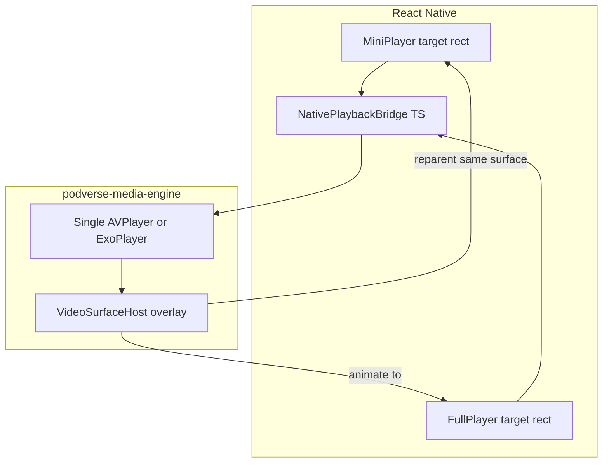

# Draft: Track 2 — Custom native media engine

**Do not use `react-native-track-player`.** This track defines a first-party Podverse media engine
with native iOS (AVPlayer + AVAudioSession) and Android (Media3 ExoPlayer) implementations, plus a JS
bridge contract consumed by `@podverse/playback-core` policy.

Reference:
[DOCS-MOBILE-PROCESS-PLAYBACK-QUEUE-PARITY.md](/docs/proposals/mobile/app-development-process/DOCS-MOBILE-PROCESS-PLAYBACK-QUEUE-PARITY.md),
[DOCS-MOBILE-CARPLAY-ANDROID-AUTO.md](/docs/proposals/mobile/initial-decisions/DOCS-MOBILE-CARPLAY-ANDROID-AUTO.md)

## Seamless video architecture

One **persistent native video surface** owned by the media engine for the lifetime of a playback
session. Mini player and full player screens register **target layout rects** (x, y, width, height,
corner radius); the engine **reparents** the same native view between containers — no tear-down on
expand.

- iOS: `AVPlayerLayer` hosted in a native overlay view managed by the engine module.
- Android: `PlayerView` (Media3) or `SurfaceView` attached to a single ExoPlayer instance.
- RN screens render transparent placeholders; native module positions the surface above them.
- Audio-only items use the same engine without attaching a visible surface.

The old app recreated the video player on full-screen open — that pattern is **explicitly forbidden**.

## Track 2 — Custom native media engine

2.1. Create `apps/mobile/modules/podverse-media-engine/` native module scaffold (iOS + Android). Model: Opus 4.8. Detail: [080-media-engine-module-scaffold](/docs/proposals/mobile/_master-plan_/details/080-media-engine-module-scaffold.md) — _TBD_
2.2. Define TypeScript bridge interface `NativePlaybackBridge` mirroring web bridge surface API. Model: Opus 4.8. Detail: [081-native-playback-bridge-interface](/docs/proposals/mobile/_master-plan_/details/081-native-playback-bridge-interface.md) — _TBD_
2.3. Document bridge methods: load, play, pause, seek, setRate, getPosition, getDuration, destroy. Model: Opus 4.8. Detail: [082-bridge-method-contract](/docs/proposals/mobile/_master-plan_/details/082-bridge-method-contract.md) — _TBD_
2.4. Implement iOS Swift module wrapping AVPlayer for audio enclosure playback. Model: Opus 4.8. Detail: [083-ios-avplayer-audio](/docs/proposals/mobile/_master-plan_/details/083-ios-avplayer-audio.md) — _TBD_
2.5. Configure iOS AVAudioSession category `.playback` with background and interrupt handling. Model: Opus 4.8. Detail: [084-ios-audio-session-lifecycle](/docs/proposals/mobile/_master-plan_/details/084-ios-audio-session-lifecycle.md) — _TBD_
2.6. Wire iOS MPNowPlayingInfoCenter and MPRemoteCommandCenter for lock-screen controls. Model: Opus 4.8. Detail: [085-ios-now-playing-remote-commands](/docs/proposals/mobile/_master-plan_/details/085-ios-now-playing-remote-commands.md) — _TBD_
2.7. Implement Android Kotlin module with Media3 ExoPlayer for audio playback. Model: Opus 4.8. Detail: [086-android-exoplayer-audio](/docs/proposals/mobile/_master-plan_/details/086-android-exoplayer-audio.md) — _TBD_
2.8. Implement Android foreground MediaSessionService for background audio survival. Model: Opus 4.8. Detail: [087-android-foreground-media-service](/docs/proposals/mobile/_master-plan_/details/087-android-foreground-media-service.md) — _TBD_
2.9. Wire Android MediaSessionCompat/Media3 session for lock-screen and BT controls. Model: Opus 4.8. Detail: [088-android-media-session-controls](/docs/proposals/mobile/_master-plan_/details/088-android-media-session-controls.md) — _TBD_
2.10. Emit native events to JS: playbackState, progress, ended, error, stalled. Model: Opus 4.8. Detail: [089-native-to-js-events](/docs/proposals/mobile/_master-plan_/details/089-native-to-js-events.md) — _TBD_
2.11. Implement JS `NativePlaybackBridge` adapter calling the native module from RN hooks. Model: Opus 4.8. Detail: [090-js-bridge-adapter](/docs/proposals/mobile/_master-plan_/details/090-js-bridge-adapter.md) — _TBD_
2.12. Spike: verify background audio survives app background on iOS and Android. Model: Opus 4.8. Detail: [091-spike-background-audio](/docs/proposals/mobile/_master-plan_/details/091-spike-background-audio.md) — _TBD_
2.13. Spike: verify audio continues after app kill where OS policy allows (document limits). Model: Opus 4.8. Detail: [092-spike-audio-after-kill](/docs/proposals/mobile/_master-plan_/details/092-spike-audio-after-kill.md) — _TBD_
2.14. Add iOS video: single AVPlayer instance shared for audio+video items. Model: Opus 4.8. Detail: [093-ios-avplayer-video](/docs/proposals/mobile/_master-plan_/details/093-ios-avplayer-video.md) — _TBD_
2.15. Add Android video: single ExoPlayer instance with video surface support. Model: Opus 4.8. Detail: [094-android-exoplayer-video](/docs/proposals/mobile/_master-plan_/details/094-android-exoplayer-video.md) — _TBD_
2.16. Implement native **VideoSurfaceHost** overlay view (iOS) for persistent surface ownership. Model: Opus 4.8. Detail: [095-ios-video-surface-host](/docs/proposals/mobile/_master-plan_/details/095-ios-video-surface-host.md) — _TBD_
2.17. Implement native **VideoSurfaceHost** overlay view (Android) for persistent surface ownership. Model: Opus 4.8. Detail: [096-android-video-surface-host](/docs/proposals/mobile/_master-plan_/details/096-android-video-surface-host.md) — _TBD_
2.18. Add bridge API `attachVideoSurface(targetId, layoutRect)` for mini/full player targets. Model: Opus 4.8. Detail: [097-bridge-attach-video-surface](/docs/proposals/mobile/_master-plan_/details/097-bridge-attach-video-surface.md) — _TBD_
2.19. Add bridge API `animateVideoSurface(toTargetId, durationMs)` for mini↔full transition. Model: Opus 4.8. Detail: [098-bridge-animate-video-surface](/docs/proposals/mobile/_master-plan_/details/098-bridge-animate-video-surface.md) — _TBD_
2.20. Implement reparenting logic: same native view moves between registered layout targets. Model: Opus 4.8. Detail: [099-surface-reparent-implementation](/docs/proposals/mobile/_master-plan_/details/099-surface-reparent-implementation.md) — _TBD_
2.21. RN mini player registers `targetId=mini` rect updated on layout and keyboard events. Model: Opus 4.8. Detail: [100-rn-mini-player-surface-target](/docs/proposals/mobile/_master-plan_/details/100-rn-mini-player-surface-target.md) — _TBD_
2.22. RN full player registers `targetId=full` rect; expand triggers animate, not remount. Model: Opus 4.8. Detail: [101-rn-full-player-surface-target](/docs/proposals/mobile/_master-plan_/details/101-rn-full-player-surface-target.md) — _TBD_
2.23. Hide video surface when item is audio-only; show when `PlaybackTarget` is video kind. Model: Opus 4.8. Detail: [102-audio-only-hide-surface](/docs/proposals/mobile/_master-plan_/details/102-audio-only-hide-surface.md) — _TBD_
2.24. Handle orientation change by updating target rects without resetting player. Model: Opus 4.8. Detail: [103-orientation-surface-resize](/docs/proposals/mobile/_master-plan_/details/103-orientation-surface-resize.md) — _TBD_
2.25. Implement `loadAndStart` bridge method accepting enclosure URL and initial seek seconds. Model: Opus 4.8. Detail: [104-bridge-load-and-start](/docs/proposals/mobile/_master-plan_/details/104-bridge-load-and-start.md) — _TBD_
2.26. Support `file://` local paths for offline playback through same engine. Model: Opus 4.8. Detail: [105-engine-local-file-playback](/docs/proposals/mobile/_master-plan_/details/105-engine-local-file-playback.md) — _TBD_
2.27. Define error taxonomy and map native errors to `@podverse/helpers` playback error shapes. Model: Opus 4.8. Detail: [106-playback-error-mapping](/docs/proposals/mobile/_master-plan_/details/106-playback-error-mapping.md) — _TBD_
2.28. Add unit-testable pure TS layer for bridge command serialization (no native in Vitest). Model: Codex 5.3. Detail: [107-bridge-command-serialization-tests](/docs/proposals/mobile/_master-plan_/details/107-bridge-command-serialization-tests.md) — _TBD_
2.29. Document engine architecture in `apps/mobile/modules/podverse-media-engine/README.md`. Model: Codex 5.3. Detail: [108-media-engine-readme](/docs/proposals/mobile/_master-plan_/details/108-media-engine-readme.md) — _TBD_
2.30. Add abcmemory skill update: replace any track-player references with podverse-media-engine. Model: Codex 5.3. Detail: [109-abcmemory-no-track-player](/docs/proposals/mobile/_master-plan_/details/109-abcmemory-no-track-player.md) — _TBD_
2.31. Register non-FOSS deps used by engine (if any Google Play Services) in FOSS register doc stub. Model: Codex 5.3. Detail: [110-engine-fdroid-deps-register](/docs/proposals/mobile/_master-plan_/details/110-engine-fdroid-deps-register.md) — _TBD_
2.32. E2E: spike flow plays sample audio and captures lock-screen screenshot (manual/semi-auto). Model: Codex 5.3. Detail: [111-e2e-audio-spike-screenshot](/docs/proposals/mobile/_master-plan_/details/111-e2e-audio-spike-screenshot.md) — _TBD_
2.33. E2E: spike flow plays sample video mini→full transition without playback restart. Model: Opus 4.8. Detail: [112-e2e-video-transition-spike](/docs/proposals/mobile/_master-plan_/details/112-e2e-video-transition-spike.md) — _TBD_
2.34. Define go/no-go gate: engine spike must pass before Track 10/11 full player UI work. Model: Codex 5.3. Detail: [113-engine-spike-gate](/docs/proposals/mobile/_master-plan_/details/113-engine-spike-gate.md) — _TBD_
2.35. Export native cache write hooks from engine for queue snapshot (feeds Track 12 car layer). Model: Opus 4.8. Detail: [114-engine-native-cache-hooks](/docs/proposals/mobile/_master-plan_/details/114-engine-native-cache-hooks.md) — _TBD_
