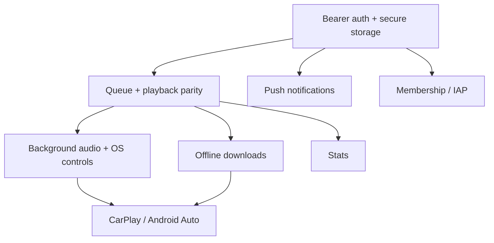
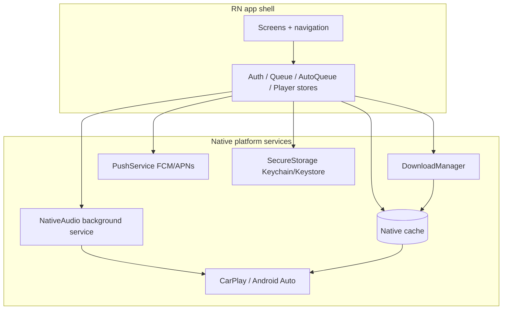

# Mobile-only features and platform differences

This document catalogs the **major categorical differences** between web and mobile — features the
mobile app must implement that the web app does not, or implements very differently. Read the
foundation first: [DOCS-MOBILE-PROCESS-OVERVIEW.md](DOCS-MOBILE-PROCESS-OVERVIEW.md) and the parity
matrix in [DOCS-MOBILE-PROCESS-SHARED-VS-DIVERGENT.md](DOCS-MOBILE-PROCESS-SHARED-VS-DIVERGENT.md).

Each category lists: web status, mobile requirement, recommended approach, API endpoints, and LLM
guidance.

## 1. Offline downloads and local playback

- **Web:** Browser download only — `apps/web/src/utils/fileDownloader.ts` and
  `apps/web/src/utils/downloadModal/`. No persistent app storage; playback streams enclosure URLs.
- **Mobile requirement:** Download episodes to app storage, track progress, play from local files
  offline, manage storage quota, and auto-delete policies.
- **Recommended approach:** A native **download job queue** (e.g. `react-native-blob-util` or Expo
  FileSystem + background downloads), a local **metadata DB** (SQLite/WatermelonDB/MMKV) tracking
  `item_id`, file path, size, status, and integration with the playback bridge so a downloaded item
  plays from `file://` instead of the enclosure URL.
- **API:** None new for the file itself (enclosure URLs come from item DTOs); reuse item/queue
  endpoints for metadata.
- **LLM guidance:** Do not reuse `fileDownloader.ts` (DOM `<a download>`); design a native module.
  The downloads index is also part of the **native car cache** (offline items must appear in
  CarPlay/Android Auto).

## 2. Background audio and OS media controls

- **Web:** `<audio>` element + Page Visibility; limited lock-screen control via the browser.
- **Mobile requirement:** True background audio (foreground service on Android, audio session on
  iOS), lock-screen + notification controls, Bluetooth/headset controls, audio focus/ducking.
- **Recommended approach:** `react-native-track-player` as the baseline (ships a native playback
  service + media session). Wrap it behind the `NativePlaybackBridge` (see
  [DOCS-MOBILE-PROCESS-PLAYBACK-QUEUE-PARITY.md](DOCS-MOBILE-PROCESS-PLAYBACK-QUEUE-PARITY.md)).
- **LLM guidance:** Background audio is a **prerequisite** for CarPlay/Android Auto; build/verify it
  first (survives app background and kill).

## 3. CarPlay and Android Auto

- **Web:** Not implemented.
- **Mobile requirement:** Browse + play from the car head unit **with the phone app closed**.
- **Recommended approach:** Native layer — iOS CarPlay scene (`CPTemplate`s) + Android Media3
  `MediaLibraryService` foreground service — reading a **native cache** the JS app writes. Full
  design: [DOCS-MOBILE-CARPLAY-ANDROID-AUTO.md](/docs/proposals/mobile/initial-decisions/DOCS-MOBILE-CARPLAY-ANDROID-AUTO.md).
- **Spike criteria:** verify browse + play with the app **closed** using the Android Desktop Head
  Unit (DHU) and the CarPlay simulator; confirm the native cache read-path works with no JS running.
- **LLM guidance:** Do **not** implement the car experience as JS-only `track-player` browsing — it
  fails when JS is suspended (the exact past failure mode).

## 4. Push notifications

- **Web:** Web Push — `apps/web/src/contexts/Notifications.tsx` + a service worker.
- **API (already exists):** `apps/api/src/routes/account.ts` registers devices for **FCM**
  (`/account/fcm-device/*`), **Web Push** (`/account/webpush-device/*`), and **UnifiedPush**
  (`/account/up-device/*`). Typed wrappers live in `packages/helpers-requests/src/api/account/`
  (`fcm/`, `webpush/`, `unifiedpush/`, `notification/`).
- **Mobile requirement:** FCM (Android) and APNs (iOS, typically via FCM) device registration +
  notification handling (new episodes, live).
- **Recommended approach:** Use the existing **FCM** device endpoints (`/account/fcm-device/create`,
  `update`, `delete`, `update-locale`); integrate `@react-native-firebase/messaging` or Expo
  notifications. UnifiedPush is available for de-Googled Android if desired.
- **LLM guidance:** Reuse the FCM wrappers; do **not** port the Web Push/service-worker path.

## 5. Secure auth token storage

- **Web:** HttpOnly `jwt` cookie.
- **Mobile requirement:** Store access + refresh tokens in Keychain (iOS) / Keystore (Android);
  rotate via `/auth/mobile/refresh`; revoke via `/auth/mobile/revoke`.
- **Recommended approach:** `expo-secure-store` or `react-native-keychain`; construct the API client
  with `AuthContext { mode: 'bearer', token }` (`@podverse/http-request-core`). See
  [API-CLIENT-BOUNDARIES.md](/docs/development/API-CLIENT-BOUNDARIES.md).
- **LLM guidance:** Never use cookies / `withCredentials`; never store tokens in AsyncStorage
  (use secure storage).

## 6. Deep linking and universal links

- **Web:** Next.js routes (`apps/web/src/constants/routes.ts`, `apps/web/src/app/`).
- **Mobile requirement:** Universal Links (iOS) / App Links (Android) mapping web URLs to native
  screens by resource id (`channel_id`, `item_id`, `playlist_id`, `clip` id), including cold-start
  handling (open the right screen when launched from a link).
- **Recommended approach:** Expo Linking / React Navigation linking config; mirror the web route
  shapes so shared URLs resolve on both platforms.
- **LLM guidance:** Keep the id-to-screen mapping aligned with web routes so links are portable.

## 7. Membership and payments

- **Web:** PayPal checkout — `apps/web/src/app/checkout/`, `apps/web/src/app/membership/`; API routes
  `paypal.ts`, `membershipClaimToken.ts`, `product/`.
- **Mobile requirement:** A store-compliant purchase path. Apple/Google generally require **IAP** for
  digital goods, though policies have specific carve-outs.
- **Recommended approach (phased for a small team):**
  1. **v1:** Membership claim/redeem + manage via in-app browser or existing PayPal flow where store
     policy allows (verify current rules).
  2. **Later:** Native IAP (StoreKit/Play Billing) with server-side **receipt verification** (new
     API endpoints) feeding the same membership state.
- **API:** Reuse membership/product endpoints; IAP will need new receipt-verification routes
  (flagged as a gap in [DOCS-MOBILE-PROCESS-SHARED-VS-DIVERGENT.md](DOCS-MOBILE-PROCESS-SHARED-VS-DIVERGENT.md)).
- **LLM guidance:** Do not assume PayPal-in-WebView passes review; confirm store policy before
  building.

## 8. Local settings and preferences

- **Web:** `localSettings` cookie — `apps/web/src/utils/localSettings/localSettings.ts` (theme,
  filter defaults, auto-queue shuffle/repeat `aqc.rd`/`aqc.rp`, preferred media type).
- **Mobile requirement:** On-device prefs store; sync playback prefs to the server when logged in.
- **Recommended approach:** MMKV or AsyncStorage; reconcile `preferred_media_type` and playback prefs
  with `account-settings` endpoints (`apps/api/src/routes/accountSettings.ts`) on login, mirroring the
  web `AccountProvider` reconciliation.
- **LLM guidance:** Same pref **keys/semantics** as web; different storage backend.

## 9. File system and permissions

- **Mobile requirement:** Storage permissions (Android scoped storage), iOS background modes
  (`audio`, background fetch) in `Info.plist`, notification permission prompts.
- **Recommended approach:** Configure via Expo config plugins during prebuild; request permissions
  contextually (e.g. notifications after a relevant action).
- **LLM guidance:** Permission/config changes are **native** (require a full store build, not OTA).

## 10. App lifecycle

- **Web:** SSR provides initial data; tab lifecycle is simple.
- **Mobile requirement:** Handle cold start, background, and killed-state resume; restore now-playing
  and queue on relaunch.
- **Recommended approach:** On launch, hydrate auth (secure storage) → fetch queues + abridged index
  → restore now-playing (server or anonymous snapshot). Refresh on app focus.
- **LLM guidance:** There is no SSR; replace `apps/web/src/app/layout.tsx` SSR bootstrap with an
  on-launch hydration sequence.

## 11. Analytics / stats

- **Web:** `reqStats*` calls (`apps/api/src/routes/stats.ts`, wrappers in
  `packages/helpers-requests/src/api/stats/`).
- **Mobile requirement:** Same play/page stats from native.
- **Recommended approach:** Reuse the same `reqStats*` wrappers; supply mobile client identifiers.
- **LLM guidance:** Identical endpoints — no new API.

## 12. Add-by-RSS on mobile

- **Web:** `apps/web/src/app/add-by-rss/` + `AddByRSSListContext`; add-by-rss queue resource types.
- **Mobile requirement:** Add an arbitrary RSS feed and play/queue its items.
- **Recommended approach:** Simplified native UX; reuse the same add-by-rss queue resource mutations
  and the `add-by-rss` `PlaybackTarget` kind (see playback parity doc).
- **LLM guidance:** Reuse the API mutations; the local add-by-rss list can mirror the web context's
  shape in RN state.

## Feature priority (v1 MVP)

| Feature                        | Priority | Rationale                              |
| ------------------------------ | -------- | -------------------------------------- |
| Bearer auth + secure storage   | P0       | Everything authenticated depends on it |
| Background audio + OS controls | P0       | Core podcast UX; prerequisite for car  |
| Queue + playback parity        | P0       | Core product                           |
| Stats                          | P0       | Low cost, reuse endpoints              |
| Local settings + prefs sync    | P1       | Consistency with web                   |
| Offline downloads              | P1       | Major mobile differentiator            |
| Push notifications (FCM)       | P1       | Engagement; API exists                 |
| Deep links                     | P1       | Sharing/retention                      |
| CarPlay / Android Auto         | P1       | High value; after background audio     |
| Add-by-RSS                     | P2       | Power-user feature                     |
| Membership / IAP               | P2       | Revenue; policy-sensitive, do later    |
| Livestream HLS                 | P2       | Deferred (separate effort)             |

## Dependencies between features

## LLM pitfalls

| Category         | Common mistake                      | Correct approach                  |
| ---------------- | ----------------------------------- | --------------------------------- |
| Downloads        | Reuse web `fileDownloader.ts`       | Native download module + local DB |
| Background audio | JS timers/intervals for playback    | Native service (`track-player`)   |
| CarPlay/Auto     | JS-only browse tree                 | Native services + native cache    |
| Push             | Port Web Push + service worker      | FCM device endpoints              |
| Auth             | Cookies / AsyncStorage for tokens   | Bearer + secure storage           |
| Settings         | New pref keys                       | Reuse web keys/semantics          |
| Membership       | Assume PayPal WebView passes review | Verify store policy; plan IAP     |
| Lifecycle        | Assume SSR-style initial data       | On-launch hydration               |

## Diagram: mobile platform services

