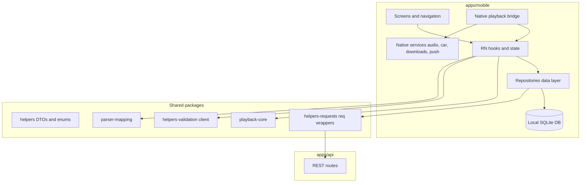
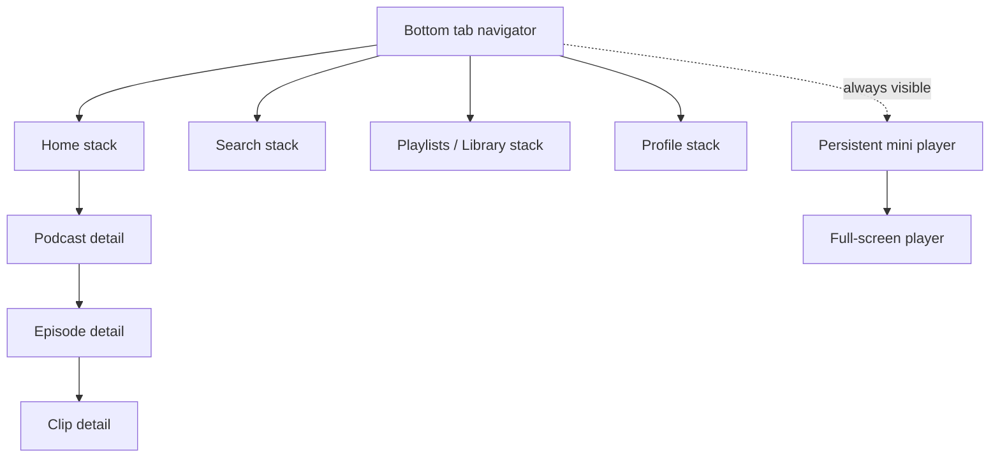

# Mobile app development process: overview and architecture

This is the foundational Track B document. It describes **how to build the Podverse mobile app by
using the mature web app as a reference implementation** — reusing the same API, DTOs, and
playback/queue semantics while building a native UX where the platform requires it.

The sibling Track B docs build on this one:
[shared-vs-divergent](DOCS-MOBILE-PROCESS-SHARED-VS-DIVERGENT.md),
[playback-queue-parity](DOCS-MOBILE-PROCESS-PLAYBACK-QUEUE-PARITY.md),
[mobile-only-features](DOCS-MOBILE-PROCESS-MOBILE-ONLY-FEATURES.md),
[visual-parity](DOCS-MOBILE-PROCESS-VISUAL-PARITY.md),
[roadmap](DOCS-MOBILE-PROCESS-ROADMAP.md). Tooling/setup lives in the Track A docs under
[monorepo-llm-setup](/docs/proposals/mobile/monorepo-llm-setup/DOCS-MOBILE-MONOREPO-CURRENT-STATE.md).
Offline data layer decision:
[DOCS-MOBILE-DATA-LAYER-OFFLINE.md](/docs/proposals/mobile/initial-decisions/DOCS-MOBILE-DATA-LAYER-OFFLINE.md).

## 1. Purpose and principles

- **Same backend, same contracts.** Mobile calls the **same** `apps/api` REST endpoints via the
  same typed `@podverse/helpers-requests` `req*` wrappers and the same DTOs from `@podverse/helpers`.
  No mobile-specific API fork.
- **Same semantics, native shell.** Playback, queue, auto-queue, and playlist _behavior_ match web;
  the _transport_ (audio engine), _storage_, and _UI_ are native.
- **Web as instructive reference, not copy-paste.** Read web hooks/contexts to learn the data flow
  and decisions; do **not** port `@podverse/ui` components or SCSS.
- **Bearer auth, secure storage.** Mobile authenticates with bearer tokens, not cookies (see
  [API-CLIENT-BOUNDARIES.md](/docs/development/API-CLIENT-BOUNDARIES.md)).
- **Offline-first data.** Screens and hooks read through **repositories** backed by a local DB;
  the API syncs in the background. See
  [DOCS-MOBILE-DATA-LAYER-OFFLINE.md](/docs/proposals/mobile/initial-decisions/DOCS-MOBILE-DATA-LAYER-OFFLINE.md).
- **Add-by-RSS: server-side parse, client-side mapping.** Neither web nor mobile parses RSS XML in
  the client. Both call `POST /account/add-by-rss/parse` and poll status; a worker runs
  `@podverse/parser`. Clients then map with `@podverse/parser-mapping` (browser/mobile-safe) and
  store locally (web: IndexedDB; mobile: offline DB). Do not import `@podverse/parser` in mobile.

## 2. Assumed stack

- **React Native + Expo (prebuild / dev client)** — decision in
  [initial-decisions/DOCS-MOBILE-FRAMEWORK-REACT-NATIVE.md](/docs/proposals/mobile/initial-decisions/DOCS-MOBILE-FRAMEWORK-REACT-NATIVE.md).
- **API client:** `@podverse/helpers-requests` with `AuthContext { mode: 'bearer' }` from
  `@podverse/http-request-core`.
- **Playback policy:** `@podverse/playback-core` (proposed extraction — see
  [DOCS-MOBILE-MONOREPO-TARGET-STRUCTURE.md](/docs/proposals/mobile/monorepo-llm-setup/DOCS-MOBILE-MONOREPO-TARGET-STRUCTURE.md)).
- **Audio + car:** native background service + CarPlay/Android Auto layer
  ([DOCS-MOBILE-CARPLAY-ANDROID-AUTO.md](/docs/proposals/mobile/initial-decisions/DOCS-MOBILE-CARPLAY-ANDROID-AUTO.md)).

## 3. Layered architecture

## 4. Web as reference map

When implementing a mobile area, read these web files for **behavior and data loading** (not UI):

| Web area             | Mobile equivalent         | Primary web files to read                                                    |
| -------------------- | ------------------------- | ---------------------------------------------------------------------------- |
| Provider tree        | RN state providers        | `apps/web/src/providers/Providers.tsx`                                       |
| Account/session      | Auth + account store      | `apps/web/src/contexts/Account.tsx`                                          |
| Queue                | Queue store               | `apps/web/src/contexts/Queue.tsx`                                            |
| Auto-queue           | Auto-queue store          | `apps/web/src/contexts/AutoQueue.tsx`, `hooks/useAutoQueueLoadResources.tsx` |
| Media player state   | Player store              | `apps/web/src/contexts/MediaPlayer.tsx`                                      |
| Playback policy      | `@podverse/playback-core` | `apps/web/src/lib/playback/`                                                 |
| Resource load action | Play action hook          | `apps/web/src/hooks/useMediaPlayerResourceUpdate.tsx`                        |
| API client           | Same client (bearer)      | `packages/helpers-requests/src/api/_request.ts`                              |
| Local settings       | Device prefs              | `apps/web/src/utils/localSettings/`                                          |

## 5. Screen / route map

Web routes live under `apps/web/src/app/` (e.g. `podcast/`, `episode/`, `search/`, `playlists/`,
`playlist/`, `profile/`, `my-profile/`, `queues/`, `history/`, plus `album/`, `artist/`, `clip/`,
`add-by-rss/`). Proposed mobile screen mapping:

| Web route                      | Mobile screen                | Primary data sources                             | Web source reference                                                                                                   |
| ------------------------------ | ---------------------------- | ------------------------------------------------ | ---------------------------------------------------------------------------------------------------------------------- |
| `/` (home)                     | Home / Subscriptions         | `reqChannelGetMany` (subscribed)                 | `apps/web/src/app/page.tsx`, `apps/web/src/components/List`                                                            |
| `/podcast/[channel_id]`        | Podcast detail               | channel + `reqItemGetManyByChannel` + live items | `apps/web/src/app/podcast/[podcast_id]/PodcastPageClient.tsx`                                                          |
| `/episode/[item_id]`           | Episode detail               | item + chapter/soundbite/clip/transcript tabs    | `apps/web/src/app/episode/[episode_id]/EpisodePageClient.tsx`                                                          |
| `/album/[id]`, `/artist/[id]`  | Album / Artist               | music channel + items                            | `apps/web/src/app/album/[album_id]/AlbumPageClient.tsx`, `apps/web/src/app/artist/[artist_id]/ArtistPageClient.tsx`    |
| `/search`                      | Search                       | `reqPodcastIndexSearchPodcasts`                  | `apps/web/src/app/search/SearchPageClient.tsx`                                                                         |
| `/playlists`, `/playlist/[id]` | Playlists / Playlist         | `reqPlaylistGetMany`, playlist resources         | `apps/web/src/app/playlists/PlaylistsPageClient.tsx`, `apps/web/src/app/playlist/[playlist_id]/PlaylistPageClient.tsx` |
| `/profile/[id]`, `/my-profile` | Profile                      | `reqProfile*` / `reqMyProfile*`                  | `apps/web/src/app/profile/[profile_id]/ProfilePageClient.tsx`, `apps/web/src/app/my-profile/MyProfilePageClient.tsx`   |
| `/queues`                      | Queue                        | `reqQueue*` now-playing + upcoming               | `apps/web/src/app/queues/QueuesPageClient.tsx`                                                                         |
| `/history`                     | History                      | history-paginated queue resources                | `apps/web/src/app/history/HistoryPageClient.tsx`                                                                       |
| `/clip/[id]`, `/my-clips`      | Clip detail / My clips       | `reqClip*`                                       | `apps/web/src/app/clip/[clip_id]/ClipPageClient.tsx`, `apps/web/src/app/my-clips/MyClipsPageClient.tsx`                |
| `/add-by-rss`                  | Add-by-RSS                   | parse/poll APIs + parser-mapping + local DB  | `apps/web/src/app/add-by-rss/**`, `apps/web/src/components/AddByRSS/**`                                                |
| Global player                  | Mini player + full player    | queue + auto-queue + playback policy             | `apps/web/src/components/MediaPlayer/**`                                                                               |
| `/settings`                    | Settings                     | account-settings APIs                            | `apps/web/src/app/settings/**`                                                                                         |
| `/checkout`, `/membership`     | Membership (native strategy) | membership/PayPal APIs                           | `apps/web/src/app/membership/**`                                                                                       |

Exact per-page API calls are catalogued in
[DOCS-MOBILE-PROCESS-SHARED-VS-DIVERGENT.md](DOCS-MOBILE-PROCESS-SHARED-VS-DIVERGENT.md) and
[DOCS-MOBILE-PROCESS-PLAYBACK-QUEUE-PARITY.md](DOCS-MOBILE-PROCESS-PLAYBACK-QUEUE-PARITY.md).

## 6. Navigation model

**Recommendation: a bottom tab navigator with nested stacks**, the standard podcast-app pattern.

- **Tabs:** Home (subscriptions), Search, Playlists/Library, Profile, (optionally Downloads).
- **Stacks within tabs:** push podcast → episode → clip detail.
- **Global player:** a persistent mini-player above the tab bar that expands to a full-screen player
  (modal/stack), mirroring the web player's always-present nature in `Providers.tsx`.
- **Rationale:** matches platform conventions, keeps the player reachable from every screen, and maps
  cleanly onto the web route hierarchy.

## 7. State management

Mirror the web provider boundaries (`apps/web/src/providers/Providers.tsx`) at a high level. Web
nests, in order: `Config → LocalSettings → Account → Notifications → Queues →
QueueResourcesAbridgedIndex → PlaylistsLikes → MediaPlayerCurrentTime → MediaPlayer →
MediaPlayerVideo → MediaPlayerControls → AddByRSSList → AutoQueue → Modals → Categories`.

Mobile equivalents (React Context or Zustand — recommend **Zustand** for cross-screen player/queue
state with less re-render churn):

| Web provider                          | Mobile store | Notes                            |
| ------------------------------------- | ------------ | -------------------------------- |
| `AccountProvider`                     | auth/account | bearer token from secure storage |
| `LocalSettingsProvider`               | device prefs | AsyncStorage/MMKV, not cookie    |
| `QueuesProvider`                      | queue        | hydrate on launch (no SSR)       |
| `QueueResourcesAbridgedIndexProvider` | resume index | fetch on launch instead of SSR   |
| `AutoQueueProvider`                   | auto-queue   | client-only prefetch buffer      |
| `MediaPlayer*Provider`                | player       | drives native bridge             |

Key difference: web hydrates several stores via **SSR** in `apps/web/src/app/layout.tsx`; mobile
fetches the same data on **app launch** and refreshes on focus/pull-to-refresh.

## 8. Auth flow (mobile)

Web uses an HttpOnly `jwt` cookie; mobile uses bearer tokens. The API already exposes mobile routes
in `apps/api/src/routes/auth.ts`:

- `POST /auth/mobile/token` — issue access + refresh tokens (`issueMobileToken`)
- `POST /auth/mobile/refresh` — rotate (`refreshMobileToken`)
- `POST /auth/mobile/revoke` — revoke (`revokeMobileToken`)
- `GET /auth/me`, `GET /auth/check-session` — shared session checks

Construct the client with `AuthContext { mode: 'bearer', token }` (see
`packages/helpers-requests/src/api/_request.ts` and
[API-CLIENT-BOUNDARIES.md](/docs/development/API-CLIENT-BOUNDARIES.md)). Store access/refresh tokens
in Keychain/Keystore; never cookies, never `withCredentials`.

## 9. Out of scope for v1 (proposed)

- **Embed mode** (`apps/web/src/app/embed/`) — web-only chromeless player.
- **management-web / management-api** — admin surface, not consumer mobile.
- **Workers** — server-side; mobile never imports them.
- **Livestream HLS parity** — web uses `video.js`; defer native HLS (track separately, like the web
  livestream HLS migration plan).

## 10. Sibling Track B docs

- [DOCS-MOBILE-PROCESS-SHARED-VS-DIVERGENT.md](DOCS-MOBILE-PROCESS-SHARED-VS-DIVERGENT.md)
- [DOCS-MOBILE-PROCESS-PLAYBACK-QUEUE-PARITY.md](DOCS-MOBILE-PROCESS-PLAYBACK-QUEUE-PARITY.md)
- [DOCS-MOBILE-PROCESS-MOBILE-ONLY-FEATURES.md](DOCS-MOBILE-PROCESS-MOBILE-ONLY-FEATURES.md)
- [DOCS-MOBILE-PROCESS-VISUAL-PARITY.md](DOCS-MOBILE-PROCESS-VISUAL-PARITY.md)
- [DOCS-MOBILE-PROCESS-ROADMAP.md](DOCS-MOBILE-PROCESS-ROADMAP.md)

## Consistency rules (data + add-by-RSS)

When implementing mobile screens or hooks:

1. **Read through repositories**, not `req*` directly from screens. Repositories own local DB reads
   and background API sync
   ([DOCS-MOBILE-DATA-LAYER-OFFLINE.md](/docs/proposals/mobile/initial-decisions/DOCS-MOBILE-DATA-LAYER-OFFLINE.md)).
2. **Add-by-RSS:** server parse + poll only; map with `@podverse/parser-mapping`; never parse XML
   in the app; never import `@podverse/parser`.
3. **Visual:** prefer shared RN primitives (`Card`, `ListRow`, …) + design tokens; defer pixel
   polish to a later phase
   ([DOCS-MOBILE-PROCESS-VISUAL-PARITY.md](DOCS-MOBILE-PROCESS-VISUAL-PARITY.md)).

## 11. Track A (tooling) references

- [DOCS-MOBILE-MONOREPO-CURRENT-STATE.md](/docs/proposals/mobile/monorepo-llm-setup/DOCS-MOBILE-MONOREPO-CURRENT-STATE.md)
- [DOCS-MOBILE-MONOREPO-TARGET-STRUCTURE.md](/docs/proposals/mobile/monorepo-llm-setup/DOCS-MOBILE-MONOREPO-TARGET-STRUCTURE.md)
- [DOCS-MOBILE-LLM-CURSOR-SETUP.md](/docs/proposals/mobile/monorepo-llm-setup/DOCS-MOBILE-LLM-CURSOR-SETUP.md)
- [DOCS-MOBILE-DATA-LAYER-OFFLINE.md](/docs/proposals/mobile/initial-decisions/DOCS-MOBILE-DATA-LAYER-OFFLINE.md)
