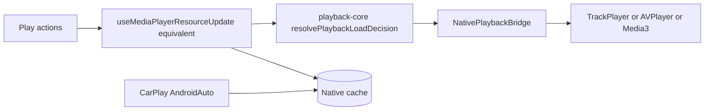
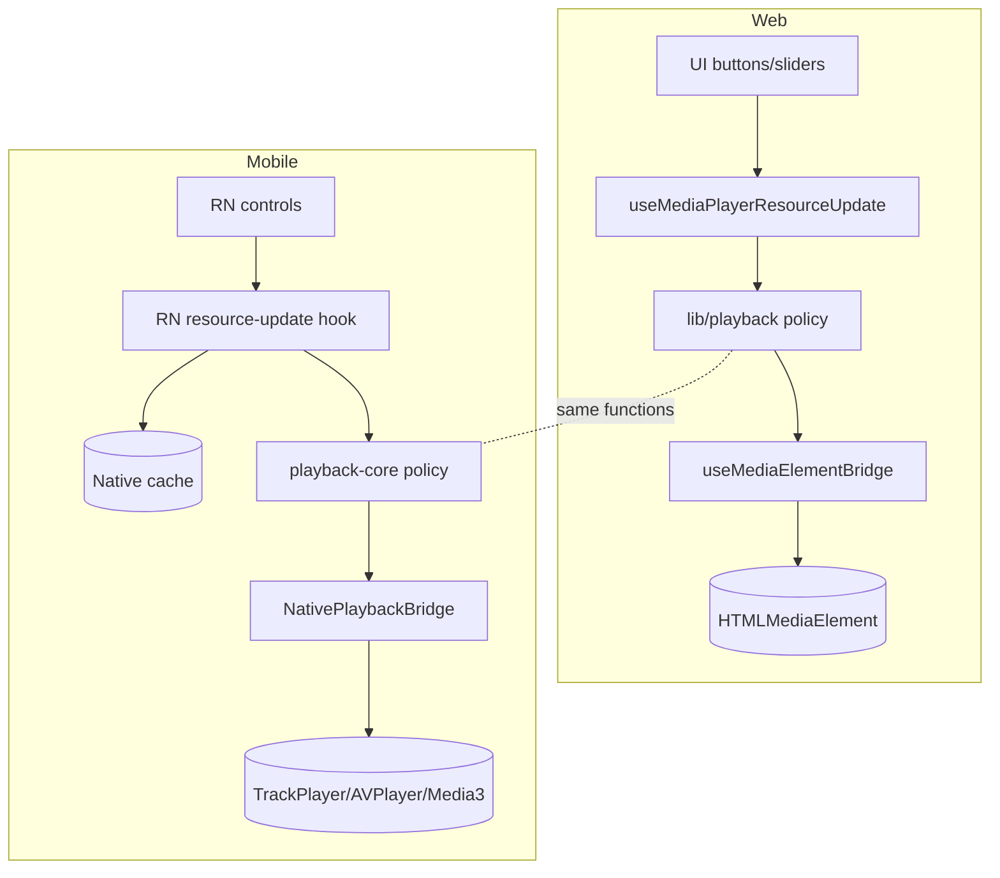
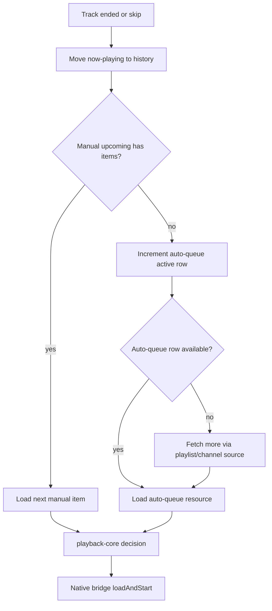

# Playback, queue, auto-queue, and playlist parity

This is the deep-dive proposal for mirroring Podverse web's most sophisticated product areas —
playback policy, manual queue, auto-queue, and playlist-driven play — on mobile. Read the foundation
first: [DOCS-MOBILE-PROCESS-OVERVIEW.md](DOCS-MOBILE-PROCESS-OVERVIEW.md) and the parity matrix in
[DOCS-MOBILE-PROCESS-SHARED-VS-DIVERGENT.md](DOCS-MOBILE-PROCESS-SHARED-VS-DIVERGENT.md).

## 1. Executive summary

- **Reuse the pure policy.** The web playback **decision engine** is platform-agnostic and should be
  extracted to `@podverse/playback-core` (see
  [DOCS-MOBILE-MONOREPO-TARGET-STRUCTURE.md](/docs/proposals/mobile/monorepo-llm-setup/DOCS-MOBILE-MONOREPO-TARGET-STRUCTURE.md)).
- **Reuse the same API sequences.** Manual queue and auto-queue call the **same** `req*` wrappers and
  endpoints as web.
- **Replace only the transport.** Swap the DOM `useMediaElementBridge` for a **native** audio bridge,
  and feed a **native cache** so CarPlay/Android Auto work with the app closed.

## 2. Web architecture recap (cited)

Per [media-player-architecture SKILL](/.cursor/skills/media-player-architecture/SKILL.md), non-live
playback is layered:

| Layer | Location | Role |
| --- | --- | --- |
| Policy (pure) | `apps/web/src/lib/playback/` | Seek/resume/auto-play/pause-at decisions |
| Bridge (DOM) | `apps/web/src/hooks/useMediaElementBridge.ts`, `mediaElementBridgeSurface.ts` | Only place that touches `HTMLMediaElement` |
| Controls | `apps/web/src/contexts/MediaPlayerControls.tsx` (`useMediaPlayerControls`) | UI → bridge; `seek`, `jumpBy`, `pauseAt`, `loadAndStart` |
| Orchestration | `NonLiveMediaOrchestrator`, `NonLiveMediaMount` | Ended/next/history, stats, queue advance |
| State | `apps/web/src/contexts/MediaPlayer.tsx` (`applyPlaybackLoad`) | Now-playing DTOs, pending decision |
| Decision contract | `apps/web/src/components/MediaPlayer/MEDIA-PLAYER-DECISION-MATRIX.md` | Documented decision matrix |

The architecture deliberately isolates **pure policy** from the **DOM bridge** — which is exactly
what makes mobile reuse feasible.

## 3. Mobile target architecture

The mobile hook layer and native bridge are new; the **policy** is shared.

## 4. `packages/playback-core` role

| Moves to `playback-core` | Stays in `apps/web` | New in `apps/mobile` |
| --- | --- | --- |
| `resolvePlaybackLoadDecision.ts` + types | `useMediaElementBridge` (DOM) | Native playback bridge |
| `playbackTarget.ts`, `playbackLoadRequest.ts` | `MediaPlayerControls` context | RN controls/store |
| `resumeSeekFromAbridged.ts`, `clampNearEndSeconds.ts` | `NonLiveMediaMount` (portal) | RN player UI |
| `combineQueueNowPlayingAndUpcoming.ts` | orchestrator DOM binding | RN orchestration hook |
| enclosure-switch decision helpers | `parsePlaybackSeconds` wiring | — |

Both clients call the **same** decision functions; only the binding to a media engine differs.

## 5. Playback policy parity checklist

The policy is keyed on `PlaybackTarget.kind` (from
`apps/web/src/lib/playback/playbackTarget.ts`). Mobile must handle every variant identically:

| `PlaybackTarget.kind` | Meaning | Mobile handling |
| --- | --- | --- |
| `item-podcast` | Standard podcast episode | Resume from abridged position; auto-play per policy |
| `item-video` | Video episode | Same resume; native video surface |
| `item-music` | Music track (with `intent`) | Music forces `currentTime = 0`; honor `session_restore`/`explicit_play`/`fresh_transition` |
| `clip` | Clip within an item | Start at clip start; `pauseAt` clip end |
| `soundbite` | Soundbite | Start/`pauseAt` soundbite bounds |
| `chapter` | Chapter | Seek to chapter start |
| `add-by-rss` | Ad-hoc RSS resource | Load from `AddByRSSResourceData`; no server queue id |
| `livestream` | Live | Deferred (native HLS, separate effort) |

The `intent` discriminator (`MusicItemPlaybackIntent`) must be preserved for stats/side effects, per
the decision matrix doc.

## 6. Manual queue parity

Server endpoints live in `apps/api/src/routes/queue.ts`; typed wrappers in
`packages/helpers-requests/src/api/queue/` (`queue.ts`, `queueResource/`). Web hooks:

- `useQueueResourcesLoadActive.tsx` — resolve active queue by medium, fetch now-playing + upcoming
- `useQueueResourceUpdateNowPlaying.tsx` — POST now-playing + update abridged index + anon snapshot
- `useQueueResourceMoveNowPlayingToHistory.tsx` — move completed/skipped item to history
- `useMediaPlayerControllerQueueHeadLoading.ts` — react to queue head / auto-queue row changes
- `combineQueueNowPlayingAndUpcoming` (`apps/web/src/lib/queue/`) — merge now-playing + upcoming

**Mobile flow (parallel):**

1. On launch, fetch all queues + abridged index (same wrappers web uses in SSR).
2. Resolve the active queue by `medium_id` (reuse `getQueueForMedium` from `@podverse/helpers`).
3. Load now-playing + upcoming via the same `queueResource` wrappers.
4. On play action → run `playback-core` decision → native bridge `loadAndStart`.
5. On add-to-queue (next/last) → same POST wrappers; update local queue store.
6. On ended/skip → move now-playing to history (same wrapper), advance head.

## 7. Abridged index / resume

Web builds a `QueueResourcesAbridgedIndex` (positions/durations for resume) — bootstrapped via SSR
in `apps/web/src/app/layout.tsx` (`reqQueueResourcesGetAllByAccountAbridged`), then kept current by
`useQueueResourcesAbridgedIndexLoad.tsx` / `useQueueResourcesAbridgedIndexUpdate.tsx`. Resume seek is
computed by `resumeSeekFromAbridged` (moving to `playback-core`).

**Mobile:** fetch the abridged index **on app launch** (no SSR), keep it in the queue store, and
update it on now-playing changes — same DTO shape, same resume math.

## 8. Auto-queue parity

Auto-queue is a **client-only prefetch buffer** — `apps/web/src/contexts/AutoQueue.tsx` +
`apps/web/src/hooks/useAutoQueueLoadResources.tsx`. Sources:

- **Playlist mode** (`autoQueueConfig.playlist_id_text` set):
  - Sequential: `reqPlaylistResourceGetManyForQueueByListPosition`
  - Random: `reqPlaylistResourceGetManyByShuffle`
- **Channel mode** (no playlist):
  - Podcast: `reqItemGetManyForQueueByPubDate(item_id_text, 'forward')`
  - Music album: `reqItemGetManyForQueueBySeason`
  - Random: `reqItemGetManyByChannelShuffle`

Repeat/shuffle prefs persist to the web cookie as `aqc.rd` / `aqc.rp`; **mobile stores these in
device prefs** (AsyncStorage/MMKV). Row 0 is the current item; later rows are prefetched. Advance on
ended is driven by the orchestrator → `queueResourcesLoadActive` → if manual upcoming is empty,
increment the auto-queue active row and load the next resource.

**Mobile:** replicate the same source logic and `req*` calls; replace cookie prefs with device prefs;
drive advance from the native bridge's "ended" event into the same load path.

## 9. Playlist integration

Playing from a playlist row seeds the auto-queue config (`playlist_id_text` + shuffle/repeat). Web
list rows (e.g. `CommonEpisodeListRow`) call `reqQueueResourceItemAddNext` / `...AddLast` and pass a
`newAutoQueueConfig`. Playlist pages live under `apps/web/src/app/playlist/` and `playlists/`; wrappers
in `packages/helpers-requests/src/api/playlist/` (`playlist.ts`, `playlistResource/`).

**Mobile:** a playlist row's play action seeds the same auto-queue config and calls the same queue
wrappers; the native UI differs, the behavior matches.

## 10. Anonymous playback

Web persists an anonymous now-playing snapshot to `localStorage` (consent-gated) via
`apps/web/src/utils/anonymousPlaybackStorage.ts`. The snapshot shape is portable.

**Mobile:** persist the same snapshot to secure/async storage so anonymous users get resume behavior;
reconcile to the server queue on login.

## 11. Native car layer (summary)

CarPlay and Android Auto must work when the JS app is suspended or closed. The native services read a
**native cache** (queue, downloads, library index) that the JS side writes whenever queue/library
state changes. Full design:
[DOCS-MOBILE-CARPLAY-ANDROID-AUTO.md](/docs/proposals/mobile/initial-decisions/DOCS-MOBILE-CARPLAY-ANDROID-AUTO.md).
The JS write-path is the auto-queue/queue store from sections 6–8; the read-path is native.

## 12. Testing parity

- **Unit:** move the web policy tests with `playback-core` (`apps/web/src/lib/playback/__tests__/`,
  `apps/web/src/lib/queue/__tests__/`); they validate decisions independent of platform.
- **API integration:** the queue/playlist endpoints already have API coverage; mobile reuses the
  same server, so no new API tests are required for reuse.
- **Mobile E2E:** Maestro/Detox flows mirroring web E2E areas (`apps/web/e2e/media-player-*.spec.ts`
  as **reference**, not reuse): play, resume, queue add/next, auto-queue advance, playlist play.

## 13. Known deferrals

- **Livestream HLS:** web uses `video.js` (`MediaPlayerControllerLiveStream*`); native HLS is a
  separate effort (parallels the web livestream HLS migration).
- **Embed mode:** web-only chromeless player; out of scope for mobile.

## Diagram: web vs mobile playback stack

## Diagram: queue + auto-queue on ended/skip

