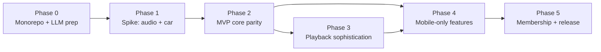
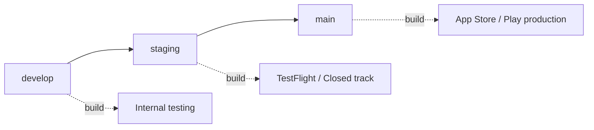

# Mobile development roadmap and milestones

> **Executive summary.** Build the Podverse mobile app as **one React Native (Expo prebuild) app** in
> the existing monorepo, reusing the web app's API, DTOs, and playback/queue semantics while adding a
> **thin native layer** for background audio and CarPlay/Android Auto. De-risk first: prove native
> background audio + car-with-app-closed in an early spike before committing to the full MVP. Then
> reach **parity with web core flows**, layer in **playback sophistication**, add **mobile-only
> features** (offline, push, deep links, car polish), and finish with **membership/growth** and store
> release. This document is the entry point for "how we build mobile" once all proposals exist.

This roadmap synthesizes Track A (monorepo/LLM setup) and Track B (process docs). See the
[index](#index-of-proposal-docs) at the bottom for all referenced documents.

## 1. Roadmap principles

- **Prove the riskiest pieces first.** The historical failure mode was CarPlay/Android Auto requiring
  the app to be open. Validate native background audio + car-with-app-closed **before** building
  breadth.
- **Parity before edge features.** Match web's core flows (auth, browse, queue, play) before
  downloads, push, or membership.
- **API backward compatibility.** Old app versions linger in the wild; API changes must stay
  backward-compatible. Reuse existing endpoints; add, don't break.
- **Shared semantics, native shell.** Reuse `@podverse/helpers*` DTOs and request wrappers; isolate
  platform code behind bridges (see
  [DOCS-MOBILE-PROCESS-SHARED-VS-DIVERGENT.md](DOCS-MOBILE-PROCESS-SHARED-VS-DIVERGENT.md)).

## 2. Phase 0 — Monorepo and LLM prep (no user-facing app)

Apply Track A recommendations so the repo and Cursor are ready before any app code.

- [ ] `.cursorignore` additions for native build artifacts (see
      [DOCS-MOBILE-LLM-CURSOR-SETUP.md](/docs/proposals/mobile/monorepo-llm-setup/DOCS-MOBILE-LLM-CURSOR-SETUP.md)).
- [ ] `apps/mobile/AGENTS.md` + `apps/mobile/APPS-MOBILE.md` stubs.
- [ ] Tier D import-specifier docs for `apps/mobile/**`
      ([DOCS-MOBILE-MONOREPO-TARGET-STRUCTURE.md](/docs/proposals/mobile/monorepo-llm-setup/DOCS-MOBILE-MONOREPO-TARGET-STRUCTURE.md)).
- [ ] Cursor rules + `mobile-playback` skill drafts.
- [ ] **Optional but recommended:** extract `packages/playback-core` (pure policy) per doc 02 so
      playback logic is reusable before mobile consumes it.

**Exit:** Cursor scopes mobile correctly; agents have guidance; no native artifacts pollute context.

## 3. Phase 1 — Spike / technical proof

A throwaway-grade proof that the hard native pieces work. **This phase gates everything else.**

- [ ] Expo **prebuild** skeleton at `apps/mobile` (dev client).
- [ ] **Bearer auth** to the API against dev/test env (`/auth/mobile/*`, `AuthContext` bearer mode).
- [ ] **Background audio** survives app background **and** kill (`react-native-track-player`).
- [ ] **Android Auto** (DHU) + **CarPlay** (simulator) minimal browse/play **with the app closed** —
      see the spike list in
      [DOCS-MOBILE-CARPLAY-ANDROID-AUTO.md](/docs/proposals/mobile/initial-decisions/DOCS-MOBILE-CARPLAY-ANDROID-AUTO.md).

**Go/no-go:** If car-with-app-closed works via the native services + native cache approach, proceed.
If not, revisit the framework decision before investing in the MVP.

## 4. Phase 2 — MVP core (parity with web essentials)

Match the web app's everyday flows. Per-screen acceptance: data loads from the same endpoints, UI
states (loading/empty/error) match web semantics.

- [ ] Auth (login, signup, logout, refresh, secure storage).
- [ ] Home / subscriptions, podcast (channel) page, episode (item) page, search.
- [ ] **Manual queue** + play + mini player (queue parity per
      [DOCS-MOBILE-PROCESS-PLAYBACK-QUEUE-PARITY.md](DOCS-MOBILE-PROCESS-PLAYBACK-QUEUE-PARITY.md)).
- [ ] Stats (`reqStats*`) and account-settings sync.

**Exit:** A logged-in user can browse, search, queue, and play in the foreground/background with
lock-screen controls.

## 5. Phase 3 — Playback sophistication

- [ ] Full playback policy via `packages/playback-core` (all `PlaybackTarget.kind` variants).
- [ ] Auto-queue (playlist-driven), playlists, history.
- [ ] Clips, chapters, soundbites — matching what web supports.

**Exit:** Playback behavior is indistinguishable from web in decision-making (only the bridge differs).

## 6. Phase 4 — Mobile-only features

See [DOCS-MOBILE-PROCESS-MOBILE-ONLY-FEATURES.md](DOCS-MOBILE-PROCESS-MOBILE-ONLY-FEATURES.md).

- [ ] Offline downloads (job queue + local metadata DB + play from `file://`; feeds the car cache).
- [ ] Push notifications via existing **FCM** device endpoints.
- [ ] Deep links / universal links mapped to screens by resource id.
- [ ] CarPlay / Android Auto polish (offline items, now-playing, browse depth).

**Exit:** Offline listening + notifications + sharing work; car experience is production-grade.

## 7. Phase 5 — Membership and growth

- [ ] PayPal vs **IAP** strategy (store-policy-driven; likely IAP + server receipt verification).
- [ ] V4V boosts on mobile (where store-compliant).
- [ ] Store release: internal → TestFlight/Closed → production, mapped to develop → staging → main per
      [DOCS-MOBILE-VERSIONING-RELEASE.md](/docs/proposals/mobile/initial-decisions/DOCS-MOBILE-VERSIONING-RELEASE.md).

**Exit:** App is in the stores with a sustainable release train.

## 8. Testing strategy by phase

| Phase | Unit                              | API integration      | E2E (device)                  |
| ----- | --------------------------------- | -------------------- | ----------------------------- |
| 0     | `playback-core` policy (pure fns) | unchanged            | —                             |
| 1     | spike-level                       | reuse existing       | manual (DHU/simulator)        |
| 2     | stores/reducers                   | unchanged            | Maestro/Detox smoke           |
| 3     | full policy matrix                | unchanged            | Maestro/Detox playback        |
| 4     | download/queue logic              | FCM routes covered   | Maestro/Detox offline + links |
| 5     | purchase/state logic              | receipt verify (new) | store-build smoke             |

- **Unit:** Vitest for `playback-core` and pure logic (no DOM/native).
- **API integration:** unchanged Vitest API suites; mobile reuses endpoints.
- **Device E2E:** **Maestro** (simpler) or **Detox**; pick one in Phase 2.
- **Explicitly not Playwright** — Playwright is web-only; do not target the RN app with it.

## 9. Team / LLM workflow by phase

| Phase | Docs/files agents should load                                         |
| ----- | --------------------------------------------------------------------- |
| 0     | Track A docs; `.cursorignore`; root `AGENTS.md`                       |
| 1     | Car doc (initial-decisions); overview; auth boundaries                |
| 2     | Overview + shared-vs-divergent; web routes/providers being mirrored   |
| 3     | Playback-queue parity doc; `playback-core`; web playback policy files |
| 4     | Mobile-only-features doc; web Notifications/downloads/localSettings   |
| 5     | Versioning/release doc; web checkout/membership                       |

- Break each phase into **COPY-PASTA** task sets under `.llm/plans/active/` (one screen or one bridge
  per prompt), mirroring this plan set's convention.
- Keep native (car/audio) and RN UI as **parallel workstreams** with a stable bridge contract between
  them.

## 10. Timeline guidance (small team, order-of-magnitude)

Ranges, **not commitments**; assume a small team leaning on LLM-driven development.

| Phase                       | Rough effort                        |
| --------------------------- | ----------------------------------- |
| 0 — Prep                    | days                                |
| 1 — Spike                   | 2–4 weeks (native is the long pole) |
| 2 — MVP core                | 4–8 weeks                           |
| 3 — Playback sophistication | 3–6 weeks                           |
| 4 — Mobile-only features    | 4–8 weeks                           |
| 5 — Membership + release    | 3–6 weeks + store review            |

Parallelize native car/audio against RN UI once the bridge contract is fixed (end of Phase 1).

## 11. Risk register

| Risk                                   | Impact | Mitigation                                                |
| -------------------------------------- | ------ | --------------------------------------------------------- |
| Car native complexity (app-closed)     | High   | Front-load in Phase 1 spike; native cache design          |
| React/React Native version skew vs web | Med    | Tier D isolation; pin RN deps; don't share `@podverse/ui` |
| Store review delay (esp. IAP)          | Med    | Defer membership to Phase 5; build review buffer          |
| API backward-compat breakage           | High   | Add-only API changes; version checks; test old clients    |
| Offline storage correctness            | Med    | Local metadata DB + integrity checks; quota policy        |

## 12. Phase dependency diagram

### Release train (branches vs store channels)

## Index of proposal docs

**Initial decisions** (`docs/proposals/mobile/initial-decisions/`)

- [DOCS-MOBILE.md](/docs/proposals/mobile/initial-decisions/DOCS-MOBILE.md) — index/summary
- [DOCS-MOBILE-MONOREPO-DECISION.md](/docs/proposals/mobile/initial-decisions/DOCS-MOBILE-MONOREPO-DECISION.md)
- [DOCS-MOBILE-FRAMEWORK-REACT-NATIVE.md](/docs/proposals/mobile/initial-decisions/DOCS-MOBILE-FRAMEWORK-REACT-NATIVE.md)
- [DOCS-MOBILE-CARPLAY-ANDROID-AUTO.md](/docs/proposals/mobile/initial-decisions/DOCS-MOBILE-CARPLAY-ANDROID-AUTO.md)
- [DOCS-MOBILE-VERSIONING-RELEASE.md](/docs/proposals/mobile/initial-decisions/DOCS-MOBILE-VERSIONING-RELEASE.md)
- [DOCS-MOBILE-LLM-CONTEXT.md](/docs/proposals/mobile/initial-decisions/DOCS-MOBILE-LLM-CONTEXT.md)

**Monorepo + LLM setup** (`docs/proposals/mobile/monorepo-llm-setup/`)

- [DOCS-MOBILE-MONOREPO-CURRENT-STATE.md](/docs/proposals/mobile/monorepo-llm-setup/DOCS-MOBILE-MONOREPO-CURRENT-STATE.md)
- [DOCS-MOBILE-MONOREPO-TARGET-STRUCTURE.md](/docs/proposals/mobile/monorepo-llm-setup/DOCS-MOBILE-MONOREPO-TARGET-STRUCTURE.md)
- [DOCS-MOBILE-LLM-CURSOR-SETUP.md](/docs/proposals/mobile/monorepo-llm-setup/DOCS-MOBILE-LLM-CURSOR-SETUP.md)

**App development process** (`docs/proposals/mobile/app-development-process/`)

- [DOCS-MOBILE-PROCESS-OVERVIEW.md](DOCS-MOBILE-PROCESS-OVERVIEW.md)
- [DOCS-MOBILE-PROCESS-SHARED-VS-DIVERGENT.md](DOCS-MOBILE-PROCESS-SHARED-VS-DIVERGENT.md)
- [DOCS-MOBILE-PROCESS-PLAYBACK-QUEUE-PARITY.md](DOCS-MOBILE-PROCESS-PLAYBACK-QUEUE-PARITY.md)
- [DOCS-MOBILE-PROCESS-MOBILE-ONLY-FEATURES.md](DOCS-MOBILE-PROCESS-MOBILE-ONLY-FEATURES.md)
- DOCS-MOBILE-PROCESS-ROADMAP.md — this document
