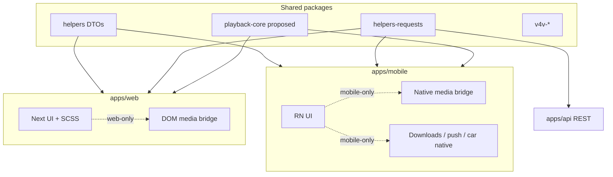

# Shared vs divergent: web and mobile parity matrix

This document catalogs **what the mobile app reuses** from the web app and API versus **what must be
built mobile-specific**. It is grounded in the real route and request-wrapper layout. Read the
foundation first: [DOCS-MOBILE-PROCESS-OVERVIEW.md](DOCS-MOBILE-PROCESS-OVERVIEW.md).

## 1. Summary

- **Reuse wholesale:** the API (`apps/api`), the typed client (`@podverse/helpers-requests`), DTOs
  (`@podverse/helpers`), client validation (`@podverse/helpers-validation/client`), playback/queue
  **policy** (proposed `@podverse/playback-core`), V4V math (`@podverse/v4v-*`).
- **Rebuild natively:** the UI shell, playback transport, token storage, downloads/offline,
  notifications, background audio + car, and the checkout surface.
- **Net:** mobile is a new **presentation + platform-services** layer over the **same** backend and
  the **same** business logic.

## 2. Parity matrix

| Concern                       | Web implementation (paths)                                                    | Mobile approach                                              | Reuse level                               |
| ----------------------------- | ----------------------------------------------------------------------------- | ------------------------------------------------------------ | ----------------------------------------- |
| Auth / session                | Cookie `jwt`; `apps/web/src/contexts/Account.tsx`                             | Bearer + secure storage; `/auth/mobile/*`                    | Endpoints reused; transport differs       |
| API client                    | `ApiRequestService`, `req*` (`packages/helpers-requests/src/api/_request.ts`) | Same class, `AuthContext { mode: 'bearer' }`                 | Full                                      |
| DTOs / validation             | `@podverse/helpers`, `@podverse/helpers-validation/client`                    | Same imports                                                 | Full                                      |
| i18n strings                  | `packages/i18n-catalog/{shared,consumer}/originals/`; `next-intl`             | Same catalog merge via `packages/i18n-catalog`; i18next/expo | Strings reused; runtime differs           |
| UI themes / design tokens     | `@podverse/ui` SCSS + `[data-ui-theme]`; cookie `uit`                         | `@podverse/design-tokens` + `ThemeProvider`; AsyncStorage `uit` | Same theme IDs + token values; UI rebuild |
| Visual primitives / polish    | `@podverse/ui` components + SCSS                                              | Shared RN primitives now; pixel polish later                     | Tokens shared; components rebuilt         |
| Channel / item / episode load | `reqChannelGet*`, `reqItemGet*`                                               | Same wrappers                                                | Full                                      |
| Search                        | `reqPodcastIndexSearchPodcasts` (`externalServices`)                          | Same                                                         | Full                                      |
| Playlists CRUD + resources    | `playlist/*` wrappers; `apps/web/src/app/playlist*`                           | Same wrappers; native UI                                     | API full                                  |
| Queue (manual)                | `queue/*` wrappers; `apps/web/src/contexts/Queue.tsx`                         | Same wrappers; RN state                                      | API full                                  |
| Auto-queue (prefetch)         | `apps/web/src/contexts/AutoQueue.tsx` + loader hook                           | Same API calls; RN state                                     | Logic reused                              |
| Playback policy               | `apps/web/src/lib/playback/`                                                  | `@podverse/playback-core`                                    | Full (after extraction)                   |
| Playback transport            | `useMediaElementBridge` (`HTMLMediaElement`)                                  | Native bridge (TrackPlayer/AVPlayer/Media3)                  | Rebuild                                   |
| Stats tracking                | `reqStats*` (`stats`)                                                         | Same wrappers                                                | Full                                      |
| Membership / checkout         | PayPal pages `apps/web/src/app/checkout`, `membership`                        | IAP or in-app browser                                        | API partial; UI rebuild                   |
| Notifications                 | Web Push; `apps/web/src/contexts/Notifications.tsx`                           | FCM/APNs; `account/fcm/*`                                    | New transport; device API exists          |
| Downloads / offline           | Browser download (`<a download>`)                                             | Offline-first DB + native download manager + files           | Rebuild                                   |
| Local settings                | Cookie (`apps/web/src/utils/localSettings/`)                                  | AsyncStorage/MMKV for prefs; app data in local DB            | Rebuild; sync prefs to server             |
| Deep links / routing          | Next routes (`apps/web/src/app/`)                                             | Universal/app links to same IDs                              | Rebuild mapping                           |
| V4V / boosts                  | `@podverse/v4v-*`; `metaboost` route                                          | Same packages; native LN provider                            | Logic reused                              |
| Add-by-RSS                    | Server parse + poll; `@podverse/parser-mapping` + IndexedDB                   | Same parse/poll APIs; adopt `parser-mapping`; local DB       | API + mapping shared; storage differs     |
| Livestream                    | `video.js` (`MediaPlayerControllerLiveStream*`)                               | Native HLS (deferred)                                        | Rebuild later                             |

## 3. Endpoint reuse catalog

API route modules in `apps/api/src/routes/` map almost 1:1 to typed wrappers in
`packages/helpers-requests/src/api/`. Mobile should call these **unchanged**:

| API route module                            | Request wrapper dir                   | Mobile use                                                                          |
| ------------------------------------------- | ------------------------------------- | ----------------------------------------------------------------------------------- |
| `auth.ts`                                   | `auth/`                               | **Mobile auth:** `/auth/mobile/token`, `/refresh`, `/revoke`; `me`, `check-session` |
| `account.ts`                                | `account/`                            | Profile, follow, FCM device registration, notifications                             |
| `accountSettings.ts`                        | `accountSettings/`                    | Locale, playback prefs, notification types                                          |
| `channel.ts`                                | `channel/`                            | Subscribed/global/category channel lists                                            |
| `item.ts`                                   | `item/`                               | Episode lists, queue helpers (pub-date/season), chapters                            |
| `itemChapter.ts`                            | `itemChapter/`                        | Chapter detail                                                                      |
| `itemSoundbite.ts`                          | `itemSoundbite/`                      | Soundbite lists                                                                     |
| `itemTranscript.ts`                         | `itemTranscript/`                     | Transcripts                                                                         |
| `clip.ts`                                   | `clip/`                               | Clip CRUD + public lists                                                            |
| `playlist.ts`                               | `playlist/`                           | Playlist CRUD, resources, shuffle, queue-by-position                                |
| `queue.ts`                                  | `queue/`                              | Queues + resources (now-playing, upcoming, history)                                 |
| `liveItem.ts`                               | `liveItem/`                           | Livestreams                                                                         |
| `profileContent.ts`                         | `profile/`                            | Public + my-profile content                                                         |
| `category.ts`                               | `category/`                           | Categories                                                                          |
| `feed.ts`, `publisherFeed.ts`, `podroll.ts` | `feed/`, `publisherFeed/`, `podroll/` | Feeds / podroll                                                                     |
| `membershipClaimToken.ts`, `product/`       | `membership/`                         | Membership pricing / claim                                                          |
| `metaboost.ts`                              | `metaboost/`                          | V4V / boost assertions                                                              |
| `stats.ts`                                  | `stats/`                              | Page/play tracking                                                                  |
| `mq.ts`                                     | `mq/`                                 | On-demand RSS refresh                                                               |
| `externalServices.ts`                       | `externalServices/`                   | Podcast Index search proxy                                                          |
| `embedDemo.ts`                              | `embedDemo/`                          | Web embed only — not mobile                                                         |

## 4. Package import allowlist / denylist

| Allowed (mobile-safe)                                  | Forbidden (web/server-only)                                |
| ------------------------------------------------------ | ---------------------------------------------------------- |
| `@podverse/helpers`                                    | `@podverse/ui`                                             |
| `@podverse/helpers-requests`                           | `@podverse/orm`                                            |
| `@podverse/http-request-core`                          | `@podverse/parser` (server/worker only — fetches + parses) |
| `@podverse/helpers-validation/client`                  | `@podverse/mq`                                             |
| `@podverse/playback-core`                              | `@podverse/helpers-backend`                                |
| `@podverse/parser-mapping` (post-parse client mapping) | `@podverse/helpers-browser`                                |
| `@podverse/v4v-helpers`, `v4v-metaboost`, `v4v-btc-ln` | `@podverse/helpers-config`                                 |
| `@podverse/design-tokens`                              | `@podverse/observability`, `@podverse/external-services-*` |

Detail and reasons: see
[DOCS-MOBILE-MONOREPO-CURRENT-STATE.md](/docs/proposals/mobile/monorepo-llm-setup/DOCS-MOBILE-MONOREPO-CURRENT-STATE.md)
section 3.

## 4.1 Add-by-RSS: server-side parse, client-side mapping

Neither web nor mobile parses RSS XML in the client. Both use the same async API:

1. `POST /account/follow/add-by-rss-channel` (follow)
2. `POST /account/add-by-rss/parse` → `{ request_id }`
3. Poll `GET /account/add-by-rss/parse/status/:request_id` until `parsed` / `not_modified` /
   `failed`

A **worker** runs `@podverse/parser` (`parseRSSFeedForAddByRSS` → `podverse-partytime`). The API
returns a `FeedObject` payload in the cache entry.

**After parse:**

| Surface | Post-parse work                                                              | Local storage                                      |
| ------- | ---------------------------------------------------------------------------- | -------------------------------------------------- |
| Web     | `@podverse/parser-mapping` `convertParsedRSSFeedToCompat` + item index       | IndexedDB (`apps/web/src/utils/addByRSS/storage`)  |
| Mobile  | Should adopt the same `parser-mapping` pipeline (today: slim `items[0]` only) | Offline-first local DB (see data-layer decision)   |

Add-by-RSS items are **not** ORM entities. They use parallel types (`AddByRSSResourceData`,
`AddByRSSMappedFeed`, `add_by_rss_hash_id`) because they lack DB channel/item IDs — that is why
web has dedicated AddByRSS "core" components. Mobile should mirror those types via
`@podverse/parser-mapping` + helpers DTOs, not invent a second model.

Do **not** import `@podverse/parser` in mobile (Node/ORM deps). Do import
`@podverse/parser-mapping` for post-parse mapping (browser/mobile-safe).

## 5. Data loading pattern comparison

Example: the podcast detail page.

| Aspect       | Web (`apps/web/src/app/podcast/[channel_id]/`)                     | Mobile (`apps/mobile` podcast screen) |
| ------------ | ------------------------------------------------------------------ | ------------------------------------- |
| Initial data | SSR fetch (channel for SEO + first tab)                            | Fetch on screen mount                 |
| Subsequent   | Client refetch on tab/sort/filter change via page context          | Same `req*` calls on tab/sort change  |
| Refresh      | Navigation / soft reload                                           | Pull-to-refresh + focus refetch       |
| API calls    | `reqChannelGetByIdOrIdText`, `reqItemGetManyByChannel`, live items | Same wrappers                         |
| Auth         | Cookie sent automatically                                          | Bearer header via `AuthContext`       |

The key divergence is **SSR (web) vs on-launch/on-focus fetch (mobile)**; the **API calls are
identical**.

## 6. Consistency rules for agents

When implementing a mobile screen:

1. **Read the web page context + hooks first** (e.g. `apps/web/src/app/<route>/*Context.tsx`) to
   learn which `req*` calls and DTOs it uses.
2. **Reuse the same `req*` wrappers** from `@podverse/helpers-requests` — but screens/hooks should
   read through **repositories** (offline-first data layer), not call `req*` directly. See
   [DOCS-MOBILE-DATA-LAYER-OFFLINE.md](/docs/proposals/mobile/initial-decisions/DOCS-MOBILE-DATA-LAYER-OFFLINE.md).
3. **Do not port** SCSS, `@podverse/ui` components, Next.js routing, or SSR patterns.
4. **Use bearer auth**, never cookie/`withCredentials`.
5. **Match behavior** (sort defaults, pagination, tab data) even when the UI looks native.
6. **Add-by-RSS:** use the server parse + poll APIs; map with `@podverse/parser-mapping`; never
   parse RSS XML in the app.
7. **Visual:** prefer shared RN primitives + tokens; defer pixel polish — see
   [DOCS-MOBILE-PROCESS-VISUAL-PARITY.md](DOCS-MOBILE-PROCESS-VISUAL-PARITY.md).

## 7. Gaps requiring API work

Based on the near 1:1 route↔wrapper mapping, **no major API gaps are expected** for consumer mobile;
the mobile auth routes (`/auth/mobile/*`) already exist. Watch items:

- **Per-route confirmation:** when implementing each screen, confirm a typed wrapper exists in
  `packages/helpers-requests/src/api/`; if a new main-API route is added for mobile, add a matching
  wrapper (policy in [API-CLIENT-BOUNDARIES.md](/docs/development/API-CLIENT-BOUNDARIES.md)).
- **Membership purchase:** native IAP may require new server validation endpoints (store receipt
  verification) not needed by PayPal web checkout — flag during the membership phase.
- **Push:** FCM device registration exists (`account/fcm/*`); confirm APNs coverage for iOS.

## Diagram: shared vs mobile-only

