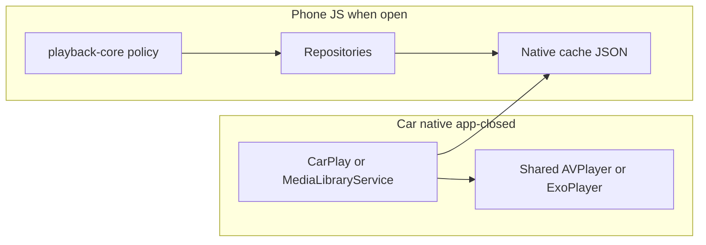

# Player medium parity — podcast vs music in the car

**Status:** proposal (docs only)
**Parent:** [000-OVERVIEW.md](./000-OVERVIEW.md)
**Policy source:** `@podverse/playback-core` + web/mobile auto-queue hooks
**Native rule:** car surfaces stay **thin** — browse, resolve URL, load shared engine; do **not**
reimplement queue policy in Kotlin/Swift

## Intent

Old podverse-rn car UX was **podcast-only** (single queue, episode lists, resume-from-history).
The new monorepo already treats **AV** and **Music** as separate playback worlds on web and phone.
CarPlay / Android Auto should feel like the same product: same advance rules and control
semantics, adapted to car chrome (system now-playing).

## Two queues

Canonical helpers:

- [`packages/helpers/src/lib/queue/queue.ts`](/packages/helpers/src/lib/queue/queue.ts) —
  `getQueueForMedium`, `getQueueMediumIdForChannelMediumId`
- Supported queue mediums: **AV (20)** and **Music (3)** only

Car Queue tab shows **both** buckets (see [010](./010-carplay-ios-ux.md) /
[020](./020-android-auto-ux.md)). Native cache stores dual snapshots
([030](./030-native-cache-extensions.md)).

When the user plays from Podcasts / Music / Queue / History, the load path must target the
**correct** queue medium so phone UI and car stay consistent after the app reopens.

## Advance policy (shared)

[`resolveQueueAdvance`](/packages/playback-core/src/resolveQueueAdvance.ts):

1. Next **manual** upcoming → play it
2. Else **auto-queue** next → advance auto-queue
3. Else **stop**

Native engine skip-next / end-of-item should eventually call the same policy (via JS bridge when
app is alive, or via a small native projection of “next URL” written into the queue snapshot when
app is closed). **v1 car:** at minimum, MediaSession skip uses the shared engine’s queue if
populated; full auto-queue refill without JS is a follow-on (document as known gap if needed).

## Auto-queue fill order (behavioral split)

| Medium               | Channel auto-queue source                       | Web/mobile reference              |
| -------------------- | ----------------------------------------------- | --------------------------------- |
| Music                | Items by **season forward** (album track order) | `reqItemGetManyForQueueBySeason`  |
| Podcast / Video (AV) | Items by **pub-date forward**                   | `reqItemGetManyForQueueByPubDate` |

Car must not invent a third ordering. When the phone projects auto-queue into the native queue
snapshot, ordering is already correct; car just plays the next cached entry.

## Load / seek intent (playback-core)

[`playbackTargetFromStandardLoad`](/packages/playback-core/src/playbackTargetFromStandardLoad.ts) /
[`resolvePlaybackLoadDecision`](/packages/playback-core/src/resolvePlaybackLoadDecision.ts):

| Kind           | Explicit play / fresh auto-queue advance           | Session restore           |
| -------------- | -------------------------------------------------- | ------------------------- |
| `item-podcast` | Resume from abridged position when appropriate     | Resume                    |
| `item-music`   | **Seek 0** on explicit play and auto-queue advance | Resume on session_restore |
| `item-video`   | Video surface (phone); car is **audio-only** v1    | —                         |

CarPlay video deferred (master plan 21.8). Video medium channels in the Podcasts (AV) tab play
**audio** enclosure in the car if present.

## Now-playing controls (UX)

Web mobile player:

- **AV queue active:** jump back / jump forward (time)
- **Music queue active:** previous track / next track

Car system now-playing:

- Prefer mapping MediaSession / `MPRemoteCommandCenter` actions to the **active queue medium**:
  - Music → skip to previous/next **item**
  - AV → prefer seek ±N seconds when the platform exposes custom/skip-interval actions; otherwise
    skip item is acceptable fallback (document in CarPlay/AA checklists)

Old car used track-player / CarPlay now-playing defaults without an explicit music mode. New car
should branch on `mediumBucket` from the active now-playing cache entry.

## Row / list labeling (layout parity)

| Surface            | Podcast (AV)            | Music                               |
| ------------------ | ----------------------- | ----------------------------------- |
| Channel list       | Podcast title + artwork | Album (or artist) + artwork         |
| Item list subtitle | Readable **pub date**   | Track/season label (not date-first) |
| Queue subtitle     | Podcast/channel title   | Album/artist title                  |
| Item type language | Episode                 | Track                               |

Use `getItemTypeFromMedium` / `isAlbumMediumId` / `isPodcastMediumId` from
[`packages/helpers/src/lib/medium.ts`](/packages/helpers/src/lib/medium.ts) when writing cache
projections (JS side). Native display just shows the strings already in the cache.

## Architecture diagram

JS owns policy and cache projection. Native owns browse chrome and transport.

## Acceptance criteria (when implemented)

- Playing an episode from Podcasts updates AV now-playing metadata; Queue **AV** section reflects
  upcoming.
- Playing a track from Music updates Music now-playing; Queue **Music** section reflects upcoming.
- Skip-next after a music track follows album/season order already present in the Music queue
  snapshot (no pub-date reshuffle).
- Skip/seek mapping matches medium when platform APIs allow.
- Force-stopped phone: play still starts from cached `mediaUrl` / `file://`; no second player
  instance.

## Out of scope

- Reimplementing `resolveQueueAdvance` in Kotlin/Swift
- Car video UI
- Changing web or phone player UX (car follows them, not the reverse)
