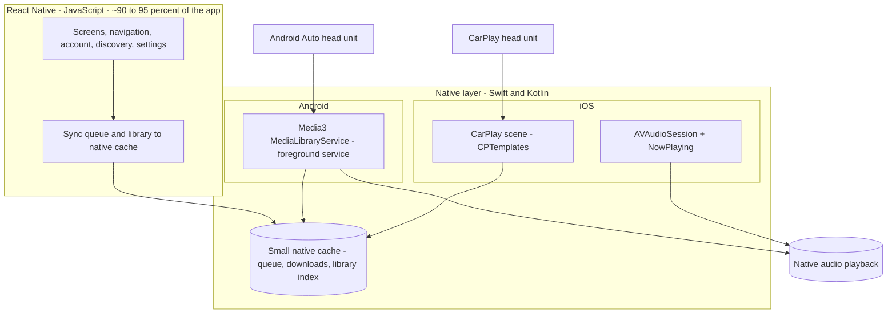

# CarPlay & Android Auto: the background-execution problem

This is the most important document in the set, because it addresses the exact pain you hit years
ago: **the React Native app had to be open/running for the car experience to work**, when the ideal
is that the user gets in the car, the head unit shows Podverse, and they can browse and play —
**without ever touching or even opening the phone app.**

The honest summary up front:

> You can deliver a flawless, professional-grade CarPlay and Android Auto experience **with a single
> React Native app**, but the car surfaces and the audio engine must be backed by **native code
> running in a native background service** — not by the JavaScript runtime. This is true for every
> cross-platform framework, and it is also how many native podcast/music apps are built internally.
> You do **not** need two separate apps.

## Why "the app had to be running" happened

In a naive RN setup, the JS thread _is_ the app. Playback state, the queue, and the data that feeds
car menus all live in JavaScript. The OS aggressively suspends or kills background app processes to
save battery. So when the phone app was backgrounded or killed:

- the JS runtime stopped executing,
- audio stopped (no native audio session owned the playback),
- and the car UI had nothing to talk to, because its data source (JS) was asleep.

The fix is architectural: **ownership of audio and car content must move out of JS and into native
platform services that the OS keeps alive for media.**

## How the platforms actually work

Both platforms have a first-class "media app" contract. If you implement it natively, the OS treats
your app like Spotify/Apple Music: it can run audio in the background indefinitely and can show car
menus driven by a long-lived service — independent of whether your UI/Activity/JS is alive.

### Android Auto

- The contract is a **`MediaLibraryService`** (Jetpack **Media3**; older apps used
  `MediaBrowserServiceCompat`). It is a **foreground service** that owns a `MediaSession`.
- Android Auto connects to **that service**, not to your Activity or the JS runtime. The service
  supplies the browse tree (your podcasts, episodes, queue) and handles play/pause/seek/skip.
- Because it is a foreground media service, the system keeps it alive while audio plays, and can
  start it on demand. **The phone UI never needs to be open.**
- `react-native-track-player` is built on exactly this (it ships an Android playback service) and
  has Android Auto support. For a rich, custom browse tree you extend the native service.

### CarPlay (iOS)

- Audio apps use the **CarPlay framework** with **`CPTemplate`** UIs (`CPListTemplate`,
  `CPNowPlayingTemplate`, etc.) declared via a CarPlay **scene** in your `Info.plist`.
- Audio runs through **`AVAudioSession`** configured for background audio (the `audio` background
  mode). iOS keeps the audio process alive while playing and can launch your app **in the
  background** for the CarPlay scene.
- The CarPlay templates are driven by **Swift** in your app. If you build the template data from
  native code (optionally reading a small native cache), the menus work even when JS has not been
  started. The "Now Playing" controls bind to `MPNowPlayingInfoCenter` / `MPRemoteCommandCenter`,
  which are native.

### The shared lesson

In both cases the **source of truth for "what can play" and "what is playing" must be reachable from
native code without the JS runtime.** That is the design constraint that fixes your old UX problem.

## Recommended architecture: one RN app, thin native car layer

- **JS owns the phone UI and writes a small native cache** (current queue, downloaded files, a
  lightweight library/browse index) whenever it changes. This is cheap and runs while the app is in
  use.
- **Native owns audio and the car surfaces.** The Android foreground service and the iOS CarPlay
  scene read the native cache, so they can render menus and play audio **with no JS running**.
- When JS _is_ alive, it can push richer/live data to native; when it is not, the car still works
  from the last synced cache. This is exactly how you get "open the car, it just works."

This keeps the native code to a **small, stable surface** (a service + a scene + a cache contract)
while everything else stays shared TypeScript.

## Will `react-native-track-player` alone be enough?

- **For background audio + lock screen + basic Android Auto:** largely yes, and it is the right
  baseline. It already runs a native service and integrates with the media session.
- **For a polished, custom CarPlay browse experience and offline-capable car menus:** plan to write
  **some native Swift/Kotlin** on top of it. Treat the library as the foundation, not the whole
  solution. Budget engineering time for the native car layer explicitly.

## The honest "two apps?" question

You asked me to be honest if flawless UX requires two separate apps. It does **not**, for a podcast
app. One RN app with a native car layer is the right answer because:

- The car experience for podcasts is **browse + play + simple controls** — a bounded native surface,
  not a sprawling native UI.
- Keeping it in one app preserves your account/auth/library/sync logic in shared TS instead of
  duplicating it natively.

You would only be pushed toward **fully native, separate apps** if **all** of these became true:

1. The CarPlay/Android Auto experiences grow large and change frequently (complex native UIs, not
   just lists), so the native layer becomes most of the app anyway; **and**
2. The RN ↔ native bridge for car/audio becomes a recurring source of bugs that out-costs the
   sharing benefit; **and**
3. You have the budget/headcount to staff and maintain two native codebases.

For a small team building a podcast app, that combination is unlikely. The hybrid RN-plus-native-car
approach is the professional-grade path that fits your budget. Revisit only with evidence that the
native layer has outgrown its "thin" role.

## De-risking before you commit

Before building the full app, spend a short spike proving the scary part first:

1. Stand up a minimal RN app with `react-native-track-player`; confirm background audio survives
   app-backgrounding and app-kill.
2. Implement a **bare-bones native browse tree + playback** for **Android Auto** (Media3 service)
   and confirm it works with the **phone app closed** (use the Desktop Head Unit / DHU emulator).
3. Implement a **bare-bones CarPlay** list + now-playing scene and confirm it launches in the
   background (CarPlay simulator).
4. Validate the **native cache contract** (JS writes, native reads with no JS running).

If those four work, the architecture is proven and the rest is product work. This spike is the
single highest-value thing to do before betting the roadmap on it.

## Bottom line

The background-execution problem is solved by **moving audio and car content ownership into native
platform services**, with JS syncing a small native cache. That delivers the "get in the car and it
just works, app closed" experience inside **one** React Native app. Prove it with a focused spike,
then build.
