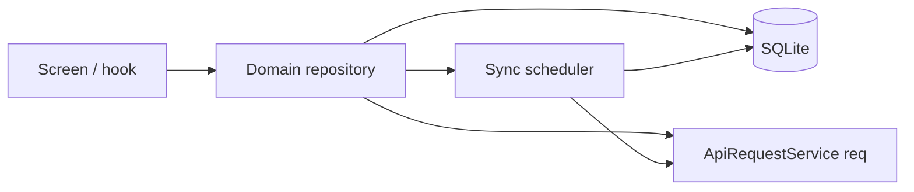
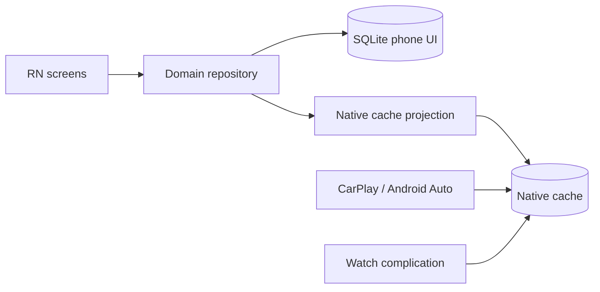

# Mobile offline-first data layer

Decision: the Podverse mobile app uses an **offline-first local database** as the source of truth
for app data, with **background sync** from the same `apps/api` REST endpoints (via
`@podverse/helpers-requests`). Screens and hooks **read through repositories** — they do not call
`req*` / `ApiRequestService` methods directly.

Foundation context:
[DOCS-MOBILE-PROCESS-OVERVIEW.md](/docs/proposals/mobile/app-development-process/DOCS-MOBILE-PROCESS-OVERVIEW.md),
[DOCS-MOBILE-PROCESS-SHARED-VS-DIVERGENT.md](/docs/proposals/mobile/app-development-process/DOCS-MOBILE-PROCESS-SHARED-VS-DIVERGENT.md).

> **Status:** Decision/recommendation (architecture). Implementation lands in the master-plan data
> layer steps (see [001-MASTER-PLAN.md](/docs/proposals/mobile/_master-plan_/001-MASTER-PLAN.md)).

## 1. Why offline-first (not "cache later")

Today (`apps/mobile` as of PG-6): screens use `useState` + `useEffect` and call the API on mount.
Persistence is limited to SecureStore (tokens), AsyncStorage (theme / media-type prefs / slim
add-by-RSS feed list). That pattern cannot support:

- Cold-start browse/queue when the network is down
- CarPlay/Android Auto native cache fed from a coherent JS write path
- Episode downloads keyed to stable local rows
- Add-by-RSS item indexes without re-polling the parse cache every launch

Retrofitting a DB after queue/player (PG-7) would rewrite most hooks. Build the data layer **before**
queue/player parity consumes it.

## 2. Recommended stack

| Layer             | Recommendation                                      | Notes                                                                 |
| ----------------- | --------------------------------------------------- | --------------------------------------------------------------------- |
| Local DB          | **SQLite** via `expo-sqlite` + **Drizzle ORM**      | Expo-native; typed schema; migrations as SQL; no Watermelon sync tax  |
| Alternative       | WatermelonDB                                        | Stronger reactive sync story; heavier; prefer only if sync needs grow |
| Prefs (tiny keys) | AsyncStorage (or MMKV later)                        | Theme `uit`, preferred media type — **not** app entities              |
| Auth tokens       | `expo-secure-store` only                            | Never AsyncStorage; never the SQLite DB                               |
| API               | Existing `ApiRequestService` + bearer refresh       | Unchanged contract; repositories own when to call                     |
| Observability     | Soft failures on sync; stale UI + error affordances | Match web loading/empty/error semantics                               |

**Default: expo-sqlite + Drizzle.** Revisit WatermelonDB only if multi-writer sync or heavy
observable query graphs become blockers.

## 3. Repository seam



Rules:

1. **Screens/hooks call repositories** (e.g. `queueRepository.getNowPlaying()`,
   `addByRssRepository.listFeeds()`).
2. **Repositories own** local reads, writes, and when to enqueue sync.
3. **`req*` / `ApiRequestService` live only inside repositories** (and auth bootstrap that seeds
   the session). Screens must not import `createMobileApiRequestService` for product data.
4. Return domain DTOs already used by web/mobile (`@podverse/helpers` types), not raw SQL rows.

Suggested layout:

```
apps/mobile/src/data/
├── db/                 # schema, migrations, client
├── repositories/       # one module per domain
├── sync/               # scheduler, conflict helpers
└── index.ts
```

## 4. Sync model

- **Read path:** UI reads local DB first (instant). If stale or missing, repository triggers a
  background fetch and updates the DB; UI observes the DB (or repository subscription).
- **Write path (mutations):** optimistic local write when safe; enqueue API mutation; reconcile on
  success/failure (rollback or mark conflict).
- **Staleness:** per-domain TTL or `updatedAt` watermark; pull-to-refresh and app-focus force sync.
- **Conflicts:** server wins for queue/history authoritative state after successful sync; local
  pending mutations replay in order. Document exceptions (e.g. anonymous queue snapshot) in the
  repository module.
- **Offline:** mutations queue locally; flush when connectivity returns. Do not block playback of
  already-local media on sync failure.

## 5. Per-domain rollout (order)

| Phase | Domain                          | Why first                                                                                                                                                                                                                     |
| ----- | ------------------------------- | ----------------------------------------------------------------------------------------------------------------------------------------------------------------------------------------------------------------------------- |
| A     | Schema + DB client + seam       | Foundation                                                                                                                                                                                                                    |
| B     | Auth/account snapshot           | Session hydrate without full re-fetch every cold start                                                                                                                                                                        |
| C     | Queue / now-playing / history   | PG-7 depends on it; car cache later                                                                                                                                                                                           |
| D     | Add-by-RSS feeds + mapped items | `parser-mapping` output; leave AsyncStorage feed prefs behind                                                                                                                                                                 |
| E     | Home feeds / search cache       | Optional warm cache; can stay network-first longer                                                                                                                                                                            |
| F     | Downloads index (file rows)     | Track 13; same DB, file paths on disk; **progressive only** — reject `live_item` + HLS/m3u8 (see [MOBILE-ONLY-FEATURES §1.1–1.2](/docs/proposals/mobile/app-development-process/DOCS-MOBILE-PROCESS-MOBILE-ONLY-FEATURES.md)) |

Do **not** migrate every screen in one PR. Land A→C before PG-7 queue/player work; D with add-by-RSS
parity; E/F as follow-ons.

## 6. Migration from current direct-fetch code

Existing direct-fetch call sites (non-exhaustive):

- `apps/mobile/src/screens/home/homeFeedData.ts`
- `apps/mobile/src/hooks/usePrimaryQueue.ts`, `useQueueResources.ts`, `useProfileContentLoad.ts`
- `apps/mobile/src/hooks/useAddByRssFeeds.ts`, `useAddByRssAddFlow.ts`
- Detail screens under `apps/mobile/src/screens/**` that call `requestWithMobileAuthRefresh`

Migration pattern per domain:

1. Add tables + repository methods.
2. Point the existing hook at the repository (same public hook API if possible).
3. Keep network behavior (auth refresh, errors) inside the repository.
4. Delete duplicated `useState` fetch orchestration once the repository owns it.
5. Move add-by-RSS from `src/prefs/addByRSSFeeds.ts` into the DB when domain D lands.

## 7. Storage boundaries (enforced)

| Kind                         | Store                   | Examples                                     |
| ---------------------------- | ----------------------- | -------------------------------------------- |
| Auth tokens                  | SecureStore             | access + refresh                             |
| Tiny UI prefs                | AsyncStorage / MMKV     | `uit`, preferred media type                  |
| App entities + sync metadata | SQLite (Drizzle)        | queues, history, add-by-RSS, downloads index |
| Media files                  | App filesystem          | downloaded enclosures                        |
| Car / watch browse cache     | Native cache (Track 12) | JS writes from repositories on mutation      |

## 7.1 Dual-store model (phone UI vs car / watch)

Two different “offline” problems — do not conflate them:

| Store                | Who reads it                                                               | When JS is dead / never started                       |
| -------------------- | -------------------------------------------------------------------------- | ----------------------------------------------------- |
| **SQLite (Drizzle)** | RN screens, hooks, repositories                                            | **Unavailable** — Expo SQLite lives in the JS process |
| **Native cache**     | CarPlay templates, Android Auto `MediaLibraryService`, watch complications | **Required** — only store native code can read        |



**Rules:**

1. SQLite is the source of truth for the **phone app UI** and sync metadata.
2. Native cache is a **projection** (subset + denormalized browse/now-playing shape) — not a second
   product model. Schema ownership: Track 12 (`380-native-cache-schema`); write hooks land in the
   media engine (step 2.35 stubs) and are called from repositories.
3. Domains that car/watch need (queue snapshot, downloads index, library browse index) **must** call
   the projection API on every successful local mutation (and after sync reconcile). Stubs are OK
   until Track 12 storage is real — but the call sites must exist in Track 9b / Track 10 so car work
   does not rewrite repositories.
4. Do **not** assume native car code will open Drizzle/SQLite tables. Do **not** assume watch
   complications read SQLite.

Projection API sketch (names illustrative):

- `projectQueueSnapshotToNativeCache(snapshot)`
- `projectDownloadsIndexToNativeCache(index)`
- `projectLibraryBrowseIndexToNativeCache(index)`

Debounce is allowed for high-frequency progress updates; queue/library structural mutations should
project promptly.

## 8. Add-by-RSS interaction

Parse remains **server-side** (parse + poll). After `parsed`, repositories:

1. Run `@podverse/parser-mapping` (`convertParsedRSSFeedToCompat` and related).
2. Upsert feed + item index rows into SQLite.
3. Expose list/detail/play payloads compatible with `AddByRSSResourceData` /
   `PlaybackTarget.kind: 'add-by-rss'`.

See
[DOCS-MOBILE-PROCESS-SHARED-VS-DIVERGENT.md §4.1](/docs/proposals/mobile/app-development-process/DOCS-MOBILE-PROCESS-SHARED-VS-DIVERGENT.md).

## 9. LLM / agent rules

- Skill: **mobile-data-layer** (`.cursor/skills/mobile-data-layer/SKILL.md`).
- Do not call `req*` from screens for product data after the seam exists.
- Do not put tokens or secrets in SQLite.
- Do not use `@podverse/orm` or `@podverse/parser` in mobile.
- Prefer the same DTO shapes as web so queue/playback policy stays shared.
- On queue / download / library-index mutations, call **native cache projection** hooks (stubs OK
  until Track 12). Do not leave projection only for “later car work.”

## 10. Related

- [DOCS-MOBILE-PROCESS-MOBILE-ONLY-FEATURES.md](/docs/proposals/mobile/app-development-process/DOCS-MOBILE-PROCESS-MOBILE-ONLY-FEATURES.md)
  §1 (downloads vs data layer)
- [DOCS-MOBILE-CARPLAY-ANDROID-AUTO.md](DOCS-MOBILE-CARPLAY-ANDROID-AUTO.md) — native cache fed from
  repository writes
- [apps/mobile/AGENTS.md](/apps/mobile/AGENTS.md)
