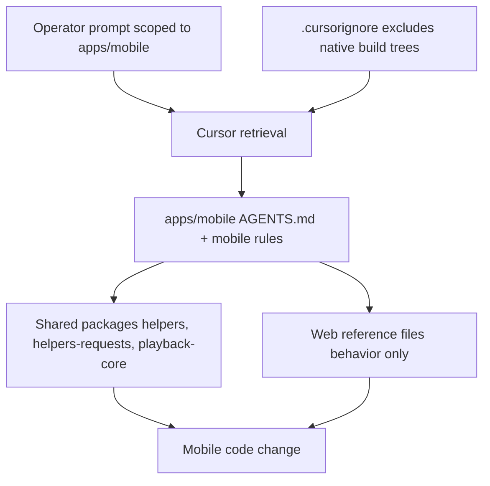

# LLM / Cursor setup for mobile

This proposal gives **actionable, file-level** recommendations for keeping Cursor effective once
`apps/mobile` exists. It complements the higher-level reasoning in
[initial-decisions/DOCS-MOBILE-LLM-CONTEXT.md](/docs/proposals/mobile/initial-decisions/DOCS-MOBILE-LLM-CONTEXT.md)
with concrete proposed content for `.cursorignore`, `AGENTS.md`, rules, and skills.

This document only **proposes** files. Do not create `.cursor/` files, `AGENTS.md`, or
`.cursorignore` changes from this doc — apply them when the mobile workspace is bootstrapped (see the
checklist in section 10).

## 1. Principles

- **Retrieval, not full load.** Cursor retrieves relevant files per task; a bigger repo is a bigger
  haystack, not a bigger per-request payload. Keep the haystack clean (exclude generated trees).
- **Scope sessions per app.** Point the agent at `apps/mobile` + the specific shared packages a task
  needs; do not mix web and mobile in one session.
- **Respect tier boundaries.** Mobile is a Tier 5 consumer
  ([architecture-tier-dependencies](/.cursor/rules/architecture-tier-dependencies.mdc),
  [.llm/context/architecture.md](/.llm/context/architecture.md)); it imports downward only.
- **Keep guidance singular.** Reuse existing conventions (strict TS, no `any`, no agent test runs);
  add mobile-specific guidance only where the platform genuinely differs.

## 2. `.cursorignore` additions

The current [.cursorignore](/.cursorignore) is minimal (env allowlist + one archived doc) and does
not exclude native build output. Add the following when `apps/mobile` exists:

```
# Mobile native build output (generated; never index)
apps/mobile/ios/Pods/
apps/mobile/ios/build/
apps/mobile/android/.gradle/
apps/mobile/android/build/
apps/mobile/android/app/build/
apps/mobile/.expo/
apps/mobile/node_modules/

# Optional: large generated assets / bundles
apps/mobile/**/*.hbc
apps/mobile/ios/*.xcworkspace/xcuserdata/
```

**Rationale:** these directories are machine-generated, large, and useless as context. Excluding
them keeps retrieval focused on real source and avoids degrading index quality.

## 3. `apps/mobile/AGENTS.md` proposal

Mirror the concise pattern of [apps/web/AGENTS.md](/apps/web/AGENTS.md) (which links the root
[AGENTS.md](/AGENTS.md) plus a few app-specific skills). Proposed outline:

```markdown
# AI guide — apps/mobile

Monorepo-wide rules: [AGENTS.md](/AGENTS.md) (repository root).

- **Stack:** React Native + Expo (prebuild / dev client). This is NOT Next.js — no `next/*`, no
  server components, no SSR, no Playwright.
- **Allowed shared imports:** `@podverse/helpers`, `@podverse/helpers-requests`,
  `@podverse/http-request-core`, `@podverse/helpers-validation/client`, `@podverse/playback-core`
  (once extracted), `@podverse/v4v-*`, `@podverse/parser-mapping`.
- **Forbidden imports:** `@podverse/ui` (web-only), `@podverse/orm`, `@podverse/parser`,
  `@podverse/mq`, `@podverse/helpers-backend`, `@podverse/helpers-browser`,
  `@podverse/helpers-config`, `@podverse/observability`, `@podverse/external-services-*`.
- **Auth:** bearer tokens in secure storage (Keychain/Keystore); NOT cookies. Use
  `AuthContext { mode: 'bearer' }` and `/auth/mobile/*` routes. See
  [API-CLIENT-BOUNDARIES.md](/docs/development/API-CLIENT-BOUNDARIES.md).
- **Playback:** reuse policy from `@podverse/playback-core`; implement a NATIVE bridge (parallels
  web `useMediaElementBridge`) — see
  [DOCS-MOBILE-PROCESS-PLAYBACK-QUEUE-PARITY.md](/docs/proposals/mobile/app-development-process/DOCS-MOBILE-PROCESS-PLAYBACK-QUEUE-PARITY.md).
- **CarPlay / Android Auto:** native layer + native cache contract — see
  [DOCS-MOBILE-CARPLAY-ANDROID-AUTO.md](/docs/proposals/mobile/initial-decisions/DOCS-MOBILE-CARPLAY-ANDROID-AUTO.md).
- **Native modules:** under `apps/mobile/modules/`, `ios/`, `android/`.
```

## 4. `apps/mobile/APPS-MOBILE.md` proposal

A human + agent contributor doc (full-path name per
[documentation-conventions](/.cursor/skills/documentation-conventions/SKILL.md)). Proposed sections:

- **Toolchain:** Node via Nix `scripts/nix/with-env`; Expo CLI; Xcode (iOS) and Android SDK
  (outside the Nix shell — document local install).
- **Commands from repo root** (per commands-from-monorepo-root):

  ```bash
  npm run build:packages          # prerequisite: builds dist/ that Metro consumes
  npm run start -w apps/mobile     # Metro dev server
  npm run ios -w apps/mobile
  npm run android -w apps/mobile
  npm run prebuild -w apps/mobile  # regenerate native projects
  ```

- **Prerequisite:** run `npm run build:packages` before mobile dev (Metro reads package `dist/`).
- **Project layout:** `src/`, `ios/`, `android/`, `modules/`, `e2e/` (Maestro/Detox).
- **Testing:** unit via Vitest in `playback-core`; mobile E2E via Maestro/Detox — NOT `make e2e_*`.

## 5. New `.cursor/rules/` proposals

Two glob-triggered rules. Draft frontmatter + bodies (keep concise; full files created later).

### Rule: `mobile-react-native.mdc`

```markdown
---
description: apps/mobile is React Native (Expo), not Next.js; enforce mobile boundaries
globs: apps/mobile/**
---

# Mobile (React Native) boundaries

- This is React Native + Expo. Do NOT use `next/*`, server components, SSR, or `@podverse/ui`.
- Do NOT import server/web-only packages (orm, parser, mq, helpers-backend, helpers-browser,
  helpers-config, observability, external-services-*).
- Auth is bearer + secure storage, never cookies / `withCredentials`.
- Reuse `@podverse/helpers-requests` `req*` wrappers and `@podverse/playback-core` policy.
- E2E uses Maestro/Detox, not Playwright; do not add `make e2e_*` commands for mobile.
```

### Rule: `mobile-carplay-android-auto.mdc`

```markdown
---
description: Mobile car surfaces and background audio are native; JS writes a native cache
globs: apps/mobile/**
---

# CarPlay / Android Auto native cache contract

- Audio + car browse trees are owned by NATIVE services (iOS CarPlay scene, Android Media3
  MediaLibraryService) so they work when JS is suspended or the app is closed.
- JS writes a small native cache (queue, downloads, library index); native reads it.
- Do NOT implement the car experience as JS-only `react-native-track-player` browsing.
- See /docs/proposals/mobile/initial-decisions/DOCS-MOBILE-CARPLAY-ANDROID-AUTO.md.
```

## 6. New `.cursor/skills/` proposal

Add a `mobile-playback` skill (or extend
[media-player-architecture](/.cursor/skills/media-player-architecture/SKILL.md)) that maps the web
policy to the RN/native bridge:

- **When to use:** implementing or changing mobile playback, queue advance, or the native bridge.
- **Map:** web `resolvePlaybackLoadDecision` (now `@podverse/playback-core`) → RN hook →
  `NativePlaybackBridge` → `react-native-track-player` / AVPlayer / Media3.
- **Native vs JS:** decisions and queue/auto-queue logic stay in JS/TS; transport, background
  service, lock-screen, and car surfaces are native.
- **Cache contract:** what JS must write for the car layer to function with the app closed.
- **Cross-link:** the Track B parity doc
  [DOCS-MOBILE-PROCESS-PLAYBACK-QUEUE-PARITY.md](/docs/proposals/mobile/app-development-process/DOCS-MOBILE-PROCESS-PLAYBACK-QUEUE-PARITY.md).

## 7. Root doc updates

- **[AGENTS.md](/AGENTS.md):** add `apps/mobile` to the directory map; note it is a Tier 5 RN
  consumer off the Node build graph; link `apps/mobile/AGENTS.md`.
- **[.cursorrules](/.cursorrules):** add a short mobile note — RN tier, allowed/forbidden imports
  pointer, commands-from-monorepo-root for `-w apps/mobile`, and "mobile E2E is Maestro/Detox".
- Keep the "agents do not run tests" policy unchanged; it applies to mobile too.

## 8. Prompt patterns for operators

Scoped prompts produce better mobile output:

```text
Work only in apps/mobile and packages/playback-core. Implement the episode screen's play action by
mirroring the behavior in apps/web/src/hooks/useMediaPlayerResourceUpdate.tsx. Reuse req* wrappers
from @podverse/helpers-requests. Do not import @podverse/ui.
```

```text
Mirror web queue behavior from apps/web/src/contexts/AutoQueue.tsx and
apps/web/src/hooks/useAutoQueueLoadResources.tsx into an apps/mobile RN hook. Reuse the same
playlist/channel req* calls; use RN state instead of React context where noted.
```

```text
Implement bearer auth for the mobile API client using AuthContext { mode: 'bearer' } from
@podverse/http-request-core and /auth/mobile/* routes. Store tokens in secure storage, not cookies.
```

## 9. Anti-patterns

| Anti-pattern                                   | Why it harms LLM output                 | Correct approach                         |
| ---------------------------------------------- | --------------------------------------- | ---------------------------------------- |
| Indexing `ios/Pods`, `.gradle`, `.expo`        | Pollutes retrieval; wastes context      | `.cursorignore` (section 2)              |
| Importing `@podverse/ui` in mobile             | Pulls Next/SCSS/react-dom; breaks Metro | Build RN components; reuse behavior only |
| Copying web cookie auth (`withCredentials`)    | Wrong auth model for native             | Bearer + secure storage                  |
| Editing web `useMediaElementBridge` for mobile | Wrong platform; DOM-specific            | Add a native bridge in `apps/mobile`     |
| Duplicating playback policy in mobile          | Drift from web semantics                | Reuse `@podverse/playback-core`          |
| Running `make e2e_*` for mobile                | Web/management-web only                 | Maestro/Detox in `apps/mobile/e2e`       |
| Mixing web + mobile in one session             | Cross-toolchain confusion               | Scope per app                            |
| Adding mobile to `build:packages`              | Breaks Node build graph                 | Keep mobile off the build graph          |

## 10. Checklist (apply when bootstrapping `apps/mobile`)

1. Add the `.cursorignore` block (section 2).
2. Create `apps/mobile/AGENTS.md` (section 3) and `apps/mobile/APPS-MOBILE.md` (section 4).
3. Add the two `.cursor/rules/` files (section 5).
4. Add the `mobile-playback` skill (section 6).
5. Update root [AGENTS.md](/AGENTS.md) and [.cursorrules](/.cursorrules) (section 7).
6. Add Tier D + ESLint override (see
   [DOCS-MOBILE-MONOREPO-TARGET-STRUCTURE.md](DOCS-MOBILE-MONOREPO-TARGET-STRUCTURE.md) section 4).
7. Exclude `apps/mobile` from root `test:unit` / `lint` until RN config is ready.

## 11. Relationship to Track B docs

This doc covers **how the agent should work**; the **what to build** lives in the
`app-development-process/` track:

- [DOCS-MOBILE-PROCESS-OVERVIEW.md](/docs/proposals/mobile/app-development-process/DOCS-MOBILE-PROCESS-OVERVIEW.md)
- [DOCS-MOBILE-PROCESS-SHARED-VS-DIVERGENT.md](/docs/proposals/mobile/app-development-process/DOCS-MOBILE-PROCESS-SHARED-VS-DIVERGENT.md)
- [DOCS-MOBILE-PROCESS-PLAYBACK-QUEUE-PARITY.md](/docs/proposals/mobile/app-development-process/DOCS-MOBILE-PROCESS-PLAYBACK-QUEUE-PARITY.md)
- [DOCS-MOBILE-PROCESS-MOBILE-ONLY-FEATURES.md](/docs/proposals/mobile/app-development-process/DOCS-MOBILE-PROCESS-MOBILE-ONLY-FEATURES.md)
- [DOCS-MOBILE-PROCESS-ROADMAP.md](/docs/proposals/mobile/app-development-process/DOCS-MOBILE-PROCESS-ROADMAP.md)

Mobile AGENTS/rules should point agents to these for feature parity.

## Diagram: agent context flow


