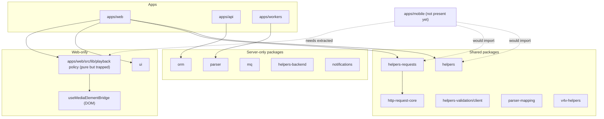

# Monorepo current-state assessment for mobile

This document assesses how well the **current** Podverse monorepo supports adding a React Native
(`apps/mobile`) app optimized for LLM-driven (Cursor) development. It is an assessment, not an
implementation plan; the target structure and changes are proposed in the sibling doc
[DOCS-MOBILE-MONOREPO-TARGET-STRUCTURE.md](DOCS-MOBILE-MONOREPO-TARGET-STRUCTURE.md).

The decision to use a monorepo (not a separate repo) and React Native is already made; see
[initial-decisions/DOCS-MOBILE-MONOREPO-DECISION.md](/docs/proposals/mobile/initial-decisions/DOCS-MOBILE-MONOREPO-DECISION.md).

## 1. Executive summary

**Verdict: ready with gaps.** No significant rewrite is required. The monorepo is well structured
for a top-tier mobile consumer, and the most valuable shared layers (DTOs, typed API client, bearer
auth) are already mobile-safe. The work is additive and isolation-focused, not a restructuring.

- **Strong foundation:** npm workspaces, explicit staged build lists, a documented import-tier
  system, and an enforced architecture-tier rule already accommodate a new top-tier app.
- **Shared logic is partly mobile-ready:** `@podverse/helpers`, `@podverse/helpers-requests`, and
  `@podverse/http-request-core` (with a `bearer` auth mode) are safe to import from React Native.
- **Biggest gap is client business logic location:** the sophisticated playback/queue **policy** is
  pure and reusable but lives inside `apps/web/src/lib/playback/`, not in a shared package.
- **Tooling gaps are small and known:** no Tier D for Metro yet; `.cursorignore` does not exclude
  native build trees; no `apps/mobile` AGENTS/rules.
- **No repo split needed.** Evidence supports staying in the monorepo with an isolated workspace.

## 2. Current layout inventory

Workspaces are defined in [package.json](/package.json) (`workspaces`: `packages/*`, `extensions/*`,
`apps/*`, the two sidecars, `tools/*`, `tools/*/*`). Root version is `5.5.0`.

### Apps

| Path                          | Package                            | Purpose                                   |
| ----------------------------- | ---------------------------------- | ----------------------------------------- |
| `apps/api`                    | `@podverse/api`                    | REST API, DB migrations, backend services |
| `apps/web`                    | `@podverse/web`                    | Main Next.js podcast client               |
| `apps/web/sidecar`            | `@podverse/web-sidecar`            | Runtime-config sidecar for web            |
| `apps/workers`                | `@podverse/workers`                | Background workers / CLI jobs             |
| `apps/management-api`         | `@podverse/management-api`         | Admin API                                 |
| `apps/management-web`         | `@podverse/management-web`         | Admin Next.js dashboard                   |
| `apps/management-web/sidecar` | `@podverse/management-web-sidecar` | Runtime-config sidecar for admin          |

### Key packages (subset)

| Package                                                  | Purpose                                                 |
| -------------------------------------------------------- | ------------------------------------------------------- |
| `@podverse/helpers`                                      | DTOs, domain enums, queue helpers, i18n time formatting |
| `@podverse/helpers-requests`                             | Typed `req*` HTTP client for the main API               |
| `@podverse/http-request-core`                            | Framework-agnostic axios transport + `AuthContext`      |
| `@podverse/helpers-validation`                           | Joi (server) + `./client` validation bundle             |
| `@podverse/helpers-backend`                              | Node/back-end utilities (Winston logging)               |
| `@podverse/helpers-browser`                              | Browser-only utilities (`window`, clipboard)            |
| `@podverse/helpers-config`                               | Env validation, startup validation, test env            |
| `@podverse/orm`                                          | TypeORM entities + services                             |
| `@podverse/parser`                                       | Server RSS/Atom parsing                                 |
| `@podverse/parser-mapping`                               | Browser-safe feed mapping helpers                       |
| `@podverse/mq`                                           | ActiveMQ/Artemis messaging                              |
| `@podverse/notifications`                                | Server push delivery                                    |
| `@podverse/ui`                                           | Shared **web** UI (Next/React/SCSS)                     |
| `@podverse/v4v-helpers` / `v4v-metaboost` / `v4v-btc-ln` | Value-for-value math + LN                               |
| `@podverse/management-api-requests`                      | Typed client for the admin API                          |

### Extensions and tools

| Path                    | Purpose                          |
| ----------------------- | -------------------------------- |
| `extensions/prometheus` | OTLP + Prometheus scrape sidecar |
| `tools/qa`              | QA/faker utilities               |
| `tools/test-assets`     | Local test asset server          |
| `tools/web-perf/*`      | Bundle analyzer + Lighthouse     |

## 3. Shared package compatibility matrix

This is the most important table for mobile: which `@podverse/*` packages a React Native app can
import today.

| Package                                    | RN-safe?             | Reason                                                                   |
| ------------------------------------------ | -------------------- | ------------------------------------------------------------------------ |
| `@podverse/helpers`                        | Yes                  | Pure TS DTOs/enums/queue helpers; avoid env-only modules                 |
| `@podverse/helpers-requests`               | Yes                  | Axios-based typed client; supports bearer auth                           |
| `@podverse/http-request-core`              | Yes                  | Framework-agnostic axios + `AuthContext`                                 |
| `@podverse/helpers-validation` (`/client`) | Yes                  | Use the Joi-free `./client` entry only                                   |
| `@podverse/parser-mapping`                 | Yes                  | Browser-safe mapping; no DOM in source                                   |
| `@podverse/v4v-helpers`                    | Yes                  | Pure payment math                                                        |
| `@podverse/v4v-metaboost`                  | Yes                  | Types/helpers over helpers                                               |
| `@podverse/v4v-btc-ln`                     | Yes\*                | LNURL HTTP + injectable provider (web uses WebLN; mobile injects native) |
| `@podverse/helpers-validation` (main)      | No                   | Joi is server-only                                                       |
| `@podverse/helpers-backend`                | No                   | Winston, daily-rotate-file, Node logging                                 |
| `@podverse/helpers-browser`                | No                   | `window` / `document` / clipboard                                        |
| `@podverse/helpers-config`                 | No                   | `process.env` startup validation                                         |
| `@podverse/orm`                            | No                   | TypeORM, `pg`, `bcrypt`                                                  |
| `@podverse/parser`                         | No                   | Server parsing pipeline + ORM                                            |
| `@podverse/mq`                             | No                   | `rhea`, `ws`, server deps                                                |
| `@podverse/notifications`                  | No                   | Server push delivery                                                     |
| `@podverse/ui`                             | No                   | Next peer, SCSS, `react-dom` — web-only                                  |
| `@podverse/observability`                  | No                   | Node OpenTelemetry SDK                                                   |
| `@podverse/external-services-*`            | No                   | Server credentials/SDKs                                                  |
| `@podverse/management-api-requests`        | No (consumer mobile) | Admin surface                                                            |

The auth contract is already mobile-aware. `AuthContext` in
[packages/http-request-core/src/authContext.ts](/packages/http-request-core/src/authContext.ts)
includes a `bearer` mode, and [docs/development/API-CLIENT-BOUNDARIES.md](/docs/development/API-CLIENT-BOUNDARIES.md)
names mobile as bearer-first.

## 4. Build and CI today

Root [package.json](/package.json) drives the build through explicit, ordered workspace lists (not
globs), via `scripts/ci/run-workspaces.mjs`:

- `build:packages` — explicit ordered list of 24 packages (helpers first, then dependents).
- `build:apps` — `apps/api apps/web apps/workers apps/management-api apps/management-web` + sidecars.
- `build:tools` — `tools/qa tools/test-assets`.
- `test:unit` — runs every workspace `test` script **except** `apps/api` and `apps/management-api`
  (`--all --exclude ...`). A new mobile workspace with a `test` script would be swept in unless
  excluded.
- `lint` — `scripts/ci/lint-with-summary.mjs` across workspaces.
- E2E — `test:e2e:web` is `make e2e_test_playwright` (web/management-web only).

Tooling is provided by the Nix flake; agent/CI commands run through
[scripts/nix/with-env](/scripts/nix/with-env). The flake provides Node 24 / npm / make / DB / k8s
tooling, but **not** Xcode or the Android SDK.

**Implication for mobile:** because the build/test scripts use **explicit** workspace lists,
`apps/mobile` will auto-enroll in `npm install` (via the `apps/*` workspace glob) but **not** in
`build:packages` / `build:apps`. That is exactly what we want — mobile builds with its own
toolchain (`expo`, `gradle`, `xcodebuild`) off the Node critical path. `test:unit` (`--all`) is the
one script that would pick up a mobile `test` script and needs an explicit exclude or RN-ready
config.

There is no `apps/mobile` in the repo today.

## 5. TypeScript / import tiers today

[tsconfig.base.json](/tsconfig.base.json) is strict, `NodeNext` module + resolution, `lib: ["ES2022"]`
(no DOM at the base). The web app overrides with bundler resolution, DOM libs, and `react-jsx`.

The repo documents three import-specifier tiers in
[docs/development/tooling/DOCS-DEVELOPMENT-TOOLING-IMPORT-SPECIFIERS.md](/docs/development/tooling/DOCS-DEVELOPMENT-TOOLING-IMPORT-SPECIFIERS.md)
and [.cursor/skills/import-specifiers-tiered/SKILL.md](/.cursor/skills/import-specifiers-tiered/SKILL.md):

| Tier | Locations                                               | Import style              |
| ---- | ------------------------------------------------------- | ------------------------- |
| A    | `packages/*` (except ui), api, workers, sidecars, tools | NodeNext `.js` specifiers |
| B    | `apps/web/src`, `apps/management-web/src`, their e2e    | extensionless             |
| C    | `packages/ui`, `packages/integrations-web`              | extensionless             |

Enforcement lives in [eslint.config.mjs](/eslint.config.mjs) (e.g. the `packages/ui` +
`integrations-web` block near line 109, and the `apps/web/src` blocks near lines 116 and 145). The
media-element bridge files are explicitly carved out as the only places allowed to mutate the media
element (lines 145–148).

**There is no Tier D for `apps/mobile/**` yet.** Metro consumes extensionless imports like Tier B/C
and reads built `dist/` from Tier A packages, so a Tier D entry plus an ESLint override is the clean
fit (proposed in the target-structure doc).

## 6. Where client business logic lives

The sophisticated, reusable playback **policy** is pure TypeScript but currently lives inside the
web app at `apps/web/src/lib/playback/`. Directory contents include:

- `resolvePlaybackLoadDecision.ts` — the core decision function (no DOM)
- `playbackTarget.ts`, `playbackLoadRequest.ts`, `playbackTargetFromStandardLoad.ts`
- `resumeSeekFromAbridged.ts`, `clampNearEndSeconds.ts`, `parsePlaybackSeconds.ts`
- `resolveEnclosureSwitchPlaybackDecision.ts`, `stageEnclosureSwitchFromSelection.ts`
- `__tests__/` (unit tests)

Per [.cursor/skills/media-player-architecture/SKILL.md](/.cursor/skills/media-player-architecture/SKILL.md),
the architecture separates **pure policy** from the **DOM bridge**:

| Layer              | Location                                                                      | Reusable on mobile?                |
| ------------------ | ----------------------------------------------------------------------------- | ---------------------------------- |
| Policy (decisions) | `apps/web/src/lib/playback/`                                                  | Yes (pure) — but not yet a package |
| Element bridge     | `apps/web/src/hooks/useMediaElementBridge.ts`, `mediaElementBridgeSurface.ts` | No — `HTMLMediaElement`            |
| Controls context   | `apps/web/src/contexts/MediaPlayerControls.tsx`                               | Pattern only                       |
| Orchestration      | `NonLiveMediaOrchestrator`, `NonLiveMediaMount`                               | Logic yes, DOM binding no          |
| State              | `apps/web/src/contexts/MediaPlayer.tsx` (`applyPlaybackLoad`)                 | Pattern only                       |

Queue helpers are split similarly: pure helpers exist in `@podverse/helpers`
(`lib/queue/queue.ts`) and `apps/web/src/lib/queue/combineQueueNowPlayingAndUpcoming.ts`, while
orchestration hooks live in `apps/web/src`. This is the single biggest extraction opportunity (a
proposed `packages/playback-core`), detailed in the target-structure doc.

## 7. LLM / Cursor setup today

| Asset                           | State                                                      |
| ------------------------------- | ---------------------------------------------------------- |
| `.cursor/rules/*.mdc`           | 45 rules                                                   |
| `.cursor/skills/*/`             | 73 skills                                                  |
| `.cursorrules`                  | Root conventions (tiers, UI, no agent test runs)           |
| [AGENTS.md](/AGENTS.md)         | Root agent handbook                                        |
| Per-app AGENTS                  | `apps/web/AGENTS.md`, `apps/management-web/AGENTS.md` only |
| [.cursorignore](/.cursorignore) | Minimal — env allowlist + one archived doc                 |

The current [.cursorignore](/.cursorignore) does **not** exclude native build output (none exists
yet). Per-app guidance follows a clear pattern (`apps/web/AGENTS.md`) that mobile should mirror.

**Gaps for mobile:**

- No `apps/mobile/AGENTS.md` or `apps/mobile/APPS-MOBILE.md`.
- No `.cursorignore` entries for `ios/Pods/`, `android/.gradle/`, `android/build/`, `.expo/`.
- No mobile-specific rule (RN not Next; bearer not cookie; native car cache).
- Skills assume Next + Playwright + `@podverse/ui`.

These are enumerated as actionable proposals in
[DOCS-MOBILE-LLM-CURSOR-SETUP.md](DOCS-MOBILE-LLM-CURSOR-SETUP.md).

## 8. i18n today

Translation **authoring** lives in `packages/i18n-catalog/` (`shared`, `consumer`, `management`,
`mobile` layers). Root scripts orchestrate compile/translate (`i18n:compile`, `i18n:translate` in
[package.json](/package.json)). Web and management-web load merged output from
`apps/*/i18n/compiled/` via `next-intl`; mobile loads `apps/mobile/i18n/compiled/` via i18next.

**Implication for mobile:** the **strings** are reusable via the catalog, but the runtime
(`next-intl`) is not. Duration formatting helpers in `@podverse/helpers`
(`lib/i18n/timeFormatter.ts`) are portable.

## 9. Gap summary

| Gap / opportunity                                                 | Type        | Effort |
| ----------------------------------------------------------------- | ----------- | ------ |
| Extract `packages/playback-core` from `apps/web/src/lib/playback` | Opportunity | Medium |
| Add Tier D (`apps/mobile/**`) + ESLint override                   | Gap         | Low    |
| `.cursorignore` native build excludes                             | Gap         | Low    |
| `apps/mobile` AGENTS + APPS-MOBILE + rule                         | Gap         | Low    |
| Exclude `apps/mobile` from root `test:unit`/`lint` until RN-ready | Gap         | Low    |
| Metro monorepo config (resolve `@podverse/*` `dist/`)             | Gap         | Medium |
| Separate macOS CI workflow (TestFlight/Play)                      | Gap         | Medium |
| i18n sharing strategy (catalog vs copy)                           | Opportunity | Medium |
| Bearer auth path in `helpers-requests` (already supported)        | Opportunity | Low    |

## 10. Prior decisions

This assessment assumes the monorepo + React Native decisions already documented in
[initial-decisions/DOCS-MOBILE-MONOREPO-DECISION.md](/docs/proposals/mobile/initial-decisions/DOCS-MOBILE-MONOREPO-DECISION.md),
[DOCS-MOBILE-FRAMEWORK-REACT-NATIVE.md](/docs/proposals/mobile/initial-decisions/DOCS-MOBILE-FRAMEWORK-REACT-NATIVE.md),
and the LLM-context guidance in
[DOCS-MOBILE-LLM-CONTEXT.md](/docs/proposals/mobile/initial-decisions/DOCS-MOBILE-LLM-CONTEXT.md).

## Diagram: current tiers (mobile absent)

